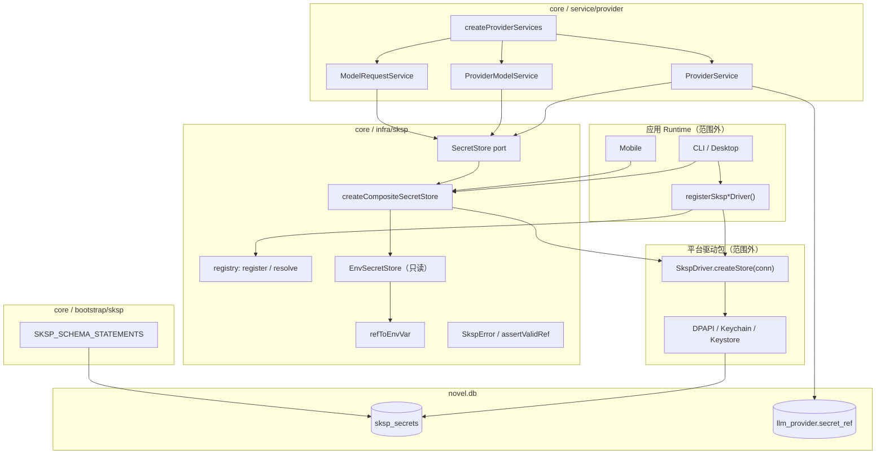

# 代码审查：SKSP 密钥存储基础设施

**日期：** 2026-06-21  
**范围：**

- `packages/core/src/infra/sksp/**`
- `packages/core/src/bootstrap/sksp/**`
- `packages/core/test/sksp/**`（及关联的 `test/infra/sksp/**`）

**审查重点：** 密钥泄漏、env ref、composite store、与 provider 集成

**关联上下文（范围外，仅作集成说明）：** 平台驱动包（`sksp-windows` / `sksp-mac` / `sksp-android`）、CLI/Desktop/Mobile runtime 接线、`infra/db-backup` 服务商表快照。

---

## 执行摘要

SKSP（Secret Key Storage Protocol）在 core 层实现了**协议面 + 组合层 + env 只读适配**，设计目标明确：业务表仅存 `secretRef`，密文落 `sksp_secrets`，平台加解密由独立驱动包完成。整体架构**轻量、边界清晰**，与 TDBC registry 镜像的驱动注册模式一致。

**总体评估：** 在「无明文落库、API 不返回密钥、内存内短暂持有明文」等主路径上表现良好；composite/env 的开发便利性带来了若干**语义不一致与覆盖风险**；provider 删除路径与读取路径在 `secretRef` 回退上**不对称**，存在孤儿密钥可能。

| 领域 | 评级 | 说明 |
|------|------|------|
| 架构 / 分层 | ✅ 良好 | Port + registry + composite；core 零原生依赖 |
| 密钥泄漏防护 | ⚠️ 良好（有缺口） | 持久化与 API 面安全；env 覆盖、备份快照、delete 不对称需关注 |
| env ref | ⚠️ 良好 | 约定清晰；空字符串与 ref 校验缺失 |
| composite store | ⚠️ 良好 | 读写分离合理；env 掩蔽 DB 为预期行为但需文档化 |
| provider 集成 | ⚠️ 良好 | 注入一致；delete / status / resolve 的 ref 策略不完全统一 |
| 测试覆盖 | ⚠️ 参差 | 单元测试够用；缺 ref 校验、边界与集成级 SKSP 测试 |

---

## 架构概览



### 模块职责

| 模块 | 职责 |
|------|------|
| `ports/secret-store.port.ts` | 异步 KV 秘密存储契约：`get/set/delete/has` |
| `logic/registry.ts` | 平台驱动注册与解析（单驱动默认可省略 name） |
| `logic/ref-to-env.ts` | `provider/{id}/apiKey` → `NOVEL_MASTER_PROVIDER_{ID}_API_KEY` |
| `impl/env-secret-store.ts` | 从 `process.env` 只读取 provider API Key |
| `impl/composite-secret-store.ts` | env 读优先、写仅 DB |
| `sksp-error.ts` | 统一错误码 + `assertValidRef` |
| `bootstrap/sksp/sksp-schema.ts` | `sksp_secrets` DDL |

### 数据流（Provider API Key）

```text
写入：ProviderService.create/edit
  → secretStore.set(providerApiKeyRef(id), plainKey)
  → composite → db driver → encrypt → sksp_secrets
  → llm_provider.secret_ref 更新（有 apiKey 时）

读取：ModelRequestService / ProviderModelService
  → ref = provider.secretRef ?? providerApiKeyRef(id)
  → composite.get(ref) → env 命中则直接返回，否则 db decrypt

状态：ProviderService.list
  → apiKeyStatus = secretStore.has(ref) ? "set" : "not set"（不返回明文）
```

---

## 文件清单

### 基础设施（`src/infra/sksp/` — 7 文件）

| 路径 | 角色 |
|------|------|
| `ports/secret-store.port.ts` | `SecretStore` 接口 |
| `sksp-error.ts` | `SkspError`、`SkspErrorCode`、`assertValidRef` |
| `logic/registry.ts` | 驱动注册表 |
| `logic/ref-to-env.ts` | ref → 环境变量名映射 |
| `impl/env-secret-store.ts` | Env 只读 store |
| `impl/composite-secret-store.ts` | env + db 组合 store |
| `index.ts` | 公共导出（`@novel-master/core/sksp`） |

### Bootstrap（`src/bootstrap/sksp/` — 1 文件）

| 路径 | 角色 |
|------|------|
| `sksp-schema.ts` | `sksp_secrets` 表 DDL，由 `bootstrapNovelMaster` 执行 |

### 测试

| 路径 | 覆盖 |
|------|------|
| `test/sksp/schema.test.ts` | bootstrap 后表存在 |
| `test/infra/sksp/env-secret-store.test.ts` | `refToEnvVar` + Env get/has |
| `test/infra/sksp/composite.test.ts` | env 优先、回退、写仅 DB |
| `test/infra/sksp/registry.test.ts` | 单驱动解析、空注册表异常 |

---

## 1. 密钥泄漏

### 1.1 做得好的地方

**持久化层无明文列。** DDL 仅含 `ciphertext`、`iv`、`algo` 等字段，符合 PRD「无明文落库」：

```8:15:packages/core/src/bootstrap/sksp/sksp-schema.ts
  `CREATE TABLE IF NOT EXISTS sksp_secrets (
  ref TEXT PRIMARY KEY,
  ciphertext BLOB NOT NULL,
  iv BLOB,
  algo TEXT NOT NULL,
  version INTEGER NOT NULL DEFAULT 1,
  updated_at_ms INTEGER NOT NULL
);`,
```

**业务 API 不返回密钥。** `ProviderListItem` 仅附加 `apiKeyStatus: "set" | "not set"`；`LlmProvider` 只暴露 `secretRef`（opaque 引用），`CreateProviderInput` / `EditProviderPatch` 中的 `apiKey` 为写入时瞬态字段，不写入 `llm_provider` 表。

**错误信息不含明文。** `SkspError` 消息携带 `code` 与可选 `ref`，平台驱动解密失败时提示 re-run edit，未 echo 密钥内容。

**ref 校验在驱动层执行。** `assertValidRef` 限制长度 ≤512、禁止 `\0`；各平台 `sqlite-secret-store` 在 CRUD 前调用（core 的 env/composite 未调用，见下文）。

**Mobile 生产路径无 env store。** `create-mobile-runtime.ts` 仅 `createCompositeSecretStore({ db })`，避免生产环境被环境变量劫持。

### 1.2 风险与缺口

#### P1 — env 变量可静默覆盖 DB 密钥（开发面风险）

CLI/Desktop 接线：

```148:152:apps/cli/src/runtime.ts
  const dbStore = resolveSkspDriver("windows").createStore(conn);
  const secretStore = createCompositeSecretStore({
    db: dbStore,
    env: createEnvSecretStore(),
  });
```

任意能修改进程环境变量的主体（同用户 shell、CI secret、恶意父进程）可在**不改动 DB** 的情况下改变实际使用的 API Key。对本地开发是特性，对共享/自动化环境是**信任边界降级**。

**建议：** 文档明确「env 覆盖仅用于 CI/本地」；可选 `NM_SKSP_DISABLE_ENV=1` 生产开关（Mobile 已通过不传 env 实现）。

#### P1 — DB 备份快照含密文（跨设备泄漏面）

`dumpProviderTableSnapshot` 对 `sksp_secrets` 做 `SELECT *`（范围外 `infra/db-backup`，但与 SKSP 直接相关）。密文虽非明文，但：

- 与 `llm_provider.secret_ref` 一并导出，攻击者知 ref 与 algo；
- 跨平台/跨用户恢复后可能尝试离线攻击或误迁移不可解密密文。

已有 scrub 路径；审查结论是 **core SKSP schema 本身无问题**，但备份策略必须在产品层排除或 scrub 服务商三表（迭代文档已跟踪）。

#### P2 — `assertValidRef` 未在 core 读路径统一 enforced

`EnvSecretStore`、`createCompositeSecretStore` 均不校验 ref。恶意或损坏 ref 会：

- env 路径：静默返回 `null`（非 provider apiKey 形态）；
- db 路径：依赖驱动层校验。

provider 域生成的 ref 格式固定（`provider/{id}/apiKey`），正常路径安全；若未来 SKSP 扩展至 cloud-sync S3 key 等 ref 形态，应在 composite 或 port 装饰层统一校验。

#### P2 — `SkspError` 的 `INVALID_REF` 消息 echo 完整 ref

```39:42:packages/core/src/infra/sksp/sksp-error.ts
export function assertValidRef(ref: string): void {
  if (ref.length === 0 || ref.length > MAX_REF_LENGTH || ref.includes("\0")) {
    throw new SkspError("INVALID_REF", `Invalid secret ref: ${ref}`, { ref });
  }
}
```

当前 ref 非秘密；若将来 ref 编码敏感信息需改为摘要日志。

#### P3 — 测试用 memory store 持有明文

provider 测试中的 `memorySecretStore()` 在堆内存存 plaintext，可接受；需确保此类 store **永不**进入生产 runtime（当前满足）。

---

## 2. env ref（`refToEnvVar` / `EnvSecretStore`）

### 2.1 映射规则

```11:18:packages/core/src/infra/sksp/logic/ref-to-env.ts
export function refToEnvVar(ref: string): string | null {
  const m = /^provider\/([^/]+)\/apiKey$/.exec(ref);
  if (!m) {
    return null;
  }
  const id = m[1]!.toUpperCase().replace(/[^A-Z0-9]/g, "_");
  return `NOVEL_MASTER_PROVIDER_${id}_API_KEY`;
}
```

| ref 示例 | 环境变量 |
|----------|----------|
| `provider/openai/apiKey` | `NOVEL_MASTER_PROVIDER_OPENAI_API_KEY` |
| `provider/my-gw/apiKey` | `NOVEL_MASTER_PROVIDER_MY_GW_API_KEY` |
| `other/ref` | `null`（Env store 返回 null） |

与域层 `providerApiKeyRef()` 生成的 ref 一致：

```22:24:packages/core/src/domain/provider/model/provider.ts
export function providerApiKeyRef(providerId: string): string {
  return `provider/${providerId}/apiKey`;
}
```

**注意：** env 名对 id 做 `[A-Z0-9]` 过滤，极端情况下不同 id 可能映射到同一 env 名（如 `my.gw` 与 `my-gw` → `MY_GW`）。provider id 校验若禁止歧义字符则可忽略；否则应在文档或 id 校验中限制。

### 2.2 EnvSecretStore 行为

- **只读：** 无 `set`/`delete`（类未实现完整 `SecretStore`，composite 通过 `EnvSecretStoreLike` 约束）。
- **`get`：** 非 provider apiKey ref → `null`；未设置 env → `null`；设为空字符串 `""` → 返回 `""`。
- **`has`：** 基于 `get`，且要求非空：`v !== null && v !== ""`。

### 2.3 发现的问题

#### P2 — `get` 与 `has` 对空字符串不一致

| env 值 | `get()` | `has()` |
|--------|---------|---------|
| 未设置 | `null` | `false` |
| `""` | `""` | `false` |
| `"sk-xxx"` | `"sk-xxx"` | `true` |

composite 的 `get` 将 `""` 视为有效命中（`!== null`），不会回退 DB；`has` 却回退 DB。可能导致：

- `apiKeyStatus` 显示「未设置」（has → false → DB 可能有 key）；
- 实际请求 `get` 得到 `""` → `API_KEY_NOT_SET` 或向 vendor 发送空 Authorization。

**建议：** env 路径将 `""` 与 unset 同等对待（`get` 归一化为 `null`），或 composite 层统一「falsy 即 miss」。

#### P3 — 仅支持 provider apiKey 一种 ref 形态

符合当前 PRD；cloud-sync 等未来 ref 需扩展 `refToEnvVar` 或独立 env store。

---

## 3. Composite Store

### 3.1 设计语义

```19:50:packages/core/src/infra/sksp/impl/composite-secret-store.ts
export function createCompositeSecretStore(options: {
  db: SecretStore;
  env?: EnvSecretStoreLike;
}): SecretStore {
  // ...
  // Read order: env hit → DB; writes go to DB only.
```

| 操作 | 行为 |
|------|------|
| `get` | env 非 null → 返回 env；否则 `db.get` |
| `has` | env.has true → true；否则 `db.has` |
| `set` | 仅 `db.set` |
| `delete` | 仅 `db.delete`（**不**清除 env） |

测试明确覆盖「set 写 DB 但 get 仍返回 env」：

```57:71:packages/core/test/infra/sksp/composite.test.ts
  it("set/delete only touch db", async () => {
    // ...
    await composite.set("provider/x/apiKey", "stored");
    assert.equal(await db.get("provider/x/apiKey"), "stored");
    assert.equal(await composite.get("provider/x/apiKey"), "env-only");
  });
```

### 3.2 影响分析

**预期场景（开发/CI）：** 用户在 UI/CLI 写入 DB 密钥，同时 shell 导出 env；实际 LLM 调用走 env。便于 E2E，但用户可能误以为已更新 DB 密钥。

**delete 语义：** 删除 provider 时 `secretStore.delete(ref)` 只清 DB；env 仍存在 → `has`/`get` 仍命中。对内置 provider（不可 delete）+ env 配置是合理行为；对 custom provider delete 后若 env 仍设，ref 虽无 owner 但密钥仍「存在」— 通常可接受。

**无 env 参数：** Mobile 等价于纯 DB store，行为正确。

### 3.3 建议

- 在 `@novel-master/core/sksp` 模块 doc 或 README 中**显式记录** env-over-DB 优先级与 set/delete 不对称。
- 可选：`get` 对 whitespace-only env 值做 trim/拒绝（防误配）。

---

## 4. 与 Provider 集成

### 4.1 接线方式

`createProviderServices(conn, secretStore)` 将同一 `SecretStore` 注入三个服务：

```44:66:packages/core/src/service/provider/create-provider-services.ts
  const providers = new DefaultProviderService({ /* ... */ secretStore });
  const providerModels = new DefaultProviderModelService({ /* ... */ secretStore });
  const modelRequests = new DefaultModelRequestService({ /* ... */ secretStore });
```

公共 API 导出 `SecretStore` 类型与 `providerApiKeyRef`，边界清晰。

### 4.2 ref 解析策略

读取路径（model request / fetch models / apiKeyStatus）统一使用：

```text
ref = provider.secretRef ?? providerApiKeyRef(providerId)
```

内置 provider 种子 `secret_ref = NULL`，允许仅通过 env 配置密钥且 status 仍显示 set — **设计合理**。

### 4.3 发现的问题

#### P1 — delete 未使用 fallback ref（与读取不对称）

```133:135:packages/core/src/service/provider/impl/provider.service.ts
    if (provider.secretRef) {
      await this.deps.secretStore.delete(provider.secretRef);
    }
```

对比 `apiKeyStatus` / `resolveApiKey` 使用 `secretRef ?? providerApiKeyRef(id)`。

**场景：** `llm_provider.secret_ref` 被置 NULL（数据损坏、手工 SQL、未来 migration bug），但 `sksp_secrets` 在默认 ref 仍有行 → delete provider 后**孤儿密钥**残留。

正常 create/edit 有 apiKey 时会写 `secretRef`，概率低，但修复成本低。

**建议：** delete 时改为：

```typescript
const ref = provider.secretRef ?? providerApiKeyRef(id);
if (await this.deps.secretStore.has(ref)) {
  await this.deps.secretStore.delete(ref);
}
```

#### P2 — edit 允许写入空 apiKey

`patch.apiKey !== undefined` 时无空字符串校验，会向 DB 写入 `""`。下游 `resolveApiKey` 将空串视为未设置并抛 `API_KEY_NOT_SET`，但 DB 中仍留有空 ciphertext 行。

**建议：** `patch.apiKey === ""` 时视为清除密钥（`delete` + `secretRef = null`）或显式拒绝。

#### P2 — 内置 provider 的 secretRef 延迟 materialize

首次 `edit --apiKey` 才写入 `secretRef`；此前仅 env 有 key。无安全 bug，但 `llm_provider` 行无法从 DB  alone 判断密钥来源（env vs db）。

#### P3 — 明文仅在请求路径内存驻留

`ModelRequestService.request` 将 `apiKey` 传入 adapter；core 内未见日志打印。需确保 `createLoggingFetch` / HTTP debug 不记录 `Authorization` 头（属 llm-protocol 范围，集成审查建议顺带确认）。

---

## 5. Registry 与驱动模型

```37:57:packages/core/src/infra/sksp/logic/registry.ts
export function resolveSkspDriver(explicit?: string): SkspDriver {
  if (explicit !== undefined) { /* ... */ }
  const names = [...drivers.keys()];
  if (names.length === 1) {
    return getSkspDriver(names[0]!)!;
  }
  throw new SkspError("NOT_REGISTERED", /* 0 or >1 drivers */);
}
```

- 镜像 TDBC registry，语义清晰。
- 全局可变 `Map`；测试通过 `clearSkspDrivers()` 隔离。
- **缺口：** 测试未覆盖「多驱动未指定 name 抛错」分支。

core  deliberately **不包含** 平台 crypto；`assertValidRef` 导出给驱动包使用 — 分层正确。

---

## 6. Schema 与 Bootstrap

- `SKSP_SCHEMA_STATEMENTS` 纳入 `NOVEL_MASTER_SCHEMA_STATEMENTS`，顺序在 provider 表之前，无 FK 依赖问题。
- `iv` 可空：兼容 DPAPI（`iv = NULL`）与 AES-GCM 驱动 — 合理。
- `test/sksp/schema.test.ts` 仅断言表存在，未验证列定义；对 DDL 变更回归保护较弱。

---

## 7. 测试覆盖评估

| 区域 | 状态 | 缺口 |
|------|------|------|
| DDL bootstrap | ✅ 基础 | 无列级断言 |
| `refToEnvVar` | ✅ | 无冲突 id 边界 |
| `EnvSecretStore` | ✅ | 无空字符串 / 非 provider ref |
| `composite` | ✅ 核心路径 | 无 env 空串 + DB 回退 |
| `registry` | ⚠️ | 无 multi-driver、explicit 错误名 |
| `assertValidRef` | ❌ | core 无单测 |
| provider + SKSP 集成 | ⚠️ | 使用 memory store，无 encrypt 往返 |
| 平台驱动 | — | 在 `packages/sksp-*` 包内 |

---

## 8. 优先级汇总

| 级别 | 项 | 说明 |
|------|-----|------|
| **P1** | env 覆盖 DB | 开发便利 vs 信任边界；Mobile 已规避 |
| **P1** | 备份含 `sksp_secrets` 密文 | 产品层 scrub/排除（db-backup 模块） |
| **P1** | delete 不用 fallback ref | 可能孤儿密钥 |
| **P2** | env 空字符串语义 | get/has/composite 不一致 |
| **P2** | edit 空 apiKey | 写入无效密文行 |
| **P2** | composite/env 行为文档 | 避免「已 save 但未生效」困惑 |
| **P3** | assertValidRef 单测 | 低成本补覆盖 |
| **P3** | ref 映射 id 碰撞 | 极端 provider id |

**未发现 P0 级「明文落库 / API 返回密钥 / 日志打印 key」问题。**

---

## 9. 建议后续动作

1. **ProviderService.delete** — 与读取路径对齐，使用 fallback ref 并 conditional delete。
2. **EnvSecretStore.get** — 将 `""` 视为 miss，或 composite 层过滤。
3. **EditProviderPatch.apiKey** — 定义空字符串语义（清除 vs 拒绝）。
4. **测试** — 增加 `assertValidRef`、`registry` 多驱动、env 空串 composite 用例；可选 `provider delete` 在 `secretRef=null` + db 有 key 时的集成测试。
5. **文档** — 在 SKSP spec / runtime 文档中固定 env 覆盖、Mobile 无 env、备份不含密文的运维说明。

---

## 10. 结论

core 层 SKSP 是一个**职责收窄、接口稳定**的密钥协议内核：持久化 schema 不含明文列，provider 服务正确地将密钥操作委托给 `SecretStore`，public API 不泄漏 apiKey。主要改进点集中在 **composite/env 的边界语义**、**provider delete 与 read 的 ref 一致性**，以及**备份与 env 覆盖的信任模型**——均属可渐进修复项，不构成推翻当前架构的理由。

与 [provider 域审查](../domain/provider.md) 衔接：provider 业务逻辑正确消费 SKSP port；SKSP 本身不感知 LLM 协议，耦合度低，符合 infra 分层预期。
