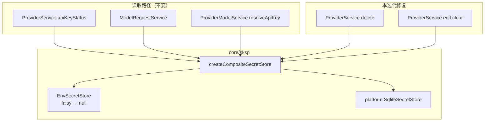

# SKSP 密钥生命周期一致性（sksp-key-lifecycle）技术规格（SPEC）

## 设计目标

- 在 **不修改** [SKSP SPEC](../../../sksp/spec.md) 已锁定的端口、DDL、驱动契约前提下，修复 provider 集成与 composite/env 的 **lifecycle 不对称**（见 [PRD](./prd.md)）。
- 使 **ref 解析** 在 delete、has/get（status）、model request 三条路径 **单源一致**。
- 归一化 **env 空值** 语义，消除 `apiKeyStatus` 与 `get` 分叉。
- 定义 **`edit` 清除 apiKey** 行为，避免 `sksp_secrets` 无效空行。
- 补齐 **单测** 与 **模块文档**；可选 `NM_SKSP_DISABLE_ENV` 降低 Desktop/CLI 信任面风险。

**不在本 SPEC 实现：** `sksp_secrets` 备份 scrub（`infra/db-backup` 已有 `DB_BACKUP_PROVIDER_TABLES` 常量，产品层策略另迭代）。

---

## 现状与约束（代码探索）

| 项 | 路径 / 现状 | 本迭代变更 |
|----|-------------|------------|
| ref 读取 | `provider.service.ts` `apiKeyStatus`：`secretRef ?? providerApiKeyRef(id)` | 不变 |
| ref 读取 | `model-request.service.ts`、`provider-model.service.ts` `resolveApiKey`：同上 | 不变 |
| ref 删除 | `provider.service.ts` `delete`：仅 `if (provider.secretRef) delete(...)` | **改为 fallback ref + conditional has** |
| env get | `env-secret-store.ts`：`process.env[name]` 为 `""` 时 `get` 返回 `""`，`has` 为 false | **get 归一化：falsy → null** |
| composite get | `composite-secret-store.ts`：`fromEnv !== null` 即命中 | env 归一化后自动一致；可选 composite 防御性 `if (fromEnv !== null && fromEnv !== "")` |
| edit apiKey | `provider.service.ts`：`patch.apiKey !== undefined` → 一律 `set` | **`""` → delete + secretRef null** |
| CLI 接线 | `apps/cli/src/runtime.ts`：`createCompositeSecretStore({ db, env: createEnvSecretStore() })` | 可选读取 `NM_SKSP_DISABLE_ENV` |
| Desktop 接线 | `apps/desktop/.../create-desktop-runtime.ts` | 同 CLI |
| Mobile 接线 | `create-mobile-runtime.ts`：仅 `{ db }` | **不变** |
| 测试 | `composite.test.ts` 覆盖 env 优先、set 仅 DB | 增加 env `""` 用例；provider delete 集成 |
| assertValidRef | `sksp-error.ts` 导出，core 无单测 | 新增 `test/infra/sksp/sksp-error.test.ts` |

---

## 总体方案

### 架构（变更点标注）



### Ref 解析（单源函数）

为避免三处 copy-paste 再次分叉，在 `packages/core/src/domain/provider/model/provider.ts`（或 `service/provider/internal/ref.ts`）新增：

```typescript
/** SKSP ref for provider API key; used by list status, request, delete, edit. */
export function resolveProviderApiKeySecretRef(
  provider: Pick<LlmProvider, "id" | "secretRef">,
): string {
  return provider.secretRef ?? providerApiKeyRef(provider.id);
}
```

`ProviderService`、`ModelRequestService`、`ProviderModelService` 逐步改用此 helper（本迭代至少 **ProviderService delete/edit/status** 必须使用该函数）。

---

## 变更规格

### 1. `ProviderService.delete`

**文件：** `packages/core/src/service/provider/impl/provider.service.ts`

**现状：**

```typescript
if (provider.secretRef) {
  await this.deps.secretStore.delete(provider.secretRef);
}
```

**目标：**

```typescript
const ref = resolveProviderApiKeySecretRef(provider);
if (await this.deps.secretStore.has(ref)) {
  await this.deps.secretStore.delete(ref);
}
```

**语义说明：**

- 在 `providers.delete(id)` **之后** 清理 SKSP（与现状顺序一致，避免 delete provider 失败却已删密钥）。
- `composite.delete` 仅触 DB；env-only 密钥无 DB 行时 `has` 可能仍为 true（env），`delete` 返回 false — **可接受**（env 非 provider 生命周期管理范围）。
- 内置 provider 不可 delete（现有 `BUILTIN_PROVIDER` 守卫不变）。

### 2. `EnvSecretStore` 空值归一化

**文件：** `packages/core/src/infra/sksp/impl/env-secret-store.ts`

```typescript
async get(ref: string): Promise<string | null> {
  const name = refToEnvVar(ref);
  if (!name) {
    return null;
  }
  const v = process.env[name];
  if (v === undefined || v === "") {
    return null;
  }
  return v;
}

async has(ref: string): Promise<boolean> {
  return (await this.get(ref)) !== null;
}
```

**可选（P3）：** trim 后为空字符串亦视为 null（`v.trim() === ""`），防误配空格；本迭代可一并纳入。

**Composite：** 无需改 `get` 条件（env 已返回 null）；保留注释说明 env miss 定义。

### 3. `ProviderService.edit` 清除 apiKey

**文件：** `packages/core/src/service/provider/impl/provider.service.ts`

当 `patch.apiKey !== undefined`：

| `patch.apiKey` | 行为 |
|----------------|------|
| 非空字符串 | 现有：`secretRef = providerApiKeyRef(id)`；`secretStore.set(ref, patch.apiKey)` |
| `""` | `ref = resolveProviderApiKeySecretRef({ id, secretRef: provider.secretRef })`；若 `has(ref)` 则 `delete(ref)`；`secretRef = null` |
| （不设 patch.apiKey） | 保持现有 `secretRef` |

**注意：** 清除后内置 provider 仍可通过 env 显示 `set` — 符合 PRD K6。

**CLI：** `nm provider edit --apiKey ""` 需能传空值（现有 parse-args 若不支持，在 CLI 层补 `--clear-api-key` flag 或等价方式 — 实施时以 CLI 可测为准）。

### 4. 文档

**文件（择一或组合）：**

- `packages/core/src/infra/sksp/index.ts` 模块顶注释
- `packages/core/ARCHITECTURE.md` SKSP 小节

**必须包含：**

1. **读取优先级：** env 命中 > DB > null。
2. **写入 asymmetry：** `set`/`delete` 仅 DB；env 只读。
3. **开发陷阱：** DB 已 save 但 shell env 仍覆盖实际请求密钥。
4. **Mobile：** 生产不传 env store。
5. **env 命名：** `NOVEL_MASTER_PROVIDER_<ID>_API_KEY`（指向 `refToEnvVar`）。
6. **备份：** `sksp_secrets` 含平台绑定密文；跨用户/设备恢复可能 `DECRYPT_FAILED`；完整备份导出可能含密文（链接 db-backup 迭代）。

### 5. 可选：`NM_SKSP_DISABLE_ENV`

**文件：** `apps/cli/src/runtime.ts`、`apps/desktop/src/main/runtime/create-desktop-runtime.ts`

```typescript
const env =
  process.env.NM_SKSP_DISABLE_ENV === "1"
    ? undefined
    : createEnvSecretStore();

const secretStore = createCompositeSecretStore({ db: dbStore, env });
```

- 默认未设置：行为与现网一致。
- Mobile **不**读取此变量（无 env 参数）。

---

## 文件变更清单

| 文件 | 变更 |
|------|------|
| `packages/core/src/domain/provider/model/provider.ts` | 新增 `resolveProviderApiKeySecretRef`（或同级 internal 模块） |
| `packages/core/src/service/provider/impl/provider.service.ts` | delete fallback；edit 清除；status 用 helper |
| `packages/core/src/infra/sksp/impl/env-secret-store.ts` | falsy 归一化 |
| `packages/core/src/infra/sksp/index.ts` 或 `ARCHITECTURE.md` | 文档 |
| `apps/cli/src/runtime.ts` | 可选 env 开关 |
| `apps/desktop/src/main/runtime/create-desktop-runtime.ts` | 可选 env 开关 |
| `packages/core/test/infra/sksp/env-secret-store.test.ts` | 空字符串用例 |
| `packages/core/test/infra/sksp/composite.test.ts` | env `""` + DB 回退 |
| `packages/core/test/infra/sksp/sksp-error.test.ts` | **新建** assertValidRef |
| `packages/core/test/provider/provider-service.test.ts` | delete `secretRef=null` + memory/db key；edit clear |

**不修改：** `sksp-schema.ts`、各 `sksp-*` 驱动包、Mobile runtime composite 接线。

---

## 测试计划

### 单元测试

| 套件 | 用例 |
|------|------|
| `env-secret-store.test.ts` | ref 映射；unset → null；`""` → null；has 与 get 一致 |
| `composite.test.ts` | env `""`、DB 有值 → get/has 来自 DB；现有 env 优先用例仍绿 |
| `sksp-error.test.ts` | 空 ref、超长、`\0` → `INVALID_REF` |
| `provider-service.test.ts` | **delete orphan：** insert provider `secretRef: null`，memory store 在 default ref 有 key → delete 后 key  gone；**edit clear：** set 后 `apiKey: ""` → has false |

### 回归

```bash
cd packages/core && npm run test:fast
```

可选窄跑：

```bash
npx vitest run test/infra/sksp test/provider/provider-service.test.ts
```

### CLI 验收（可选，非阻塞）

参考 [sksp/test/sksp-cli.md](../../../sksp/test/sksp-cli.md)：

1. `nm provider create` + edit apiKey → list 显示 set → delete → 查 `sksp_secrets` 无对应 ref（需本地 sqlite 或 debug 命令）。

---

## 与 SKSP 原 SPEC 的关系

| SKSP SPEC 条目 | 本 feature |
|----------------|------------|
| Composite 读优先 env | **保持**；补充 falsy 定义与文档 |
| `get` 允许 `""` 与 unset 区分 | **amend**：env 路径不再返回 `""`；DB `set("",)` 仍由 edit clear 禁止 |
| Provider delete 孤儿策略 | **amend**：fallback ref + conditional delete |
| Registry / DDL / 驱动 | 不变 |

实施后应在本 feature 目录或 SKSP SPEC 末尾增加 **「Amendments」** 交叉链接（实现 PR 时处理）。

---

## 风险与回滚

| 风险 | 缓解 |
|------|------|
| env `""` 行为变更 | 测试 + PRD 已声明；CI 应使用 unset 而非空串 |
| delete 顺序 | 保持先删 provider 行再删 SKSP，避免 FK/业务中间态（现状无 FK） |
| CLI 空 apiKey 传参 | 实施时确认 flag；必要时 `--clear-api-key` |

**回滚：**  revert provider + env-secret-store 改动即可；已清除的 SKSP 行不可自动恢复（用户需 re-edit apiKey）。

---

## 实施步骤建议

1. 添加 `resolveProviderApiKeySecretRef` + provider delete/edit 修复。
2. `EnvSecretStore` falsy 归一化 + composite/env 测试。
3. `assertValidRef` 单测 + provider-service 集成用例。
4. 模块文档 + 可选 `NM_SKSP_DISABLE_ENV` 接线。
5. 全量 `test:fast` 绿 → CLI 抽检（可选）。
