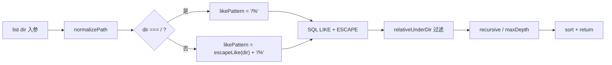

# VFS list() LIKE 通配符转义 技术规格（SPEC）

## 设计目标

- 修正 `SqliteVfsEntryRepository.list()` 中 SQL `LIKE` 模式构造缺陷，使目录前缀按**字面量**匹配。
- **最小 diff：** 仅改 `list()` 内 `likePattern` 生成逻辑 + 补充测试；不重构 `escapeLike` 提取（留给 P1 backlog）。
- **行为对齐：** 与同文件 `delete`、`listEntriesUnderPrefix`、`listFileMetaUnderPrefix`、`scanContents(pathPrefix)` 的前缀 + `ESCAPE '\'` 约定一致。
- **零对外 API 变更：** `VfsEntryRepository.list`、`VfsService.list`、CLI 均不变。

## 现状与根因

### 缺陷位置

```80:88:packages/core/src/domain/vfs/repositories/impl/sqlite-vfs-entry.repository.ts
  async list(dir: string, options?: VfsListOptions): Promise<VfsListEntry[]> {
    const normalizedDir = normalizePath(dir);
    const likePattern = listPrefix(normalizedDir);
    const rows = await queryTemplate<{ path: string; entry_kind: string }>(
      this.conn,
      this.parser,
      `SELECT path, entry_kind FROM vfs_entry WHERE path LIKE #{likePattern} ESCAPE '\\'`,
      { likePattern },
    );
```

`listPrefix()` 直接拼接 `${dir}/%`，未对 `dir` 调用 `escapeLike()`。

### 已正确实现的对照

| 方法 | 前缀处理 | childPattern |
|------|----------|--------------|
| `delete` | `escapeLike(normalized)` | `` `${escaped}/%` `` |
| `listEntriesUnderPrefix` | `escapeLike(base)` | `` `${escaped}/%` `` |
| `listFileMetaUnderPrefix` | `escapeLike(base)` | `base === "/" ? "/%" : \`${escaped}/%\`` |
| **`list`（当前）** | **无转义** | `` `${dir}/%` `` 或 `"/%"` |

### 辅助函数（不变）

```50:63:packages/core/src/domain/vfs/repositories/impl/sqlite-vfs-entry.repository.ts
function listPrefix(dir: string): string {
  return dir === "/" ? "/%" : `${dir}/%`;
}

function escapeLike(value: string): string {
  return value.replace(/\\/g, "\\\\").replace(/%/g, "\\%").replace(/_/g, "\\_");
}
```

`escapeLike` 顺序：先 `\` → `\\`，再 `%` → `\%`，再 `_` → `\_`。SQL 使用 `ESCAPE '\'`（单反斜杠为 escape 字符）。

### 影响面

```text
VfsService.list / ScopedVfsService.list
    └── DefaultVfsService.list → repo.list(dir)   ← 缺陷
RevisionAwareVfsService.list → inner.list         ← 透传
```

**不受影响（已转义）：** worktree `listFileMetaUnderPrefix`、`listDirectoryPathsUnderPrefix`；ZIP/tree-copy 等 bulk 前缀 API。

**受影响：** 所有经 `repo.list` / `VfsService.list` 的目录浏览（agent `list` tool、CLI、测试直接调 repo）。

---

## 总体方案

### 修复策略（定稿）

在 `list()` 内构造 `likePattern` 时，对非根目录应用 `escapeLike`，与 `listFileMetaUnderPrefix` 根路径特例保持一致：

```typescript
async list(dir: string, options?: VfsListOptions): Promise<VfsListEntry[]> {
  const normalizedDir = normalizePath(dir);
  const likePattern =
    normalizedDir === "/"
      ? "/%"
      : `${escapeLike(normalizedDir)}/%`;
  // ... 其余不变
}
```

**说明：**

- 不再经 `listPrefix(normalizedDir)` 调用（或让 `listPrefix` 接受已转义前缀——为最小 diff，推荐**内联**于 `list()`，避免误用未转义路径调用 `listPrefix`）。
- `listPrefix` 若暂留文件中且仅 `list` 使用，可在同一 PR 中删除 dead helper，或保留并加 `@deprecated` 注释；**推荐删除** `listPrefix` 若修复后无引用。

### 数据流（修复后）



### 不改动部分

- Post-SQL 过滤：`relativeUnderDir`、`recursive`、`maxDepth`、`localeCompare` 排序。
- `normalizePath`：不新增对 `%`/`_` 的拒绝规则。
- Service / port / CLI / public export。

---

## 测试方案

### 文件

`packages/core/test/vfs/sqlite-vfs-entry.repository.test.ts`

### 新增用例

#### T1 — `%` 非递归隔离

```text
Setup:
  insertDirectory `/…/x/v1%draft`
  insert          `/…/x/v1%draft/keep.txt`
  insertDirectory `/…/x/v1Xdraft`          // X 代替 %，不应被匹配
  insert          `/…/x/v1Xdraft/wrong.txt`

Act:   list(`/…/x/v1%draft`)

Assert: 仅含 `/…/x/v1%draft/keep.txt`（file）；不含 v1Xdraft  subtree
```

#### T2 — `%` 递归

同上结构，`list(dir, { recursive: true })` 仅返回 `v1%draft` 下所有层级。

#### T3 — `_` 非递归

```text
Setup:
  insertDirectory `/…/x/foo_bar`
  insert          `/…/x/foo_bar/ok.txt`
  insert          `/…/x/fooXbar/wrong.txt`

Act:   list(`/…/x/foo_bar`)

Assert: 仅 `ok.txt` 路径出现在结果中
```

#### T4 — 回归锚点

现有 `lists direct children only by default` 必须保持通过（无通配符路径）。

### 可选（本 SPEC 不强制）

- `default-vfs.service.test.ts`：经 `createVfsService` 对含 `%` 目录 `list` 一条 smoke，验证 service 透传。
- 含字面 `\` 的路径段：POSIX normalize 后通常无 `\`，可省略。

### 验收命令

```bash
cd packages/core
npx tsx --test test/vfs/sqlite-vfs-entry.repository.test.ts
npm run test:fast
```

---

## 实现清单

| 步骤 | 文件 | 动作 |
|------|------|------|
| 1 | `sqlite-vfs-entry.repository.ts` | `list()` 使用 `escapeLike` 构造 `likePattern`；删除未使用的 `listPrefix`（若无其它引用） |
| 2 | `sqlite-vfs-entry.repository.test.ts` | 添加 T1–T3 |
| 3 | — | 跑 fast 套件，确认 L4–L6 |

**预估变更量：** ~15 行生产代码 + ~40 行测试。

---

## 兼容性

| 维度 | 影响 |
|------|------|
| 公共 API | 无 |
| 数据库 schema | 无 |
| 含 `%`/`_` 的路径 | **行为修正**（更严格、正确） |
| 常规路径 | 无变化 |
| CLI | 无参数变更；输出在特殊路径下变正确 |

---

## 非目标（明确排除）

- 将 `escapeLike`、`normalizePrefix`、`listPrefix` 提取到 `domain/vfs/logic/path-prefix.ts`（explore P1）
- 修复 move/copy 非原子、copy 覆盖、`grep` 字面语义等其它 CR 项
- 修改 worktree materialize 双重加载等 worktree 域问题

---

## 与 PRD 验收映射

| PRD ID | SPEC 对应 |
|--------|-----------|
| L1 | T1 |
| L2 | T2 |
| L3 | T3 |
| L4 | 现有 + T4 |
| L5 | 现有根路径行为 / 代码审查 `normalizedDir === "/"` 分支 |
| L6 | `npm run test:fast` |
| L7 | 可选 service smoke |

---

**文档路径：** `.apm/kb/docs/Iterations/core-explore-remediation/features/vfs-list-like-escape/spec.md`
