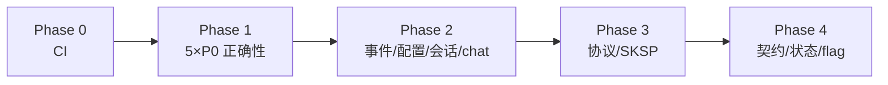

# core-explore-remediation

**来源：** `packages/core` 两轮代码审查（15 domain + infra/service/config/bootstrap/public + 全量测试）  
**日期：** 2026-06-21  
**状态：** 14 feature 已实现并合并至 `feature/core-explore-remediation`（991 tests pass，需先 `npm run build -w @novel-master/core`）

---

## 目录约定

```
core-explore-remediation/
├── readme.md                 ← 本文件（总索引 + 跨 feature 优先级）
└── features/
    └── <feature-slug>/
        ├── explore*.md         ← 自 explore 迁入的 CR 原文（只读参考）
        ├── prd.md              ← requirement-review 产出（待写）
        └── spec.md             ← design-proposal 产出（待写）
```

CR 报告已迁入各 feature，**不再保留** `docs/explore/`。

---

## 执行摘要

`packages/core` 在单写者桌面/CLI 主路径上**已具备投产能力**；两轮审查**未发现已验证 P0 数据损坏**。最大缺口为：**CI 中断**（2/893 失败）、**rollback 后 worktree 快照 stale**、**KKV/事件静默失败**、**VFS list LIKE 通配符**、**内置 provider 协议推断**。

| 测试 | 结果 |
|------|------|
| `npm run test:fast` | 893 用例，**891 通过**，2 失败（`hide-message.handler.test.ts`） |

---

## Feature 索引

| Phase | Feature | CR 材料 | 优先级 | 文档 |
|-------|---------|---------|--------|------|
| 0 | [ci-test-health](./features/ci-test-health/) | `explore.md` | P0 | [prd](./features/ci-test-health/prd.md) · [spec](./features/ci-test-health/spec.md) |
| 1 | [compaction-conditions-integrity](./features/compaction-conditions-integrity/) | compaction + kkv | P0 | [prd](./features/compaction-conditions-integrity/prd.md) · [spec](./features/compaction-conditions-integrity/spec.md) |
| 1 | [vfs-list-like-escape](./features/vfs-list-like-escape/) | vfs + worktree | P0 | [prd](./features/vfs-list-like-escape/prd.md) · [spec](./features/vfs-list-like-escape/spec.md) |
| 1 | [provider-builtin-protocol](./features/provider-builtin-protocol/) | provider | P0 | [prd](./features/provider-builtin-protocol/prd.md) · [spec](./features/provider-builtin-protocol/spec.md) |
| 1 | [session-fs-and-template](./features/session-fs-and-template/) | session-fs-template | P0/P1 | [prd](./features/session-fs-and-template/prd.md) · [spec](./features/session-fs-and-template/spec.md) |
| 2 | [message-checkpoint-and-agent](./features/message-checkpoint-and-agent/) | checkpoint + agent | P1 | [prd](./features/message-checkpoint-and-agent/prd.md) · [spec](./features/message-checkpoint-and-agent/spec.md) |
| 2 | [events-reliability](./features/events-reliability/) | events + cross-cutting | P1 | [prd](./features/events-reliability/prd.md) · [spec](./features/events-reliability/spec.md) |
| 2 | [events-config-validation](./features/events-config-validation/) | events-config + depth + config-forms | P1 | [prd](./features/events-config-validation/prd.md) · [spec](./features/events-config-validation/spec.md) |
| 2 | [chat-user-vfs-turn](./features/chat-user-vfs-turn/) | chat | P1 | [prd](./features/chat-user-vfs-turn/prd.md) · [spec](./features/chat-user-vfs-turn/spec.md) |
| 3 | [llm-streaming-hardening](./features/llm-streaming-hardening/) | llm-protocol | P1 | [prd](./features/llm-streaming-hardening/prd.md) · [spec](./features/llm-streaming-hardening/spec.md) |
| 3 | [sksp-key-lifecycle](./features/sksp-key-lifecycle/) | sksp | P1 | [prd](./features/sksp-key-lifecycle/prd.md) · [spec](./features/sksp-key-lifecycle/spec.md) |
| 4 | [public-api-boundaries](./features/public-api-boundaries/) | public-api | P2 | [prd](./features/public-api-boundaries/prd.md) · [spec](./features/public-api-boundaries/spec.md) |
| 4 | [persistent-state-lifecycle](./features/persistent-state-lifecycle/) | persistent-state | P2 | [prd](./features/persistent-state-lifecycle/prd.md) · [spec](./features/persistent-state-lifecycle/spec.md) |
| 4 | [feature-flags-config](./features/feature-flags-config/) | feature-flags | P2 | [prd](./features/feature-flags-config/prd.md) · [spec](./features/feature-flags-config/spec.md) |
| — | [quality-backlog](./features/quality-backlog/) | prompt, regex, tool, bootstrap, tdbc, tokenizer | P2/P3 | explore only |

---

## 跨 feature P0 / P1 清单

### 立即（Phase 0–1）

1. `hide-message.handler.test.ts` — deps 与 `projectId` 接线
2. compaction KKV 损坏 → 抛错，非 `null`
3. `setConditions` 写入前 Zod 校验
4. VFS `list()` LIKE 转义
5. Provider 内置 ID 协议推断
6. `createSessionFsService` 注入共享 `worktreeSnapshot`

### 高优先级（Phase 2–3）

7. checkpoint capture 勿 fire-and-forget 吞错  
8. event orchestrator / SimpleEventBus 错误可观测、handler 隔离  
9. 畸形 SSE JSON 可观测  
10. 三协议流式 tool-use parity  
11. sksp delete fallback ref  
12. config-forms hide-message `endDepth`  
13. session.create vs sessionTemplatePull VFS 语义统一  
14. user VFS turn 部分失败与 flush 事务性  

### 架构 / 契约（Phase 4）

15. 收敛 `public/*.ts` export  
16. feature-flag 配置源  
17. agent 删后 `currentAgentId` 清理  

---

## 与已有迭代的关系

| 已有迭代 | 关系 |
|----------|------|
| `codebase-audit-remediation` | 互补：thinking signature、ChatTab 拆分、CI lint；避免重复 SSE helper / debug-fetch |
| `llm-protocol-anthropic-gemini-parity` | `llm-streaming-hardening` 的 `dependency` 前置 |
| `sksp` | `sksp-key-lifecycle` 增量 amend |
| `global-compaction-policy` | 与 `compaction-conditions-integrity` 对齐 |
| `stored-config-validity` / `config-forms-merge-into-core` | 与 `events-config-validation` 对齐 |
| `vfs-user-ops-unified-tool-turn` | 与 `chat-user-vfs-turn` 对齐 |
| `message-checkpoint-v2` | 与 `message-checkpoint-and-agent` 对齐 |

---

## 建议交付顺序



**文档节奏：** 每个 phase 先批量 `requirement-review`（PRD）→ 用户确认 → 批量 `design-proposal`（SPEC）→ 实现。

---

## 第一轮 domain 速览（归档）

| 领域 | 评级 | 关键结论 |
|------|------|----------|
| agent | B+ | Runner 扎实；生命周期事件 + capture 风险 |
| chat | B+ | 模型清晰；VFS turn 部分失败 |
| compaction-conditions | B | 损坏 KKV 静默禁用 |
| depth | A- | endDepth 在 form 丢失 |
| events | B | 测试损坏；总线吞错 |
| events-config | B+ | DAG 双源 |
| feature-flags | C+ | 恒 true |
| kkv | B+ | 无事务 RMW |
| message-checkpoint | B+ | capture fire-and-forget |
| prompt | B+ | 遗留 PromptBlock |
| provider | B | 内置协议推断 |
| regex | B+ | depth schema 缺口 |
| tool | A- | 64 测通过 |
| vfs | B+ | list LIKE bug |
| worktree | B+ | spec 小漂移 |

## 第二轮 infra/service 速览（归档）

| 模块 | 评级 | 要点 |
|------|------|------|
| llm-protocol | A- | parity、畸形 SSE |
| tokenizer | B+ | 热路径无缓存 |
| tdbc-sql-template | A- | `${}` lint |
| sksp | B+ | delete 不对称 |
| cross-cutting | A- | EventBus 异常传播 |
| session-fs-template | B | worktreeSnapshot H1 |
| persistent-state | B+ | agent 指针 |
| config-forms | B | 双源校验 |
| bootstrap | A- | 投产就绪 |
| public-api | B | export 过宽 |

---

*下一步：确认各 feature PRD/SPEC → 按 Phase 0 起实现（建议先 `ci-test-health`）。*
