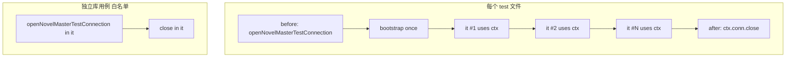

# Core 测试 SQLite Fixture 共享 技术规格（SPEC）

> PRD：`.apm/kb/docs/Iterations/core-test-fixture-sharing/prd.md`

## 设计目标

- 将集成测试从「**每 it 一次 bootstrap**」改为「**每文件（或顶层 describe）一次 bootstrap**」。
- 提供 **`test:fast`** 等脚本，解决 `npm test -- <path>` 无法替换 glob 的问题。
- **`performance.test.ts` 移出默认测试路径**，避免 1000 文件 seed 拖慢全量。
- **不修改** `packages/core/src` 生产代码；迁移测保持独立 in-memory 库。

---

## 现状与约束（代码探索）

| 模块 | 现状 | 本迭代 |
|------|------|--------|
| `test/helpers/novel-master.ts` | `openNovelMasterTestConnection()`：open + bootstrap + 返回 ctx | 保留；新增 fixture 包装 |
| `test/vfs/helpers.ts` | `openVfsTestConnection()` 同样每次 bootstrap | 迁移后复用共享 fixture 或薄封装 |
| 典型集成测 | 每个 `it` 内 `const ctx = await open...()`，`close()` 在末尾 | 改为 `before`/`after` 共享 |
| `package.json` `test` | `tsx ... --test test/**/*.test.ts` | 保留全量；新增 `test:fast` |
| `performance.test.ts` | 含于 glob；1000 文件 + P95 断言 | 改名或单独 script |
| Node test runner | 默认文件级并行；`--test-concurrency=1` 更慢 | 保持默认；**一文件一 conn** |

**耗时结构（调研）**

| 环节 | 成本 |
|------|------|
| `bootstrapNovelMaster` | 高；每 it 重复 |
| 用例内业务 SQL | 中；视用例而定 |
| `conn.close()` on `:memory:` | 可忽略 |
| 清表 / TRUNCATE | **当前不存在** |

**并行安全**

- Node 以 **文件** 为并行单元 → **每个 test 文件** 持有独立 `ctx` 安全。
- **禁止** 模块级单例 conn 跨文件共享。

---

## 总体方案

### Fixture 生命周期



### 隔离策略（定案）

**M1 采用「每 it 独立 project/session」**，不实现全表 TRUNCATE：

- 共享 `ctx`（同一 conn + schema）。
- 每个 `it` 内 `const project = await ctx.projects.create(uniqueName())`，避免跨用例 ID 冲突。
- 依赖「列表长度 / 内容断言」的用例必须在 **本 it 内** 创建全部数据，不假设库为空。

**不采用** `afterEach` 清业务表（M1）：实现复杂且易漏表；若 M2 仍有个别污染再评估。

**独立库**（不进入共享 fixture）：

- `packages/core/test/bootstrap/**`
- `compaction-conditions/*-migration.test.ts`
- 任意文件名匹配 `*-migration.test.ts` 且断言依赖「空库后单次 bootstrap」

### `performance.test.ts` 处理（定案）

- 文件重命名为 `performance.perf.test.ts` **或** 保留文件名，从默认 glob 排除。
- **定案**：新增 script `test:perf` 显式指向该文件；`test` 全量 glob 改为：

```json
"test": "tsx ... --test 'test/**/*.test.ts' '!test/**/performance.test.ts'"
```

（Node test 支持 negation glob；若 shell 转义麻烦则用 `test:all` + `test` 仅 fast 子集 — **实现时二选一，优先 negation**。）

---

## 最终项目结构

```
packages/core/
├── package.json                          # + test:fast, test:msg, test:vfs, test:perf
└── test/
    ├── helpers/
    │   ├── novel-master.ts               # 保留 openNovelMasterTestConnection
    │   └── novel-master-fixture.ts       # 新建：共享 fixture API
    └── message-checkpoint/
        └── rollback.test.ts              # M1 迁移示例

.apm/kb/docs/Iterations/core-test-fixture-sharing/
├── prd.md
└── spec.md
```

---

## API 设计

### `novel-master-fixture.ts`

```typescript
import { after, before, type TestContext } from "node:test";
import {
  openNovelMasterTestConnection,
  type NovelMasterTestContext,
} from "./novel-master.js";

/** Registers before/after hooks on the current node:test suite for one shared DB. */
export function useNovelMasterTestFixture(suite: TestContext): void {
  let ctx: NovelMasterTestContext;
  before(async () => {
    ctx = await openNovelMasterTestConnection();
  });
  after(async () => {
    await ctx.conn.close();
  });
  suite.diagnostic("fixture", () => ({
    getContext: () => {
      if (ctx! === undefined) throw new Error("fixture not ready");
      return ctx;
    },
  }));
}

/** Unique suffix for project/session names inside shared DB. */
export function testIsolationSuffix(): string {
  return `${Date.now()}-${Math.random().toString(36).slice(2, 8)}`;
}
```

**说明**：`node:test` 无全局 `getContext`；更简单定案 — **不用 diagnostic**，改用显式模块变量：

```typescript
let sharedCtx: NovelMasterTestContext;

export function novelMasterTestFixture() {
  before(async () => { sharedCtx = await openNovelMasterTestConnection(); });
  after(async () => { await sharedCtx.conn.close(); });
}

export function getNovelMasterTestContext(): NovelMasterTestContext {
  if (sharedCtx == null) throw new Error("Call novelMasterTestFixture() in this file first");
  return sharedCtx;
}
```

每个迁移文件顶部：

```typescript
novelMasterTestFixture();

describe("MessageRollbackService", () => {
  it("R1: ...", async () => {
    const ctx = getNovelMasterTestContext();
    const project = await ctx.projects.create(`P-${testIsolationSuffix()}`);
    // ...
    // 移除 it 末尾 ctx.conn.close()
  });
});
```

---

## package.json scripts

```json
{
  "test": "tsx --experimental-test-module-mocks --tsconfig tsconfig.test.json --test test/**/*.test.ts",
  "test:fast": "tsx --experimental-test-module-mocks --tsconfig tsconfig.test.json --test",
  "test:msg": "npm run test:fast -- test/message-checkpoint/*.test.ts",
  "test:vfs": "npm run test:fast -- test/vfs/*.test.ts",
  "test:perf": "npm run test:fast -- test/message-checkpoint/performance.test.ts"
}
```

**后续（M2）**：`test` 默认排除 `performance.test.ts`（见上节定案）。

根 `package.json` 可选：

```json
"test:core:fast": "npm run test:fast -w @novel-master/core"
```

---

## 变更点清单

| # | 文件 | 操作 | 要点 |
|---|------|------|------|
| 1 | `test/helpers/novel-master-fixture.ts` | **新建** | `novelMasterTestFixture` + `getNovelMasterTestContext` + `testIsolationSuffix` |
| 2 | `package.json` | 修改 | `test:fast` / `test:msg` / `test:vfs` / `test:perf` |
| 3 | `test/message-checkpoint/*.test.ts` | 修改 | M1 全部改用 fixture（除 migration 不适用） |
| 4 | `test/message-checkpoint/performance.test.ts` | 修改 | 移出默认 `test` glob 或仅 `test:perf` |
| 5 | `test/vfs/*.test.ts` 等 | 修改 | M2 分批迁移 |

**明确不改**

- `packages/core/src/**`
- `bootstrapNovelMaster` 实现
- `openNovelMasterTestConnection` 签名（向后兼容）

---

## 迁移指南（给实施者）

### 迁移前（rollback.test.ts 片段）

```typescript
it("R1: ...", async () => {
  const ctx = await openNovelMasterTestConnection();
  // ...
  await ctx.conn.close();
});
```

### 迁移后

```typescript
import { getNovelMasterTestContext, novelMasterTestFixture, testIsolationSuffix } from "../helpers/novel-master-fixture.js";

novelMasterTestFixture();

describe("MessageRollbackService", () => {
  it("R1: ...", async () => {
    const ctx = getNovelMasterTestContext();
    const project = await ctx.projects.create(`P-${testIsolationSuffix()}`);
    // ... 无 close
  });
});
```

### 检查清单

- [ ] 文件内无 `openNovelMasterTestConnection`（白名单除外）
- [ ] 无 `ctx.conn.close()` 在 `it` 内
- [ ] 不假设「库中只有本用例数据」除非本 it 自建全部实体
- [ ] 单文件 `npm run test:fast -- test/.../file.test.ts` 通过

---

## 实施步骤

### Phase M0 — 基础设施（本迭代最小可交付）

1. 新增 `novel-master-fixture.ts`。
2. 添加 `test:fast` / `test:msg` / `test:vfs` / `test:perf` scripts。
3. 迁移 `rollback.test.ts`、`restore-path.test.ts`、`capture.test.ts` 等 message-checkpoint 目录。
4. `performance.test.ts` 仅经 `test:perf` 运行。
5. 记录迁移前后 `test:msg` 与全量耗时。

### Phase M1 — vfs + session-fs

迁移 `test/vfs/**`、`test/session-fs/**`（`openVfsTestConnection` 改为 `getNovelMasterTestContext` + `createVfsService` 或 sessionVfs）。

### Phase M2 — chat / provider / 其余

按 grep `openNovelMasterTestConnection` 文件列表逐个迁移；bootstrap 目录保持独立。

---

## 验收矩阵

| PRD | 验证方式 | 通过条件 |
|-----|----------|----------|
| A1 | `rollback.test.ts` bootstrap 次数 | 每文件 1 次；用例全绿 |
| A2 | `npm run test:msg` | 仅 message-checkpoint；<30s |
| A3 | 全量前后计时 | ≥40% 降幅（M1+M2 后） |
| A4 | bootstrap 测试文件 | 仍独立 open |
| A5 | `git diff packages/core/src` | 空 |

---

## 风险与后续

| 风险 | 缓解 |
|------|------|
| 用例假设空库 | 迁移时改断言；code review 查 `list` 长度 |
| `sharedCtx` 模块变量在单文件内安全，多 describe 同文件共享 | 符合设计；顶层调用一次 `novelMasterTestFixture()` |
| Windows glob 引号 | package.json 用 `test/message-checkpoint/*.test.ts`；必要时文档写 PowerShell 示例 |

**后续迭代**：workspaces 并行 `npm test`；compiled test（先 build 再 node --test dist）边际优化。

---

## 估算

| Phase | 工作量 |
|-------|--------|
| M0 fixture + scripts + message-checkpoint | 0.5–1 天 |
| M1 vfs + session-fs | 1 天 |
| M2 其余 | 1–2 天 |
| **合计** | 2.5–4 天（可分 PR）

---

## 迁移耗时记录

测量环境：Windows 10，`packages/core` 目录，wall-clock 秒（命令启动到结束）。

| 命令 | 基线 (5739804, pre-fixture) | 迁移后 (feature/core-test-fixture-cleanup HEAD) | 降幅 |
|------|----------------------------|------------------------------------------------|------|
| `test:msg` | 2.1 s¹ | 2.2 s | −5%² |
| `npm test`（排除 performance） | 162.2 s³ | 165.9 s⁴ | −2%² |

¹ 基线无 `test:msg` script；等价命令：`tsx ... --test "test/message-checkpoint/!(performance).test.ts"`  
² 负值表示迁移后略慢；受机器负载与并行调度影响，两次 post 全量分别为 172.7 s / 165.9 s  
³ 基线等价 glob：`test/**/!(performance).test.ts`（与迁移后 `npm test` 排除 perf 一致）  
⁴ 迁移后 `npm test` 第二次运行（第一次 172.7 s）

**A3 验收（≥40% 全量降幅）**：当前测量未达标。bootstrap 共享已落地，但全量 wall-clock 仍与基线同量级；后续可排查 perf 外瓶颈（compiled test、并发度、I/O）或复测稳定环境。
