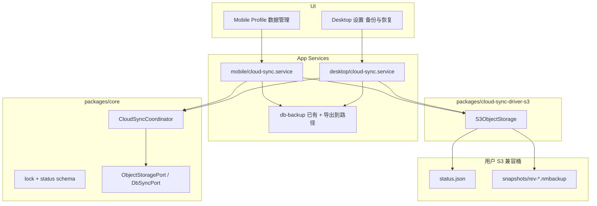
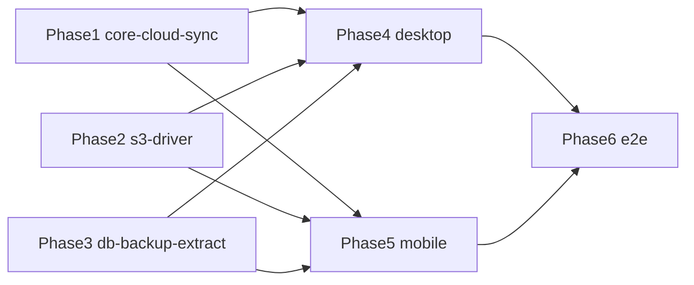

---

## date: 2026-06-12

# Desktop / Mobile 跨端云同步 技术规格（SPEC）

> 需求：[prd.md](./prd.md)  
> 前置：`import-export-navigation-fix/spec.md`（`.nmbackup` 排除/保留服务商三表）、`sksp/spec.md`（`SecretStore` 存 Secret Key）、`mobile-stability-db-migration/spec.md`（DB 备份基线）、`desktop-app/spec.md`（Desktop 数据管理入口）

## 设计目标

在 **最小改动面** 内交付 PRD 一期能力：用户自备 **S3 兼容** 桶 + **手动 Pull/Push** + **Push 时租约锁** + `**rev` 先拉后推**，复用既有整库备份语义，不引入自建同步服、后台自动同步或实体 merge。


| #   | PRD 能力  | 设计要点                                                           |
| --- | ------- | -------------------------------------------------------------- |
| 1   | S3 兼容配置 | Endpoint / Bucket / AK / SK / Region / 路径前缀；SK 经 `SecretStore` |
| 2   | 手动 Pull | 下载快照 → 现有 import 管线（保留服务商）→ 更新 `lastSyncedRev`                 |
| 3   | 手动 Push | 抢锁 → export 快照 → 上传 → `rev++` + 清锁                             |
| 4   | Push 互斥 | `status.json` 内租约锁 + S3 条件 PUT（`If-Match`）                     |
| 5   | 先拉后推    | `remote.rev > local.lastSyncedRev` 默认阻断 Push                   |
| 6   | 锁超时     | `expiresAt` 过期视为无锁；Push `finally` 清锁                           |
| 7   | 双端一致    | Desktop main IPC + Mobile service；Core 协调逻辑共享                  |


**SPEC 锁定（由头脑风暴 + PRD 待确认项收敛）**


| 项             | 决策                                                                     |
| ------------- | ---------------------------------------------------------------------- |
| 租约默认时长        | **900s（15min）**                                                        |
| 上传续租          | 单次 Push 内若上传耗时 **> 租约 50%**，**续租 1 次**（同 holder 条件 PUT 延长 `expiresAt`） |
| 强制覆盖云端        | **保留**：Push 阻断时 UI 二次确认 `forceOverwriteRemote`，跳过 `rev` 检查但仍须抢锁        |
| 默认路径前缀        | `novel-master/sync/`（用户可改，须以 `/` 结尾规范化）                                |
| `status.json` | 单文件承载 **manifest + lock**                                              |
| 快照命名          | `{prefix}snapshots/rev-{rev 6 位零填充}.nmbackup`                          |
| WebDAV        | **本期不实现**                                                              |
| 云端加密          | 不实现应用层加密；依赖桶侧 SSE                                                      |


**不在本 SPEC**：CLI 子命令、iOS、自动后台同步、多快照 UI、实体 merge、WebDAV 驱动。

---

## 总体方案

### 架构




### 远端对象布局

以默认前缀 `novel-master/sync/` 为例：

```
novel-master/sync/
  status.json
  snapshots/
    rev-000001.nmbackup
    rev-000042.nmbackup
```

### `status.json`（schemaVersion 1）

```json
{
  "schemaVersion": 1,
  "rev": 42,
  "snapshotKey": "novel-master/sync/snapshots/rev-000042.nmbackup",
  "snapshotSha256": "a1b2…",
  "snapshotBytes": 12582912,
  "uploadedAt": "2026-06-12T14:30:00.000Z",
  "uploadedByDeviceId": "550e8400-e29b-41d4-a716-446655440000",
  "lock": {
    "holderDeviceId": "550e8400-e29b-41d4-a716-446655440000",
    "acquiredAt": "2026-06-12T14:30:00.000Z",
    "expiresAt": "2026-06-12T14:45:00.000Z"
  }
}
```

- `**rev**`：已成功发布的快照版本；**0** 表示尚无快照（仅初始化或空桶）。
- `**lock`**：`null` 表示无人持锁；非 `null` 时须校验 `expiresAt`。
- **有效锁判定**：`lock != null && Date.parse(expiresAt) > Date.now()`。

### 本机持久化（不进云端）


| 存储                  | module / ref               | 键                                                                             | 说明                                        |
| ------------------- | -------------------------- | ----------------------------------------------------------------------------- | ----------------------------------------- |
| KKV `nm-cloud-sync` | —                          | `endpoint`, `bucket`, `region`, `pathPrefix`, `accessKeyId`, `forcePathStyle` | 非密钥配置                                     |
| KKV `nm-cloud-sync` | —                          | `deviceId`                                                                    | 首次配置时 `randomUUID()`                      |
| KKV `nm-cloud-sync` | —                          | `deviceLabel`                                                                 | 可选展示名                                     |
| KKV `nm-cloud-sync` | —                          | `lastSyncedRev`                                                               | 本机已与云端对齐的 `rev`                           |
| KKV `nm-cloud-sync` | —                          | `lastPullAt`, `lastPushAt`, `lastPullResult`, `lastPushResult`                | 状态展示                                      |
| SKSP                | `cloud-sync/s3-secret-key` | —                                                                             | Secret Access Key 明文经平台加密入 `sksp_secrets` |


> **不** 把 SK 写入 KKV 或 `status.json`。Access Key ID 可明文存 KKV（与 provider 配置一致）。

### 协调算法（Core `CloudSyncCoordinator`）

#### 读取远端状态

1. `GET status.json`；不存在 → 视为 `{ schemaVersion:1, rev:0, lock:null }`（无 `snapshotKey`）。
2. 解析 JSON + zod 校验；失败 → `CloudSyncError` `INVALID_STATUS`。

#### Pull（不需锁）

```
pull():
  remote = readStatus()
  if remote.rev <= local.lastSyncedRev → return ALREADY_UP_TO_DATE
  if remote.rev > 0 && !remote.snapshotKey → throw SNAPSHOT_MISSING
  bytes = download(remote.snapshotKey)
  verify sha256 === remote.snapshotSha256
  dbSync.importSnapshot(bytes)   // 保留服务商 + rebootstrap
  local.lastSyncedRev = remote.rev
```

#### Push（抢锁 → 上传 → 还锁）

```
push({ forceOverwriteRemote? }):
  if dbSync.isAgentActive() → throw AGENT_ACTIVE
  remote = readStatus()
  if !force && remote.rev > local.lastSyncedRev → throw NEED_PULL_FIRST

  etag = remote.etag
  try:
    newLock = buildLease(deviceId, leaseSeconds=900)
    if !canAcquireLock(remote.lock, deviceId):
      throw LOCK_HELD_BY_OTHER
  acquired = conditionalPutStatus(mergeLock(remote, newLock), ifMatch=etag)
  if !acquired → throw LOCK_CONTENTION

  try:
    tmpPath = dbSync.exportSnapshotToPath()   // scrub 后 .nmbackup
  hash = sha256(tmpPath)
  nextRev = remote.rev + 1
  snapKey = paths.snapshotKey(prefix, nextRev)
  upload(snapKey, tmpPath)
  if uploadElapsed > lease*0.5 → renewLockOnce()

  finalStatus = {
    schemaVersion: 1,
    rev: nextRev,
    snapshotKey: snapKey,
    snapshotSha256: hash,
    snapshotBytes: size,
    uploadedAt: now,
    uploadedByDeviceId: deviceId,
    lock: null
  }
  conditionalPutStatus(finalStatus, ifMatch=acquiredEtag)  // 失败则重读重试 1 次
  local.lastSyncedRev = nextRev
  finally:
    if lock still held by self → conditionalClearLock()
```

> **Push 成功 = 自动还锁**（`lock: null` 写入最终 `status.json`）。`finally` 仅在「已抢锁但未完成 final PUT」时尝试清锁。

#### 测试连接

`HeadBucket` 或 `ListObjectsV2`（`Prefix=pathPrefix`, `MaxKeys=1`）；不创建 `status.json`。

---

## 现状与约束（代码探索）


| 项          | 路径 / 现状                                                                                      | 本迭代                                                       |
| ---------- | -------------------------------------------------------------------------------------------- | --------------------------------------------------------- |
| DB 导出      | `apps/*/services/db-backup.service.ts`：`checkpoint` → `cp` → `scrubProviderTablesInDatabase` | 抽出 **导出到路径** / **从路径导入** 供云同步复用                           |
| DB 导入      | `dump` → `close` → replace → `restoreProviderTableSnapshot` → rebootstrap                    | `importSnapshot` 复用同序列                                    |
| 服务商三表      | `packages/core/src/infra/db-backup/`                                                         | 云快照与本地导出一致（已 scrub）                                       |
| Agent 守卫   | `isDesktopAgentActive` / `isMobileAgentActive`                                               | Push/export 前检查                                           |
| SKSP       | `SecretStore` + `sksp_secrets`                                                               | 存 S3 SK                                                   |
| KKV        | `KkvService`，module 如 `nm-mobile-ui`                                                         | 新 module `nm-cloud-sync`                                  |
| S3 SDK     | 仓库 **无** 既有依赖                                                                                | 新增 `packages/cloud-sync-driver-s3` + `@aws-sdk/client-s3` |
| Desktop 入口 | `SettingsViews` → `DataManagementView`；IPC `nm:backup/`*                                     | 扩展云同步区块 + 新 IPC                                           |
| Mobile 入口  | `ProfileTabScreen`「数据管理」                                                                     | 同区增加云同步                                                   |
| Core 依赖    | 无 `node:crypto`                                                                              | **sha256 在 driver / app 层**计算，Core 只比对 hex 字符串            |


---

## 最终项目结构

```
packages/core/src/infra/cloud-sync/
  ports/
    object-storage.port.ts      # get/put/head + etag
    db-sync.port.ts             # exportSnapshotToPath, importSnapshot, isAgentActive
  model/
    cloud-sync-status.ts        # types + zod schema
  logic/
    lock.ts                     # isEffectiveLock, canAcquireLock, buildLease
    paths.ts                    # statusKey, snapshotKey, normalizePrefix
  impl/
    cloud-sync-coordinator.ts
  errors/
    cloud-sync-errors.ts
  index.ts

packages/core/test/cloud-sync/
  lock.test.ts
  coordinator.test.ts         # mock ports

packages/cloud-sync-driver-s3/          # @novel-master/cloud-sync-driver-s3
  package.json
  src/
    create-s3-object-storage.ts
    s3-config.ts
  test/
    s3-object-storage.test.ts   # 可选：MinIO 集成

apps/desktop/src/main/
  services/
    cloud-sync-config.store.ts  # KKV + SKSP 读写
    cloud-sync.service.ts       # 组装 coordinator + S3 + db
    db-backup.service.ts        # + exportToPath / importFromPath
  ipc/handlers/cloud-sync.ts

apps/desktop/shared/ipc-types.ts        # 新 channel + DTO
apps/desktop/renderer/features/settings/SettingsViews.tsx  # DataManagementView 扩展

apps/mobile/src/
  services/
    cloud-sync-config.store.ts
    cloud-sync.service.ts
    db-backup.service.ts          # + exportToPath / importFromPath
  screens/tabs/ProfileTabScreen.tsx

apps/mobile/__tests__/
  cloud-sync.service.test.ts
  cloud-sync-coordinator.test.ts  # 若 mock 在 app 层
```

---

## 变更点清单


| 文件                                           | 变更类型 | 说明                                 |
| -------------------------------------------- | ---- | ---------------------------------- |
| `packages/core/src/infra/cloud-sync/**`      | 新增   | 协调器、锁、schema、ports                 |
| `packages/core/src/index.ts`                 | 修改   | 导出 cloud-sync API                  |
| `packages/cloud-sync-driver-s3/**`           | 新增   | S3 驱动包                             |
| `apps/desktop/package.json`                  | 修改   | 依赖 driver-s3                       |
| `apps/mobile/package.json`                   | 修改   | 依赖 driver-s3                       |
| `apps/*/db-backup.service.ts`                | 修改   | `exportToPath` / `importFromBytes` |
| `apps/desktop/.../cloud-sync.*`              | 新增   | 配置存储 + service + IPC               |
| `apps/mobile/.../cloud-sync.*`               | 新增   | 配置存储 + service                     |
| `SettingsViews.tsx` / `ProfileTabScreen.tsx` | 修改   | UI                                 |
| `ipc-types.ts` / `register-handlers.ts`      | 修改   | Desktop IPC                        |


**不改**：CLI、`vfs-zip`、provider 业务、服务商三表同步语义。

---

## 端口定义（Core）

### `ObjectStoragePort`

```typescript
export type ObjectStorageHeadResult = {
  exists: boolean;
  etag?: string;
  bytes?: number;
};

export interface ObjectStoragePort {
  head(key: string): Promise<ObjectStorageHeadResult>;
  get(key: string): Promise<{ body: Uint8Array; etag: string }>;
  put(
    key: string,
    body: Uint8Array,
    options?: { ifMatch?: string; ifNoneMatch?: string },
  ): Promise<{ etag: string }>;
}
```

### `DbSyncPort`

```typescript
export interface DbSyncPort {
  isAgentActive(): boolean;
  exportSnapshotToPath(destPath: string): Promise<void>;
  importSnapshot(bytes: Uint8Array): Promise<void>;
}
```

### `CloudSyncErrorCode`


| Code                 | 用户文案方向           |
| -------------------- | ---------------- |
| `NOT_CONFIGURED`     | 请先配置云存储          |
| `NEED_PULL_FIRST`    | 云端有更新，请先拉取       |
| `LOCK_HELD_BY_OTHER` | 另一台设备正在同步，请稍后再推送 |
| `LOCK_CONTENTION`    | 同步冲突，请重试         |
| `AGENT_ACTIVE`       | Agent 运行中，请稍后再试  |
| `ALREADY_UP_TO_DATE` | 已是最新             |
| `INVALID_STATUS`     | 云端状态文件损坏         |
| `SNAPSHOT_MISSING`   | 云端快照缺失           |
| `CHECKSUM_MISMATCH`  | 下载校验失败，请重试       |
| `NETWORK` / `AUTH`   | 网络错误 / 凭据错误      |


---

## S3 驱动（`@novel-master/cloud-sync-driver-s3`）

- 依赖：`@aws-sdk/client-s3`（**仅 driver 包**，不进 core）。
- `createS3ObjectStorage(config)` → `ObjectStoragePort`。
- 配置字段：

```typescript
export type S3StorageConfig = {
  endpoint: string;       // 含 https://
  region: string;         // 空串允许（MinIO）
  bucket: string;
  accessKeyId: string;
  secretAccessKey: string;
  forcePathStyle?: boolean; // MinIO / 部分 OSS 默认 true
};
```

- **Mobile**：main JS 线程使用 AWS SDK v3；若 Metro 需 polyfill，在 `apps/mobile` 入口确保 `react-native-get-random-values`（项目若已有则复用）。上传大文件用 `PutObject` + `Uint8Array`（经 `react-native-blob-util` 读入内存）；**一期接受**中等体积库一次性读入（与现有 import 一致）。
- **条件 PUT**：`PutObjectCommand` 的 `IfMatch` / `IfNoneMatch`。
- **ETag**：`GetObject` / `HeadObject` 返回；写入 `status.json` 时去掉引号。

---

## UI 规格

### 共用文案与行为


| 控件        | 行为                                                                     |
| --------- | ---------------------------------------------------------------------- |
| 云存储配置表单   | Endpoint、Bucket、Region、Access Key、Secret Key、路径前缀、Path style 开关        |
| 测试连接      | 不调 Pull/Push                                                           |
| 保存配置      | 校验非空；生成 `deviceId`（若缺）；SK 写 SKSP                                       |
| 状态区       | 云端 `rev`、本机 `lastSyncedRev`、上次 Pull/Push 时间/结果                         |
| 云端较新提示    | `remote.rev > lastSyncedRev` 时显示「建议先拉取」                                |
| Pull      | 确认后执行；`ALREADY_UP_TO_DATE` toast                                       |
| Push      | 默认执行；`NEED_PULL_FIRST` 弹窗：**先拉取** / **仍要覆盖云端**（`forceOverwriteRemote`） |
| Push 他人持锁 | 仅提示，无覆盖选项                                                              |
| 忙碌态       | `dbBusy` / `syncBusy` 禁用按钮                                             |


### Desktop

- 扩展 `DataManagementView`（`备份与恢复`）：上方「云同步」区块，下方保留本地导出/导入。
- IPC：`nm:cloud-sync/getConfig`、`setConfig`、`testConnection`、`getLocalStatus`、`pull`、`push`。

### Mobile

- `ProfileTabScreen`「数据管理」：`ListSectionTitle`「云同步」+ 配置入口（可 `Alert` 表单或轻量 stack screen `CloudSyncConfigScreen`）+ Pull/Push 按钮。
- 配置项多时用 **stack screen**（与 Events 配置同级），避免 Alert 表单过长。

---

## 详细实现步骤

### Phase 1 — Core cloud-sync（可独立合并）

1. `cloud-sync-status.ts`：zod schema + 默认值 `rev=0`。
2. `lock.ts`：`isEffectiveLock`、`canAcquireLock`、`buildLease`、`renewLease`。
3. `paths.ts`：`normalizePrefix`、`statusKey`、`snapshotKey(rev)` → `rev-000042`。
4. `cloud-sync-coordinator.ts`：Pull/Push/test 编排（依赖 ports）。
5. `cloud-sync-errors.ts`。
6. 单测：
  - 锁过期后可抢；
  - 他人持锁 Push 失败；
  - `remote.rev > local` Push 抛 `NEED_PULL_FIRST`；
  - Pull 后 `lastSyncedRev` 更新；
  - mock：Push 成功 `lock:null`；
  - mock：Push 中途失败 `finally` 清锁。

### Phase 2 — S3 driver

1. 新建 `packages/cloud-sync-driver-s3`，`npm workspace` 注册。
2. 实现 `createS3ObjectStorage`。
3. 单测：mock `@aws-sdk/client-s3` 客户端；可选本地 MinIO 手工验收记录。

### Phase 3 — DB backup 抽取

1. `exportDatabaseBackupToPath(runtime, destPath)`：从现有 export 去掉 dialog/saveDocuments。
2. `importDatabaseBackupFromBytes(bytes)` / `importDatabaseBackupFromPath`：从现有 import 去掉 picker。
3. Desktop/Mobile 原 export/import **改为调用** 上述函数 + UI 层。
4. 扩展 `db-backup.service.test.ts` 覆盖新函数。

### Phase 4 — Desktop

1. `cloud-sync-config.store.ts`：KKV + SKSP。
2. `cloud-sync.service.ts`：组装 coordinator、`DbSyncPort`、`S3ObjectStorage`。
3. IPC handlers + `ipc-types` + preload 暴露。
4. `DataManagementView` UI。
5. `apps/desktop/test/ipc-handlers.test.ts` 或 cloud-sync service test（mock S3）。

### Phase 5 — Mobile

1. 同 Phase 4 store + service。
2. `ProfileTabScreen` / `CloudSyncConfigScreen`。
3. `cloud-sync.service.test.ts`（jest mock）。

### Phase 6 — 集成验收

1. `npm run build`（根目录）。
2. `npm run test -w @novel-master/core`。
3. `npm test -w @novel-master/mobile`。
4. `npm test -w @novel-master/desktop`。
5. **手工**：MinIO 或阿里云 OSS 同桶 — Desktop Push → Mobile Pull → Mobile 改 → Push → Desktop Pull；双端 AK 仍可用；模拟持锁 Push 失败文案。

---

## 测试策略

### 自动化


| ID    | 层级      | 用例                                                  |
| ----- | ------- | --------------------------------------------------- |
| CS-L1 | core    | 有效锁 + 未过期 + 他人 holder → `canAcquireLock` false      |
| CS-L2 | core    | 锁过期 → `canAcquireLock` true                         |
| CS-P1 | core    | `remote.rev=2, local=1` Pull 成功，mock import 被调用     |
| CS-P2 | core    | `remote.rev=1, local=1` Pull → `ALREADY_UP_TO_DATE` |
| CS-P3 | core    | `remote.rev=2, local=1` Push → `NEED_PULL_FIRST`    |
| CS-P4 | core    | 他人有效锁 Push → `LOCK_HELD_BY_OTHER`                   |
| CS-P5 | core    | Push 成功 mock：final status `lock:null`, `rev++`      |
| CS-P6 | core    | Push 上传失败：mock 清锁被调用                                |
| CS-S1 | driver  | mock SDK `If-Match` 冲突抛错映射                          |
| DB-E1 | mobile  | `exportToPath` 后 attach 副本无三表行                      |
| IPC-1 | desktop | mock service Pull/Push IPC 返回                       |


### 手工（一期必做）


| ID  | 场景                                |
| --- | --------------------------------- |
| E1  | Desktop 建项目 Push → Mobile Pull 可见 |
| E2  | Mobile 改消息 Push → Desktop Pull 可见 |
| E3  | 双端各配 AK，往返后仍可调用模型                 |
| E4  | A Push 中途杀进程，15min 后 B Push 成功    |
| E5  | A 持锁 Push 中，B Push 提示「另一台设备正在同步」  |
| E6  | 云端更新后 B 直接 Push → 先拉取提示           |


---

## 风险与回滚方案


| 风险                    | 缓解                                  | 回滚                     |
| --------------------- | ----------------------------------- | ---------------------- |
| S3 条件 PUT 与部分 OSS 兼容性 | `forcePathStyle`；验收 MinIO + 一家云 OSS | 隐藏云同步 UI；本地导入/导出仍可用    |
| 大库 Push 内存            | 与现有 import 同限制；文案提示大库耗时             | 用户改用手动 `.nmbackup`     |
| AWS SDK 体积（Mobile）    | 仅 driver 包引用；tree-shaking           | —                      |
| `status.json` 损坏      | zod 校验 + 明确错误                       | 用户手动删桶内 status 重新 Push |
| Pull 误覆盖              | 导入前 `.nmbackup.bak`                 | 本地 bak 恢复              |


**功能回滚**：不删 KKV/SKSP 键即可；关闭 UI 入口不影响数据。

---

## 兼容性与迁移

- **无** `novel.db` schema 变更（KKV 新 module 即可）。
- 未配置云同步的用户：**零行为变化**。
- `import-export-navigation-fix` 合并后云快照 **必须** scrub 三表；若 main 尚未含该能力，本迭代 **依赖** 其合并或同步 cherry-pick `infra/db-backup`。

---

## DAG 任务拆分（实现用）




| Wave | 任务                 | 可并行                         |
| ---- | ------------------ | --------------------------- |
| 0    | core-cloud-sync    | s3-driver、db-backup-extract |
| 1    | desktop-cloud-sync | mobile-cloud-sync           |
| 2    | e2e-verify         |                             |


