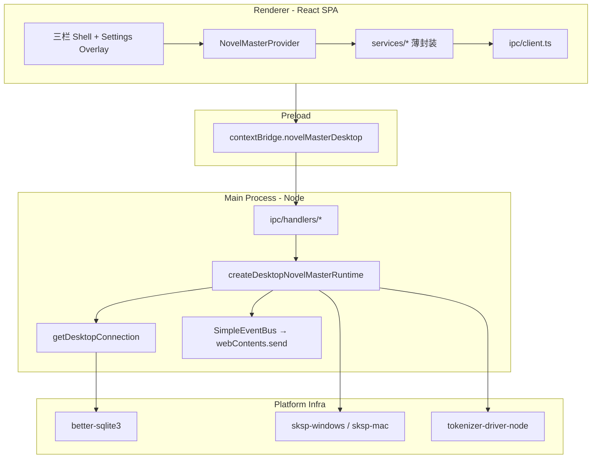

# Novel Master Desktop App 技术规格（SPEC）

> 需求：[prd.md](./prd.md)  
> UI 权威：[examples/desktop](../../../../examples/desktop)（`index.html` + `shell.js` + `shell.css`）  
> 行为权威：[apps/mobile](../../../../apps/mobile)（功能与 Core 接线对照）  
> Runtime 对照：[apps/cli/src/runtime.ts](../../../../apps/cli/src/runtime.ts)

## 设计目标

- 在 **`apps/desktop`** 交付 PRD 定义的全功能 Electron 产品：三栏冻结布局 + mobile 能力全集。
- **数据层**与 `createMobileNovelMasterRuntime` / `createNovelMasterRuntime` 等价，替换为 Node `better-sqlite3` + 平台 SKSP（Windows DPAPI / macOS Keychain）+ `tokenizer-driver-node`。
- **UI**用 React 重写 renderer，视觉与 IA 对齐 `examples/desktop`；**禁止**生产路径依赖原型 localStorage mock。
- **沙箱 renderer**：`contextIsolation: true`、`nodeIntegration: false`；所有 Core 访问在 **main 进程**，经类型化 IPC 暴露。
- **跨平台**：同一 codebase 产出 Win/macOS 未签名安装包（`electron-builder`）。
- **Core 零变更**（本迭代）：复用 mobile 已落地的 `KkvService` 导出、`PersistentState.currentAgentId`、`random-uuid` 等；Desktop 仅新增 `apps/desktop/**` 与必要 workspace 依赖。

---

## 现状与约束（代码探索）

| 项 | 现状 | 对本迭代影响 |
|----|------|----------------|
| `apps/desktop` | `main.ts` + stub preload + 占位 `renderer/index.html`；仅依赖 `core` + `electron` | 需全面扩展：Vite/React、IPC、runtime、打包 |
| `apps/desktop/test/smoke.test.js` | 禁止 `createNovelMasterRuntime` 出现在 `src`/`renderer` | 改用 `createDesktopNovelMasterRuntime`；更新 smoke 断言 |
| `examples/desktop` | ~3200 行 `shell.js` IIFE；`SETTINGS_NAV` 四组配置；`NAV_TO_WORKSPACE` 映射；`verify-spec-matrix.mjs` D-01–D-06 | React 组件按 DOM id / 交互 1:1 复刻；矩阵脚本扩展为「构建产物 DOM 检查」 |
| `apps/mobile` | 完整 runtime + 25 个 `services/*.ts` + 17 个 stack screens | **行为与薄服务层**直接移植到 renderer（改调 IPC）；RN 组件换 Web 实现 |
| `apps/cli` `runtime.ts` | `registerBetterSqlite3Driver` + **硬编码** `registerSkspWindowsDriver` + `resolveSkspDriver("windows")` + `createEnvSecretStore` | Desktop 需 **平台分支** SKSP；可选保留 env override 便于开发 |
| SKSP 包 | `sksp-windows`（DPAPI）、`sksp-mac`（Keychain + AES-GCM）均已实现 | main 进程按 `process.platform` 注册 |
| Tokenizer | `registerTokenizerNodeDriver({ assetsRoot })`；默认 `packages/tokenizer-driver-node/assets/tokenizers` | 打包时 `extraResources` 拷贝 assets；开发态用 monorepo 路径 |
| 构建工具 | 无 Vite/webpack/electron-builder | 新增 Vite（renderer）+ electron-builder（dist） |
| Native 模块 | `better-sqlite3`、`@primno/dpapi`（win）、`@napi-rs/keyring`（mac） | `electron-rebuild` / builder `npmRebuild` |
| 原型 vs README | README 写 rail「对话\|我的」Tab；**实际 HTML** 用顶栏 ⚙ 打开 `#settings-page` | **以 HTML 为准**（齿轮 → 全屏设置 overlay） |

**兼容性原则**

- Desktop DB 为独立文件（`userData/novel.db`），与 mobile 设备库、CLI `.novel-master/novel.db` **路径不同**；互通靠 **整库文件替换**（与 mobile `db-backup.service.ts` 同语义）。
- KKV UI 模块使用 **`nm-desktop-ui`**（不复用 `nm-mobile-ui`），避免同库导入后键冲突；跨端 prefs 不保证恢复（PRD 已接受）。
- 工作区指针仍仅经 `PersistentState`（Core port），App 不得直写 `nm-workspace-state`。

---

## 总体方案

### 前端框架选型：**React 18+**

| 维度 | React（选定） | Vue 3 |
|------|---------------|-------|
| 仓库先例 | `apps/mobile` 全栈 React 19 + 上下文模式（`NovelMasterProvider`） | 无 |
| 服务层移植 | `agent-run.service.ts` 等可直接改类型导入，逻辑几乎原样 | 全部重写 |
| 配置屏映射 | mobile 17 个 stack screen → desktop settings overlay 子视图，组件结构可对照迁移 | 无对照 |
| Electron 生态 | `electron-vite` / Vite+React 模板成熟 | 可行但无本项目积累 |
| 包体积 | 略大 | 略小 |
| 风险 | RN 组件（WebView 聊天气泡、BottomSheet）**不可移植**，需 Web 替代 | 同等重写成本，无复用 |

**结论**：选 React；配置与对话逻辑优先从 `apps/mobile/src` 移植，布局与样式从 `examples/desktop` 移植。

### 架构



### 关键定案

| 主题 | 决策 |
|------|------|
| Runtime 宿主 | **Main 进程单例** `getDesktopRuntime()`，对齐 `getMobileConnection()` 生命周期 |
| IPC 形态 | **分域 `ipcMain.handle`**（`nm:projects/*`、`nm:sessions/*`、`nm:messages/*`、`nm:vfs/*`、`nm:agent/*`、`nm:providers/*`、`nm:backup/*`、`nm:ui/*`）；**禁止** renderer 直接 `import @novel-master/core` |
| 流式输出 | Main 订阅 `runtime.eventBus`；`webContents.send('nm:agent-stream', payload)`；Renderer `useEffect` 监听 |
| Agent 运行 | Main 执行 `runAgentTurn`（移植 `agent-run.service.ts`）；Renderer 只发 `nm:agent/run` |
| LLM HTTP | Main 进程 `globalThis.fetch`（与 CLI/mobile Node 一致）；可选 dev logging |
| DB 路径 | `path.join(app.getPath('userData'), 'novel.db')` |
| SKSP | `darwin` → `registerSkspMacDriver` + `resolveSkspDriver('macos')`；否则 windows 分支 |
| SecretStore | `createCompositeSecretStore({ db, env: createEnvSecretStore() })`（与 CLI 一致，便于开发） |
| UI 偏好 | `createAppUiPreferences(kkv)`，module **`nm-desktop-ui`**；keys 对齐 mobile `app-ui-keys.ts` |
| Scope | `desktop-scope.ts` 对齐 `mobile-scope.ts`；`PersistentState` 读写 project/session/agent/model/regex |
| 文件对话框 | `electron.dialog`（备份、YAML、VFS zip）在 main 或 IPC 内调用 |
| VFS Zip | Main 使用 `@novel-master/core` `createVfsZipIoService` + Node `fs`（替代 mobile native zip） |
| Token 计数 | **首期接入** `registerTokenizerNodeDriver`（与 CLI 一致，满足 PRD 对话 meta） |
| Markdown | 聊天气泡与预览用 **react-markdown** + 现有 CSS token；不移植 RN WebView 引擎 |
| 主题 | `data-theme` on `#app`；持久化 `nm-desktop-ui` / key `theme`（对齐原型 `THEME_STORAGE_KEY` 语义） |

### 布局与 mobile 功能映射

| 原型区域 / 视图 | DOM / 状态 | Mobile 对照 |
|-----------------|------------|-------------|
| `#chat-rail` 项目列表 | `data-nav-view="projects"` | `ChatTab` 项目抽屉 + `projects.list` |
| `#chat-rail` 会话列表 | `sessions` | 会话列表 + `sessions.listByProject` |
| `#chat-rail` 对话 | `conversation` | 聊天子 Tab + Composer + `agent-run` |
| `#explorer-pane` | `NAV_TO_WORKSPACE[viewId]` | `VfsFileManager`（global/project/session scope） |
| `#preview-pane` | `previewFileId` | `FileEditorScreen` 预览/编辑 |
| `#settings-page` | `SETTINGS_NAV` / `pageStack` | Profile + 全部 stack screens |
| 会话菜单 `#session-actions-menu` | 批量/压缩/模型/Agent | `SessionActionsDrawer` |
| 真实提示词 `#real-prompt-list` | conversation Tab | `RealPromptScreen` / `prompt-preview.service` |

---

## 最终项目结构

```text
apps/desktop/
├── package.json                      # + react, vite, electron-builder, drivers, sksp-*
├── electron-builder.yml
├── vite.config.ts
├── tsconfig.json                     # main + preload
├── tsconfig.renderer.json
│
├── shared/
│   └── ipc-types.ts                  # 通道名 + Request/Response DTO（可序列化）
│
├── src/
│   ├── main/
│   │   ├── main.ts                   # 窗口、加载 Vite 产物、注册 IPC、quit 时 closeConnection
│   │   ├── runtime/
│   │   │   ├── connection.ts         # getDesktopConnection / closeDesktopConnection / checkpoint
│   │   │   ├── create-desktop-runtime.ts
│   │   │   ├── resolve-db-path.ts
│   │   │   ├── register-platform-drivers.ts
│   │   │   └── types.ts              # DesktopNovelMasterRuntime（≈ MobileNovelMasterRuntime + dbPath）
│   │   ├── ipc/
│   │   │   ├── register-handlers.ts
│   │   │   ├── forward-event-bus.ts
│   │   │   └── handlers/
│   │   │       ├── bootstrap.ts      # ping, getStatus, rebootstrap
│   │   │       ├── scope.ts
│   │   │       ├── projects.ts
│   │   │       ├── sessions.ts
│   │   │       ├── messages.ts
│   │   │       ├── vfs.ts
│   │   │       ├── worktree.ts
│   │   │       ├── session-fs.ts
│   │   │       ├── agent.ts          # registry + run + yaml
│   │   │       ├── providers.ts
│   │   │       ├── regex.ts
│   │   │       ├── events.ts
│   │   │       ├── compaction.ts
│   │   │       ├── backup.ts         # export/import + dialog
│   │   │       └── app-ui.ts         # KKV nm-desktop-ui 读写
│   │   └── services/                 # main 侧执行（从 mobile 移植）
│   │       ├── agent-run.service.ts
│   │       ├── db-backup.service.ts
│   │       ├── vfs-zip.service.ts
│   │       └── ...
│   │
│   └── preload/
│       └── preload.ts                # expose novelMasterDesktop.invoke / on / version
│
├── renderer/
│   ├── index.html
│   ├── main.tsx
│   ├── App.tsx
│   ├── providers/
│   │   ├── NovelMasterProvider.tsx
│   │   └── ThemeProvider.tsx
│   ├── ipc/
│   │   └── client.ts
│   ├── state/
│   │   └── desktop-scope.ts
│   ├── layout/
│   │   ├── MainShell.tsx
│   │   ├── PreviewPane.tsx
│   │   ├── ExplorerPane.tsx
│   │   ├── ChatRail.tsx
│   │   ├── AppChrome.tsx
│   │   └── SettingsOverlay.tsx
│   ├── features/
│   │   ├── chat/                     # 消息列表、Composer、batch、session 菜单
│   │   ├── workspace/                # VfsTree、context menu、footer pickers
│   │   ├── preview/                  # 读/编切换、保存
│   │   ├── settings/                 # SETTINGS_NAV 各子页
│   │   └── theme/
│   ├── services/                     # 薄封装：调 IPC，接口对齐 mobile services
│   ├── hooks/
│   │   ├── useAgentStream.ts
│   │   └── useColumnSplitters.ts
│   └── styles/
│       ├── tokens.css                # 从 shell.css 提取变量
│       └── shell.css                 # 布局类（端口）
│
└── test/
    ├── smoke.test.js
    ├── runtime.test.ts
    ├── ipc-handlers.test.ts
    └── packaging.test.js
```

---

## 变更点清单

| 路径 | 变更类型 | 说明 |
|------|----------|------|
| `apps/desktop/package.json` | 修改 | 增加 runtime 依赖、React、Vite、electron-builder、scripts |
| `apps/desktop/electron-builder.yml` | 新建 | win nsis、mac dmg、`extraResources` tokenizer assets、`npmRebuild` |
| `apps/desktop/vite.config.ts` | 新建 | `root: renderer`，`outDir: dist/renderer`，`base: './'` |
| `apps/desktop/src/main/**` | 新建/重写 | runtime + IPC + 窗口加载 `dist/renderer/index.html` |
| `apps/desktop/src/preload/preload.ts` | 重写 | `invoke(channel, payload)` + `on(channel, cb)` |
| `apps/desktop/renderer/**` | 新建 | 全量 React UI |
| `apps/desktop/shared/ipc-types.ts` | 新建 | 通道契约 |
| `apps/desktop/test/smoke.test.js` | 修改 | 断言 `createDesktopNovelMasterRuntime`、Vite 产物、IPC preload API |
| `package.json`（root） | 修改 | `desktop:dev` 并行 Vite + electron；`desktop:dist` 打包 |
| `packages/core` | **不改** | 消费现有 API |
| `examples/desktop` | **不改** | 保持原型参考；矩阵脚本可被 desktop test import |

---

## 详细实现步骤

### D0 — 工程脚手架与原生依赖

1. **依赖**（`apps/desktop/package.json`）：
   - runtime：`@novel-master/tdbc-driver-better-sqlite3`、`@novel-master/tokenizer-driver-node`、`@novel-master/sksp-windows`、`@novel-master/sksp-mac`
   - ui：`react`、`react-dom`
   - tooling：`vite`、`@vitejs/plugin-react`、`electron-builder`、`@electron/rebuild`（或 builder 内置）
2. **`vite.config.ts`**：renderer 构建到 `dist/renderer`；dev server 端口固定（如 5173），`main.ts` dev 模式 `loadURL`。
3. **`electron-builder.yml`**：
   - `files`: `dist/**`、`package.json`
   - `extraResources`: `packages/tokenizer-driver-node/assets/tokenizers` → `tokenizers/`
   - `win.target`: `nsis`；`mac.target`: `dmg`
   - `npmRebuild: true`
4. **根脚本**：
   - `desktop:dev`: `concurrently "vite -w" "wait-on tcp:5173 && electron ."`
   - `desktop:build`: `vite build && tsc && electron-builder`
5. **`register-platform-drivers.ts`**：

```typescript
export function registerPlatformSkspDriver(): "windows" | "macos" {
  if (process.platform === "darwin") {
    registerSkspMacDriver();
    return "macos";
  }
  registerSkspWindowsDriver();
  return "windows";
}
```

**验证**：`npm run build -w @novel-master/desktop`；`npm test -w @novel-master/desktop` smoke 通过；Electron 窗口加载空白 React 页。

---

### D1 — Runtime + IPC 基础

1. **`connection.ts`**（镜像 `apps/mobile/src/db/connection.ts`）：
   - `registerBetterSqlite3Driver()`
   - `registerPlatformSkspDriver()`
   - `registerTokenizerNodeDriver({ assetsRoot: resolveTokenizerAssetsRoot() })`
   - `open(\`tdbc:sqlite:file:${dbPath}\`, { driver: "better-sqlite3" })`
   - `bootstrapNovelMaster(conn)`
2. **`create-desktop-runtime.ts`**：复制 `create-mobile-runtime.ts` 装配；`secretStore` 改为：

```typescript
const skspName = registerPlatformSkspDriver();
const dbStore = resolveSkspDriver(skspName).createStore(conn);
const secretStore = createCompositeSecretStore({
  db: dbStore,
  env: createEnvSecretStore(),
});
```

3. **`resolveTokenizerAssetsRoot()`**：开发用 monorepo 默认路径；生产用 `path.join(process.resourcesPath, 'tokenizers')`。
4. **`preload.ts`**：暴露 `{ invoke, on, off, version }`。
5. **`register-handlers.ts`**：注册 `nm:bootstrap/status`、`nm:bootstrap/rebootstrap`。
6. **`forward-event-bus.ts`**：main 在 runtime 创建后 `eventBus.on('*')` → 转发到 focused `webContents`。
7. **Renderer `NovelMasterProvider`**：启动 `invoke('nm:bootstrap/status')`；loading/error/retry 对齐 mobile。

**验证**：`runtime.test.ts` 内存库 bootstrap；Windows/macOS 单测 SKSP round-trip（CI 仅跑当前 OS）；应用启动显示「Runtime ready」。

---

### D2 — 三栏主 Shell（PRD 布局）

1. **`MainShell.tsx`**：CSS grid 三栏 + `#splitter-*` 拖拽（端口 `initColumnSplitters` 逻辑到 `useColumnSplitters`）。
2. **`AppChrome.tsx`**：列显示切换、`#theme-toggle`、`#settings-open`。
3. **响应式**：宽度 &lt; 900px 隐藏 `#preview-pane`（`shell.css` 已有规则）。
4. **`ThemeProvider`**：`appUi.get/set('theme')`；`document.documentElement.dataset.theme`。
5. **DOM id 保留**：关键容器 id 与原型一致，便于 `verify-spec-matrix` 复用。

**验证**：D-01、D-06 矩阵项；手动：拖拽分栏、主题切换持久化。

---

### D3 — Scope + 聊天轨导航

1. **`desktop-scope.ts`**：移植 `mobile-scope.ts`；IPC `nm:scope/get`、`nm:scope/setProject`、`nm:scope/setSession`。
2. **`ChatRail.tsx`**：`projects` → `sessions` → `conversation` drill-down；`#rail-pane-nav` 返回栈。
3. **项目/会话 CRUD IPC**：`projects.list/create/rename/delete`、`sessions.listByProject/create/rename/delete`。
4. **批量删除**：对齐 mobile 循环删除。
5. **`syncWorkspaceWithNav`**：`showNavView` 时设置 `workspaceScope`（`NAV_TO_WORKSPACE` 表）。

**验证**：D-02、D-03；B1–B3 类场景（项目会话切换）。

---

### D4 — Explorer + Preview（VFS）

1. **IPC**：`nm:vfs/list|read|write|mkdir|delete|rename`、`nm:worktree/buildListRows|setDirRule|setFileRule`、`nm:sessionFs/execute|listBatches|rollback`。
2. **`ExplorerPane.tsx`**：三棵逻辑树（`#workspace-tree-global|session|chat`）按 `workspaceScope` 显隐；端口 `renderWorkspaceTree` 行 UI。
3. **Context menu**：`#workspace-context-menu` 动作接 `vfs-operations` / `worktree-operations`（从 mobile 移植）。
4. **`PreviewPane.tsx`**：读/编切换、保存；用户保存走 `sessionFs.execute`（actor `user`）。
5. **Zip 导入导出**：main `vfs-zip.service.ts` + `dialog.showOpenDialog` / `showSaveDialog`。
6. **Template pull**：`projects.pullTemplate` / `sessions.pullTemplate`（mobile M6 已有）。

**验证**：D-04；PRD VFS 验收；`vfs.write` 产生 sessionFs batch。

---

### D5 — 对话 + Agent 闭环

1. **main `agent-run.service.ts`**：从 mobile 原样移植；`toolCtx` 含 `sessionFs`、`sessionVfs`。
2. **IPC**：`nm:agent/run`、`nm:agent/resolveCurrent`、`nm:messages/list|append|edit|hide|delete`、`nm:messages/rollback`。
3. **`ChatRail` 对话视图**：
   - `#chat-messages`：`MessageList` + display-channel regex（`regex-apply-channel.ts`）
   - `#chat-composer`：有 model 才可发；`llmStream` 读 `nm-desktop-ui`
   - `#conversation-meta` / token bar：`chat-prompt-tokens.service.ts`
4. **流式**：`useAgentStream` 监听 `nm:agent-stream`；尾块追加或 message reload。
5. **会话菜单**：切换 Agent/模型（写 `PersistentState`）、真实提示词、手动压缩（`eventOrchestrator.emit`）、批量消息模式。
6. **真实提示词 Tab**：`#real-prompt-list` ← `prompt-preview.service.ts`。

**验证**：PRD 对话 + 回滚验收；E2 场景。

---

### D6 — 设置页全集（对齐 mobile stack）

按 `SETTINGS_NAV` 实现 React 子路由（`settingsState.pageStack`）：

| viewId | Mobile 源文件 | Core API |
|--------|---------------|----------|
| `workspace` | Profile 工作区区 | `state` model/agent/regex；`preferences` |
| `agentsSettings` / `agentEditor` | `AgentsSettingsScreen` / `AgentEditorScreen` | `agentRegistry` + YAML IPC |
| `providers` / `providerDetail` / `modelSampling` | Provider 系列 | `providers` + `providerModels` + SKSP |
| `compactionConditions` | `CompactionConditionsScreen` | `compactionConditions` |
| `eventsConfig` | `EventsConfigScreen` | `eventsConfig` + YAML |
| `regexGroups` / `regexRules` / `regexRuleEditor` | Regex 系列 | `regexConfig` |
| `globalTemplate` | `GlobalTemplateScreen` | `globalVfs` + `VfsFileManager` 嵌入 |
| `dataManagement` | DB backup | `db-backup.service.ts` |

Provider 创建/编辑：`providers.create/edit` + apiKey → `secretStore.set`（**SKSP 验收**）。

**验证**：D-05、CR-1–4；PRD Provider+SKSP、配置页验收。

---

### D7 — 打包、打磨与跨端备份

1. **`db-backup.service.ts`（main）**：
   - export：`checkpoint` → `dialog.showSaveDialog` → 复制 db 为 `.nmbackup`
   - import：选文件 → 校验 SQLite magic → `closeDesktopConnection` → 替换 → `rebootstrap`
   - Agent 运行中拒绝（`agent-activity` 标志）
2. **`electron-builder`** 产出 Win/macOS 安装包；README 说明未签名警告。
3. **错误边界**：IPC handler 统一 try/catch → `{ ok: false, error: { code, message } }`。
4. **更新 `verify-spec-matrix.mjs`**：可选增加对 `dist/renderer/index.html` 的构建后检查（CI 步骤）。

**验证**：PRD 构建与备份验收；mobile 导出库在 Desktop 导入后可继续对话。

---

## 测试策略

### 自动化

| ID | 范围 | 内容 |
|----|------|------|
| T1 | `runtime.test.ts` | `createDesktopNovelMasterRuntime` 装配；`projects.create` smoke |
| T2 | `ipc-handlers.test.ts` | 用 Electron `utilityProcess` 或抽取 handler 纯函数测试 scope/projects |
| T3 | SKSP | 复用 `sksp-windows` / `sksp-mac` 包内单测；desktop 增平台注册 smoke |
| T4 | `smoke.test.js` | package main、preload API、dist 产物存在、原型仍驻留 examples |
| T5 | `packaging.test.js` | `electron-builder --dir` 后可执行文件存在（CI 按 OS 条件执行） |
| T6 | renderer 单测 | Vitest：`desktop-scope`、`regex-apply-channel`（从 mobile 复制） |
| T7 | `verify-spec-matrix.mjs` | D-01–D-06 对 **built** `index.html` + 源中关键字符串 |

**不在首期**：Spectron/Playwright E2E、真机 LLM 集成（手工）。

### 测试用例（手工冒烟）

| ID | 场景 | 步骤 | 期望 |
|----|------|------|------|
| E1 | 布局 | 启动 → 拖分栏 → 切主题 | 三栏可见；主题重启后保持 |
| E2 | 对话 | 配 Provider+模型+Agent → 发消息 | 持久化；流式结束有回复；重启仍在 |
| E3 | SKSP | 新建 Provider 填 Key → 拉模型 | `sksp_secrets` 有 ref；重启后仍可用 |
| E4 | VFS | 会话工作区建文件 → 预览编辑保存 | 内容与 Core 一致；prompt 可见 |
| E5 | 回滚 | 对历史消息回滚 | 之后消息清除；与 mobile 语义一致 |
| E6 | 备份 | mobile 导出 → desktop 导入 | 项目会话消息可继续 |
| E7 | 打包 | 安装 built 包 → 重复 E1–E3 | 安装版行为与 dev 一致 |

### CLI / mobile 对照

同库不同路径；对比 **语义**（`nm project list`、`nm vfs list` 与 Desktop 同 scope 下一致）。SKSP：CLI Win 与 Desktop Win 均 DPAPI；macOS 用 Keychain。

---

## 风险与回滚方案

| 风险 | 缓解 | 回滚 |
|------|------|------|
| `better-sqlite3` Electron ABI 不匹配 | `electron-builder` `npmRebuild`；文档固定 Electron 版本 | 锁定 electron 版本；`npm rebuild` |
| 沙箱 renderer 禁止直接调 Core | 全量 IPC；禁止 renderer 依赖 core | — |
| IPC 面膨胀难维护 | `shared/ipc-types.ts` 单源；handler 按域拆分 | — |
| Tokenizer assets 打包路径错误 | `extraResources` + `resolveTokenizerAssetsRoot` 单测 | 回退近似计数（仅 UI 降级，不推荐） |
| macOS Keychain 在无 GUI CI 失败 | SKSP 单测在包内；desktop 仅 smoke 当前 OS | 跳过 mac 打包 CI 步骤 |
| 原型 3200 行端口工作量大 | 分里程碑；先布局再设置页；复用 mobile 逻辑 | 缩减首期设置子页（违 PRD，仅作紧急回滚） |
| Agent 运行中导入 DB | `agent-activity` 互斥 | 提示用户等待 |
| 未签名安装包 Gatekeeper | README 说明右键打开 / 安全设置 | 不阻断 PRD |
| `createNovelMasterRuntime` smoke 历史约束 | 更新 test 允许 desktop 自有 factory | revert test + runtime 提交 |

**回滚策略**：`apps/desktop` 可独立 revert 至 Electron 壳；`examples/desktop` 不受影响；Core 无变更无需回滚。

---

## 里程碑总览

| 阶段 | 交付物 | PRD 对应 |
|------|--------|----------|
| D0 | Vite+React+builder 脚手架 | 构建产物 |
| D1 | Runtime + IPC + Provider | 持久化基础 |
| D2 | 三栏 Shell + 主题 | 布局验收 |
| D3 | 聊天轨导航 + scope | 导航验收 |
| D4 | VFS + Preview | VFS 验收 |
| D5 | 对话 + Agent + 流式 | 对话验收 |
| D6 | 设置全集 + SKSP | Provider/配置验收 |
| D7 | 备份 + 安装包 | 跨端 + 构建验收 |
