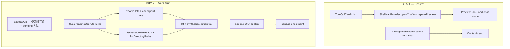

# Desktop 聊天与工作区交互优化 技术规格（SPEC）

> **PRD**：[prd.md](./prd.md)  
> **前置**：[vfs-user-ops-unified-tool-turn/prd.md](../vfs-user-ops-unified-tool-turn/prd.md)、[message-checkpoint-v2/spec.md](../message-checkpoint-v2/spec.md)、[desktop-workspace-ux-fixes/spec.md](../desktop-workspace-ux-fixes/spec.md)  
> **建议分支**：`feature/desktop-chat-workspace-polish`  
> **范围**：F2/F3 → `apps/desktop/**`；F4 → `packages/core/**`（Desktop/Mobile flush 共用，行为变更双端生效；Mobile UI 不变）

## 设计目标

1. **F2**：Desktop 聊天区文件类工具卡片可点击，打开 **聊天工作区**（`chat` scope）Preview tab，对齐 Mobile `vfsToolFilePath` 语义。
2. **F3**：Explorer 顶栏三图标收拢为 **更多（⋯）** 菜单；「初始化 / 导入 / 导出」逻辑与 IPC 不变。
3. **F4**：用户发送 Agent 消息触发 flush 时，以 **最近 message checkpoint 为基准** 对比当前会话工作区 **终态**，**合成** `user-vfs-action` XML；净变更为空则 **不** 写入 U+A 消息对。
4. **可分期落地**：阶段 1（F3→F2）可独立验收；阶段 2（F4）仅改 Core flush，不依赖 Desktop UI。

---

## 总体方案

### 架构概览



### 设计决策

| 项 | 选择 | 理由 |
|----|------|------|
| F2 scope | 固定 `chat` | 与 Mobile「聊天工作区」一致；会话工作区用 `session` 面板 |
| F2 Preview 栏 | `openChatWorkspacePreview` 封装 `selectPreviewFile` + 显示 Preview 列 | PRD 默认需看见打开结果；`toggleColumn` 在 `App`/`useColumnSplitters`，经 ShellNav 注册回调 |
| F2 `vfsToolFilePath` | 复制到 Desktop `message-blocks.ts`（首版） | Mobile/Web 各有拷贝；后续可抽 shared，本迭代不扩 scope |
| F3 菜单 | 复用 `ContextMenu.tsx` | ChatRail/Settings 已有 portal 菜单；比复制 `#message-actions-menu` 更少样板 |
| F4 基准树 | `findCheckpointMessageIdAtOrBefore(sessionId, maxSeq)` + `loadFileTree` | 与 rollback 同源；`maxSeq` = flush 前会话最大 `seq` |
| F4 空目录 | flush 时 `listDirectoryPathsUnderPrefix` vs 由 baseline 文件路径 **推导** 的父目录集 | checkpoint **不** 存空目录（message-checkpoint-v2 设计）；不改 checkpoint schema |
| F4 rename | 合成层：同内容「删 path + 增 path」配对 → `kind="rename"` | VFS `moveVfsPath` 已是语义 rename；transcript 合成需启发式 |
| F4 pending 队列 | **保留** `executeOp` 入队（`hasPendingTurns`）；flush **不再** `mergePendingVfsTurns` 拼接 pending XML | 磁盘仍在 execute 时更新；transcript 以终态 diff 为准 |
| F4 edit 回滚 | 同 path 比较 **revision 正文**；相等则不出 save action | 与 PRD 验收一致；终态 diff 自然包含 |
| Core 边界 | F4 逻辑放 `domain/chat/logic/` 纯函数 + `user-vfs-turn.service` 编排 | 可单测；不修改 checkpoint capture 语义 |

---

## 最终项目结构

```
apps/desktop/
  renderer/
    features/chat/
      message-blocks.ts              # + vfsToolFilePath
      ToolCallCard.tsx               # + onOpenFile, clickable UI
      ToolCallGroupCard.tsx          # + onOpenFile
      MessageList.tsx                # + onOpenToolFile
      ConversationPanel.tsx          # wire openChatWorkspacePreview
    features/workspace/
      WorkspaceHeaderActions.tsx     # ⋯ + ContextMenu；保留 ConfirmModal
    providers/
      ShellNavProvider.tsx           # + openChatWorkspacePreview, registerEnsurePreviewVisible
    layout/
      App.tsx                        # 注册 ensurePreviewVisible
    styles/
      shell.css                      # .tool-call-card--clickable 等
  test/
    message-blocks.test.ts           # NEW — vfsToolFilePath

packages/core/
  src/domain/chat/logic/
    resolve-flush-baseline-tree.ts   # NEW — latest checkpoint + derived dirs
    resolve-current-workspace-snapshot.ts  # NEW — files + dirs
    diff-workspace-for-user-vfs-flush.ts   # NEW — net changes
    synthesize-user-vfs-flush-actions.ts # NEW — actionXml lines
  src/service/chat/impl/
    user-vfs-turn.service.ts         # flush 改走 synthesize
  src/public/chat.ts                 # export 新纯函数（可选）
  test/chat/
    diff-workspace-for-user-vfs-flush.test.ts      # NEW
    synthesize-user-vfs-flush-actions.test.ts       # NEW
    user-vfs-turn.service.test.ts                   # EXTEND flush 场景
```

**不修改**：`apps/mobile/**`、Desktop/Mobile IPC 契约、checkpoint DDL、`mergePendingVfsTurns` 函数（可保留供测试/legacy，flush 主路径不再调用）。

---

## 变更点清单

### 阶段 1 — F3 顶栏更多菜单

| 文件 | 变更 |
|------|------|
| `WorkspaceHeaderActions.tsx` | 三 `IconButton` → 单 `IconButton label="更多"`；`useState` 菜单 `{ open, x, y }`；`ContextMenu` 项：初始化（`showSync`）、导入、导出；`export-zip` 直接 `exportZip()`；其余设 `confirmKind` |
| `WorkspaceHeaderActions.tsx` | **保留** `ConfirmModal`、`pullTemplate` / `importZip` / `exportZip` 实现与 toast 文案 |
| `shell.css` | 可选 `.explorer-header__more-btn` 与菜单对齐 |

### 阶段 1 — F2 工具卡片跳转

| 文件 | 变更 |
|------|------|
| `message-blocks.ts` | 新增 `FILE_OPEN_TOOL_NAMES`、`vfsToolFilePath(tool)`（与 Mobile 同逻辑） |
| `ToolCallCard.tsx` | `onOpenFile?: (path: string) => void`；`canOpen` 时 `<button type="button">` 或 `role="button"` + 主色边框 +「点击查看 · 聊天工作区」 |
| `ToolCallGroupCard.tsx` | 透传 `onOpenFile` |
| `MessageList.tsx` | `onOpenToolFile?: (path: string) => void` → `ToolCallGroupCard` |
| `ShellNavProvider.tsx` | `registerEnsurePreviewVisible(fn)` + `openChatWorkspacePreview(path)` = `selectPreviewFile("chat", path)` + 若 Preview 列隐藏则 `fn()` |
| `App.tsx` | `useColumnSplitters`：`registerEnsurePreviewVisible(() => { if (!columnVisibility.preview) toggleColumn("preview"); })` |
| `ConversationPanel.tsx` | `const { openChatWorkspacePreview } = useShellNav()`；`onOpenToolFile={openChatWorkspacePreview}` |
| `shell.css` | `.tool-call-card--clickable`、`.tool-call-card__open-hint` |

### 阶段 2 — F4 checkpoint 终态 diff flush

| 文件 | 变更 |
|------|------|
| `resolve-flush-baseline-tree.ts` | 输入：`MessageCheckpointRepository`, `MessageRepository`, `sessionId` → `{ fileTree: Map<path, version>, dirPaths: Set<path> }`；无 checkpoint 时空 tree + 空 dir 集 |
| `resolve-current-workspace-snapshot.ts` | 输入：`VfsEntryRepository`, `projectId`, `sessionId` → 同上结构；dirs 来自 `listDirectoryPathsUnderPrefix` |
| `diff-workspace-for-user-vfs-flush.ts` | 输出 `WorkspaceFlushDiff`：`deletedFiles`, `addedFiles`, `changedFiles`, `addedDirs`, `deletedDirs`, `renames: {from,to}[]` |
| `synthesize-user-vfs-flush-actions.ts` | 用 `buildUserVfsSimpleActionXml` / `buildUserVfsSaveWriteActionXml` / `mapUserSaveToToolUses`+`buildUserVfsSaveEditActionXml` 生成多行 XML；rename 优先于 delete+write |
| `user-vfs-turn.service.ts` | `flushPendingUserVfsTurns`：pending 空 → `{flushed:false}`；否则 diff+synthesize；**synthesized 空** → 清 pending、不 append、不 capture、`{flushed:false}`；否则 `flushPendingInTransaction` 传入 **synthesized** `actionsXml`（新参数），清 pending，事务外 `capture` |
| `user-vfs-turn.service.ts` | `UserVfsTurnServiceDeps` 增加 `checkpoints: MessageCheckpointRepository`、`messages: MessageRepository`（或经 port 封装 baseline 解析） |
| `flushPendingInTransaction` | 签名改为接受 `actionsXml: string`，**不再**调用 `mergePendingVfsTurns` |

**F4 diff 规则（首版）**

| 类型 | 判定 |
|------|------|
| 删除文件 | baseline 有 path、current 无 |
| 新增文件 | current 有、baseline 无 |
| 内容变更 | 双方有 path；读 baseline revision 与 current head **正文**不等 |
| 内容相同 | 双方有 path、正文相等 → **跳过**（含 edit 后改回） |
| rename | 删除集与新增集按 **内容 SHA/逐字相等** 1:1 配对；同前缀目录批量 rename（可选 follow-up，首版单文件 1:1） |
| 新增目录 | current `dirPaths` 有、baseline 推导 dir 集无 |
| 删除目录 | baseline 推导有、current 无，且其下无文件 |
| 空目录 mkdir 后又删 | 终态 dir 集与 baseline 相同 → 无 mkdir/delete action |

**Baseline 推导目录**：对 baseline `fileTree` 每个 path 取 `parentDir` 链至 `/`（不含根），加入 `dirPaths`；**不**包含从未有文件的纯空目录（与 checkpoint 一致）。

---

## 详细实现步骤

### 阶段 1a — F3 更多菜单（可独立验收）

1. `WorkspaceHeaderActions`：引入 `ContextMenu`；更多按钮 `onClick` 设置 anchor 坐标。
2. 菜单 action 映射：`pull-template` / `import-zip` / `export-zip`。
3. 手工：session/chat 面板见「更多」；global 无「初始化」；导入确认与 toast 与现网一致。

### 阶段 1b — F2 工具卡片（可独立验收）

1. 实现 `vfsToolFilePath` + 单测（对齐 Mobile cases）。
2. 改 `ToolCallCard` / `ToolCallGroupCard` / `MessageList` props。
3. `ShellNavProvider` 增加 `openChatWorkspacePreview` + preview 列回调注册。
4. `App.tsx` 注册 `ensurePreviewVisible`；`ConversationPanel` 接线。
5. 手工：Agent `write` `/notes/ch1.md` → 点击卡片 → Preview 3s 内打开；`delete` 卡片不可点。

### 阶段 2 — F4 flush（Core）

1. 实现 `resolve-flush-baseline-tree`（`findCheckpointMessageIdAtOrBefore` + `loadFileTree` + derive dirs）。
2. 实现 `resolve-current-workspace-snapshot`（`listSessionFileHeads` + `listDirectoryPathsUnderPrefix`）。
3. 实现 `diff-workspace-for-user-vfs-flush` + 单测（删+建、rename 往返、真删除、edit 回滚、空目录）。
4. 实现 `synthesize-user-vfs-flush-actions` + 单测（XML kind/path 与 `user-vfs-turn-view` 可解析）。
5. 改 `DefaultUserVfsTurnService` deps 工厂（`create-user-vfs-turn` / bootstrap 接线）。
6. 改 `flushPendingInTransaction` / `flushPendingUserVfsTurns`。
7. 扩展 `user-vfs-turn.service.test.ts` 与 `run-agent-turn` 相关用例（空 diff + trailing user reorder）。
8. 手工 Desktop/Mobile：删+建同目录 → 发送后 transcript 无 user VFS 行；单次删除仍有。

---

## 测试策略

### 单元测试

| 文件 | 用例 |
|------|------|
| `message-blocks.test.ts` | `vfsToolFilePath`：`read/write/edit`、`vfs.write`、`delete`→undefined、path 无 `/` 前缀 |
| `diff-workspace-for-user-vfs-flush.test.ts` | 空 diff；删+mkdir 同路径；rename A→B→A；edit 内容恢复；仅新增文件 |
| `synthesize-user-vfs-flush-actions.test.ts` | 输出含 `<user-vfs-action`；rename 为 `kind="rename"` 非 delete+write |
| `user-vfs-turn.service.test.ts` | 集成：pending 非空但 net diff 空 → 无 message 行、pending 清空；net diff 非空 → U+A + capture |

### 手工验收

| 场景 | 预期 |
|------|------|
| F3 聊天工作区「更多 → 初始化」 | 与现网 ↻ 一致 |
| F2 点击 write 工具卡片 | Preview 打开 `chat` tab |
| F4 删 `/drafts` 再 mkdir `/drafts` 后发送 | 无 user VFS transcript |
| F4 仅删除 `/x.md` 后发送 | 仍有 user VFS action |
| Mobile 同会话 F4 | flush 行为与 Desktop 一致（Core 共用） |

### 不新增

- E2E Playwright（本迭代无）；Mobile UI 回归仅 spot-check。

---

## 兼容性与迁移

- **无 DB 迁移**；`user_vfs_pending_json` 形态不变。
- **双端 flush**：F4 在 Core，Mobile 同步获得「净变更跳过 transcript」；PRD 声明 Mobile UI 不变。
- **Legacy**：`NM_USER_VFS_UNIFIED_TOOL_TURN=0` 路径 **不修改**。
- **与 desktop-workspace-ux-fixes**：`ConversationPanel` 已含 `notifyWorkspaceMutated`；F2 仅增 props，合并时以 ux-fixes 为基。

---

## 风险与回滚方案

| 风险 | 缓解 | 回滚 |
|------|------|------|
| F4 合成 edit 大文件慢 | flush 前仅读 diff 涉及 path；单会话 ≤1000 文件规模可接受 | 恢复 `mergePendingVfsTurns` 旧 flush 一行 |
| rename 启发式误判 | 首版要求内容 **完全相等** 才配对 rename | 退化为 delete+write XML |
| Preview 列 API 耦合 | `registerEnsurePreviewVisible` 可选；未注册时仅 `selectPreviewFile` | 删除注册，保留开 tab |
| F4 与 trailing user reorder | net-empty flush 返回 `flushed:false` 且 pending 已清 → reorder 不触发 | 单测覆盖 `run-agent-turn` |

**分阶段回滚**：阶段 2 可单独 revert Core；阶段 1 可单独 revert Desktop。

---

## 建议实现顺序

1. F3 → F2（Desktop，1 PR 或 2 commit）
2. F4 domain 纯函数 + 测试
3. F4 service 接线 + 集成测试
