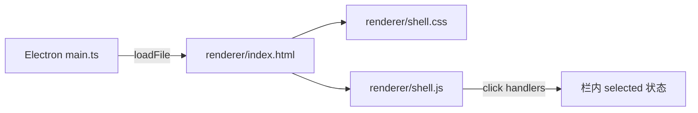

# Desktop 主页面 Shell 原型 技术规格（SPEC）

## 设计目标

- 在 [desktop-main-shell PRD](./prd.md) 范围内，将 `apps/desktop` 从空白壳升级为**可演示的三栏主界面原型**。
- 布局对齐产品草图：**左 — 文件预览｜中 — 资源管理器｜右 — Chat（项目 → 会话 → 聊天）**。
- **纯静态 UI + 栏内选中态**；不接 `@novel-master/core` runtime；不实现跨栏联动。
- 技术栈保持 Electron 现有模式：**renderer 内原生 HTML/CSS/JS**，不引入 React/Vite 构建链（本期）。

## 现状与约束（代码探索）

| 项 | 路径 / 现状 | 本迭代 |
|----|-------------|--------|
| Electron 壳 | `apps/desktop` 存在于 **worktree**（`feat/desktop-electron`）；主仓库 `main` **尚无** `apps/desktop` | 在 `apps/desktop/renderer` 实现 UI；合并 worktree 时一并带入 |
| 当前 renderer | `renderer/index.html` 单页占位 + 内联 CSS；`index.js` 仅读 preload 版本 | **替换** 为三栏 shell |
| Main / Preload | `src/main.ts` 加载 `renderer/index.html`；`preload.ts` 暴露 `novelMasterDesktop.version` | **不改** 业务逻辑；CSP 仍 `script-src 'self'` |
| 根脚本 | worktree 有 `desktop:dev` / `desktop:build`；主仓库 `package.json` **无** | 若在本分支开发，沿用 worktree 脚本；合并后根 `package.json` 需含 desktop 脚本 |
| 参考原型 | `examples/desktop/`：完整三栏 UI，但布局为 **左导航+会话｜中聊天｜右工作区**，与 PRD 草图 **列顺序不同** | **仅借用** CSS 变量、树节点/列表面板样式；**不重排为 examples 布局** |
| Mobile 参考 | `ChatTabScreen.tsx`：项目 drawer、会话列表、conversation；`VfsFileManager.tsx`：目录树 | 右侧分区命名与层级对齐 mobile 心智；不移植 RN |
| PRD 排除 | 无 Settings/Agent/Provider 入口；无 composer 发送；无主题系统 | 不复制 `examples/desktop` 的 Agent/设置 Tab、可编辑 composer、主题切换 |
| 依赖 | `apps/desktop/package.json` 依赖 `@novel-master/core`（脚手架遗留） | **不新增** runtime 接线；**不增加** 新 npm 依赖 |

**布局锁定（与 PRD 草图一致）**

```text
┌─────────────────────────────────────────────────────────────────┐
│ App chrome：Novel Master + 当前上下文占位（项目 / 会话 假文案）      │
├──────────────────────┬──────────────┬───────────────────────────┤
│ 文件预览区 (~38%)     │ 资源管理器    │ Chat 管理区 (~42%)         │
│ preview-pane         │ (~20%)       │ chat-rail                  │
│ 假文件名 + 静态 MD    │ VS Code 密度  │ ├项目列表─┬会话列表─┬聊天─┤ │
│                      │ 树形占位 ≥3 项 │  各栏可点选 active        │
└──────────────────────┴──────────────┴───────────────────────────┘
```

---

## 总体方案

### 架构



1. **`index.html`**：语义化三栏 DOM + 顶栏 chrome；静态 mock 数据直接写在 HTML（或 JS 常量），不请求后端。
2. **`shell.css`**：从 `examples/desktop/css/styles.css` **抽取** 颜色变量、面板/列表/树节点基础样式（约 200–350 行，非全量复制）；默认 **深色** 单主题（PRD 不含主题系统）。
3. **`shell.js`**：IIFE；三栏独立 `selectItem(group, id)`；**禁止**跨栏状态同步；禁用/不绑定发送、新建等按钮（`disabled` 或 `type="button"` 无 handler）。
4. **删除/替换** 现有占位 `index.js` 中对 preload 的依赖可保留于 footer 版本戳（可选，非必须）。

### 右侧 Chat rail 结构

采用 **三列 master 面板**（桌面宽度够用时并列；`<900px` 时 Chat 区内部仍可见至少两列，通过 PRD「至少两层」验收）：

| 子列 | 占位内容 | mobile 对应 |
|------|----------|---------------|
| 项目 | 3 个假项目名 | `ProjectDrawer` |
| 会话 | 3 个假会话名 | `ChatTabScreen` session list |
| 聊天 | 2 条静态消息 + 禁用输入框占位 | conversation（无发送） |

各列独立选中态；**不**实现「选项目过滤会话」逻辑。

### 中间资源管理器

- 静态树：`chapters/`、`outline.md`、`notes/` 等 ≥3 节点。
- 样式：缩进、`📁`/`📄` 图标、VS Code 侧栏密度（`font-size: 13px`，行高 22px）。
- 点击节点 → `.is-active`；**不**更新左侧预览内容（PRD：无跨栏联动）。

### 左侧预览区

- 顶栏：假文件名 `chapter-01.md`（静态）。
- 正文：占位 Markdown 块（标题 + 段落），或「选中文件后将在此预览」说明。
- 本期固定内容，不随资源树变化。

---

## 最终项目结构

```text
apps/desktop/
├── package.json              # 不变（无新 dep）
├── src/
│   ├── main.ts               # 不变
│   └── preload.ts            # 不变
├── renderer/
│   ├── index.html            # 重写：三栏 shell
│   ├── shell.css             # 新建
│   └── shell.js              # 新建（替换 index.js）
└── test/
    └── smoke.test.js         # 扩展：断言 renderer 资产存在
```

**不改动**：`src/main.ts`、`src/preload.ts`、`packages/core`、根 workspace 除已存在的 desktop 脚本外。

---

## 变更点清单

| # | 文件 | 动作 |
|---|------|------|
| 1 | `renderer/index.html` | 重写 DOM：`.app-chrome` + `#preview-pane` + `#explorer-pane` + `#chat-rail` |
| 2 | `renderer/shell.css` | 新建；grid/flex 三栏 + 选中态 + 从 examples 抽取的基础 token |
| 3 | `renderer/shell.js` | 新建；栏内 click → toggle `.is-active` |
| 4 | `renderer/index.js` | **删除** 或留空 re-export（改为只引用 `shell.js`） |
| 5 | `test/smoke.test.js` | 增加：renderer 三栏关键 id/class 存在性检查（读文件断言） |
| 6 | `README.md` | 补充「主 shell 原型」说明与 `desktop:dev` 目视验收步骤 |

---

## 详细实现步骤

### Step 0 — 确认 `apps/desktop` 可构建

若当前分支无 `apps/desktop`，从 worktree `feat/desktop-electron` cherry-pick 脚手架提交（`209e90d`）或复制目录。

```bash
npm install
npm run build -w @novel-master/desktop
```

### Step 1 — `index.html`

- `lang="zh-CN"`；CSP 保持：`style-src 'self' 'unsafe-inline'`；`script-src 'self'`。
- 结构：

```html
<div id="app">
  <header class="app-chrome">…</header>
  <div class="workspace">
    <section id="preview-pane" aria-label="文件预览">…</section>
    <section id="explorer-pane" aria-label="资源管理器">…</section>
    <section id="chat-rail" aria-label="Chat 管理">
      <div class="chat-column" data-group="projects">…</div>
      <div class="chat-column" data-group="sessions">…</div>
      <div class="chat-column" data-group="chat">…</div>
    </section>
  </div>
</div>
<script src="./shell.js"></script>
```

- Mock 项使用 `data-selectable` + `data-id` 属性供 JS 绑定。
- Composer：`<textarea disabled placeholder="原型阶段不可用">`；发送按钮 `disabled`。

### Step 2 — `shell.css`

- CSS 变量（深色单主题，对齐 examples 深色 token 子集）。
- `.workspace`：`display: grid; grid-template-columns: 2fr 1fr 2.2fr; height: calc(100vh - var(--chrome-height));`
- `.chat-rail`：`display: grid; grid-template-columns: 1fr 1fr 1.4fr;`
- `.is-active`：背景 `var(--surface-elevated)` + 左侧 2px accent border（各栏统一）。
- 资源树：`.tree-node` 嵌套 `padding-left`。
- `@media (max-width: 900px)`：隐藏 `preview-pane` 或缩小比例（可选）；**必须**保证 `explorer` + `chat-rail` 仍可见。

### Step 3 — `shell.js`

```javascript
// 栏内选中：同 data-group 内仅一项 .is-active
function bindSelection(root, groupAttr) {
  root.querySelectorAll(`[${groupAttr}]`).forEach((container) => {
    container.addEventListener('click', (e) => {
      const item = e.target.closest('[data-selectable]');
      if (!item) return;
      container.querySelectorAll('.is-active').forEach((n) => n.classList.remove('is-active'));
      item.classList.add('is-active');
    });
  });
}
```

- 初始化：每列默认第一项 `is-active`。
- **不**监听跨 pane 事件；**不**使用 `localStorage`（PRD 无主题）。

### Step 4 — 测试与文档

- 更新 `smoke.test.js`：读取 `index.html`，断言 `#preview-pane`、`#explorer-pane`、`#chat-rail` 存在；读取 `shell.js` 存在。
- `README.md`：三栏说明 + PRD 链接。

### Step 5 — 验证

```bash
npm run build -w @novel-master/desktop
npm run test -w @novel-master/desktop
npm run desktop:dev   # 目视：三栏 + 点击选中
```

---

## 测试策略

### 自动化

| ID | 用例 | 命令 / 方法 | 预期 |
|----|------|-------------|------|
| T1 | desktop 包构建 | `npm run build -w @novel-master/desktop` | exit 0 |
| T2 | smoke 包元数据 | `npm run test -w @novel-master/desktop` | 既有 electron entry 断言 pass |
| T3 | renderer 结构 | smoke 读 `renderer/index.html` | 含三栏 root id |
| T4 | shell 资产 | smoke 读文件 | `shell.css`、`shell.js` 存在 |
| T5 | 无 core 接线 | grep `createNovelMasterRuntime` in `apps/desktop` | 0 匹配 |

### 手工（PRD 验收）

| ID | 用例 | 预期 |
|----|------|------|
| M1 | `desktop:dev` 启动 | 窗口展示三栏 |
| M2 | 点击资源树节点 | 仅 explorer 内 active 切换 |
| M3 | 点击项目/会话项 | 仅对应列 active；不过滤其他列 |
| M4 | 发送/新建按钮 | disabled 或无反应，不 crash |

### 不测

- Electron E2E（Spectron/Playwright）
- macOS / Windows 像素对比
- 与 examples/desktop 布局一致性（**刻意不同**）

---

## 风险与回滚方案

| 风险 | 缓解 |
|------|------|
| 主仓库无 `apps/desktop` | Step 0 cherry-pick 脚手架；或在本 spec 分支先合入 desktop 初始化 |
| `examples/desktop` 布局误导实现者 | SPEC 与 PRD 明确列顺序；代码 review 对照草图 |
| CSP 阻止未来 inline script | 本期仅 `shell.js` 外链；保持 CSP |
| worktree 与 main 分叉 | 桌面 UI 在 `feat/desktop-electron` 或新建 `feat/desktop-main-shell` 开发 |

**回滚**：恢复 `renderer/index.html` 占位版；删除 `shell.css` / `shell.js`；revert smoke 扩展。

---

## 后续迭代（本期外）

- 接入 `createNovelMasterRuntime`（main process + IPC）
- 资源树 ↔ 预览 ↔ 会话 scope **真实联动**
- 从 `examples/desktop` 迁移主题、Agent、Settings（若产品需要）
- 考虑 React + Vite /renderer 构建链
