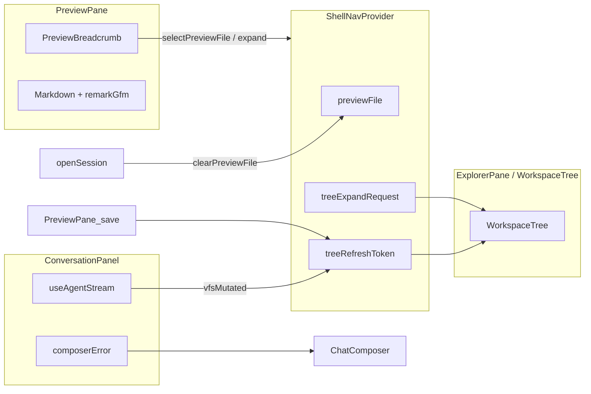

# Desktop UX Bug 修复批次 技术规格（SPEC）

> **PRD**：[prd.md](./prd.md)  
> **前置**：[desktop-app/spec.md](../desktop-app/spec.md)、[worktree-vfs-ui-refresh-fix/spec.md](../worktree-vfs-ui-refresh-fix/spec.md)、[desktop-ui-polish/spec.md](../desktop-ui-polish/spec.md)  
> **建议分支**：`feature/desktop-ux-bug-fixes`  
> **代码基线**：`main`（2026-06-22）  
> **范围**：仅 `apps/desktop/**`；**不修改** `apps/mobile/**` 与 `@novel-master/core` 域逻辑（消费既有 IPC/事件）

## 设计目标

1. **修复 10 项 Desktop UX/缺陷**，对齐 [prd.md](./prd.md) 验收标准。
2. **Desktop 与 Mobile 工作区刷新策略分叉**：Desktop Agent write/edit 与用户 Preview 保存后 **实时** 刷新 Explorer（消费方 ①）；**不** `markDirty`、**不** 改变消费方 ② 窄刷新口径；Mobile 保持 lazy。
3. **零新 IPC 契约**：复用 `vfsMutated`、`refreshWorkspaceTrees`、`ipcSessionsRename` 等既有能力。
4. **可测试、可回滚**：改动集中在 renderer 层；逐步骤可独立验证。

## 总体方案

### 架构概览



### 跨 Bug 依赖（实现顺序约束）

| 顺序 | 项 | 原因 |
|------|-----|------|
| 1 | Bug 6（pointer-down 守卫） | 修复 macOS 单击无响应；避免后续 Bug 3 增加 refresh 加剧竞态 |
| 2 | Bug 4（会话清 preview） | 独立、低风险 |
| 3 | Bug 3（vfsMutated 刷新） | 依赖 Explorer 点击稳定 |
| 4 | Bug 1 / 5 / 10 | ChatComposer 集中改造 |
| 5 | Bug 2 / 7 / 8 | 小改动 |
| 6 | Bug 9（面包屑） | 依赖 ShellNav 扩展 expand 请求 |

---

## 最终项目结构

```
apps/desktop/renderer/
  utils/
    ime-composition.ts          # NEW — isImeComposing()
    textarea-enter-shortcuts.ts # NEW — 单行/多行 Enter 处理器
  hooks/
    useAutoResizeTextarea.ts    # NEW — Bug 10
  components/ui/
    MultilineTextArea.tsx       # NEW（可选）— 多行 + IME + auto-resize
  layout/
    PreviewPane.tsx             # Bug 2/3/9
    PreviewBreadcrumb.tsx       # NEW — Bug 9
    ExplorerPane.tsx            # Bug 6
  providers/
    ShellNavProvider.tsx        # Bug 4/9
  features/
    chat/
      ChatComposer.tsx          # Bug 1/5/10
      ConversationPanel.tsx     # Bug 3/5
      message-edit.ts           # Bug 7
    workspace/
      WorkspaceTree.tsx         # Bug 6/9
      vfs-tree-utils.ts         # Bug 9 — path 分段 helper
    settings/                   # Bug 1 — 按需接入 Enter 规范
  App.tsx                       # Bug 8
  styles/shell.css              # Bug 9/10
```

**不新增 package**；`remark-gfm` 已在 `apps/desktop/package.json`。

---

## 变更点清单

| Bug | 文件 | 变更摘要 |
|-----|------|----------|
| 1 | `utils/ime-composition.ts`, `utils/textarea-enter-shortcuts.ts`, `ChatComposer.tsx`, `TextPromptModal.tsx`, `MessageEditModal.tsx`, `AddModelModal.tsx`, 设置页 textarea/input | IME 守卫 + Enter 规范 |
| 2 | `PreviewPane.tsx` | 添加 `remarkGfm` |
| 3 | `ConversationPanel.tsx`, `PreviewPane.tsx` | `vfsMutated` → `refreshWorkspaceTrees`；save 后 refresh |
| 4 | `ShellNavProvider.tsx` | `openSession`/`goBackToSessions`/`openProject` 清 preview |
| 5 | `ConversationPanel.tsx`, `ChatComposer.tsx` | 流式失败内联 + controlled error |
| 6 | `ExplorerPane.tsx`, `WorkspaceTree.tsx` | pointer-down 守卫 |
| 7 | `message-edit.ts` | 文案「回滚」 |
| 8 | `App.tsx`, `ShellNavProvider.tsx` | 聊天重命名 + 压缩上下文文案 |
| 9 | `PreviewBreadcrumb.tsx`, `PreviewPane.tsx`, `ShellNavProvider.tsx`, `WorkspaceTree.tsx`, `vfs-tree-utils.ts`, `shell.css` | 面包屑 + 树展开 |
| 10 | `useAutoResizeTextarea.ts`, `ChatComposer.tsx`, `shell.css` | max-height 200px 自适应 |

---

## 详细实现步骤

### Step 0 — Bug 6：修复 Explorer 单击竞态（P0，先做）

**根因**：`ExplorerPane.tsx` L55–57 在 `.explorer-tree` 上监听 `onPointerDown` → `refreshWorkspaceTrees()`，任意树节点按下即触发 reload → `WorkspaceTree` `setLoading(true)` 替换 DOM，macOS 上后续 `click` 丢失。

**改动**：

1. `ExplorerPane.tsx` — 与 blank context menu 相同守卫：

```typescript
onPointerDown={(e) => {
  if ((e.target as HTMLElement).closest(".tree-node")) {
    return;
  }
  refreshWorkspaceTrees();
}}
```

2. `WorkspaceTree.tsx` — 防御性：`onPointerDown={(e) => e.stopPropagation()}` 加在 `.tree-node`（双保险）。

**验证**：macOS 单击文件 → Preview 打开；单击目录 → 展开/折叠；空白区 pointer-down 仍可 refresh。

---

### Step 1 — Bug 4：切换会话清空 Preview

**改动** `ShellNavProvider.tsx`：

| 方法 | 动作 |
|------|------|
| `openSession` | 开头调用 `clearPreviewFile()` |
| `goBackToSessions` | `clearPreviewFile()` |
| `openProject` | `clearPreviewFile()` |
| `goBackToProjects` | `clearPreviewFile()` |

`PreviewPane` 已有 `previewFile === null` 时清空 content（L20–24）；`useEffect([loadFile])` 会在 preview 清空后重置 mode/content。

**验证**：会话 A 打开文件 → 切会话 B → Preview 显示占位「在工作区选择文件以预览」。

---

### Step 2 — Bug 3：Desktop 实时工作区刷新

**原则**：仅 `refreshWorkspaceTrees()`（消费方 ① UI token）；**不** 调用 `ipcWorktreeInvalidateSessionSnapshot`（那是消费方 ② markDirty）。

**2a. Agent 工具 write/edit**

`ConversationPanel.tsx` — 扩展 `onStepCommitted`：

```typescript
const { refreshWorkspaceTrees } = useShellNav();

const onStepCommitted = useCallback(
  (payload: AgentStepCommittedPayload) => {
    void flushAgentStepUi(payload.phase, reloadMessages, onStreamReset);
    if (payload.vfsMutated) {
      refreshWorkspaceTrees();
    }
  },
  [reloadMessages, onStreamReset, refreshWorkspaceTrees],
);
```

可选 belt-and-suspenders：`onRunFinished` 若 `payload.vfsMutated` 再 refresh 一次（防漏 step）。

**事件来源**：`packages/core` AgentRunner 已在 tool 阶段设置 `vfsMutated`（write/edit 等）；payload 定义见 `shared/agent-event-types.ts` L46–51。

**2b. 用户 Preview 保存**

`PreviewPane.tsx` — `save()` 成功路径末尾：

```typescript
const { refreshWorkspaceTrees } = useShellNav();
// after ipcVfsWrite ok + loadFile:
refreshWorkspaceTrees();
```

**2c. Mobile 不变**

不修改 `apps/mobile/**`。

**验证**：Agent write 后 3s 内 Explorer 出现新文件；Preview 保存后列表 meta 更新；Mobile 写盘不切换面板时列表仍 lazy。

---

### Step 3 — Bug 1：IME + 全局 Enter 规范

**3a. 共享工具（新建）**

`renderer/utils/ime-composition.ts`：

```typescript
export function isImeComposing(
  e: React.KeyboardEvent | KeyboardEvent,
): boolean {
  if ("nativeEvent" in e && e.nativeEvent instanceof KeyboardEvent) {
    return e.nativeEvent.isComposing;
  }
  return (e as KeyboardEvent).isComposing === true;
}
```

`renderer/utils/textarea-enter-shortcuts.ts`：

```typescript
/** 多行：Enter 换行；Ctrl/Cmd+Enter 提交；composing 时忽略 */
export function handleMultilineSubmitKeyDown(
  e: React.KeyboardEvent,
  onSubmit: () => void,
  opts?: { disabled?: boolean },
): void { ... }

/** 单行：Enter 提交；composing 时忽略 */
export function handleSingleLineSubmitKeyDown(
  e: React.KeyboardEvent,
  onSubmit: () => void,
): void { ... }
```

使用 `(e.metaKey || e.ctrlKey) && e.key === "Enter"` 作为提交快捷键（macOS Cmd+Enter）。

**3b. ChatComposer（关键路径）**

- 移除 `Enter && !shiftKey` 发送逻辑。
- 改为 `handleMultilineSubmitKeyDown(e, () => void send(), { disabled: sendDisabled })`。
- Enter 默认行为 = 换行（不 `preventDefault`）。
- Ctrl/Cmd+Enter = `preventDefault` + send。

**3c. 其他输入框接入清单**

| 优先级 | 文件 | 类型 | 行为 |
|--------|------|------|------|
| P0 | `TextPromptModal.tsx` | 单行 input | Enter 确认 + IME 守卫 |
| P0 | `MessageEditModal.tsx` | 多行 TextArea | Enter 换行 / Ctrl+Enter 保存 |
| P1 | `AddModelModal.tsx` | 单行 | Enter 确认 |
| P1 | `AgentEditorView.tsx` | system prompt + dynamic blocks textarea | 多行规范 |
| P1 | `SettingsViews.tsx` | headers JSON textarea (L1129) | 多行规范 |
| P2 | 其余 settings 单行 input | 单行 Enter → 触发保存或 blur（按字段语义） |

**3d. 豁免**

- `CodeEditor.tsx`（CodeMirror 6）：Enter 已为换行；IME 由 CM 处理；**不** 强制 Ctrl+Enter 保存（已有 Mod-s）。
- `ChatRail.tsx` 列表项 Enter/Space：导航用途，不改。

**验证**：拼音 composing 时 Enter 不发送；多行 Enter 换行；Ctrl/Cmd+Enter 发送/确认。

---

### Step 4 — Bug 5 + 10：Composer 错误内联 + 自适应高度

**4a. Bug 5 — 错误状态提升**

`ConversationPanel.tsx`：

```typescript
const [composerError, setComposerError] = useState<string | undefined>();

const onRunFailed = useCallback((payload: AgentRunFailedPayload) => {
  setRunning(false);
  ...
  setComposerError(formatUserError(payload.error));
  showToast(payload.error); // 保留辅助 Toast（PRD 允许）
  void reloadMessages();
}, [...]);

// 新 send / session 切换时 setComposerError(undefined)
```

`ChatComposer.tsx` — 新增 props：

```typescript
error?: string;
onErrorChange?: (msg: string | undefined) => void;
```

- 本地 `setError` 改为调用 `onErrorChange`（controlled 模式）；若无 prop 则保留 local state 兼容。
- 渲染仍用 `.chat-composer__error`。

`formatUserError`：`renderer/utils/format-user-error.ts`（已存在）。

**4b. Bug 10 — 自适应高度**

新建 `hooks/useAutoResizeTextarea.ts`：

```typescript
export function useAutoResizeTextarea(
  ref: RefObject<HTMLTextAreaElement | null>,
  value: string,
  maxHeightPx = 200,
): void {
  useLayoutEffect(() => {
    const el = ref.current;
    if (!el) return;
    el.style.height = "auto";
    const next = Math.min(el.scrollHeight, maxHeightPx);
    el.style.height = `${next}px`;
    el.style.overflowY = el.scrollHeight > maxHeightPx ? "auto" : "hidden";
  }, [ref, value, maxHeightPx]);
}
```

`ChatComposer.tsx`：`useRef` + hook；移除固定 `rows={1}` 或保留 `rows={1}` 作初始值。

`shell.css`：`.chat-composer__input { max-height: 200px; }`（原 160px）。

**验证**：流式失败 Composer 上方可见错误；输入多行增高至 200px 后滚动。

---

### Step 5 — Bug 2：Preview Markdown 表格

`PreviewPane.tsx`：

```typescript
import remarkGfm from "remark-gfm";
// ...
<Markdown remarkPlugins={[remarkGfm]}>{content}</Markdown>
```

CSS 已存在：`.preview-markdown table`（`shell.css` L4079+）。聊天侧 `MessageList` 已用 GFM，回归确认即可。

**验证**：含 pipe table 的 `.md` 在 Preview 只读模式正确渲染。

---

### Step 6 — Bug 7 / 8：文案与菜单

**Bug 7** — `message-edit.ts` L55：`"回滚到此"` → `"回滚"`。

**Bug 8** — `App.tsx`：

| 位置 | 变更 |
|------|------|
| `#session-actions-menu` | 在「刷新工作树」前新增「聊天重命名」按钮 |
| L316 | 「压缩聊天」→「压缩上下文」 |
| ConfirmModal L322–323 | title/message 同步改为「压缩上下文」 |

**聊天重命名流程**：

1. `App.tsx` 新增 state：`sessionRenamePrompt: { sessionId: string; initialTitle: string } | null`。
2. 菜单点击 → 关闭菜单 → 打开 `TextPromptModal`（复用 ChatRail 模式）。
3. 确认 → `ipcSessionsRename({ id, title })`；成功则：
   - 若 `sessionId === 当前会话` → `setSessionName(title)`（需在 `ShellNavProvider` 暴露 setter 或 `updateSessionName(name)` helper）；
   - `ChatRail` 列表通过现有 refresh 机制更新（可 dispatch custom event 或 lift session list refresh callback — **最小方案**：仅更新 nav 标题 + toast；列表标题在返回 sessions 视图时 reload）。

参考：`ChatRail.tsx` L281–288 `ipcSessionsRename`；Mobile `SessionActionsDrawer.tsx` L36。

**验证**：更多菜单含重命名与压缩上下文；重命名当前会话后 ChatRail 标题更新。

---

### Step 7 — Bug 9：Preview 面包屑

**7a. 路径工具** — `vfs-tree-utils.ts` 新增：

```typescript
/** `/notes/ch1.md` → [`notes`, `ch1.md`]（跳过空段） */
export function logicalPathSegments(path: string): string[];

/** 段 index 对应的绝对逻辑路径，如 index=0 → `/notes` */
export function logicalPathForSegmentIndex(
  segments: readonly string[],
  index: number,
): string;

/** 路径所有祖先目录（含自身若为 dir） */
export function ancestorDirPaths(path: string): string[];
```

**7b. ShellNav 扩展**

`ShellNavProvider.tsx` 新增：

```typescript
treeExpandRequest: { path: string; token: number } | null;
requestTreeExpandPath: (path: string) => void;
```

实现：每次调用 token++，携带目标 dir path。

**7c. WorkspaceTree 响应 expand**

`useEffect` 监听 `treeExpandRequest`：将 `ancestorDirPaths(path)` 合并进 `expandedDirs`。

**7d. PreviewBreadcrumb 组件**

`layout/PreviewBreadcrumb.tsx`：

- Props：`filePath`, `workspaceScope`, `onSelectPath(path)`, `onExpandDir(path)`。
- 渲染：`文件预览` 标题下或替换 `#preview-filename` 为分段 `<nav aria-label="文件路径">`。
- 点击规则：
  - **目录段**：`onExpandDir(segmentPath)` → `requestTreeExpandPath`；不切换 preview 文件。
  - **文件段（末段）**：`onSelectPath(fullPath)` → `selectPreviewFile(scope, fullPath)`。
- 当前段 `aria-current="page"`。

**7e. PreviewPane 集成**

替换 L89–91 平铺文件名为 `<PreviewBreadcrumb ... />`。

**验证**：打开 `/notes/ch1.md` 显示 `notes > ch1.md`；点击 `notes` 展开 Explorer 树中该目录；点击文件名保持/打开该文件。

---

## 兼容性与迁移说明

| 项 | 说明 |
|----|------|
| Desktop vs Mobile 刷新 | **刻意分叉**。在 `ConversationPanel` refresh 调用处加注释：`// Desktop-only: real-time consumer-① refresh; Mobile stays lazy per worktree-vfs-ui-refresh-fix` |
| worktree-vfs-ui-refresh-fix | 本批次 **不推翻** 消费方分离、不扩大 markDirty；仅 Desktop 增加 UI token 刷新触发点 |
| Explorer pointer-down refresh | 保留空白区 refresh 行为；仅排除 `.tree-node` |
| 快捷键变更 | Enter 不再发送聊天消息 — **破坏性 UX 变更**，PRD 已确认；需在 PR 描述中注明 |
| 会话 rename | 无数据迁移；IPC 契约不变 |

---

## 测试策略

### 自动化

| 范围 | 方式 |
|------|------|
| `ime-composition.ts`, `textarea-enter-shortcuts.ts`, `vfs-tree-utils` 新函数 | 单元测试（Vitest，`apps/desktop` 或 `packages` 既有 test 布局） |
| `isImeComposing` | 模拟 `nativeEvent.isComposing` |
| `logicalPathSegments` / `logicalPathForSegmentIndex` | 表驱动用例 |

**不强制** E2E；Desktop E2E 若有 Playwright 夹具可补 1–2 条 smoke。

### 手工验收（对齐 PRD）

按 PRD「验收标准」逐条在 **macOS + Windows** 执行；重点：

1. 拼音 IME composing + Enter（Bug 1）
2. macOS 文件单击（Bug 6）
3. Agent write 后 Explorer 自动更新（Bug 3）
4. 流式失败内联错误（Bug 5）

### 测试用例

| ID | Given | When | Then |
|----|-------|------|------|
| T1 | 中文 IME composing，Composer 焦点 | Enter | 不发送 |
| T2 | Composer 多行文本 | Enter / Ctrl+Enter | 换行 / 发送 |
| T3 | Preview 打开含 table 的 md | 只读预览 | 表格 HTML 渲染 |
| T4 | Desktop 会话，Agent write 新文件 | 工具完成 | 3s 内 Explorer 可见新文件 |
| T5 | Preview 编辑并保存 | 保存成功 | Explorer 刷新 |
| T6 | 会话 A 打开文件 | 切会话 B | Preview 空占位 |
| T7 | Agent 流式失败 | run.failed | Composer 上方内联错误 |
| T8 | macOS 聊天工作区 | 单击文件行 | Preview 打开 |
| T9 | 消息菜单 | 查看 | 「回滚」 |
| T10 | Composer 更多 | 展开 | 聊天重命名 + 压缩上下文 |
| T11 | Preview `/a/b.md` | 点击面包屑 `a` | Explorer 展开 `/a` |
| T12 | Composer | 输入超 200px 内容 | 高度封顶 + 内部滚动 |
| T13 | Mobile Agent write | 不切换面板 | 列表 **不** 自动刷新（回归） |

---

## 风险与回滚方案

| 风险 | 缓解 | 回滚 |
|------|------|------|
| Bug 6 根因假设不成立 | `stopPropagation` + 守卫双保险；macOS/Win 双测 |  revert ExplorerPane/WorkspaceTree |
| Bug 1 设置页遗漏 | 清单化 + grep `textarea\|<input` 审计 | 按文件 revert |
| Bug 3 频繁 refresh 性能 | 仅 `vfsMutated` 时触发；in-flight coalescing 在 Core 已有 | 移除 ConversationPanel/PreviewPane 调用 |
| Enter 快捷键变更用户习惯 | PRD 已确认；Composer placeholder 可加提示「Ctrl+Enter 发送」 | 恢复 ChatComposer keydown |
| 面包屑 expand 与 scope 不一致 | breadcrumb 使用 `previewFile.workspaceScope` | revert PreviewBreadcrumb + nav expand |
| rename 后 ChatRail 列表不同步 | 最小方案先更 nav 标题；可选回调 refresh sessions | revert App.tsx 菜单项 |

**分支回滚**：整分支 revert 即可，无 schema/IPC 迁移。

---

## 实现检查清单（开发自用）

- [ ] Step 0 Bug 6 — Explorer pointer-down 守卫
- [ ] Step 1 Bug 4 — clearPreviewFile on nav
- [ ] Step 2 Bug 3 — vfsMutated + save refresh
- [ ] Step 3 Bug 1 — IME utils + ChatComposer + modals + settings
- [ ] Step 4 Bug 5/10 — composer error + auto-resize
- [ ] Step 5 Bug 2 — remarkGfm in PreviewPane
- [ ] Step 6 Bug 7/8 — copy + rename menu
- [ ] Step 7 Bug 9 — breadcrumb + tree expand
- [ ] T1–T13 手工验收
- [ ] 确认 Mobile 无改动、`grep vfsMutated` renderer 仅 desktop
