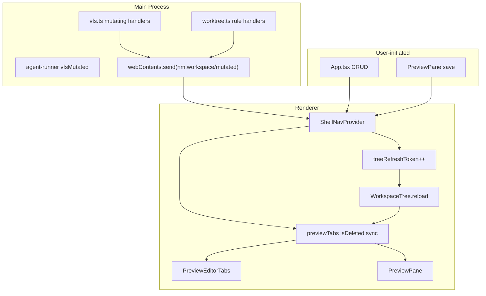

# Desktop 工作区 / 预览一致性修复 技术规格（SPEC）

> **PRD**：[prd.md](./prd.md)  
> **前置**：[desktop-ux-bug-fixes/spec.md](../desktop-ux-bug-fixes/spec.md)、[worktree-vfs-ui-refresh-fix/spec.md](../worktree-vfs-ui-refresh-fix/spec.md)、[mobile-ui-vfs-defaults/prd.md](../mobile-ui-vfs-defaults/prd.md)  
> **建议分支**：`feature/desktop-workspace-ux-fixes`  
> **范围**：以 `apps/desktop/**` 为主；**不修改** `apps/mobile/**`；Core **不改** `resolveRuleState` 全局语义

## 设计目标

1. **Bug 1**：Desktop 新建目录自动持久化默认开启规则；规则配置弹窗展示 Core 真值（无记录 = 关）。
2. **Bug 2**：Desktop 任意 VFS / worktree 可视变更后 **3s 内** Explorer 自动重载；不依赖空白区点击；Mobile lazy 策略 **不变**。
3. **Bug 3**：已删除文件 Preview tab 保留 VS Code 式删除态；编辑区明确提示；工作区删除 **不再** 自动关 tab。
4. **可测试、可回滚**：改动可逐步落地；新增 push 通道可单独关闭回滚。

## 总体方案

### 架构概览



### 跨 Bug 协同

| 钩子 | Bug 1 | Bug 2 | Bug 3 |
|------|-------|-------|-------|
| `createWorkspaceEntry(mkdir)` | `setDirRule` 后 | `notifyWorkspaceMutated` | — |
| `loadDirRuleForm` / `DirectoryRuleModal` | 无记录 `ruleEnabled: false` | — | — |
| `notifyWorkspaceMutated` | 规则保存后已有 | 统一刷新入口 | 触发 tab 存在性同步 |
| `WorkspaceTree.reload` 成功 | 列表更新 | 消费方①重载 | 用 file rows 校验 open tabs |
| 工作区删除确认 | — | refresh | `markDeleted` 替代 `closePreviewTabsUnderPath` |

### 设计决策

| 项 | 选择 | 理由 |
|----|------|------|
| Bug 2 兜底机制 | Main **push** `nm:workspace/mutated` + Renderer 保留显式 `notifyWorkspaceMutated` | Agent 工具在 main 内写 VFS，renderer 无法穷举调用点；push 覆盖 agent / 未来路径 |
| 刷新去抖 | `notifyWorkspaceMutated` 100ms 内合并多次 bump | 避免 `vfsMutated` step + push 双触发导致树闪动 |
| Bug 3 删除检测 | `buildListRows` file 集合 + `ipcVfsRead NOT_FOUND` 双源 | 树刷新可批量标记；激活 tab 时 read 权威校验 |
| `PreviewFileSelection` | 扩展 `isDeleted?: boolean` | 比平行 Set 更易传给 `PreviewEditorTabs` / `PreviewPane` |
| Core 变更 | **无** `resolveRuleState` 修改 | 符合 PRD；仅 Desktop mkdir 时 **写入** 规则 |

---

## 最终项目结构

```
apps/desktop/
  shared/
    ipc-types.ts                    # WORKSPACE_MUTATED channel + payload
  src/main/ipc/
    handlers/vfs.ts                 # push after write/mkdir/delete/rename
    handlers/worktree.ts            # push after setDirRule/setFileRule
    forward-workspace-mutated.ts    # NEW — notify focused renderer
  renderer/
    features/workspace/
      workspace-actions.ts          # mkdir+setDirRule; loadDirRuleForm split
      DirectoryRuleModal.tsx        # ruleEnabled 初始 false
      preview-tab-sync.ts           # NEW — sync tabs vs file rows
    layout/
      PreviewPane.tsx               # NOT_FOUND UI; reload on treeRefreshToken
      PreviewEditorTabs.tsx         # is-deleted class
    providers/
      ShellNavProvider.tsx          # notifyWorkspaceMutated; markDeleted; renameTab
    ipc/
      client.ts                     # subscribe workspace mutated
    styles/shell.css                # .preview-editor-tabs__tab.is-deleted
  test/
    workspace-actions.test.ts       # NEW
    preview-tab-sync.test.ts        # NEW
    shell-nav-workspace.test.ts     # NEW（或扩展现有 runtime 测）
```

**不修改** `packages/core/**`（agent `vfsMutated` 已足够；失败 run 用 renderer ref 追踪）。

---

## 变更点清单

### Bug 1 — 目录规则

| 文件 | 变更 |
|------|------|
| `workspace-actions.ts` | 拆分 `defaultDirRuleRequest`（mkdir 持久化，`ruleEnabled: true`）与 `emptyDirRuleForm`（弹窗展示，无记录时 `ruleEnabled: false`）；`createWorkspaceEntry` folder 分支 mkdir 成功后 `ipcWorktreeSetDirRule(defaultDirRuleRequest(...))`；`loadDirRuleForm` 在 `data == null` 时返回 `emptyDirRuleForm` |
| `DirectoryRuleModal.tsx` | `useState(false)` 作 `ruleEnabled` 初始值；加载后 `setRuleEnabled(rootRuleLocked ? true : form.ruleEnabled)`，去掉 `?? true` |
| `App.tsx` | mkdir 成功后已有 `refreshWorkspaceTrees()`，改为 `notifyWorkspaceMutated()`（Bug 2 统一入口） |

**参照 Mobile**（`VfsFileManager.tsx:673-674`）：

```typescript
await ipcVfsMkdir({ ...req, path });
const ruleResult = await ipcWorktreeSetDirRule(defaultDirRuleRequest(path, req));
if (!ruleResult.ok) {
  return { ok: false, message: ruleResult.error.message };
}
```

**`loadDirRuleForm` 修正**（现网 `141` 行回落 `defaultDirRuleRequest` 导致 `ruleEnabled: true`）：

```typescript
if (result.ok && result.data) {
  return { ...req, logicalPath: target.row.path, ...result.data };
}
return emptyDirRuleForm(target.row.path, req); // ruleEnabled: false, 其余 DEFAULT_WORKTREE_DIR_RULE
```

### Bug 2 — Explorer 全量刷新

| 文件 | 变更 |
|------|------|
| `ipc-types.ts` | 新增 `WORKSPACE_MUTATED: "nm:workspace/mutated"`；payload `{ workspaceScope, projectId?, sessionId? }` |
| `forward-workspace-mutated.ts` | `notifyWorkspaceMutatedToRenderer(payload)`，向 focused `webContents` send |
| `vfs.ts` | `handleVfsWrite/Mkdir/Delete/Rename` 成功返回前 `notifyWorkspaceMutatedToRenderer`（session scope 带 sessionId） |
| `worktree.ts` | `handleWorktreeSetDirRule/SetFileRule` 成功后 push（规则变更影响列表 meta） |
| `preload` + `client.ts` | 暴露 `onWorkspaceMutated(cb)` 订阅 |
| `ShellNavProvider.tsx` | `refreshWorkspaceTrees` 重命名为内部实现；对外 `notifyWorkspaceMutated` = debounced bump `treeRefreshToken` + 调度 tab sync；`useEffect` 订阅 main push |
| `ConversationPanel.tsx` | 保留 `vfsMutated` 刷新（幂等）；新增 `vfsMutatedInRunRef`：`onStepCommitted` 置位，`onRunFailed` 若 ref 为 true 则 `notifyWorkspaceMutated` |
| `App.tsx` / `PreviewPane.tsx` / `ExplorerPane.tsx` / `WorkspaceHeaderActions.tsx` | 将 `refreshWorkspaceTrees` 调用改为 `notifyWorkspaceMutated`（Explorer 空白区点击可保留作冗余兜底，非唯一路径） |

**不改动：**

- Mobile `VfsFileManager` 刷新策略
- `ipcWorktreeInvalidateSessionSnapshot`（消费方② `markDirty`）语义
- Core `markDirty` 触发集

**Agent 失败兜底**（`AgentRunFailedPayload` 无 `vfsMutated` 字段，避免 Core 变更）：

```typescript
const vfsMutatedInRunRef = useRef(false);
// onRunStarted / onRunFinished: ref = false
// onStepCommitted: if (payload.vfsMutated) ref = true
// onRunFailed: if (vfsMutatedInRunRef.current) notifyWorkspaceMutated()
```

### Bug 3 — 已删除文件 tab

| 文件 | 变更 |
|------|------|
| `ipc-types.ts` | `PreviewFileSelection` 增加 `isDeleted?: boolean` |
| `ShellNavProvider.tsx` | 新增 `markPreviewTabsDeletedUnderPath(scope, path)`：匹配 path 及子路径的 tab 设 `isDeleted: true`，**不** remove；新增 `renamePreviewTab(scope, oldPath, newPath)`；`selectPreviewFile` 重置 `isDeleted: false`；`closePreviewTabsUnderPath` **保留**供会话切换等场景，删除流程 **不再调用** |
| `preview-tab-sync.ts` | `syncPreviewTabsWithFileRows(tabs, rows, scope)`：file row path 集合外的 open tab 标 `isDeleted: true` |
| `WorkspaceTree.tsx` | `reload` 成功后调用 context 回调 `onRowsLoaded(rows)`（由 ExplorerPane 注入，内部调 sync） |
| `App.tsx` | `handleWorkspaceConfirm` delete 成功：删 `closePreviewTabsUnderPath`，改 `markPreviewTabsDeletedUnderPath` + `notifyWorkspaceMutated`；rename 成功：加 `renamePreviewTab` |
| `PreviewEditorTabs.tsx` | `tab.isDeleted` → class `is-deleted`；`title` 追加「（已删除）」 |
| `shell.css` | `.preview-editor-tabs__tab.is-deleted .preview-editor-tabs__label { font-style: italic; color: var(--text-tertiary); opacity: 0.75; }` |
| `PreviewPane.tsx` | `loadFile`：`!result.ok && error.code === "NOT_FOUND"` → `setFileMissing(true)`；成功则 `false`；`treeRefreshToken` 变化时若 `previewFile` 存在则 `loadFile()`；渲染 `fileMissing` 占位 UI：「文件已删除或不存在」 |

---

## 详细实现步骤

### 阶段 1 — Bug 1 目录规则（可独立验收）

1. 在 `workspace-actions.ts` 新增 `emptyDirRuleForm(logicalPath, scope)`，`ruleEnabled: false`，其余字段同 `DEFAULT_WORKTREE_DIR_RULE`。
2. 修改 `loadDirRuleForm`：`data == null` → `emptyDirRuleForm`。
3. `createWorkspaceEntry` folder：`ipcVfsMkdir` 成功后 `ipcWorktreeSetDirRule(defaultDirRuleRequest(...))`；任一步失败返回错误。
4. `DirectoryRuleModal`：初始 `ruleEnabled` 为 `false`；加载逻辑去掉 `?? true`。
5. 手工：新建 `drafts` → 列表「规则·开」；打开无规则 `notes` 弹窗 → 「规则启用」关。

### 阶段 2 — Bug 2 刷新中枢（依赖阶段 1 的 `notifyWorkspaceMutated` 命名）

1. `ipc-types.ts` 增加 channel + payload 类型。
2. 实现 `forward-workspace-mutated.ts`；在 `vfs.ts` / `worktree.ts` 成功路径末尾调用。
3. preload 注册 `ipcRenderer.on(WORKSPACE_MUTATED, ...)`；`client.ts` 导出订阅 helper。
4. `ShellNavProvider`：实现 debounced `notifyWorkspaceMutated`；挂载 push 监听；context 对外暴露 `notifyWorkspaceMutated`（`refreshWorkspaceTrees` 可保留为 alias 一版后废弃）。
5. `ConversationPanel`：添加 `vfsMutatedInRunRef` 与 `onRunFailed` 刷新。
6. 全局替换 renderer 侧 `refreshWorkspaceTrees()` → `notifyWorkspaceMutated()`。
7. 手工：Agent `fs` write/delete、Preview 保存、工作区 CRUD 各测一次，3s 内树更新。

### 阶段 3 — Bug 3 删除态 tab（依赖阶段 2 的 sync 钩子）

1. 扩展 `PreviewFileSelection.isDeleted`。
2. 实现 `markPreviewTabsDeletedUnderPath`、`renamePreviewTab`、`preview-tab-sync.ts`。
3. `WorkspaceTree` / `ExplorerPane` 接线 `onRowsLoaded` → sync。
4. 修改 `App.tsx` 删除/重命名流程。
5. `PreviewEditorTabs` + `shell.css` 删除态样式。
6. `PreviewPane` NOT_FOUND UI + `treeRefreshToken` 触发 reload。
7. 手工：打开 `ch1.md` → Agent 删除 → tab 斜体保留 → 编辑区提示；工作区删除同路径 tab 仍保留删除态。

### 阶段 4 — 测试与文档

1. 新增/更新单元测试（见下节）。
2. `apm kb index rebuild`；在 `desktop-ux-bug-fixes` 相关注释中注明本批次扩大刷新范围。

---

## 测试策略

### 单元测试

| 文件 | 用例 |
|------|------|
| `workspace-actions.test.ts` | `emptyDirRuleForm` → `ruleEnabled: false`；`loadDirRuleForm` mock `getDirRule` 返回 `null` → false；`createWorkspaceEntry` folder mock 断言 `setDirRule` 被调用 |
| `preview-tab-sync.test.ts` | 给定 rows 含 `/a.md`，tab `/b.md` → `isDeleted: true`；`markPreviewTabsDeletedUnderPath("/notes")` 匹配子路径 |
| `vfs-tree-utils.test.ts` | 无变更（列表文案仍来自 `row.ruleState`） |
| `forward-event-bus.test.ts` 或新测 | main `notifyWorkspaceMutatedToRenderer` 在 vfs write 后 send（mock webContents） |

### 集成 / 手工验收

| 场景 | 预期 |
|------|------|
| 新建目录 `drafts` | 列表「规则·开」；弹窗「规则启用」开 |
| 无规则目录打开弹窗 | 「规则启用」关 |
| Agent write 新文件 | Explorer 3s 内出现，无需点空白区 |
| Agent run 中途失败且曾 write | Explorer 仍刷新 |
| Preview 保存 | Explorer meta 更新 |
| 打开文件后 Agent 删除 | tab 斜体；Preview 提示已删除 |
| 工作区删除已打开文件 | tab 保留删除态（不关） |
| 重命名已打开文件 | tab 路径/名称跟随 |
| Mobile Agent write 不切换面板 | **无** Desktop 式即时刷新（回归） |

### 不新增 Core 测试

`resolveRuleState` 语义不变；mkdir 后「开」因 Desktop 写入规则，非 Core 默认行为变更。

---

## 风险与回滚方案

| 风险 | 缓解 | 回滚 |
|------|------|------|
| 双触发刷新闪动 | `notifyWorkspaceMutated` 100ms debounce；`WorkspaceTree` 保持 expand 状态（后续优化，非阻塞） | 调大 debounce 或仅保留 renderer 显式调用 |
| push 通道遗漏 scope | payload 带 `workspaceScope` + ids；ShellNav 仅在同 scope 时刷新 | 移除 push，回退 `ConversationPanel` vfsMutated only |
| 删除态 tab 与 rename 竞态 | rename 优先 `renamePreviewTab`；sync 仅标 missing 不取消 deleted | 恢复 `closePreviewTabsUnderPath` on delete |
| `emptyDirRuleForm` 与保存合并 | 用户开规则点保存时 `saveDirRule` 传 `ruleEnabled: true` + DEFAULT 字段 | 仅回滚 `loadDirRuleForm`，保留 mkdir setDirRule |
| 新 IPC channel 安全 | 只 push 通知、无写权限；preload contextBridge 白名单注册 | 删除 channel 与订阅 |

**分 Bug 回滚顺序**：Bug 3 → Bug 2 push → Bug 2 debounce → Bug 1（互不强制依赖除命名统一外）。

---

## 兼容性与迁移说明

- **存量目录**：无 DB 规则行仍为列表「规则·关」；弹窗改为展示「关」，与列表一致。**不**自动迁移历史目录。
- **存量 open tabs**：升级后首次 `notifyWorkspaceMutated` + sync 将不存在的 path 标删除态。
- **Mobile**：零变更。
- **消费方②**：`markDirty` / 「刷新工作树」菜单行为不变；本批次仅强化消费方①。
