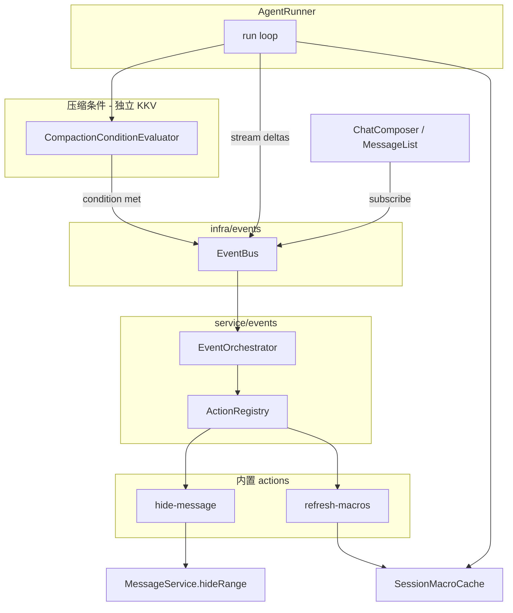

# 事件总线与压缩条件 技术规格（SPEC）

> **PRD**：`.apm/kb/docs/Iterations/event-bus-compaction-conditions/prd.md`  
> **现状基线**：`CompactionPipeline` + `nm-compaction` KKV；`AgentRunner` 每 step 调 `maybeCompact` 并注入 `abstract`；宏在 `agent-run.service` / `agent-runner` 路径实时 `renderDisplay`/`renderFileTree`；regex 用 `minDepth`/`maxDepth` + `visibleFloorByMessageId`（自头 1-based）；Mobile 流式靠 `AgentRunCallbacks`。

## 设计目标

1. **进程内事件总线**：typed 发布/订阅，支撑 UI、压缩链、未来插件（同进程）。
2. **压缩条件与事件配置解耦**：条件只 emit；events 只执行 action。
3. **统一自尾深度切片**：`hide-message`、regex 共用 `start-depth` / `end-depth`。
4. **宏会话缓存**：组 prompt 读缓存；`refresh-macros` 刷新；默认不在 `message.received` 上刷新。
5. **移除 abstract 压缩链路**：无 summary message、无 prompt `abstract` 块、无 `CompactionPolicy.action.abstract`。
6. **CLI emit + Mobile 手动压缩**；保存期校验 events/conditions。

## 总体方案



### 分层（对齐 [ARCHITECTURE.md](../../../../packages/core/ARCHITECTURE.md)）

| 层 | 路径 | 职责 |
|----|------|------|
| 深度（纯逻辑） | `domain/depth/logic/` | 自尾 depth、切片匹配/校验（**无** `.ts` 落在 ctx 根目录） |
| 事件契约 | `domain/events/model/` | 事件名、payload 类型 |
| 事件配置 schema | `domain/events-config/model/` + `logic/` | Zod、默认 events 文档、保存期校验（纯函数） |
| 压缩条件 | `domain/compaction-conditions/` + `service/compaction-conditions/` | `triggers/` 判定 OR；**不**执行 hide |
| 总线（Library 型 infra） | `infra/events/simple-event-bus.ts` | 同步 pub/sub；**不**建空 `ports/impl`（无第二实现时） |
| 条件 / 配置持久化 | `service/*/impl/*-store.service.ts` | KKV `nm-compaction-conditions`、`nm-events`（同现 `compaction-policy-store`） |
| 编排 | `service/events/` | `EventOrchestrator` port + `impl/`；action 处理器放 `impl/actions/` |
| 宏缓存 | `service/prompt/impl/` | `SessionMacroCache`（与 `render-prompt.ts` 同上下文，读 worktree） |
| 集成 | `service/agent/impl/agent-runner.ts` 等 | emit 点；**domain ↛ service** |

**依赖**：`service/events/impl/actions/*` → `domain/depth/logic`、`service/chat`（MessageService）、`service/prompt`（宏缓存）、`infra/events`；**禁止** `infra/events` → `service/*`。

### 内置事件（契约）

| 类型 | Payload（最小字段） |
|------|---------------------|
| `agent.run.started` | `sessionId`, `projectId` |
| `agent.run.finished` | `sessionId`, `projectId`, `stopReason` |
| `agent.run.failed` | `sessionId`, `projectId`, `error` |
| `agent.stream.text-delta` | `sessionId`, `text` |
| `agent.stream.thinking-delta` | `sessionId`, `text` |
| `session.message.received` | `sessionId`, `projectId` |
| `session.compaction.requested` | `sessionId`, `projectId`, `trigger: 'condition' \| 'manual'` |

用户 **events YAML 仅配置** 后两类（及可选扩展）；流式与 run 生命周期 **不进 YAML**，由代码 `publish`。

### 压缩条件（替代 `CompactionPolicy`）

**KKV 模块**：`nm-compaction-conditions`，key `policy`（或 `conditions`）。

```yaml
schemaVersion: 2
enabled: true
tokenThreshold: -1      # -1 → 解析为当前 model max context tokens
tokenRatio: 0.8         # 可选；有效阈值 = resolve(tokenThreshold) * ratio
visible-floor: 20       # 可选；可见条数 > 20 时满足（wire 可用 camelCase visibleFloor）
```

- `enabled: false` → 不自动 emit。
- 启用时 **至少一项** trigger 字段。
- **OR** 组合（复用 `CompositeTrigger` 思路，重命名/搬迁）：
  - `TokenThresholdTrigger`：扩展 `tokenThreshold === -1` + `tokenRatio`。
  - `VisibleFloorTrigger`（原 `FloorThresholdTrigger`）：`visible.length > visibleFloor`。
- 满足 → `eventBus.publish('session.compaction.requested', { trigger: 'condition', ... })`。
- **每 agent step 至多自动 emit 一次**（step 内去重，避免同一轮 LLM 前重复压缩）。

### 事件配置（替代 compaction `action`）

**KKV 模块**：`nm-events`，key `config`。

**默认内置**（`getEventsConfig()` 未持久化时返回）：

```yaml
schemaVersion: 1
events:
  session.compaction.requested:
    parallel:
      - hide-message:
          start-depth: 6
      - refresh-macros
```

**Action 项解析**（wire → 归一化）：

| YAML 写法 | 归一化 |
|-----------|--------|
| `- refresh-macros` | `{ type: 'refresh-macros', params: {} }` |
| `- refresh-macros: {}` | 同上 |
| `- hide-message:` + `start-depth` / `end-depth` | `{ type: 'hide-message', params: DepthSlice }` |

**执行语义**：

- `sequential`：按序 `await`。
- `parallel`：`Promise.allSettled`；**不回滚**；汇总为 `EventRunResult`（`partialFailure` + 错误列表）。
- 未知 action / 缺 depth 边界 → **保存时** Zod/refine 失败。

### 深度切片（核心算法）

**输入**：`visibleMessages` = `listVisibleSorted(all)`（`hidden` 排除，按 `seq` 升序）。

**自尾 depth**：`depth = visibleMessages.length - 1 - index`（最后一条 depth 0）。

**`DepthSlice` 参数**（kebab-case in YAML，`startDepth`/`endDepth` in TS）：

| 配置 | 匹配 depth 集合 |
|------|-----------------|
| 仅 `start-depth: 6` | \( d \in [6, \infty) \) |
| 仅 `end-depth: 99` | \( d \in [0, 99] \) |
| 两者皆有 | \( d \in [start, end] \) |
| 仅 `start-depth: 0` | 全部可见 |

**`hide-message`**：算出命中消息 id → 取 `seq` 连续区间 → `messages.hideRange(sessionId, fromSeq, toSeq)`（可多次 range 若中间有 gap，SPEC 实现取 minSeq～maxSeq 一次或按连续段循环）。

**Regex**：`applyRegexRules` 的 `ctx.floor` 改为 **`ctx.depthFromTail`**；`depthInRange(depth, rule)` 使用 rule 的 `startDepth`/`endDepth`（∞ 用 `Number.POSITIVE_INFINITY`）。**删除** `visibleFloorByMessageId` 在 regex 路径的使用。

**DB**：`regex_rule` 列 `min_depth`/`max_depth` 重命名为 `start_depth`/`end_depth`（bootstrap 迁移；**无**旧数据兼容，开发可清库）。Zod `createRegexRuleSchema` 仅接受 `startDepth`/`endDepth`（或 kebab 在 YAML 层转换）。

### 宏缓存

```typescript
interface SessionMacroSnapshot {
  worktreeDisplay: string;
  filetreeDisplay: string;
  refreshedAtMs: number;
}
```

- **Key**：`projectId + sessionId`。
- **`getOrRefresh`**：无缓存则 `refresh`（首期）；组 prompt **只读** `get`，不隐式刷新。
- **`refresh-macros` action**：`worktree.renderDisplay()` + `renderFileTree()` 写入缓存。
- **注入点**：`buildPromptLlmInput` / `AgentRunOptions.promptContext` 从 `SessionMacroCache.get` 取；`agent-run.service` 不再每 turn 直接 render（除非 cache miss 且 SPEC 定冷启动 fill）。

### AgentRunner 集成（替换 CompactionPipeline）

**删除**：`compactionAbstract`、`maybeCompact` 返回 abstract、`DefaultCompactionAction`。

**每 step 开头**：

1. `compactionConditions.evaluate(...)` → 若 true 且本 step 未 emit 过 → `publish session.compaction.requested`。
2. `macroCache.get` → 填入 `promptContext`（无则空串或 lazy refresh，SPEC 选 **空串 + 依赖压缩链 refresh**，默认配置会在压缩时 refresh）。

**`modelRequests.request`**：`onStream` 包装为 `publish agent.stream.*`。

**`run()` 结束**：

| 结果 | 行为 |
|------|------|
| `stopReason === 'completed'` 或正常结束且本 run `assistantAppendCount > 0` | `publish session.message.received` |
| 异常 / `assistantAppendCount === 0` | **不** `message.received` |
| 成功 / 失败 | `publish agent.run.finished` / `agent.run.failed` |

**Tool-only 最后一轮**：assistant 消息含 `tool_use` 已 `append` → 算 `assistantAppendCount > 0` → **emit** `message.received`。

### Mobile 流式

- `createMobileNovelMasterRuntime` 创建 **单例** `EventBus`。
- `runAgentTurn` 不再接收 `AgentRunCallbacks`；内部注册临时 subscriber 或传入 `RunContext` 上的 bus。
- `ChatComposer`：`useEffect` 订阅 `agent.stream.text-delta` / `thinking-delta`，卸载时 unsubscribe；`agent.run.finished` → `onMessagesChanged` + reset stream state。

### Mobile 手动「压缩」

- `buildMessageActionItems` 增加 `{ label: '压缩', action: 'compact' }`（或 `compress-session`）。
- `ChatTabScreen`：`eventOrchestrator.emit('session.compaction.requested', { trigger: 'manual', ... })`；Agent 运行中禁用（与批量删一致）。
- **二次确认** Alert（文案含将 hide 深度 6～∞）。

### CLI

| 命令 | 说明 |
|------|------|
| `nm compaction-conditions show` | 打印 conditions JSON/YAML |
| `nm compaction-conditions set --file <path>` | 校验并写入 KKV |
| `nm events show` | 合并默认后展示 |
| `nm events set --file <path>` | 保存期校验 + 写入 |
| `nm event emit <eventType> [--session <id>]` | 当前 scope 或指定 session；走 Orchestrator |

- **移除** `nm compaction`（或仅保留 deprecated 别名打印提示，首期直接删）。
- `--file` 支持 `.yaml`/`.json`（复用 `parseText`）。

### 移除 abstract（跨模块）

| 区域 | 改动 |
|------|------|
| `render-prompt.ts` | 删除 `abstract` 块分支、`PromptRenderDot.abstract`、`compactionAbstract` 参数 |
| `agent-definition.schema` | 拒绝 `type: abstract` prompt 块 |
| `CompactionPolicy` / store | **删除** 模块或留空壳 redirect；改用 conditions + events |
| `CompactionPolicyScreen` | 改为 **压缩条件** 编辑（token/visible-floor）；events 可第二屏或折叠 |
| `examples/compaction-policy.yaml` | 改为 `compaction-conditions` + `events` 样例 |
| Tests | 删除/改写 compaction abstract 用例 |

## 最终项目结构

> 对照 `packages/core/ARCHITECTURE.md` 校验：**domain 模块根目录不放 `.ts`**；schema 仅在 `model/`；纯函数在 `logic/`；service 用 `*.port.ts` + `create-*.ts` + `impl/*.service.ts`；infra 事件总线为 **Library 型**（扁平，无空 ports/impl）。

### 校验结论（原草案 → 修正）

| 原草案问题 | ARCHITECTURE 规则 | 修正 |
|------------|-------------------|------|
| `domain/depth/depth-slice.ts` 在 ctx 根 | ctx 根禁止 `.ts` | → `domain/depth/logic/` |
| `domain/events/event-types.ts` 在根 | 同上 | → `domain/events/model/` |
| `domain/events-config/*.schema.ts` 在根 | schema 在 `model/` | → `model/` + `logic/default-events.ts` |
| `infra/events/event-bus.ts` 未说明形态 | Library 型扁平即可 | 命名为 `simple-event-bus.ts` |
| `service/events/actions/*.action.ts` | service 用 `impl/` | → `service/events/impl/actions/` |
| `service/macro/` 新顶层 ctx | 宏服务于 prompt | → `service/prompt/` 旁 `impl/session-macro-cache.service.ts` |
| `domain/compaction-conditions/*.schema` 在根 | schema 在 `model/` | → `model/`；触发器 → `triggers/` |
| 保留 `domain/compaction/action/` | 删除 abstract action | **移除**旧 `domain/compaction/action`、`service/compaction/create-compaction-pipeline` 等 |

### `packages/core/src/`（新增/变更）

```text
packages/core/src/
├── bootstrap/regex/
│   └── regex-schema.ts                 # min_depth/max_depth → start_depth/end_depth
├── domain/
│   ├── depth/
│   │   └── logic/
│   │       ├── depth-slice.ts            # parse/validate/matchDepth
│   │       └── depth-from-tail.ts        # depthByMessageId, idsInSlice
│   ├── events/
│   │   └── model/
│   │       └── event-types.ts            # 事件名常量 + payload 类型
│   ├── events-config/
│   │   ├── model/
│   │   │   ├── events-config.ts
│   │   │   └── events-config.schema.ts
│   │   └── logic/
│   │       ├── default-events.ts         # DEFAULT_EVENTS 内置文档
│   │       └── validate-events-config.ts # 保存期校验（纯函数）
│   ├── compaction-conditions/            # 替代 policy 的「条件」侧
│   │   ├── model/
│   │   │   ├── compaction-conditions.ts
│   │   │   └── compaction-conditions.schema.ts
│   │   ├── ports/
│   │   │   └── compaction-condition-trigger.port.ts  # 自 compaction-trigger.port 搬迁/改名
│   │   ├── triggers/
│   │   │   ├── composite-trigger.ts
│   │   │   ├── token-threshold.trigger.ts   # 含 -1、tokenRatio
│   │   │   └── visible-floor.trigger.ts     # 原 floor-threshold，改名
│   │   └── logic/
│   │       └── token-estimate.ts              # 自 domain/compaction/logic 保留或迁入
│   ├── chat/logic/
│   │   └── message-visible-floor.ts           # 保留；仅 visible-floor 触发/其它非 regex 用途
│   └── regex/
│       ├── model/                             # startDepth/endDepth 字段
│       └── logic/apply-regex-rules.ts         # 改用 domain/depth/logic
├── errors/
│   ├── events-errors.ts
│   └── compaction-conditions-errors.ts
├── infra/events/
│   └── simple-event-bus.ts                    # Library 型；同步 EventBus
├── service/
│   ├── compaction-conditions/
│   │   ├── compaction-conditions-store.port.ts
│   │   ├── create-compaction-conditions-store.ts
│   │   ├── create-compaction-condition-evaluator.ts
│   │   └── impl/
│   │       └── compaction-conditions-store.service.ts   # KKV nm-compaction-conditions
│   ├── events-config/
│   │   ├── events-config-store.port.ts
│   │   ├── create-events-config-store.ts
│   │   └── impl/
│   │       └── events-config-store.service.ts             # KKV nm-events
│   ├── events/
│   │   ├── event-orchestrator.port.ts
│   │   ├── create-event-orchestrator.ts
│   │   ├── event-run-result.ts                            # 类型可放 model/ 或邻接 port
│   │   └── impl/
│   │       ├── event-orchestrator.service.ts
│   │       └── actions/
│   │           ├── hide-message.handler.ts
│   │           ├── refresh-macros.handler.ts
│   │           └── register-default-action-handlers.ts
│   ├── prompt/
│   │   ├── render-prompt.ts                               # 删 abstract；读宏缓存
│   │   ├── session-macro-cache.port.ts
│   │   ├── create-session-macro-cache.ts
│   │   └── impl/
│   │       └── session-macro-cache.service.ts
│   └── agent/impl/
│       └── agent-runner.ts                                  # emit + 条件；去 CompactionPipeline
└── index.ts                                                 # 仅导出稳定公共 API

# 删除或清空（实现阶段）
# domain/compaction/action/default-compaction-action.ts
# domain/compaction/model/compaction-policy*.ts
# service/compaction/create-compaction-pipeline.ts
# service/compaction/compaction-policy-store.*
# service/compaction/impl/sqlite-compaction-agent-resolver.ts  # 无 abstract agent 后可删
```

### `packages/core/test/`（镜像 domain/service ctx）

```text
packages/core/test/
├── depth/
├── events/
├── events-config/
├── compaction-conditions/
├── events/                    # orchestrator + handlers 集成
├── prompt/                    # session-macro-cache（可选）
└── regex/                     # 深度字段改写用例
```

### `apps/cli` / `apps/mobile`（不变更 core 分层规则）

```text
apps/cli/src/
  compaction-conditions/commands.ts
  events/commands.ts
  event/commands.ts            # emit 子命令（或并入 events/）
  runtime.ts

apps/mobile/src/
  runtime/create-mobile-runtime.ts
  runtime/types.ts
  services/agent-run.service.ts
  screens/stack/CompactionConditionsScreen.tsx
  screens/stack/EventsConfigScreen.tsx
  components/chat/message-edit.ts
```

### 与现有 `domain/compaction` 的关系

| 现路径 | 处置 |
|--------|------|
| `domain/compaction/triggers/*` | 迁至 `domain/compaction-conditions/triggers/`（`visible-floor` 改名） |
| `domain/compaction/action/*` | **删除**（`hide-message` 在 `service/events/impl/actions/`） |
| `domain/compaction/model/compaction-policy*` | **删除**；由 `compaction-conditions/model` 替代 |
| `service/compaction/*` | **删除** pipeline/policy store；KKV 模块名改为 `nm-compaction-conditions` + `nm-events` |

## 变更点清单

| # | 文件/模块 | 改动 |
|---|-----------|------|
| 1 | `infra/events/simple-event-bus.ts` | 新建（Library 型） |
| 2 | `domain/events/model/*` | 事件类型 |
| 3 | `domain/depth/logic/*` | 深度切片 |
| 4 | `service/events/impl/*` | Orchestrator + action handlers |
| 5 | `service/prompt/impl/session-macro-cache.service.ts` | SessionMacroCache |
| 6 | `compaction-conditions/*` | 替代 policy store |
| 7 | `events-config/*` | 新 KKV + schema |
| 8 | `agent-runner.ts` | 去 pipeline/abstract；emit + conditions |
| 9 | `create-compaction-pipeline.ts` | 删除或 noop 导出移除 |
| 10 | `default-compaction-action.ts` | 删除 |
| 11 | `render-prompt.ts` | 去 abstract |
| 12 | `agent-definition.schema.ts` | 禁 abstract 块 |
| 13 | `regex-rule.*` / `apply-regex-rules.ts` | start/end depth 自尾 |
| 14 | `regex-schema.ts` + bootstrap | 列迁移 |
| 15 | `message-visible-floor.ts` | 保留给 visible-floor 触发；regex 不再用 |
| 16 | `index.ts` | 导出新 API |
| 17 | `apps/cli/*` | 新命令；runtime 接线 |
| 18 | `apps/mobile/*` | bus、宏缓存、菜单压缩、流式订阅 |
| 19 | `.apm/kb` / `examples/*` | 样例配置 |

## 详细实现步骤

### M1 — 深度切片 + 事件总线

1. 实现 `depth-from-tail.ts`、`depth-slice.ts` + 单测（PRD 验收 4 条 hide 场景）。
2. 实现 `SimpleEventBus` + `event-types.ts`。
3. CLI `nm event emit`（Orchestrator 可先 stub actions）。
4. **验证**：`npm test -w @novel-master/core -- depth` + bus test。

### M2 — 事件配置 + Orchestrator + actions

1. `events-config.schema.ts`：支持 action 简写、parallel/sequential。
2. `DEFAULT_EVENTS`、`EventsConfigStore`（KKV `nm-events`）。
3. `hide-message.action.ts`、`refresh-macros.action.ts`；parallel `allSettled` + partialFailure。
4. `EventOrchestrator.emit(type, ctx)`。
5. **验证**：配置校验单测；emit compaction 集成测（memory session + messages）。

### M3 — 宏缓存 + 压缩条件 + AgentRunner

1. `SessionMacroCache` + `refresh-macros` 接入。
2. `CompactionConditions` schema v2 + store + evaluator（-1 token、ratio、visible-floor）。
3. 重构 `AgentRunner`：去 `CompactionPipeline`；step 前条件 emit；stream/run/message.received emit。
4. `createAgentRunner` / CLI & Mobile runtime 接线。
5. **验证**：`agent-runner.test.ts` 改写；宏 cache spy。

### M4 — Regex 深度 + Mobile/CLI + 清理 abstract

1. DB `start_depth`/`end_depth`；repository + schema；apply-regex 改用自尾 depth。
2. 删除 abstract/compaction policy 残留；更新 agent 测试样例。
3. Mobile：`ChatComposer` 订阅；`message-edit` + 压缩；Conditions/Events UI。
4. CLI `compaction-conditions`、`events` 子命令；删除 `nm compaction`。
5. **验证**：全量 `npm test -w @novel-master/core`；`npm test -w @novel-master/mobile`；`npm run build`。

## 测试策略

### 单元测试（Core）

| ID | 范围 |
|----|------|
| D1 | depth slice 边界（仅 start / 仅 end / 全区间 / 不足条数） |
| D2 | `hide-message` 映射到正确 seq range |
| E1 | EventBus subscribe/unsubscribe 多处理器 |
| E2 | events config：简写 `refresh-macros`、非法 hide 拒绝 |
| E3 | parallel 一侧失败不回滚 hide |
| C1 | visible-floor `>` 21 vs 20 |
| C2 | tokenThreshold -1 × ratio 解析（mock model meta） |
| C3 | step 内重复条件不双 emit |
| R1 | regex 仅 depth 0–2 命中 |
| M1 | macro cache 二次 get 不 render |

### 集成 / Mobile

| ID | 范围 |
|----|------|
| I1 | CLI `event emit session.compaction.requested` 后可见条数 = 6 |
| I2 | run 失败不 `message.received` |
| I3 | tool-only 成功 run 仍 `message.received` |

## 兼容性与迁移

| 项 | 策略 |
|----|------|
| `nm-compaction` KKV | **不读**；文档说明改用 `compaction-conditions` + `events` |
| `CompactionPolicy` API | 从 `index.ts` 移除或标记 deprecated 一版后删 |
| regex `minDepth`/`maxDepth` | schema 拒绝；DB 列改名，**开发环境清库** |
| Agent YAML `abstract` 块 | 加载失败，提示移除 |
| `keepLastN` action 名 | **不存在**；用 `hide-message: { start-depth: 6 }` |

## 风险与回滚方案

| 风险 | 缓解 | 回滚 |
|------|------|------|
| Runner 行为回归 | 保留 agent-runner 黄金路径单测 | revert 分支 |
| 宏缓存陈旧 | 压缩链默认 parallel refresh；用户可配 message.received | 临时恢复每 turn render |
| parallel hide 成功、refresh 失败 | PRD：不回滚 hide；UI toast | — |
| regex DB 迁移 | 开发 reset；生产尚未大规模则 acceptable | 备份 DB |
| 高频 stream 事件 | Mobile handler 仅 append state，禁止 reload 全表 | 节流（非首期） |

---

编码前请确认本 SPEC。确认后建议分支：`feature/event-bus-compaction-conditions`。
