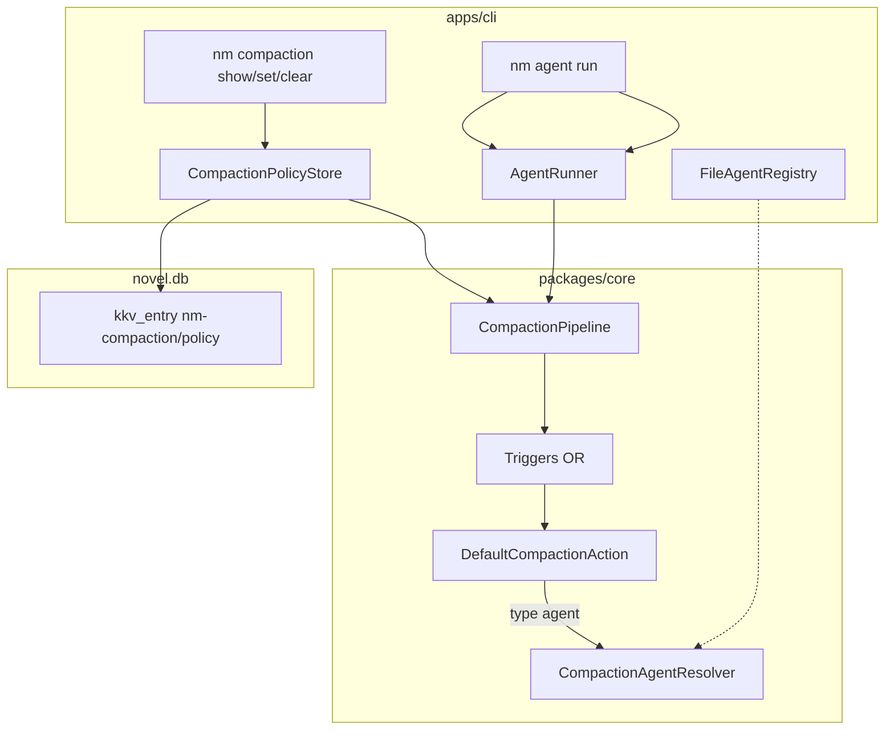

# 全局压缩策略（与 Agent 解耦）技术规格（SPEC）

## 设计目标

- **CompactionPolicy** 独立于 `AgentDefinition`，全局单例持久化于 **novel.db KKV**。
- `CompactionPipeline` / `DefaultCompactionAction` **不再读取** `definition.compact`；`abstract.type: agent` 通过 **agentId** 解析摘要 Agent。
- **AgentDefinition** 移除 `compact`（Zod `.strict()` 拒绝未知字段）；对话 Agent 仍用 **`type: abstract` Prompt 块** 消费 `dot.abstract`。
- CLI：`nm compaction show|set|clear`；Agent 注册表 **文件制**（首期），供 `agentId` 校验与解析。
- **`examples/mobile` 原型 UI 同步**（必做）：Agent 无 compact；「我的 → 压缩策略」编辑全局 mock 策略（含 agentId 下拉）。
- **不考虑** 旧 Agent YAML 中 `compact:` 兼容。

---

## 现状与约束（代码探索）

| 模块 | 现状 | 本迭代 |
|------|------|--------|
| `AgentDefinition.compact` | `agent-definition.ts` + `agent-definition.schema.ts` | **删除** |
| `CompactionPipeline.maybeCompact` | 签名 `(session, definition, worktreeDisplay)` | 改为 `(session, worktreeDisplay)`；内部读 **PolicyStore** |
| `CompactionContext` | 含 `definition: AgentDefinition`；action 用 `definition.compact` / `definition.model` | 含 `policy` + `resolveAgent`；摘要模型来自 **解析后的 Agent B** |
| `createCompactionPipeline` | 仅 `modelRequests` | + `CompactionPolicyStore` + `CompactionAgentResolver` |
| `createAgentRunner` | 默认 `createCompactionPipeline({ modelRequests })` | 注入 store + resolver（CLI runtime）；测试可 `createNoOpCompactionPipeline` 或 mock store |
| `DefaultAgentRunner` | 每步 `maybeCompact(session, definition, …)` | `maybeCompact(session, worktreeDisplay)` |
| KKV | `KkvService` + `PersistentPreferences`（module `nm-preferences`） | 新 module **`nm-compaction`**，key **`policy`** |
| Agent 列表 | **无** Core 注册表；CLI 仅 `--agent-config <path>`；mobile `agentCatalog` mock | CLI **`.novel-master/agents/registry.json`** |
| `agentDefinitionFromJson` | 读写 `compact` | 不再读写 |
| `compaction.test.ts` / `agent-runner.test.ts` T11 | 依赖 `definition.compact` | 改为 **内存 PolicyStore** |
| `capture-agent-scenarios.mjs` 场景 12 | agent.yaml 内嵌 `compact` | `nm compaction set --file` + 无 compact 的 agent |
| `examples/agent-writer.yaml` | 含 `compact` + abstract 块 | 去掉 `compact` |

**边界（PRD）**：无 project/session 策略；无 DB 存 Agent；token 估算仍为 `estimateTokens`（chars/4）。

---

## 总体方案

### 架构



### 领域模型

```ts
/** 全局压缩策略（KKV 单条 JSON 文档） */
interface CompactionPolicy {
  readonly schemaVersion: 1;
  readonly enabled: boolean;
  readonly trigger: CompactionTriggerConfig;
  readonly action: CompactionActionConfig;
}

/** 与现 CompactConfig 相同，但 abstract.agent 必须带 agentId */
type CompactionAbstractConfig =
  | { readonly type: "text"; readonly content: string }
  | {
      readonly type: "agent";
      readonly agentId: string;
      readonly instruction?: string;
    };

interface CompactionTriggerConfig {
  readonly tokenThreshold?: number;
  readonly floorThreshold?: number;
}

interface CompactionActionConfig {
  readonly keepLastN: number;
  readonly abstract: CompactionAbstractConfig;
}
```

**运行时语义（与现网对齐）**：

- `enabled === false` 或 store **无记录** → pipeline 返回 `undefined`（等同 `createNoOpCompactionPipeline`）。
- `enabled === true` 且 trigger OR 满足 → `hideRange` + 可选 LLM 摘要 + `[Compaction summary]` user 消息 → 返回 `abstract` 字符串。
- `abstract.type: agent` → `resolveAgent(agentId)` 取 **摘要 Agent** 的 `model.applicationModelId` / `params`，**禁止 tools**。
- 对话 Agent 的 `buildPromptLlmInput(..., { abstract })` **不变**。

### 持久化

| 项 | 值 |
|----|-----|
| KKV module | `nm-compaction` |
| KKV key | `policy` |
| Value | `JSON.stringify(compactionPolicyToJson(policy))` |
| 空状态 | key 不存在 → `getPolicy()` 返回 `null`（视为不压缩） |

实现：`DefaultCompactionPolicyStore`（仿 `DefaultPersistentPreferences`），内部 `KkvService`。

公开 API：

| API | 职责 |
|-----|------|
| `compactionPolicyFromJson(unknown)` | 校验 + `CompactionPolicy` |
| `compactionPolicyToJson(policy)` | 可序列化文档 |
| `createCompactionPolicyStore(conn)` | 工厂 |
| `CompactionPolicyStore` port | `getPolicy()` / `setPolicy()` / `clearPolicy()` |

错误类型：`CompactionPolicyError`（`INVALID_SCHEMA` | `NOT_FOUND` 仅 clear 可选 | `AGENT_NOT_FOUND` 在 CLI/validate 层）。

### Agent 注册表（CLI，首期）

**路径**：`{novelMasterHome}/agents/registry.json`  
**novelMasterHome**：`process.env.NOVEL_MASTER_HOME ?? dirname(dbPath)` 的父级若 db 为 `.novel-master/novel.db` 则同目录；与 `resolveDbPath` 一致取 **含 `novel.db` 的目录** 为 home（即 `.novel-master/`）。

**registry.json 形状**：

```json
{
  "schemaVersion": 1,
  "agents": {
    "writer": "agents/writer.yaml",
    "summarizer": "agents/summarizer.yaml"
  }
}
```

- 值为 **相对 novelMasterHome** 或绝对路径。
- **agentId** = `agents` 对象的 key。

**`FileCompactionAgentResolver`**（`apps/cli/src/compaction/file-agent-resolver.ts`）：

- `resolve(agentId)` → 读 registry → `deserializeAgentDefinition(readFile(path))`
- 不存在 → `CompactionPolicyError` / CLI 友好文案 `agent not found: {id}`

**校验时机**：

| 时机 | 行为 |
|------|------|
| `nm compaction set --file` | Zod policy + **agentId 必须在 registry** |
| `nm agent run`（压缩触发时） | `resolveAgent` 失败 → **抛错中止 run**（不静默回退对话 Agent） |

### Pipeline / Action 改造

**`compaction-pipeline.port.ts`**：

```ts
maybeCompact(
  session: AgentSession,
  worktreeDisplay: string,
): Promise<string | undefined>;
```

**`createCompactionPipeline(deps)`**：

```ts
interface CreateCompactionPipelineDeps {
  readonly modelRequests: ModelRequestService;
  readonly policyStore: CompactionPolicyStore;
  readonly resolveAgent: CompactionAgentResolver;
}
```

流程：

1. `const policy = await policyStore.getPolicy()`；若 `!policy?.enabled` → `undefined`。
2. `triggersFromPolicy(policy)`（自 `triggersFromDefinition` 重命名，读 `policy.trigger`）。
3. `action.execute({ session, policy, modelRequests, resolveAgent, worktreeDisplay })`。

**`CompactionContext`**（`compaction-context.ts`）：

- 移除 `definition`。
- 新增 `policy: CompactionPolicy`、`resolveAgent: CompactionAgentResolver`。

**`default-compaction-action.ts`**：

- `action` 取自 `ctx.policy.action`。
- `abstract.type === "agent"`：`const summaryDef = await ctx.resolveAgent(abstractCfg.agentId)`，用 `summaryDef.model` 调 `modelRequests.request`。
- `abstract.type === "text"`：逻辑不变。

**`agent-runner.ts`**：删除 `definition` 参数传递。

**`create-agent-runner.ts`**：deps 扩展 **必选** `policyStore` + `resolveAgent`（或提供 overload：缺省时 no-op pipeline — **不推荐**；测试显式传 no-op 或 in-memory store）。

**推荐 CLI 接线**：

```ts
// runtime.ts
compactionPolicy: createCompactionPolicyStore(conn),
resolveCompactionAgent: createFileCompactionAgentResolver(resolveNovelMasterHome(dbPath)),

// agent/commands.ts createAgentRunner({
  compaction: createCompactionPipeline({
    modelRequests: rt.modelRequests,
    policyStore: rt.compactionPolicy,
    resolveAgent: rt.resolveCompactionAgent,
  }),
})
```

---

## 最终项目结构

```text
packages/core/src/
├── domain/
│   ├── agent/
│   │   ├── agent-definition.ts          # 删 compact
│   │   ├── agent-definition.schema.ts   # 删 compactConfigSchema
│   │   └── compaction/                  # triggers + action（保留路径，改 context）
│   └── compaction/
│       ├── compaction-policy.ts         # 新：Policy 类型
│       └── compaction-policy.schema.ts  # 新：Zod（含 agentId）
├── errors/
│   └── compaction-policy-errors.ts      # 新
├── service/
│   └── compaction/
│       ├── compaction-policy-store.port.ts
│       ├── create-compaction-policy-store.ts
│       ├── impl/compaction-policy-store.service.ts
│       ├── compaction-agent-resolver.port.ts   # 新 port
│       ├── create-compaction-pipeline.ts       # 改 deps/逻辑
│       └── compaction-pipeline.port.ts         # 改签名
packages/core/test/
├── agent/compaction.test.ts             # 改 policy + mock resolver
├── agent/agent-runner.test.ts           # T11 改 global policy
└── compaction/compaction-policy-store.test.ts  # 新

apps/cli/src/
├── compaction/
│   ├── commands.ts                      # nm compaction
│   └── file-agent-resolver.ts
├── runtime.ts                           # 挂 store + resolver
└── main.ts                              # case compaction

examples/
├── agent-writer.yaml                    # 无 compact
├── compaction-policy.yaml               # 新样例
└── agents-registry.example.json         # 或 .novel-master 文档

examples/mobile/                         # 必做：UI 与领域模型对齐
├── index.html                           # 我的 → 压缩策略页；Agent 编辑无 compact
├── app.js                               # globalCompactionPolicy + 表单/保存
├── styles.css                           # compaction-policy 页样式（可复用 agent-compact）
├── README.md
└── docs/feature-inventory.md
```

---

## 变更点清单

| 文件 | 变更 |
|------|------|
| `domain/agent/agent-definition.ts` | 删除 `CompactConfig` 与 `compact?` |
| `domain/agent/agent-definition.schema.ts` | 删除 `compactConfigSchema` 及 document 字段 |
| `domain/agent/agent-definition-from-json.ts` | 不再映射 `compact` |
| `domain/compaction/compaction-policy*.ts` | **新增** |
| `domain/agent/compaction/compaction-context.ts` | `policy` + `resolveAgent` |
| `domain/agent/compaction/action/default-compaction-action.ts` | 用 policy + resolveAgent |
| `service/compaction/create-compaction-pipeline.ts` | PolicyStore + 新签名 |
| `service/compaction/compaction-pipeline.port.ts` | 新签名 |
| `service/agent/impl/agent-runner.ts` | maybeCompact 少传 definition |
| `service/agent/create-agent-runner.ts` | 新 deps |
| `packages/core/src/index.ts` | 导出新类型/工厂 |
| `apps/cli/src/compaction/*` | 子命令 |
| `apps/cli/src/main.ts` | 路由 `compaction` |
| `apps/cli/src/runtime.ts` | store + resolver |
| `apps/cli/src/agent/commands.ts` | runner 接线 |
| `examples/agent-writer.yaml` | 删 `compact` |
| `examples/compaction-policy.yaml` | **新增** |
| `apps/cli/scripts/capture-agent-scenarios.mjs` | 场景 12 用 compaction set |
| `packages/core/test/agent/agent-definition.test.ts` | 删 compact 合法用例；**增** 含 compact 拒绝 |
| `examples/mobile/index.html` | 我的菜单「压缩策略」；`#compactionPolicyPage` |
| `examples/mobile/app.js` | 见 §「移动端原型」 |
| `examples/mobile/styles.css` | 全局策略页 / agentId 下拉样式 |
| `examples/mobile/README.md` | 信息架构：全局压缩 vs Agent |
| `examples/mobile/docs/feature-inventory.md` | §7 Agent 无 compact；§9 或新节全局压缩 |
| `.apm/kb/docs/Iterations/agent-config-and-compaction/*` | 文首注记 compact 已迁出（一句） |

---

## 详细实现步骤

### 步骤 1：领域模型与 Zod

1. 新增 `compaction-policy.ts` / `compaction-policy.schema.ts`（`schemaVersion: 1`、`enabled`、`trigger`、`action`；`abstract.type: agent` 必填 `agentId`）。
2. 新增 `compaction-policy-from-json.ts`（`compactionPolicyFromJson` / `compactionPolicyToJson`）。
3. 从 `agent-definition.schema.ts` **移除** compaction 相关 schema 与 `compact` 字段。

### 步骤 2：AgentDefinition 瘦身

1. 更新 `agent-definition.ts`、`agent-definition-from-json.ts`。
2. 跑 `agent-definition.test.ts`：删除 compact 正向用例；增加 `compact` 字段 → `INVALID_SCHEMA`。

### 步骤 3：CompactionPolicyStore

1. `compaction-policy-store.port.ts` + `impl` + `create-compaction-policy-store.ts`。
2. module `nm-compaction`，key `policy`。
3. 单测：set/get/clear、无效 JSON。

### 步骤 4：CompactionAgentResolver port + CLI 实现

1. Core：`compaction-agent-resolver.port.ts`（`resolve(agentId): Promise<AgentDefinition>`）。
2. CLI：`file-agent-resolver.ts` + `registry.json` 读取。
3. 文档约定默认路径 `.novel-master/agents/registry.json`。

### 步骤 5：改造 Action / Pipeline / Runner

1. 更新 `CompactionContext`、`DefaultCompactionAction`（摘要 Agent 分支）。
2. `triggersFromPolicy(policy)`；`createCompactionPipeline` 读 store。
3. `CompactionPipeline` + `AgentRunner` 签名调整。
4. `createAgentRunner` 要求 `policyStore` + `resolveAgent`（或默认 no-op pipeline 仅当显式 `compaction: createNoOpCompactionPipeline()` — 保持测试现有 `createNoOpCompactionPipeline` 用法）。

### 步骤 6：CLI `nm compaction`

子命令（`apps/cli/src/compaction/commands.ts`）：

| 子命令 | 行为 |
|--------|------|
| `show` | 无记录 → stderr 提示 + exit 0 或打印 `{}`/`disabled`（实现定：**打印 `enabled: false` 说明无策略**） |
| `set --file <path>` | 读 YAML/JSON → `compactionPolicyFromJson` → 校验 agentId → `setPolicy` |
| `clear` | `clearPolicy()` |

`main.ts`：`top === "compaction"` → `runCompaction(rt, sub, rest)`。

`set` 支持格式：扩展名 `.yaml/.yml` 用现有 yaml 解析（与 agent-config 同库），否则 JSON。

### 步骤 7：示例与捕获脚本

1. `examples/agent-writer.yaml` 删除 `compact` 段（保留 abstract 块）。
2. `examples/compaction-policy.yaml`：

```yaml
schemaVersion: 1
enabled: true
trigger:
  tokenThreshold: 12000
  floorThreshold: 20
action:
  keepLastN: 6
  abstract:
    type: agent
    agentId: summarizer
    instruction: "Summarize the following conversation history concisely:"
```

3. 提供 `examples/agents-registry.example.json` + README 说明复制到 `.novel-master/agents/registry.json`。
4. 更新 `capture-agent-scenarios.mjs`：先 `compaction set`，agent yaml **无 compact**。

### 步骤 8：测试改编

1. `compaction.test.ts`：注入 `InMemoryCompactionPolicyStore` + `Map` resolver；policy 启用代替 `compactDefinition()`。
2. `agent-runner.test.ts` T11：预置 policy store 含 abstract text/agent；对话 definition **无 compact**。
3. 新增 store + `agentId` 缺失 resolver 测试。

### 步骤 9：导出与文档

1. `packages/core/src/index.ts` 导出新符号。
2. `CHANGELOG.md` 一条 breaking：AgentDefinition 无 compact；需全局 policy。

### 步骤 10：`examples/mobile` UI 同步（必做）

与 Core 解耦后的信息架构一致；仍为 **mock**（`localStorage` 可选，非必须），字段形状对齐 `CompactionPolicy`。

#### 10.1 状态与 mock 数据（`app.js`）

```js
// appState 增加
globalCompactionPolicy: { enabled, trigger, action } | null

// 默认 mock（与 examples/compaction-policy.yaml 等价）
appState.globalCompactionPolicy = {
  schemaVersion: 1,
  enabled: true,
  trigger: { tokenThreshold: 12000, floorThreshold: 20 },
  action: {
    keepLastN: 6,
    abstract: { type: 'agent', agentId: 'agent-writer', instruction: '...' },
  },
};
```

- `createWriterDefinition()` / `createCreativeDefinition()`：**删除** `compact` 字段。
- 新增 `createSummarizerDefinition()`（可选）或复用 `agent-creative` 作为摘要 Agent 示例；policy 默认 `agentId` 指向 catalog 中已有 id。

#### 10.2 Agent 列表与编辑器

| 位置 | 变更 |
|------|------|
| `agentListMeta()` | **删除**「压缩 · token/条数」后缀 |
| `definitionToYamlPreview()` | 输出 **不含** `compact` |
| `renderAgentEditor()` | **删除**整段 `<h3>压缩策略 compact</h3>` 及 `data-compact-*` 表单项 |
| `collectAgentDefinitionFromForm()` | **删除** `compactEnabled` / `def.compact` 分支 |
| 事件委托 | 移除 `compactEnabled`、`abstractType`（agent 编辑器内）相关监听 |

保留 Agent 编辑器内 **`type: abstract` Prompt 块** 的说明（「无压缩摘要时不拼接」hint 仍适用）。

#### 10.3 全局压缩策略页

**入口**（`index.html` `#profilePage`）：

```html
<div class="menu-item" data-action="compaction-policy">
  <div class="menu-icon">🗜️</div>
  <div class="menu-label">压缩策略</div>
  <div class="menu-arrow">›</div>
</div>
```

**页面** `#compactionPolicyPage`（全屏栈，顶栏标题「压缩策略」）：

- 启用开关 `enabled`
- 与现 Agent compact 面板相同字段：tokenThreshold、floorThreshold、keepLastN、abstractType（text | agent）
- **新增**：`abstract.type === agent` 时 **下拉选择摘要 Agent**（`agentId`，选项来自 `agentCatalog` 的 id + `definition.name`）
- instruction / content 文本区逻辑与现 mock 一致
- 底部或工具栏：**保存** → `showToast('已保存全局压缩策略')`（写回 `appState.globalCompactionPolicy`）

**路由**：

- `pageConfig.compactionPolicy = { title: '压缩策略', showBack: true, showNav: false }`
- `setupMenuItems`：`compaction-policy` → `navigateToPage('compactionPolicy', true)`
- `renderCompactionPolicyPage()`：从 `appState.globalCompactionPolicy` 渲染表单

#### 10.4 样式（`styles.css`）

- 将 `.agent-compact-panel` 泛化为 `.compaction-policy-form`（或复用类名并用于新页）
- `.compaction-agent-select`：`agentId` 下拉全宽
- Agent 编辑器中删除仅用于 compact 的无用规则（若不再引用）

#### 10.5 文档

- `README.md`：底栏 **我的 → 压缩策略**（全局）；**Agent** 仅 prompts/model/runtime
- `feature-inventory.md`：
  - §7.2：删除「压缩/摘要」在 Agent 表单中的描述
  - 新增 **§9.x 全局压缩策略**（或并入扩展设置）：单条策略、agentId 引用 Agent 列表、与 CLI `nm compaction` 概念对齐

#### 10.6 手工验收（mobile）

| ID | 步骤 | 预期 |
|----|------|------|
| M1 | 打开 Agent 编辑 writer | **无**「压缩策略 compact」区块 |
| M2 | Agent 列表 meta | **不显示**「压缩 12000 tokens」类文案 |
| M3 | 我的 → 压缩策略 | 进入全屏表单，含启用开关与 agentId 下拉 |
| M4 | 修改 keepLastN 保存 | Toast 成功；再次进入值保留 |
| M5 | YAML 预览（若有） | Agent 导出/预览 **无** compact 键 |

### 步骤 11：验证

```bash
npm run build
npm test -w @novel-master/core
# 手工
nm compaction set --file examples/compaction-policy.yaml --db .novel-master/novel.db
nm compaction show --db .novel-master/novel.db
nm agent run --agent-config examples/agent-writer.yaml ...
```

---

## 测试策略

### 单元（core）

| ID | 场景 |
|----|------|
| P1 | policy JSON 合法/非法 schema |
| P2 | `enabled: false` → pipeline 不 hide |
| P3 | store round-trip KKV（内存 conn 或 mock KkvService） |
| C1–C5 | 原 compaction T1–T5、T12：改为 policy 驱动 |
| C6 | `agentId` 解析失败 → action 抛错 |
| A1 | AgentDefinition 含 `compact` → fromJson 失败 |
| R1 | agent-runner T11：global policy + definition 无 compact |

### CLI（手工 / 可选脚本）

| ID | 场景 |
|----|------|
| CLI1 | `compaction set/show/clear` |
| CLI2 | set 时 agentId 不在 registry → 失败 |
| CLI3 | agent run 触发压缩且摘要用 agent B 的 model（mock 或 scenario 12） |

### 移动端原型（`examples/mobile`）

| ID | 场景 |
|----|------|
| M1–M5 | 见步骤 10.6 |

---

## 风险与回滚方案

| 风险 | 缓解 |
|------|------|
| 无 registry 文件导致 set/run 失败 | `set` 文档说明先创建 registry；示例 `agents-registry.example.json` |
| 对话 Agent 无 `type: abstract` 块 | 压缩仍执行；SPEC 不强制；CLI `set` 可打 **warn**（可选） |
| `createAgentRunner` breaking deps | 仅 CLI 与少数测试调用；编译器强制改全 call site |
| 与 preferences 混淆 | 独立 module `nm-compaction` |

**回滚**：revert 迭代提交；恢复 `AgentDefinition.compact` 与旧 pipeline 签名（需同时 revert schema）。

---

## 兼容性与迁移说明

- **PRD：不考虑兼容**。含 `compact:` 的 Agent YAML **必须**删除该段并改用 `nm compaction set`。
- **agent-config-and-compaction** 文档中 `compact` / `PromptBlock.when` 章节：加 superseded 指向本迭代 + agent-prompt-abstract-block。
- **agent-system/test/agent-cli.md** 场景 12：改为 `compaction set`，删除 `config set agent.compaction.*` 叙述。

---

实现前请确认本 SPEC。确认后再编码（建议分支 `feature/global-compaction-policy`）。
