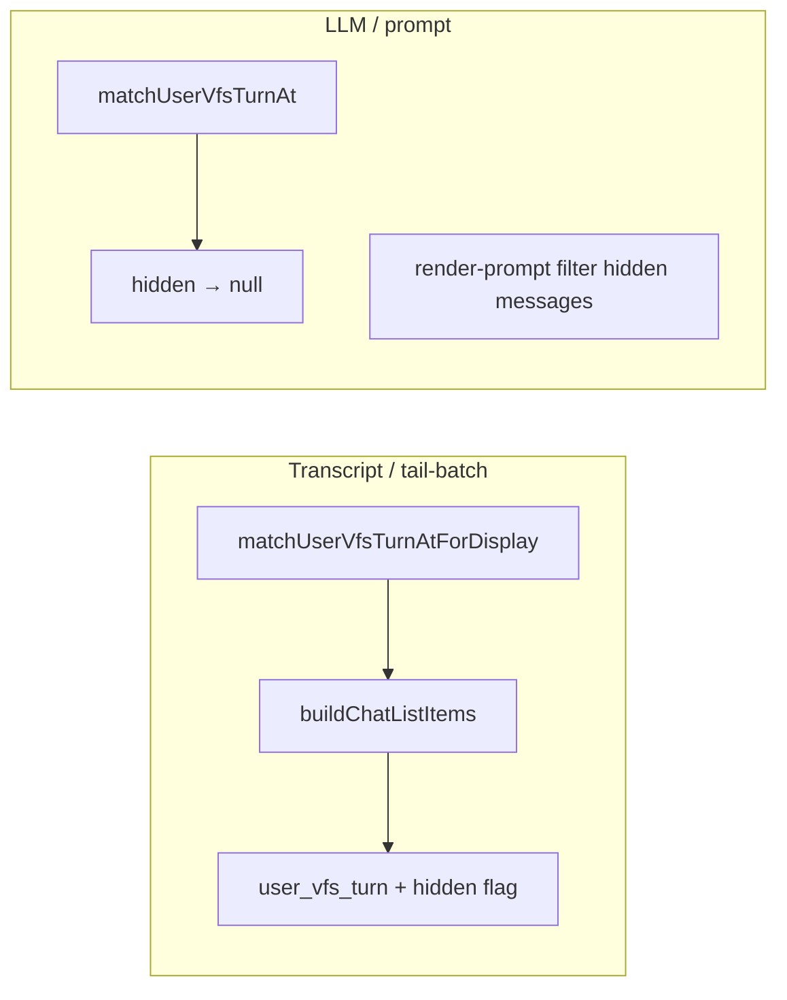

# hide 期间 user ops 卡片退化与真实提示词字数展示 技术规格（SPEC）

## 设计目标

1. **缺陷 A**：transcript 展示路径在 UA 两段 `hidden=true` 时仍能合成 `user_vfs_turn`；LLM / prompt 组装路径保持跳过 hidden。
2. **缺陷 B**：`PromptPreviewSegmentCard` 折叠区字数与预览解耦，避免 `numberOfLines` 挤掉 `N 字`。
3. 改动面小、可单测验证、双端（Mobile + Desktop）行为一致。

## 总体方案

### 缺陷 A — display / LLM 匹配分离



**现状**（`user-vfs-turn-view.ts` L167–168）：

```typescript
if (m0.hidden || m1.hidden) {
  return null;
}
```

`matchUserVfsTurnAt` 同时被 transcript（Mobile/Desktop `message-blocks.ts`）与 tail-batch（`transcript-selectable-role.ts`）使用，导致 hidden 时合成失败。

**方案**：

| 函数 | 用途 | hidden 行为 |
|------|------|-------------|
| `matchUserVfsTurnAt` | LLM 相关、保持现有语义 | 任一段 hidden → `null` |
| `matchUserVfsTurnAtForDisplay` | transcript、tail-batch | **不**因 hidden 拒绝；其余 UA 校验与现函数相同 |

实现方式：将 L170–188 的 UA 结构校验提取为内部函数 `matchUserVfsTurnStructureAt`；两个 export 分别决定是否检查 hidden。

`buildUserVfsTurnView` 调整：

```typescript
hidden: actionMsg.hidden || ackMsg.hidden,
```

（原仅 `actionMsg.hidden`，与「整卡 hidden」语义对齐。）

**调用方替换**（仅 display 路径）：

| 文件 | 变更 |
|------|------|
| `apps/mobile/src/components/chat/message-blocks.ts` | `matchUserVfsTurnAt` → `matchUserVfsTurnAtForDisplay` |
| `apps/desktop/renderer/features/chat/message-blocks.ts` | 同上 |
| `apps/mobile/src/components/chat/transcript-selectable-role.ts` | `chatMessagesToTailBatchRows` 内同上 |
| `apps/desktop/renderer/features/chat/transcript-selectable-role.ts` | 同上 |

**不改动**：

- `packages/core/src/service/prompt/render-prompt.ts`（已 `if (message.hidden) continue`）
- `hideRange` / `showRange` / WebView `renderUserVfsTurnRow`（已支持 `row.hidden` 灰显）
- `matchUserVfsTurnAt` 的现有调用方（若有仅 LLM 用途，保持原函数）

**公开 API**：在 `packages/core/src/public/chat.ts` 导出 `matchUserVfsTurnAtForDisplay`；更新 `public-chat-allowlist.json` 快照（若项目有 export 快照测试）。

### 缺陷 B — 折叠字数 UI

**现状**（`PromptPreviewSegmentCard.tsx` L75–81）：预览与 `· ${charCount} 字` 共用 `numberOfLines={2}`。

**方案**：

```tsx
{!expanded ? (
  <View>
    <Text style={styles.preview} numberOfLines={2}>
      {collapsedHint}
    </Text>
    {charCount > 0 ? (
      <Text style={styles.charCount}>{charCount} 字</Text>
    ) : null}
  </View>
) : null}
```

- `collapsedHint` 逻辑不变；当首行为空时仍可能显示 `` `${charCount} 字` `` 于预览行——保留现状，字数行可 `charCount > 0` 时始终再显一次（轻微重复可接受）或当 `collapsedHint` 已含字数时省略第二行（可选优化，非必须）。
- 新增 `charCount` 样式：与 `preview` 同级字号，不设 `numberOfLines`。
- **不**引入 WebView、不改 `RealPromptScreen` FlatList 配置。

## 最终项目结构

```
packages/core/src/domain/chat/logic/user-vfs-turn-view.ts   # 修改 + 新 export
packages/core/src/public/chat.ts                            # 导出新函数
packages/core/test/chat/user-vfs-turn-view.test.ts          # 新用例
packages/core/test/package-exports/snapshots/...            # 若需更新 allowlist

apps/mobile/src/components/chat/message-blocks.ts           # ForDisplay
apps/mobile/src/components/chat/transcript-selectable-role.ts
apps/desktop/renderer/features/chat/message-blocks.ts
apps/desktop/renderer/features/chat/transcript-selectable-role.ts

apps/mobile/src/components/prompt/PromptPreviewSegmentCard.tsx  # 字数 UI
apps/mobile/test-utils/core-shim.ts                         # 若 shim 需同步 export
```

## 变更点清单

| 路径 | 变更类型 | 说明 |
|------|----------|------|
| `user-vfs-turn-view.ts` | 修改 | 提取结构匹配；新增 `matchUserVfsTurnAtForDisplay`；`buildUserVfsTurnView.hidden` 或运算 |
| `public/chat.ts` | 修改 | export 新函数 |
| `user-vfs-turn-view.test.ts` | 修改 | hidden UA 对：ForDisplay 匹配、At 不匹配 |
| Mobile/Desktop `message-blocks.ts` | 修改 | import + 调用 ForDisplay |
| Mobile/Desktop `transcript-selectable-role.ts` | 修改 | 同上 |
| `PromptPreviewSegmentCard.tsx` | 修改 | 预览/字数拆分 |
| `core-shim.ts` | 可选 | Metro 测试 shim 同步 |

## 详细实现步骤

### Step 1 — Core display 匹配（缺陷 A）

1. 在 `user-vfs-turn-view.ts` 提取 `matchUserVfsTurnStructureAt(messages, startIndex)`，包含 metadata、XML、ack 文本等校验，**不含** hidden 判断。
2. `matchUserVfsTurnAt`：结构匹配通过后，若 `m0.hidden || m1.hidden` 则 `null`。
3. `matchUserVfsTurnAtForDisplay`：仅调用结构匹配。
4. 更新 `buildUserVfsTurnView` 的 `hidden` 字段为 `actionMsg.hidden || ackMsg.hidden`。
5. 导出并更新 public API / 快照。

### Step 2 — Transcript 调用方（缺陷 A）

1. Mobile `message-blocks.ts` L231：`matchUserVfsTurnAtForDisplay`。
2. Desktop `message-blocks.ts` L222：同上。
3. Mobile + Desktop `transcript-selectable-role.ts` `chatMessagesToTailBatchRows`：同上。
4. 确认 WebView `buildTranscriptRows` 无需改（仍消费 `buildChatListItems` 产物）。

### Step 3 — 真实提示词字数 UI（缺陷 B）

1. 修改 `PromptPreviewSegmentCard.tsx` 折叠区布局（见总体方案）。
2. 补充 `charCount` 样式（`marginTop: 2`，颜色 `textSecondary`）。

### Step 4 — 验证

1. 跑 `packages/core` 相关单测。
2. Android 手工：hide 含 user ops 区间 → 工具组仍一条且灰显；恢复后正常。
3. Android 手工：大 worktree 真实提示词 → 折叠见完整 `N 字`。

## 测试策略

### 单元测试（Core）

| 用例 | 断言 |
|------|------|
| `matchUserVfsTurnAtForDisplay` + 两段 `hidden: true` | 返回 UA 二元组 |
| `matchUserVfsTurnAt` + 两段 `hidden: true` | 返回 `null` |
| `buildUserVfsTurnView` + 仅 ack hidden | `view.hidden === true` |
| 结构非法（旧四段、错误 ack 文案） | 两个 match 函数均 `null` |

可选：在 `apps/mobile/__tests__/message-blocks.test.ts` 增加 hidden UA 对仍产出 `user_vfs_turn` 的用例（若已有类似 fixture 可扩展）。

### 手工 / 设备验收

| ID | 步骤 | 期望 |
|----|------|------|
| M1 | 会话有 user ops → hide 到该 seq | 一条「用户操作」卡，灰显 |
| M2 | M1 后 restore | 灰显消失，仍一条工具组 |
| M3 | M1 后查看提示词 | 无 hidden 段 |
| M4 | 大 worktree 提示词折叠 | 完整 `N 字` |
| D1 | Desktop 同 M1 | 与 Mobile 一致 |

### 回归

- `visibility-batch-range` 单测全绿。
- 未 hidden 的 `user_vfs_turn` 工具展开、bridge 文案不变。
- `render-prompt.test.ts` 中 hidden 过滤用例不受影响。

## 风险与回滚方案

| 风险 | 缓解 |
|------|------|
| 双函数 API 调用方漏改 | grep `matchUserVfsTurnAt` 全仓；仅 display 路径替换 |
| `buildUserVfsTurnView.hidden` 行为变化影响菜单（回滚/隐藏入口） | 手工确认 hidden 卡片的 context menu 与现网一致（通常无回滚） |
| 字数双行显示略冗余（空首行 + 字数行） | 可后续微调 `collapsedHint` 逻辑，非阻塞 |

**回滚**：还原 `user-vfs-turn-view.ts` 与四处调用方 + `PromptPreviewSegmentCard.tsx` 即可；无 schema / 数据迁移。
