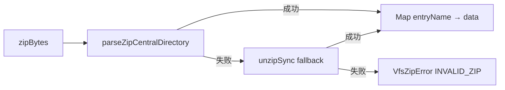

# Mobile VFS ZIP 导出导入往返失败 技术规格（SPEC）

> 需求：[prd.md](./prd.md)  
> 父迭代：[import-export-navigation-fix/spec.md](../../spec.md)

## 设计目标

在最小改动面内修复 Android 导出 ZIP 损坏与导入解析兼容性，不改变 VFS ZIP 域语义与 `DefaultVfsZipIoService` 事务结构。

## 变更点

### 1. Mobile 导出：`copy: true`

**文件**：`apps/mobile/src/services/vfs-zip.service.ts`

```typescript
await saveDocuments({
  sourceUris: [toFileUri(tmpPath)],
  mimeType: 'application/zip',
  fileName,
  copy: true, // 与 agent-yaml / events-yaml 一致
});
```

**原理**：`copy: true` 要求 picker 先将源 URI 复制到用户选定目标后再返回；`finally` 中 `unlink(tmpPath)` 删除的是应用缓存副本，不影响已完成的目标文件复制。

### 2. Mobile 导入前校验：EOCD 扫描

**文件**：`apps/mobile/src/services/vfs-zip.service.ts`

新增 `findZipEocdOffset`：自文件尾向前扫描 `PK\x05\x06`。`assertZipArchive` 在 PK 魔数通过后继续要求 EOCD 存在，错误文案含 `missing EOCD`。

### 3. Core 解析：central dir 主路径 + unzipSync 回退

**文件**：`packages/core/src/domain/vfs/logic/vfs-zip-parse.ts`



- **主路径**：保留 GBK/EFS/CP437 文件名解码收益。
- **回退**：兼容 `react-native-zip-archive` 等边缘 ZIP 结构；回退路径使用 fflate 默认 UTF-8 文件名语义（与旧版 `8efad7b` 前行为一致）。

## 测试

| ID | 层级 | 用例 |
|----|------|------|
| M-zip-copy | mobile | `exportVfsZip` 调用 `saveDocuments` 时 `copy: true` |
| M-zip-eocd | mobile | 截断 ZIP（无 EOCD）导入抛出 `INVALID_ZIP` + `missing EOCD` |
| Z-parse-fallback | core | 损坏 central dir 签名的 ZIP 仍可由 `parseVfsZip` 经 unzipSync 解析 |
| Z-parse-fflate | core | `zipSync` 产物往返解析 |
| Z1–Z9 回归 | core | `vfs-zip-io.test.ts` 全量通过 |

**命令**：

```bash
npm test -w @novel-master/mobile -- vfs-zip
cd packages/core && npx tsx --tsconfig tsconfig.test.json --test test/vfs/vfs-zip-parse.test.ts test/vfs/vfs-zip-io.test.ts
```

## 未改动项（备注）

- `apps/mobile/src/services/db-backup.service.ts` 仍使用 `copy: Platform.OS === 'ios'`；若出现备份文件损坏可单独开 bug 对齐 `copy: true`。
- iOS VFS ZIP 导出仍省略 `buildZip`，走 Core STORE。

## 验收清单

- [x] Android `saveDocuments` 使用 `copy: true`
- [x] `assertZipArchive` 检测 EOCD
- [x] `parseVfsZip` central dir 失败回退 `unzipSync`
- [x] mobile + core 单测更新并通过
- [x] `apm kb index rebuild`
