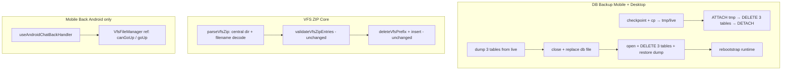

# 导入导出与导航修复 技术规格（SPEC）

> 需求：[prd.md](./prd.md)  
> 前置：`sksp/prd.md`、`mobile-stability-db-migration/spec.md`（DB 备份基线）、`vfs-zip-io-agent-tool-policy/spec.md`（VFS ZIP 语义）、`mobile-chat-conversation-back/spec.md`（Chat Tab 返回优先级）

## 设计目标

在 **最小改动面** 内交付 PRD 五项能力，并保持 Mobile / Desktop / Core / CLI 行为一致（第 3 项仅 Mobile）：

| # | PRD 能力 | 设计要点 |
|---|----------|----------|
| 1 | DB 导出排除服务商表 | 文件拷贝后于 **临时库** 上 `DELETE` 三表，不改 live DB |
| 2 | DB 导入保留本机服务商 | 替换前 `dump` 三表 → 整库替换 → `restore` 至新库 |
| 3 | Mobile 工作区逐级返回 | `VfsFileManager` 暴露 `canGoUp` / `goUp`，`BackHandler` 优先目录上退 |
| 4 | VFS ZIP 导入路径名不乱码 | 自研 central directory 解析 + EFS/GBK/CP437 文件名解码 |
| 5 | VFS ZIP 域内全量覆盖 | 文件名正确后现有 `deleteVfsPrefix` 即满足；补回归用例 |

**不在本 SPEC**：iOS 验收、加密备份、二进制 ZIP、服务商选择性迁移、DB 增量合并、自定义 Pan 手势。

---

## 总体方案



### 1. 数据库备份：排除 / 保留服务商表

#### 现状

- Mobile：`apps/mobile/src/services/db-backup.service.ts` — `checkpoint` → `fs.cp` → 分享；导入 `closeMobileConnection()` → 整文件覆盖 → `onRebootstrap()`。
- Desktop：`apps/desktop/src/main/services/db-backup.service.ts` — 同等语义。
- 三表 DDL：`sksp_secrets`（`bootstrap/sksp/sksp-schema.ts`）、`llm_provider` / `llm_saved_model`（`bootstrap/provider/provider-schema.ts`）。`llm_saved_model` 对 `llm_provider` 有 `ON DELETE CASCADE`；`secret_ref` 无 DB 级 FK。
- 仓库内 **无** 既有 `ATTACH` / 表级备份实现；本迭代在 Core 引入可复用逻辑。

#### 方案

**Core 新增模块** `packages/core/src/infra/db-backup/`：

| 导出符号 | 职责 |
|----------|------|
| `DB_BACKUP_PROVIDER_TABLES` | `['sksp_secrets', 'llm_provider', 'llm_saved_model'] as const` |
| `ProviderTableSnapshot` | 三表 `Row[]` 快照 |
| `dumpProviderTableSnapshot(conn)` | `SELECT *` 三表 |
| `scrubProviderTables(conn)` | 在当前连接 **主库** 上 `DELETE` 三表（FK 顺序：`llm_saved_model` → `llm_provider` → `sksp_secrets`，或依赖 CASCADE） |
| `scrubProviderTablesInDatabase(conn, attachPath, alias)` | `ATTACH` → `scrub` on `alias.*` → `DETACH` |
| `restoreProviderTableSnapshot(conn, snapshot)` | 先 `scrubProviderTables`，再按 `llm_provider` → `llm_saved_model` → `sksp_secrets` 插入；列名与 bootstrap DDL 对齐 |

**导出流程（两端一致）**

1. `checkpoint`（已有）。
2. 复制 live DB → 临时/目标路径 `tmpPath`（已有）。
3. 在 **live** `runtime.conn` 上执行：
   ```sql
   ATTACH DATABASE ? AS export_db
   DELETE FROM export_db.llm_saved_model;
   DELETE FROM export_db.llm_provider;
   DELETE FROM export_db.sksp_secrets;
   DETACH DATABASE export_db
   ```
   绑定参数为 `tmpPath` 绝对路径（Desktop / Mobile 均用 `connection.execute` + `?` 绑定，避免路径注入）。
4. 分享 `tmpPath`（已有 UI 流程）。

> 不在 live DB 上 `DELETE`；`ATTACH` 仅修改副本，满足「导出不含服务商数据」且 live AK 不受影响。

**导入流程（两端一致）**

1. 校验 SQLite magic（已有）。
2. 在 **live** `conn` 上 `dumpProviderTableSnapshot`（导入前快照；可为空）。
3. 备份 live 文件 → `.nmbackup.bak`（已有）。
4. `close*Connection()`。
5. 用备份文件 **整文件覆盖** live 路径（已有）。
6. **恢复服务商（rebootstrap 之前）**：
   - 用与平台一致的 TDBC driver 短连接打开 live DB（**不**跑完整 `bootstrapNovelMaster`，仅读写三表）：
     - Mobile：`open(MOBILE_TDBC_URL, { driver: 'rn' })`
     - Desktop：`open(\`tdbc:sqlite:file:${dbPath}\`, { driver: 'better-sqlite3' })`
   - `restoreProviderTableSnapshot(conn, snapshot)`
   - `conn.close()`
7. `rebootstrap` / `NovelMasterProvider.retry()`（已有）。

> 若本机原本无服务商，`snapshot` 为空 → restore 后仍为空（PRD 验收）。`seedBuiltinProviders` 在 rebootstrap 时 `WHERE NOT EXISTS`，不会与已 restore 行冲突。

**UI 文案**

- Mobile `ProfileTabScreen.tsx`、Desktop `SettingsViews.tsx` 导入确认：将「服务商等」改为明确说明 **「本机服务商与 API Key 将保留，备份中的服务商配置不会导入」**。

---

### 2. Mobile 工作区系统返回

#### 现状

```106:112:apps/mobile/src/hooks/useAndroidChatBackHandler.ts
    if (chatSubview === 'conversation') {
      if (conversationPanel === 'workspace') {
        showChatPanel();
        return true;
      }
```

`VfsFileManager` 内部 `currentPath` + 「上级目录」按钮（`parentLogicalPath`）已正确，但 `ChatTabScreen` 无法感知目录深度。

#### 方案

**桥接模式（仅会话内工作区 `ChatConversationPanel` 中的 `VfsFileManager`）**

1. **`VfsFileManager`** — `forwardRef` + `useImperativeHandle`：
   ```typescript
   export type VfsFileManagerHandle = {
     canGoUp: () => boolean;
     goUp: () => void;
   };
   ```
   - `canGoUp()` ⇔ `currentPath !== root`（`root` = `rootPath ?? vfsScopeRootPath(scope)`）
   - `goUp()` ⇔ 与「上级目录」按钮相同：`parentLogicalPath(currentPath)` → `setCurrentPath(parent)`

2. **`ChatConversationPanel`** — 新增 props：
   ```typescript
   workspaceVfsRef?: React.RefObject<VfsFileManagerHandle | null>;
   onWorkspaceBackStateChange?: (state: {
     canGoUp: boolean;
     goUp: () => void;
   } | null) => void;
   ```
   - `useEffect`：当 `conversationPanel === 'workspace'` 且 ref 就绪时，向父组件上报 `{ canGoUp, goUp }`；切离 workspace 时上报 `null`。
   - 仅 session workspace 的 `VfsFileManager` 挂 ref（`GlobalTemplateScreen` 等 **不在** 本期范围）。

3. **`useAndroidChatBackHandler`** — 扩展：
   ```typescript
   workspaceCanGoUp?: boolean;
   workspaceGoUp?: () => void;
   ```
   workspace 分支逻辑：
   ```typescript
   if (conversationPanel === 'workspace') {
     if (workspaceCanGoUp && workspaceGoUp) {
       workspaceGoUp();
       return true;
     }
     showChatPanel();
     return true;
   }
   ```

4. **`ChatTabScreen`** — `useState` 保存 `workspaceBackState`；传给 `ChatConversationPanel.onWorkspaceBackStateChange`；注册 hook 时传入 `workspaceCanGoUp` / `workspaceGoUp`。

**优先级不变**：overlay（抽屉、菜单、Modal 等）仍先于 workspace 目录逻辑（与 `mobile-chat-conversation-back` 一致）。

---

### 3. VFS ZIP 文件名编码与全量覆盖

#### 根因

| 现象 | 原因 |
|------|------|
| 导入后列表文件名乱码、正文正常 | Windows / 外部工具 ZIP 常将 entry 名存为 **GBK** 且 **未** 置 ZIP UTF-8 标志（GPBF bit 11）。`fflate.unzipSync` 将文件名当 UTF-8 解码 → 乱码逻辑路径。 |
| 旧文件残留 | `deleteVfsPrefix(physicalPrefix)` 只删正确前缀下条目；乱码路径映射到 **另一组** physical path → 旧行保留、新行旁路插入。**非** `deleteVfsPrefix` 实现缺陷。 |

```13:20:packages/core/src/domain/vfs/logic/vfs-zip-parse.ts
export function parseVfsZip(zipBytes: Uint8Array): Map<string, Uint8Array> {
  try {
    const raw = unzipSync(zipBytes);
    const entries = new Map<string, Uint8Array>();
    for (const [name, content] of Object.entries(raw)) {
      entries.set(name, content);
```

#### 方案

**A. 替换 `parseVfsZip` 实现（Core，Mobile / Desktop / CLI 共用）**

新增：

| 文件 | 职责 |
|------|------|
| `domain/vfs/logic/vfs-zip-filename-decode.ts` | `decodeZipEntryName(rawBytes, gpbf): string` |
| `domain/vfs/logic/vfs-zip-central-dir.ts` | 解析 EOCD + Central Directory → `{ entryName, method, flags, compressedSize, localHeaderOffset, data }[]` |
| 修改 `vfs-zip-parse.ts` | 调用 central dir 解析；内容解压仍用 `fflate` 的 `inflateSync`（method=8）或 raw read（method=0 STORE） |

**文件名解码规则**（与 `vfs-zip-io-agent-tool-policy` 路径约定衔接）：

1. GPBF `0x0800`（UTF-8 EFS）置位 → `TextDecoder('utf-8', { fatal: true })`。
2. 否则若 `rawBytes` 含 `>= 0x80` 字节 → `iconv-lite` **GBK**（覆盖 Windows 中文资源管理器 / 7-Zip 默认本地编码场景）。
3. 否则 → `iconv-lite` **CP437**（ZIP 规范默认）。
4. 解码后统一 `replace(/\\/g, '/')`；后续校验仍走 `vfs-zip-validate.ts`（`..`、域规则、UTF-8 正文等不变）。

**依赖**：`packages/core/package.json` 增加 `"iconv-lite": "^0.6.3"`（Node + RN Metro 可打包；无 Node `Buffer` 处用 `Uint8Array` 包装）。

**B. 导出侧 UTF-8 标志（防回归）**

- `buildVfsZip`（`fflate.zipSync`）：现有行为对 Unicode entry 名一般已设 EFS；补单测断言含中文路径的 ZIP 在自研 `parseVfsZip` 往返一致。
- Mobile `nativeBuildVfsZip`（`react-native-zip-archive`）：补测试 — 导出含中文路径 → `parseVfsZip` 还原名正确。若原生库未设 EFS 导致外部工具乱码，**Android 导出**对含非 ASCII entry 名的归档 **回退** Core `buildVfsZip`（与 `vfs-zip.service` 已有 native 失败回退 fflate 的模式一致）。

**C. 全量覆盖**

- **不修改** `deleteVfsPrefix` / `DefaultVfsZipIoService.import` 事务结构。
- 文件名修复后，`deleteVfsPrefix(repoTx, physicalPrefix)` 删除域内全部旧条目，再插入 ZIP 条目，即满足 PRD。
- 补集成测试：域内预置 `/A.md` + 导入仅含 `/B.md` 的 GBK 名 ZIP → 仅余 `/B.md`。

---

## 最终项目结构

```
packages/core/src/
  infra/db-backup/
    provider-tables.ts          # 常量、Snapshot 类型
    provider-table-snapshot.ts  # dump / scrub / restore / attach-scrub
    index.ts
  domain/vfs/logic/
    vfs-zip-parse.ts            # 改：central dir + 新解码
    vfs-zip-central-dir.ts      # 新
    vfs-zip-filename-decode.ts  # 新
  index.ts                      # export db-backup 公共 API

packages/core/test/
  db-backup/provider-table-snapshot.test.ts   # 新
  vfs/vfs-zip-parse.test.ts                   # 新：UTF-8 EFS / GBK / CP437
  vfs/vfs-zip-io.test.ts                      # 扩展 Z8/Z9

apps/mobile/src/
  services/db-backup.service.ts               # 改：export attach-scrub；import dump/restore
  hooks/useAndroidChatBackHandler.ts          # 改：workspaceGoUp
  components/vfs/VfsFileManager.tsx           # 改：forwardRef handle
  screens/tabs/chat-tab/ChatConversationPanel.tsx
  screens/tabs/ChatTabScreen.tsx
  screens/tabs/ProfileTabScreen.tsx           # 改：导入确认文案

apps/desktop/src/main/services/db-backup.service.ts
apps/desktop/renderer/features/settings/SettingsViews.tsx

apps/mobile/__tests__/
  use-android-chat-back-handler.test.ts       # 改 T-B1b + 新增 T-B1c/d
  db-backup.service.test.ts                   # 扩展 mock 新 core 调用
```

---

## 变更点清单

| 文件 | 变更类型 | 说明 |
|------|----------|------|
| `packages/core/src/infra/db-backup/*` | 新增 | 三表 dump/scrub/restore/attach |
| `packages/core/src/index.ts` | 修改 | 导出 db-backup API |
| `packages/core/package.json` | 修改 | +`iconv-lite` |
| `packages/core/src/domain/vfs/logic/vfs-zip-parse.ts` | 修改 | 自研解析替代 `unzipSync` 取 entry 名 |
| `packages/core/src/domain/vfs/logic/vfs-zip-central-dir.ts` | 新增 | ZIP 目录解析 |
| `packages/core/src/domain/vfs/logic/vfs-zip-filename-decode.ts` | 新增 | 文件名解码 |
| `apps/mobile/src/services/db-backup.service.ts` | 修改 | 接入 core；import 短连接 restore |
| `apps/desktop/src/main/services/db-backup.service.ts` | 修改 | 同上 |
| `apps/mobile/src/hooks/useAndroidChatBackHandler.ts` | 修改 | workspace 目录优先 |
| `apps/mobile/src/components/vfs/VfsFileManager.tsx` | 修改 | `VfsFileManagerHandle` |
| `apps/mobile/src/screens/tabs/chat-tab/ChatConversationPanel.tsx` | 修改 | ref + back state 上报 |
| `apps/mobile/src/screens/tabs/ChatTabScreen.tsx` | 修改 | 连接 hook 与 panel |
| `apps/mobile/src/screens/tabs/ProfileTabScreen.tsx` | 修改 | 导入说明文案 |
| `apps/desktop/renderer/features/settings/SettingsViews.tsx` | 修改 | 导入说明文案 |
| `apps/mobile/src/services/vfs-zip.service.ts` | 可能修改 | 中文路径时跳过 native zip（若测试失败） |

**不改**：`vfs-zip-validate.ts` 路径映射、`vfs-tree-copy.ts` `deleteVfsPrefix`、CLI `import-zip` 命令（自动受益于 core `parseVfsZip`）。

---

## 详细实现步骤

### Phase 1 — Core DB Backup（可独立 PR / 先合并）

1. 实现 `provider-table-snapshot.ts`：
   - `dumpProviderTableSnapshot`：`conn.query('SELECT * FROM sksp_secrets')` 等。
   - `scrubProviderTables` / `scrubProviderTablesInDatabase`（ATTACH 版本）。
   - `restoreProviderTableSnapshot`：动态 `INSERT` 使用查询到的列顺序；单事务。
2. 单测 `provider-table-snapshot.test.ts`：内存 DB seed provider + secret → scrub 后行数为 0；dump → 替换库 → restore 后数据一致。
3. `index.ts` 导出 API。

### Phase 2 — Mobile / Desktop DB Backup 接入

1. **Export**：`cp` 后调用 `scrubProviderTablesInDatabase(runtime.conn, tmpPath, 'export_db')`。
2. **Import**：
   - 新增 `openDbForProviderRestore()` 平台辅助（mobile/desktop 各一，薄封装 TDBC `open`）。
   - `dump` → `close` → `replace` → `openDbForProviderRestore` → `restore` → `close` → `rebootstrap`。
   - 保持 `.nmbackup.bak` 失败回滚（restore 失败时恢复 bak 文件）。
3. 更新导入 Alert / 设置页文案。
4. 扩展 `apps/mobile/__tests__/db-backup.service.test.ts` mock core 函数调用顺序。

### Phase 3 — VFS ZIP 文件名解码

1. 实现 `vfs-zip-filename-decode.ts` + `vfs-zip-central-dir.ts`（仅支持 STORE/DEFLATE、无加密、无 ZIP64；与现有 `VFS_ZIP_MAX_*` 限制一致）。
2. 改写 `parseVfsZip`；`validateVfsZipEntries` / `DefaultVfsZipIoService` 无签名变更。
3. `vfs-zip-parse.test.ts`：
   - 用 `buildVfsZip` 生成 UTF-8 EFS ZIP（往返）。
   - **手工构造** GBK entry 名 fixture（`iconv-lite.encode('笔记/第一章.md', 'gbk')` 写入 central dir）→ parse 得 `笔记/第一章.md`。
   - CP437 纯 ASCII 回归。
4. `vfs-zip-io.test.ts` 新增 **Z8**（GBK 外部 ZIP 导入路径正确）、**Z9**（预置 `/old.md` + GBK ZIP 仅 `new.md` → 无残留）。
5. 评估 `nativeBuildVfsZip` + 中文路径；必要时 `exportVfsZip` 对 `hasNonAsciiEntryName(files)` 禁用 `buildZip` 回退 fflate。

### Phase 4 — Mobile 工作区返回

1. `VfsFileManager`：`forwardRef` + handle。
2. `ChatConversationPanel`：`workspaceVfsRef` + `onWorkspaceBackStateChange`（`currentPath` 变化时 re-emit `canGoUp`）。
3. `useAndroidChatBackHandler` + `ChatTabScreen` 接线。
4. 更新 `use-android-chat-back-handler.test.ts`：
   - **T-B1c**：`workspaceCanGoUp: true` → 调 `workspaceGoUp`，不调 `showChatPanel`。
   - **T-B1d**：`workspaceCanGoUp: false` → `showChatPanel`。
   - 修订原 **T-B1b** 为 T-B1d 语义。

### Phase 5 — 集成验收

1. `npm run build`（根目录）。
2. `npm run test -w @novel-master/core`（含新 vfs / db-backup 测试）。
3. `npm test -w @novel-master/mobile`（back handler + db-backup）。
4. Android 手工：工作区子目录侧滑、DB 导入后 AK 仍可用、Windows GBK ZIP 导入。

---

## 测试策略

### 自动化

| ID | 层级 | 用例 |
|----|------|------|
| DB-1 | core | seed 三表 → `scrubProviderTables` → 行数 0 |
| DB-2 | core | dump → 新库 scrub → restore → 行级相等 |
| DB-3 | core | ATTACH 临时文件 scrub → DETACH 后附件库无 provider 行 |
| DB-4 | mobile | export 调用 scrub；import 顺序 dump→replace→restore |
| Z8 | core | GBK 文件名 ZIP fixture → import → `list` 含正确中文路径 |
| Z9 | core | 域内 `/old.md` + GBK ZIP 仅 `new.md` → 无 `old.md` |
| Z-rt | core | `buildVfsZip` 中文路径 export → `parseVfsZip` → 名不变 |
| T-B1c/d | mobile | workspace back 目录 / 根目录分支 |
| CLI | cli | 可选：`import-zip` 用 GBK fixture 跑 e2e（若已有 vfs e2e  harness） |

### 手工（Android + Desktop）

1. 配置服务商 AK → 导出 DB → 外部 SQLite 查看三表无业务行 → 导入后 AK 仍可调用模型。
2. 会话工作区进入 `/a/b` → 侧滑 → `/a` → 再侧滑 → 聊天 Tab。
3. Windows 资源管理器压缩含 `笔记/第一章.md` 的 UTF-8 文本 ZIP → 导入 session 域 → 列表中文正确、旧文件消失。

---

## 风险与回滚方案

| 风险 | 缓解 | 回滚 |
|------|------|------|
| ATTACH 路径在 RN/SQLite 版本上失败 | 真机验证；失败则回退为「短连接 open 临时文件 + scrub」 | 移除 attach-scrub，仅保留 dump/restore |
| `restoreProviderTableSnapshot` 列与未来 migration 不一致 | INSERT 用 `SELECT` 得到的列名；单测覆盖 migration 后 DDL | 回滚 core db-backup 模块；import 恢复整文件替换 |
| 自研 ZIP 解析与安全边界 | 仅支持现有 ZIP 子集；畸形包仍抛 `INVALID_ZIP`；不扩大 ZIP64/加密范围 | 恢复 `fflate.unzipSync`（牺牲 GBK 外部 ZIP） |
| GBK 误判（非中文 CP437 扩展） | PRD 验收侧重中文 Windows ZIP；启发式：仅当 `>=0x80` 走 GBK | 收紧为「先 CP437，校验失败再 GBK」 |
| `iconv-lite` 增大 RN bundle | 仅 core 文件名解码引用；体积可接受 | 内联 CP437 表 + 仅 GBK 用 iconv |
| import restore 与 rebootstrap 之间崩溃 | restore 在单事务；失败则不 `rebootstrap` 并恢复 `.bak` | 用户重试导入或还原 bak |
| VfsFileManager ref 未就绪 | `workspaceCanGoUp` 默认 `false` → 行为等同现网（直接回聊天） | 移除 ref，恢复旧 handler |

**功能回滚**：各 Phase 可独立 revert；DB 与 ZIP 无 schema migration，回滚不涉及数据库升级。

---

## 兼容性与迁移说明

- **`.nmbackup` 格式不变**：仍为 SQLite 文件；旧备份（含服务商表）可导入，但 import 会 **丢弃备份内** provider 行并 **保留本机** provider（新行为）。
- **新备份**（本迭代后导出）不含 provider 数据；导入到无配置设备后需用户自行添加服务商（PRD 已确认）。
- **VFS ZIP 格式不变**：entry 路径约定不变；仅解析层增强；本 App `fflate` 导出 ZIP 仍兼容。
- **无 KKV / migration 变更**。
