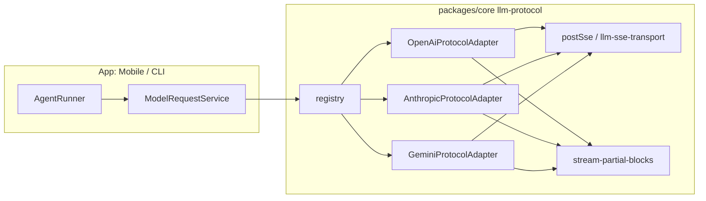

# LLM 协议能力对齐（Anthropic / Gemini → OpenAI 同级）技术规格（SPEC）

> **PRD**：`.apm/kb/docs/Iterations/llm-protocol-anthropic-gemini-parity/prd.md`  
> **代码基线**（2026-06）：`openai` 已走 `postSse` + `openai-sse-parser` + `openAiStreamAccumulatorsToPartialBlocks` + `isRequestAborted`；`anthropic` 流式为 `fetch` + `ReadableStream` + 内联 `parseSseStream`，无 abort partial；`gemini` 仅 `generateContent` 非流式且 `chatMessagesToTextOnly` 压平历史。Mobile/CLI 经 `ModelRequestService` → adapter，终止 UX 在 `ChatComposer` + `flushRunUi`，**本期无需改 Mobile 业务逻辑**（除非验收发现协议分支）。

## 设计目标

1. **Adapter 契约统一**：`LlmChatRequest.signal` abort 时，三种协议均 **resolve** `LlmChatResult`（含 partial `blocks`），而非仅抛错；`AgentRunner` 现有「有 blocks 则 append assistant 再 `cancelled`」逻辑无需按协议分叉。
2. **传输层统一**：Anthropic / Gemini 流式 HTTP **全部**经 `postSse`（Node `fetch` stream / RN `XMLHttpRequest`），消除 `Empty streaming response body`。
3. **终止 partial 语义统一**：与 `openAiStreamAccumulatorsToPartialBlocks` 一致——有 thinking 无正文时：`thinking` + **空 `text`**；无任何增量时：`blocks: []`。
4. **Gemini 能力补齐**：实现 `streamGenerateContent`（SSE）+ **结构化** `contents` / `tools`（替代 `chatMessagesToTextOnly`），支撑 Agent 多轮 `tool_use` / `tool_result`。
5. **OpenAI 零行为回退**：OpenAI 路径仅允许抽取共享 helper（可选），不改变现有单测期望。

## 总体方案

### 架构（数据流）



### 分协议策略

| 协议 | 传输 | 解析模块 | abort partial | 工具 / 多轮历史 |
|------|------|----------|---------------|-----------------|
| **openai** | 已有 `postSse` + `openai-sse-parser` | 保持 | 已有；可改为调用共享 `buildStreamPartialBlocks` | 已有 |
| **anthropic** | `chatStream` 改为 `postSse` | 新增 `anthropic-sse-parser`（从 adapter 抽出） | `finish` / `partial` 双出口 + `isRequestAborted` | 已有 mapper；保持 |
| **gemini** | 新增 `chatStream` → `postSse` | 新增 `gemini-sse-parser` + `gemini-content-mapper` | 同上 | 新增 mapper（Gemini `functionDeclarations` + `functionCall` parts） |

### Agent / Mobile 层

- **`DefaultAgentRunner`**（`packages/core/src/service/agent/impl/agent-runner.ts`）：`request` 成功返回后、检查 `signal.aborted` 前已 `append` assistant（L215–224）；**不修改**，仅依赖 adapter 在 abort 时仍返回 `blocks`。
- **`catch` 路径**（L202–210）：仅在 adapter **抛错** 时触发；Anthropic/Gemini 对齐后 abort 应走 try 内 partial 返回，避免进入 catch 导致 **不落库**。
- **Mobile**（`ChatComposer.tsx`、`flush-run-ui.ts`、`ChatTabScreen` stream buffer）：已满足 PRD「终止不先清 overlay、FINISHED 后 reload 再 reset」；**本期不改动**，作为 E2E 验收面。

### 共享 partial 规则（新建）

新增 `logic/stream-partial-blocks.ts`，集中实现 PRD B2 规则（与现 `openAiStreamAccumulatorsToPartialBlocks` 行为一致）：

```ts
// 语义摘要（实现时以代码为准）
// - thinking.trim() !== '' → push thinking
// - text.length > 0 || thinking.trim() !== '' → push text（可为 ""）
// - 可选 tool_use 列表：与 OpenAI 相同 emit tool-use 事件
// - 全无内容 → []
```

**注意**：OpenAI 正常结束用的 `blocksFromReplyStrings` 含 **GLM 将 reasoning 提为正文** 的逻辑（`openai-content-mapper.ts` L27–32），**仅用于非 abort 完成路径**；partial 路径 **不** 做该提升，以免终止后 thinking 消失。

可选重构：`openAiStreamAccumulatorsToPartialBlocks` 改为薄包装调用 `buildStreamPartialBlocks`，单测保持不变。

---

## 最终项目结构

```
packages/core/src/infra/llm-protocol/
├── impl/
│   ├── openai.adapter.ts          # 小改（可选委托 partial helper）
│   ├── anthropic.adapter.ts       # chatStream → postSse + abort partial
│   └── gemini.adapter.ts          # 流式 + tools + 结构化 history
├── logic/
│   ├── llm-sse-transport.ts       # 不变（三协议共用）
│   ├── request-abort.ts           # 不变
│   ├── openai-sse-parser.ts       # 不变
│   ├── openai-content-mapper.ts   # 可选：partial 委托共享 helper
│   ├── anthropic-content-mapper.ts # 不变（已支持 tools/thinking）
│   ├── anthropic-sse-parser.ts    # 新增：从 adapter 抽出 SSE 状态机
│   ├── gemini-content-mapper.ts   # 新增：contents ↔ blocks，tools 声明
│   ├── gemini-sse-parser.ts       # 新增：Gemini SSE JSON 增量解析
│   └── stream-partial-blocks.ts   # 新增：abort partial 统一构建
└── ports/
    └── adapter.port.ts            # 不变（契约已含 signal / onStream）

packages/core/test/
├── infra/llm-protocol/
│   ├── llm-sse-transport.test.ts           # 已有；可加 anthropic 风格 header 用例
│   ├── stream-partial-blocks.test.ts       # 新增
│   ├── anthropic-partial-stream.test.ts    # 新增
│   ├── anthropic-sse-parser.test.ts        # 新增
│   ├── gemini-sse-parser.test.ts           # 新增
│   └── gemini-partial-stream.test.ts       # 新增
└── provider/
    ├── protocol-anthropic.test.ts            # 扩展：stream + abort
    ├── protocol-gemini.test.ts               # 扩展：stream + tools
    └── model-request-tools-stream.test.ts    # 扩展 Gemini C1/C2

.apm/kb/docs/Iterations/llm-protocol-anthropic-gemini-parity/
├── prd.md
└── spec.md   # 本文件
```

**不包含**：`apps/mobile` 源码变更（默认）；`packages/core/ARCHITECTURE.md` 可在收尾时补一句能力矩阵（可选）。

---

## 变更点清单

| 文件 | 变更类型 | 说明 |
|------|----------|------|
| `logic/stream-partial-blocks.ts` | 新增 | abort partial blocks 唯一真相 |
| `logic/anthropic-sse-parser.ts` | 新增 | `createAnthropicSseParserState` / `feedAnthropicSseChunk` / `finishAnthropicSse` / `finishAnthropicSsePartial` |
| `impl/anthropic.adapter.ts` | 修改 | `chatStream` 使用 `postSse`；`try/catch` + `isRequestAborted`；删除内联 `parseSseStream(body)` |
| `logic/gemini-content-mapper.ts` | 新增 | `chatMessagesToGeminiContents`、`geminiTools`、`geminiPartsToBlocks` |
| `logic/gemini-sse-parser.ts` | 新增 | 解析 `streamGenerateContent` SSE 行（`data: {…}` JSON） |
| `impl/gemini.adapter.ts` | 重写/扩展 | 去掉 stream/tools `UNSUPPORTED`；非流式走 mapper；流式 `postSse` + partial |
| `logic/openai-content-mapper.ts` | 可选小改 | partial 委托共享 helper |
| `test/**` | 新增/扩展 | 见测试策略 |

---

## 详细实现步骤

### 阶段 1：共享 partial + Anthropic 对齐（优先，可独立合入）

1. **新增 `stream-partial-blocks.ts`**
   - 导出 `buildStreamPartialBlocks(input, onStream?)`。
   - 从 `openAiStreamAccumulatorsToPartialBlocks` 迁移逻辑并补单测（复制 `openai-partial-stream.test.ts` 用例到 `stream-partial-blocks.test.ts`）。
   - （可选）OpenAI partial 改为调用该函数。

2. **抽出 `anthropic-sse-parser.ts`**
   - 将 `anthropic.adapter.ts` L166–273 状态机迁入：累积 `textParts` / `thinkingParts` / `toolUses`。
   - `feedAnthropicSseChunk(state, lineChunk, onStream)`：按行处理 `data: ` JSON（与现逻辑相同）。
   - `finishAnthropicSse`：现 L244–272 行为（正常结束，**不** 使用 GLM 提 thinking）。
   - `finishAnthropicSsePartial`：调用 `buildStreamPartialBlocks`。

3. **改造 `AnthropicProtocolAdapter.chatStream`**
   - URL / headers / body 不变（`POST /v1/messages`，`stream: true`）。
   - 调用：
     ```ts
     const state = createAnthropicSseParserState();
     try {
       await postSse(url, { method, headers, body, signal }, (chunk) => {
         feedAnthropicSseChunk(state, chunk, req.onStream);
       }, undefined, { fetchFn: this.fetchFn, signal: req.signal });
     } catch (e) {
       if (!isRequestAborted(e, req.signal)) throw e;
     }
     const aborted = req.signal?.aborted === true;
     const { blocks, streamRaw } = aborted
       ? finishAnthropicSsePartial(state, req.onStream)
       : finishAnthropicSse(state, req.onStream);
     ```
   - 保留 `onStream({ type: "done", result })`。
   - **删除** 对 `response.body` 的硬依赖。

4. **单测**
   - `anthropic-partial-stream.test.ts`：仅 thinking → 2 blocks（thinking + 空 text）。
   - `protocol-anthropic.test.ts` 或新文件：mock `postSse` 路径下 abort（`AbortController` + 短 SSE）。
   - 回归：`model-request-tools-stream.test.ts` Anthropic stream 用例。

5. **验收**：PRD A2/B1/B2（Anthropic 模型）+ F1 OpenAI 回归。

### 阶段 2：Gemini 结构化请求 + 非流式 tools

1. **新增 `gemini-content-mapper.ts`**
   - **出站**：`chatMessagesToGeminiContents(messages)` → Gemini `contents[]`（`role: user|model`，`parts` 含 `text` / `functionCall` / `functionResponse`）。
   - **入站**：`geminiPartsToBlocks(parts)` → `ContentBlock[]`（`text`；`functionCall` → `tool_use`；不支持块抛 `UNSUPPORTED_CONTENT` 与 Anthropic 一致）。
   - **tools**：`toolsToGeminiFunctionDeclarations(tools)` → `{ functionDeclarations: [...] }`。
   - **system**：Gemini 使用 `systemInstruction` 字段（`buildGeminiRequestBody` 内处理），与 `req.system` 对齐。
   - **thinking**：若 API 返回 `thought` / thinking 类 part（视模型），映射为 `thinking` block 并触发 `thinking-delta`；若无则仅 `text-delta`（在 SPEC 验收中记录模型差异）。

2. **改造 `GeminiProtocolAdapter.chat`（非流式）**
   - 移除 tools/stream 的 `UNSUPPORTED`（stream 在阶段 3）。
   - `generateContent` body 使用 mapper；`signal` 保留。
   - 单测：`protocol-gemini.test.ts` 增加带 `tools` 的 body 断言；`gemini-content-mapper.test.ts` round-trip tool_use。

3. **验收**：PRD C1/C2 非流式或流式关闭时 Gemini tools（阶段 2 可先 CLI mock）。

### 阶段 3：Gemini 流式 + abort partial

1. **端点**：`POST /v1beta/models/{model}:streamGenerateContent?alt=sse&key=...`（与现 `generateContent` baseUrl 一致，路径替换；`alt=sse` 返回 SSE 行）。

2. **新增 `gemini-sse-parser.ts`**
   - 解析 SSE `data: ` 后 JSON（Google 常为单行一个 `GenerateContentResponse`）。
   - 累积 `text` part；识别 `functionCall` part 增量（若流式分片需按 name/args 累积，参考 OpenAI tool_calls index 模式）。
   - `finishGeminiSse` / `finishGeminiSsePartial`（partial 调 `buildStreamPartialBlocks`）。

3. **`chatStream`**
   - 与 Anthropic 相同 `postSse` + `isRequestAborted` 模式。
   - `stream: true` 时 `chat` 路由到 `chatStream`。

4. **单测**
   - `gemini-sse-parser.test.ts`：mock 2–3 行 SSE 增量 + abort mid-stream。
   - `model-request-tools-stream.test.ts`：Gemini stream 用例（替换原 UNSUPPORTED 期望）。
   - `protocol-gemini.test.ts`：stream URL 含 `streamGenerateContent` 与 `alt=sse`。

5. **验收**：PRD D1/D2 + A 全套（Gemini 模型）。

### 阶段 4：文档与双端验收

1. 更新 `packages/core/ARCHITECTURE.md` 中 llm-protocol 能力表（三协议均：stream / abort partial / RN SSE / tools）。
2. Mobile + CLI 按 PRD A–F 手工验收清单执行（记录所用模型 id）。
3. 确认 `npm test -w @novel-master/core` 全绿。

---

## 兼容性与迁移说明

| 项 | 说明 |
|----|------|
| **Provider 配置** | 无需 DB 迁移；`protocol` 仍为 `openai` \| `anthropic` \| `gemini`。 |
| **Gemini 历史格式** | 由「单字符串 role: 前缀」改为标准 `contents`；仅影响 **新请求** 出线格式，持久化 NM `ContentBlock[]` 不变。 |
| **OpenAI 兼容中转** | 不改 wire；回归 F1。 |
| **采样参数** | 继续走 `req.sampling` 分支（`anthropic` / `gemini` 已有 schema）。 |
| **多模态** | PRD 排除；Gemini/Anthropic mapper 对 `image` 仍可按现 Anthropic 行为映射或 `UNSUPPORTED_CONTENT`。 |

---

## 测试策略

### 单元 / 集成（Core，`npm test -w @novel-master/core`）

| 用例 ID | 描述 | 文件 |
|---------|------|------|
| T1 | partial：仅 thinking → thinking + 空 text | `stream-partial-blocks.test.ts` |
| T2 | partial：空累积 → `[]` | 同上 |
| T3 | Anthropic SSE 增量 text/thinking/tool | `anthropic-sse-parser.test.ts` |
| T4 | Anthropic abort partial（mock postSse + signal） | `anthropic-partial-stream.test.ts` |
| T5 | Gemini mapper：history 含 tool_result 多轮 | `gemini-content-mapper.test.ts` |
| T6 | Gemini SSE 解析 + done | `gemini-sse-parser.test.ts` |
| T7 | Gemini abort partial | `gemini-partial-stream.test.ts` |
| T8 | Gemini tools 请求体含 functionDeclarations | `protocol-gemini.test.ts` |
| T9 | OpenAI partial 回归 | `openai-partial-stream.test.ts` |
| T10 | ModelRequest Anthropic/Gemini stream 不 UNSUPPORTED | `model-request-tools-stream.test.ts` |
| T11 | RN SSE：XHR 分支（已有） | `llm-sse-transport.test.ts` |

### Agent 层（可选加强）

| 用例 | 描述 |
|------|------|
| T12 | Mock `ModelRequestService` 在 `signal.aborted` 时返回 partial blocks → runner `stopReason=cancelled` 且 session 多一条 assistant |

（现有 `agent-runner.test.ts` 仅测 abort **before** request；可加一例 abort **during** stream 的 mock。）

### 手工验收（PRD 映射）

| PRD | 执行 |
|-----|------|
| A1–A3 | Mobile 流式首字、增量、结束落库（三协议各 1 模型） |
| B1–B3 | Mobile 终止保留 / 仅 thinking / 重进会话 |
| C1–C2 | vfs 工具多轮（Anthropic + Gemini） |
| D1–D2 | Gemini 流式 + 终止 |
| E1 | 同会话 CLI `nm agent` 与 Mobile 消息 blocks 语义一致 |
| F1 | 智谱 openai 回归 A+B |

---

## 风险与回滚方案

| 风险 | 影响 | 缓解 |
|------|------|------|
| Gemini SSE wire 与 `v1beta` 文档漂移 | 流式解析失败 | 单测固定样例；失败日志保留首包 `content-type` / body snippet |
| Gemini 某模型无 function calling | C2 失败 | 验收文档写明推荐模型（如 `gemini-2.0-flash`）；不支持时 `ProviderError` 明确信息 |
| Gemini thinking part 因模型而异 | B2 仅部分模型 | 验收区分「支持 thinking 的模型」；无 thinking 时仍满足 B1 |
| Anthropic 抽出 parser 回归 | 流式/tool 行为变化 | 保留原 SSE 样例 JSON 作 golden；先阶段 1 合入 |
| `postSse` XHR abort 抛 `HTTP_ERROR` abort | 已覆盖 | `isRequestAborted` 已识别 ProviderError message |

**回滚**：

1. **阶段 1**：revert `anthropic-sse-parser` + adapter 改动，OpenAI 不受影响。
2. **阶段 2–3**：revert `gemini-*` 文件；`gemini.adapter.ts` 可恢复 `UNSUPPORTED` 门闸（流式关闭时产品可对话）。
3. 无需 feature flag；按阶段小 PR 降低回滚面。

---

## 实现顺序建议（供评审）

```text
PR-1  stream-partial-blocks + anthropic postSse/abort + tests
PR-2  gemini-content-mapper + non-stream tools + tests
PR-3  gemini streamGenerateContent + abort + tests
PR-4  docs + manual A–F checklist
```

---

**请确认本 SPEC 后再进入编码。** 若需调整（例如 Gemini 首期不做 tools、分两个迭代），请注明后更新 PRD/SPEC。
