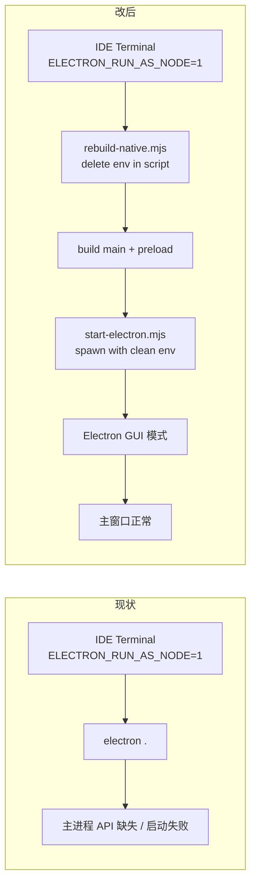

# macOS 桌面版启动修复 技术规格（SPEC）

## 设计目标

- 在 `ELECTRON_RUN_AS_NODE=1` 被 IDE 终端注入时，桌面版 `dev:electron` / `start` 仍能正常以 GUI 模式启动。
- macOS 窗口使用 `hiddenInset` + 交通灯定位；渲染层启用自定义标题栏拖拽区与 leading 避让。
- **Windows 行为零回归**：`titleBarOverlay`、主题同步、`syncTitleBarOverlay` 路径不变。
- 本迭代验收在 Windows 完成；macOS 仅代码审查 + 留待实机。

---

## 现状与约束（代码探索）

| 模块 | 现状 | 本迭代影响 |
|------|------|------------|
| `package.json` | `dev:electron` / `start` 直接调用 `electron .` | 改走 `start-electron.mjs` |
| `rebuild-native.mjs` | 直接 `execSync @electron/rebuild`；无 env 清理 | 脚本入口删除 `ELECTRON_RUN_AS_NODE` |
| `main.ts` | 仅 `win32` 设置 `titleBarStyle: hidden` + `titleBarOverlay`；其他平台无 titleBar 配置 | 按平台三分支 |
| `shell-menu.ts` | `configureWindowChrome` 对 win32/linux 隐藏菜单栏；`syncTitleBarOverlay` **仅 win32** | **不改**（macOS 不走 overlay 同步） |
| `preload.ts` | `customTitleBar: process.platform === "win32"` | 扩展为 win32 \|\| darwin |
| `AppChrome.tsx` | 设置 `data-custom-titlebar`；icon 引用 `../../../../icon.webp`（repo 根，**未入库**） | 改 `assets/icon.webp`；增加 `data-platform` |
| `shell.css` | win32 依赖 `env(titlebar-area-*)` + `.app-chrome--custom-titlebar` | 新增 `html[data-platform=darwin]` leading padding |
| `vite.config.ts` | `root: renderer/`；`server` 无 `fs.allow` | 允许访问 monorepo 根（`apps/desktop/../..`） |
| `generate-icons.mjs` | 读 `repoRoot/icon.webp` | **本迭代不改**（与 PRD「除 icon 路径外」一致；`assets/icon.webp` 已入库） |
| `dist` 脚本 | `electron-builder` 打包，不经 `electron .` | 不受影响 |

**根因机制**

当 `ELECTRON_RUN_AS_NODE=1` 时，Electron 可执行文件行为等同 Node：`require('electron')` 返回路径字符串而非 API 对象。主进程 `import { app } from 'electron'` 在运行时失败，窗口无法创建。该变量由**父 shell 继承**到 `electron .` 子进程，必须在 spawn 前从子进程 env 中移除。

**兼容性原则**

- 启动器只修改**子进程** env，不 `delete` 当前 Node 进程的 `process.env`（避免影响同 shell 内并行脚本）。
- `rebuild-native.mjs` 在脚本进程内 `delete process.env.ELECTRON_RUN_AS_NODE` 是安全的（rebuild 本就需要 Node 模式）。
- Linux 保持默认 `BrowserWindow` 配置（无 overlay、无 hiddenInset）；`customTitleBar` 仍为 false。

---

## 总体方案

### 启动链路



### 平台窗口策略

| 平台 | BrowserWindow | preload `customTitleBar` | 渲染层 |
|------|---------------|--------------------------|--------|
| `win32` | `hidden` + `titleBarOverlay`（现状） | `true` | `data-custom-titlebar` + overlay CSS |
| `darwin` | `hiddenInset` + `trafficLightPosition: {x:12,y:12}` | `true` | `data-platform=darwin` + leading `padding-left: 70px` |
| 其他 | 默认（无 titleBarStyle） | `false` | 无 custom titlebar class |

### `start-electron.mjs` 职责

1. 解析 `apps/desktop` 为 cwd。
2. 通过 `createRequire` 解析 `electron` 可执行路径（与直接 `npx electron` 一致）。
3. 复制 `process.env`，`delete env.ELECTRON_RUN_AS_NODE`，`spawn(electronPath, ['.'], { cwd, env, stdio: 'inherit' })`。
4. 子进程 exit code 透传给父进程（`process.exit(code ?? 0)`）。

---

## 最终项目结构

```
apps/desktop/
├── scripts/
│   ├── rebuild-native.mjs      # 修改：入口清 env
│   └── start-electron.mjs      # 新建：跨平台启动器
├── package.json                # 修改：dev:electron / start
├── vite.config.ts              # 修改：server.fs.allow
├── src/
│   ├── main/main.ts            # 修改：平台化 BrowserWindow
│   └── preload/preload.ts      # 修改：darwin customTitleBar
└── renderer/
    ├── layout/AppChrome.tsx    # 修改：platform dataset + icon 路径
    └── styles/shell.css        # 修改：darwin 交通灯避让

assets/
└── icon.webp                   # 已存在（git tracked）；AppChrome 引用此路径
```

无新增 npm 依赖；无 Core / IPC 契约变更。

---

## 变更点清单

| # | 文件 | 操作 | 要点 |
|---|------|------|------|
| 1 | `apps/desktop/scripts/start-electron.mjs` | **新建** | spawn electron，子进程 env 剔除 `ELECTRON_RUN_AS_NODE` |
| 2 | `apps/desktop/scripts/rebuild-native.mjs` | 修改 | 第 6 行后 `delete process.env.ELECTRON_RUN_AS_NODE` |
| 3 | `apps/desktop/package.json` | 修改 | `dev:electron` / `start` 末尾改为 `node scripts/start-electron.mjs` |
| 4 | `apps/desktop/src/main/main.ts` | 修改 | 平台三分支 BrowserWindow options |
| 5 | `apps/desktop/src/preload/preload.ts` | 修改 | `customTitleBar: win32 \|\| darwin` |
| 6 | `apps/desktop/renderer/styles/shell.css` | 修改 | `html[data-platform="darwin"] .app-chrome__leading { padding-left: 70px; }` |
| 7 | `apps/desktop/renderer/layout/AppChrome.tsx` | 修改 | icon → `assets/icon.webp`；`dataset.platform` |
| 8 | `apps/desktop/vite.config.ts` | 修改 | `server.fs.allow: [path.join(__dirname, '../..')]` |

**明确不改**

- `shell-menu.ts`（`syncTitleBarOverlay` 仍仅 win32）
- `generate-icons.mjs`（仍读根目录 `icon.webp`；与 renderer 引用分离）
- `electron-builder.yml` / `dist` 流程
- `dev` 脚本（已通过 `dev:electron` 间接受益）

---

## 详细实现步骤

### Step 1 — `start-electron.mjs`（新建）

```javascript
// apps/desktop/scripts/start-electron.mjs
import { spawn } from "node:child_process";
import { createRequire } from "node:module";
import path from "node:path";
import { fileURLToPath } from "node:url";

const __dirname = path.dirname(fileURLToPath(import.meta.url));
const desktopRoot = path.join(__dirname, "..");
const require = createRequire(import.meta.url);
const electronPath = require("electron");

const env = { ...process.env };
delete env.ELECTRON_RUN_AS_NODE;

const child = spawn(electronPath, ["."], {
  cwd: desktopRoot,
  env,
  stdio: "inherit",
});

child.on("exit", (code, signal) => {
  if (signal) process.exit(1);
  process.exit(code ?? 0);
});
```

验证：在 PowerShell 执行 `$env:ELECTRON_RUN_AS_NODE=1; npm run start -w @novel-master/desktop`（需先 build）。

### Step 2 — `rebuild-native.mjs`

在 `const __dirname = ...` 与 `const desktopRoot = ...` 之后、`readFileSync` 之前插入：

```javascript
delete process.env.ELECTRON_RUN_AS_NODE;
```

### Step 3 — `package.json` scripts

```diff
- "dev:electron": "... && electron .",
+ "dev:electron": "... && node scripts/start-electron.mjs",
- "start": "electron .",
+ "start": "node scripts/start-electron.mjs",
```

### Step 4 — `main.ts` BrowserWindow

替换现有 `useTitleBarOverlay` 布尔分支为平台 spread：

```typescript
const window = new BrowserWindow({
  title: "",
  width: 1280,
  height: 800,
  show: false,
  autoHideMenuBar: true,
  ...(process.platform === "darwin"
    ? {
        titleBarStyle: "hiddenInset" as const,
        trafficLightPosition: { x: 12, y: 12 },
      }
    : process.platform === "win32"
      ? {
          titleBarStyle: "hidden" as const,
          titleBarOverlay: titleBarOverlayOptions("light"),
        }
      : {}),
  ...(iconPath ? { icon: nativeImage.createFromPath(iconPath) } : {}),
  webPreferences: { /* 不变 */ },
});
```

删除已无用的 `useTitleBarOverlay` 局部变量。

### Step 5 — `preload.ts`

```diff
- customTitleBar: process.platform === "win32",
+ customTitleBar:
+   process.platform === "win32" || process.platform === "darwin",
```

更新 JSDoc：`Windows titleBarOverlay` → `Windows overlay / macOS hiddenInset — in-window drag region`。

### Step 6 — `AppChrome.tsx`

```diff
- import appIcon from "../../../../icon.webp";
+ import appIcon from "../../../../assets/icon.webp";
```

在现有 `useEffect`（`data-custom-titlebar`）中或并列新 effect：

```typescript
useEffect(() => {
  document.documentElement.dataset.platform = getDesktopBridge().platform;
  return () => {
    delete document.documentElement.dataset.platform;
  };
}, []);
```

`getDesktopBridge()` 在 Electron 外（纯 Vite 预览）会 throw — 与 `readShellFlags` 一致，该 effect 仅在 Electron 环境挂载 `AppChrome` 时运行，可接受；若需防御可 try/catch 回退 `delete`。

### Step 7 — `shell.css`

在 `.app-chrome__leading` 规则之后追加：

```css
html[data-platform="darwin"] .app-chrome__leading {
  padding-left: 70px;
}
```

不与 win32 的 `env(titlebar-area-x)` 冲突（darwin 无 overlay env）。

### Step 8 — `vite.config.ts`

```typescript
server: {
  port: 5173,
  strictPort: true,
  fs: {
    allow: [path.join(__dirname, "../..")],
  },
},
```

`__dirname` 为 `apps/desktop`，`../..` = monorepo 根，覆盖 `assets/icon.webp`。

### Step 9 — 冒烟测试补充（可选但推荐）

在 `apps/desktop/test/smoke.test.js` 增加：

- `package.json` 的 `start` / `dev:electron` 包含 `start-electron.mjs`，且不直接以 `electron .` 结尾。
- `existsSync(scripts/start-electron.mjs)`。

---

## 测试策略

### 自动化（Windows CI / 本地）

| 用例 | 命令 / 断言 |
|------|-------------|
| T0 既有 smoke | `npm test -w @novel-master/desktop` 全绿 |
| T1 脚本契约 | smoke 断言 `start-electron.mjs` 存在且 package scripts 引用 |
| T2 TypeScript | `npm run build:main -w @novel-master/desktop` 无错误 |
| T3 Preload 构建 | `npm run build:preload` 后 bundle 含 `darwin` 与 `customTitleBar` 逻辑 |

### 手工验收（Windows，对应 PRD A1–A4）

| ID | 步骤 | 预期 |
|----|------|------|
| A1 | `$env:ELECTRON_RUN_AS_NODE="1"` → `npm run dev -w @novel-master/desktop`（或 `dev:electron`） | 窗口打开；主进程无 electron API 报错 |
| A2 | 同上 → `npm run build -w @novel-master/desktop` 后 `npm run start` | 同上 |
| A3 | 清除 env → 正常启动 | 标题栏 overlay、拖拽区、顶栏 icon 正常 |
| A4 | 仅跑 `node apps/desktop/scripts/rebuild-native.mjs`（env=1） | rebuild 完成或按现逻辑 warn/skip，非 electron 模式错误 |

### 代码审查验收（A5，替代 macOS 实机）

- [ ] `main.ts` darwin 分支含 `hiddenInset` + `trafficLightPosition`
- [ ] `win32` 分支仍为 `hidden` + `titleBarOverlayOptions`
- [ ] `preload` darwin → `customTitleBar: true`
- [ ] `AppChrome` 写入 `data-platform`
- [ ] `shell.css` darwin leading padding 存在

### 不在本迭代执行

- A6 macOS 实机交通灯目视检查
- `generate-icons.mjs` 改读 `assets/icon.webp`（可记为后续清理）

---

## 风险与回滚方案

| 风险 | 缓解 | 回滚 |
|------|------|------|
| `spawn` 丢失 Windows 下 electron.cmd 解析 | 使用 `require('electron')` 返回的绝对路径（electron 包官方做法） | 恢复 `electron .` |
| Vite `fs.allow` 扩大读取范围 | 仅添加 monorepo 根一级目录，非 `allow: ['..']` 无限制 | 移除 `fs.allow` |
| macOS `hiddenInset` 与菜单栏交互 | 不改 `installApplicationMenu`；darwin 保留系统菜单 | 移除 darwin titleBar 分支 |
| icon 双路径（根目录 vs assets） | renderer 统一 `assets/icon.webp`（已 tracked） | 改回旧 import |
| `dist` 生产包不受启动器影响 | 打包后用户双击 .app/.exe，无 IDE env | N/A |

**回滚**：revert 本迭代 8 个文件即可；无 DB / 配置迁移。

---

## 实现顺序建议

1. `start-electron.mjs` + `package.json` + `rebuild-native.mjs`（先解 A1/A2/A4）
2. `vite.config.ts` + `AppChrome.tsx` icon 路径（解 dev 模式 404）
3. `main.ts` + `preload.ts` + `shell.css` + `AppChrome` platform（macOS chrome，Windows 无感）
4. smoke 测试补充 + 手工 A1–A3

预估改动量：**~120 行新增/修改**，单 PR 可完成。
