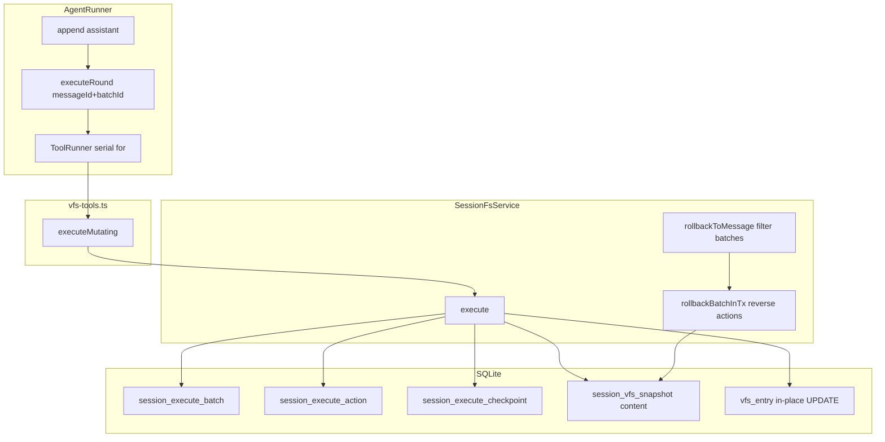
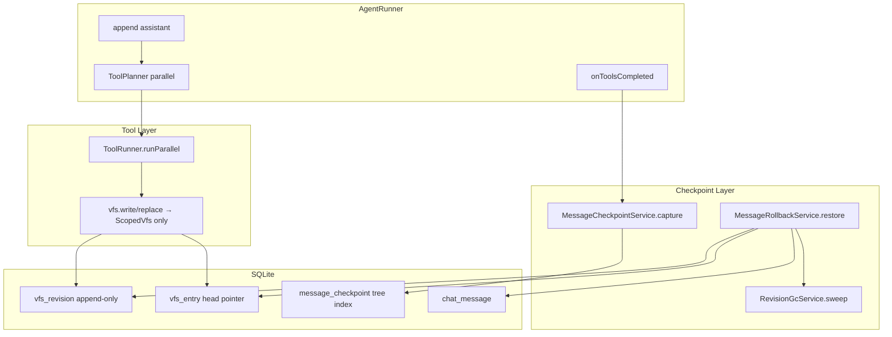

# Message Checkpoint v2 & 工具调用重构 技术规格（SPEC）

> **PRD**：[prd.md](./prd.md)  
> **代码基线**：`packages/core` SessionFs + VfsService + ToolRunner + AgentRunner（2026-06-07）  
> **替代**：batch/action/`session_vfs_snapshot` 回滚模型 → message checkpoint + vfs revision

---

## 设计目标

1. **Message 级整树 checkpoint**：Agent message 全部 tool 完成后，记录 session 工作区 **file** 的 `{ path → version }` 索引，不含空目录、不记录过程。
2. **VFS revision 层**：append-only 正文存储；checkpoint 只存指针；回滚 **正向 restore** 到 anchor 树，而非 batch 反向 undo。
3. **Tool ↔ Checkpoint 解耦**：mutating tool 只写 scoped VFS；`MessageCheckpointService.capture` 在 step 边界独立运行。
4. **Tool 并发**：同一 assistant 轮次内 tool 可 `Promise.all`（带上限）；checkpoint 在 fork-join 之后一次写入。
5. **FileEditor 无 checkpoint**：手动保存走 VFS write，不写 `message_checkpoint`。
6. **Revision GC**：回滚 / 删消息时删除不可达 revision；暂不设 FIFO 上限。
7. **规模**：单会话 ≤ 20 000 消息、≤ 1 000 文件、~100 MB 工作区 — SQLite 单机可支撑（见 §性能）。

---

## 现状与差距（代码探索）

### 当前架构



| 模块 | 路径 | 现状 |
|------|------|------|
| SessionFs port | `packages/core/src/service/session-fs/session-fs.port.ts` | `execute`, `rollbackBatch`, `rollbackToMessage`, `listBatches`, `rollbackSnapshot` |
| SessionFs impl | `packages/core/src/service/session-fs/impl/session-fs.service.ts` | 变更前 capture + action 反向 undo |
| VFS tools | `packages/core/src/domain/tool/builtin/vfs-tools.ts` | mutating → `sessionFs.execute`; `executeRound` 合并 batch |
| ToolRunner | `packages/core/src/domain/tool/logic/tool-runner.ts` | 单 tool 同步 call，无并发 |
| AgentRunner | `packages/core/src/service/agent/impl/agent-runner.ts` | `for (const tu of toolUses)` 串行；L229 设 `executeRound` |
| VFS entry | `packages/core/src/domain/vfs/repositories/impl/sqlite-vfs-entry.repository.ts` | **原地 UPDATE**，旧 version content 不可读 |
| Schema | `packages/core/src/bootstrap/session-fs/session-fs-schema.ts` | batch/action/checkpoint/snapshot 四表 |
| Mobile 回滚 | `apps/mobile/src/services/message-rollback.service.ts` | `rollbackToMessage` |
| Desktop 回滚 | `apps/desktop/.../handlers/messages.ts` | `handleMessagesRollback` |
| Desktop 写 | `PreviewPane.tsx`, `session-fs.ts` | `sessionFs.execute` 无 messageId |
| CLI | `apps/cli/src/session/commands.ts` | `rollback --message`, `listBatches`, `rollbackBatch` |

### 关键差距

| 差距 | 说明 |
|------|------|
| `vfs_entry.version` 非历史指针 | 必须引入 `vfs_revision` append-only，否则 checkpoint 指针无效 |
| batch 与产品语义错位 | UI 只用 `messageId`；batchId 从未暴露 |
| tool 与 checkpoint 耦合 | `executeMutating` → `sessionFs.execute` 每 action capture |
| 串行 tool | AgentRunner L284–306 顺序 await |
| FileEditor 走 execute | 产生 batch 但无 messageId；v2 改为纯 VFS write、无 checkpoint |

---

## 总体方案

### 目标架构



### 数据模型

#### `vfs_revision`（新增）

```sql
CREATE TABLE vfs_revision (
  path TEXT NOT NULL,
  version INTEGER NOT NULL,
  content TEXT,
  status TEXT NOT NULL,  -- 'active' | 'deleted'
  mtime_ms INTEGER NOT NULL,
  storage_kind TEXT NOT NULL DEFAULT 'inline',
  PRIMARY KEY (path, version)
);
CREATE INDEX idx_vfs_revision_path ON vfs_revision(path);
```

- 每次 **file** write/delete 产生新 `(path, version)` 行；**不 UPDATE 旧行**。
- `content` 在 `status='deleted'` 时为 NULL。

#### `vfs_entry`（演进）

```sql
-- 概念：live head；content 可冗余缓存或仅 pointer
-- path PK, head_version, entry_kind, mtime_ms, ...
-- write: INSERT revision + UPDATE entry SET head_version = new
```

实现可选：**双读**（先 revision 后 entry 缓存）或 entry 只存 `head_version` 不存 content（读总是 join revision）。SPEC 推荐 **entry 存 head_version + 冗余 content**（与现 UX 一致，写时同步更新）。

#### `message_checkpoint`（新增，替代 batch 语义）

```sql
CREATE TABLE message_checkpoint (
  session_id TEXT NOT NULL,
  message_id TEXT NOT NULL,
  created_at_ms INTEGER NOT NULL,
  PRIMARY KEY (session_id, message_id)
);

CREATE TABLE message_checkpoint_file (
  session_id TEXT NOT NULL,
  message_id TEXT NOT NULL,
  logical_path TEXT NOT NULL,
  revision_version INTEGER NOT NULL,
  PRIMARY KEY (session_id, message_id, logical_path)
);
```

- 仅 **file** path；**不含**空 directory。
- `revision_version` = capture 时刻该 path 的 `vfs_entry.head_version`。
- 无 mutating tool 的 Agent message **不写** checkpoint 行。

#### 废弃（直接删除，不迁移数据）

- `session_execute_batch` / `session_execute_action` / `session_execute_checkpoint`
- `session_vfs_snapshot`
- 上述表内 **全部旧回滚点数据不做转换**；升级后仅 **新产生的** `message_checkpoint` 可回滚

### 核心算法

#### Capture（Agent message tools 全部完成后）

```typescript
async capture(sessionId, projectId, messageId): Promise<void> {
  const files = await listSessionFiles(sessionId, projectId); // entry_kind=file, ≤1000
  if (files.length === 0) return; // 可选：无 mutating 时可不写入（与 PRD 一致）
  await tx(async () => {
    insert message_checkpoint(...)
    for (const f of files)
      insert message_checkpoint_file(messageId, f.logicalPath, f.headVersion)
  });
}
```

触发点：`DefaultAgentRunner` 在 **tool_results append 之前或之后**（建议 tool 全部 settled 后、写 tool_result message 前），且 **仅当本轮存在 mutating tool** 时调用。

#### RollbackToMessage

```typescript
async rollbackToMessage(sessionId, projectId, anchorMessageId): Promise<void> {
  const anchor = await messages.findById(anchorMessageId);
  const targetTree = await resolveRollbackTargetTree(sessionId, anchorMessageId, anchor.seq);
  const tailMessageIds = messages.where(seq > anchor.seq).ids;
  const tailLogicalPaths = checkpointFiles.listPathsForMessages(sessionId, tailMessageIds);

  // Path reconciliation (定案): tail-touched ∪ target tree keys — NOT union(liveFiles, tailTouchedPaths).
  // Pre-anchor live files (FileEditor / manual VFS writes without checkpoint) stay unless a tail
  // checkpoint touched the same path. Aligns with PRD R3 (text-only tail) and FileEditor semantics.
  const pathsToReconcile = new Set([...tailLogicalPaths, ...targetTree.keys()]);

  await tx(async () => {
    for (const path of pathsToReconcile) {
      const ver = targetTree.get(path);
      if (ver != null) {
        await ensureDirectoryChain(path);
        await restorePathToRevision(path, ver);
      } else {
        await deletePathIfExists(path);
      }
    }
    await checkpoint.deleteCheckpointsForMessages(sessionId, tailMessageIds);
    await messages.deleteAfterSeq(sessionId, anchor.seq);
    await revisionGc.sweep(sessionId);
  });
}
```

**Path reconciliation（定案）**：

- 仅 reconcile **`tailLogicalPaths ∪ targetTree.keys()`**，**不**扫描全部 live files。
- **Tail 路径**：tail message 的 checkpoint 中出现过的 logical path（含 tail 新建/修改/删除的文件）。
- **Target 树键**：anchor 解析后的 checkpoint 树中所有 path（含 anchor 时存在、tail 未再 touch 的路径）。
- **Pre-anchor 手动文件**（FileEditor 直写 VFS、无 checkpoint）：若不在 tail checkpoint 中，**不参与 reconcile、保持 live 内容**（PRD R3；回滚纯文本 tail 时工作区不变）。
- Target 中不存在的 path → `deletePathIfExists`（通常来自 tail 新建文件）。

**Anchor 无 checkpoint 策略（定案）**：

- 若 anchor message **有** checkpoint 行：target tree = 该 message 的 checkpoint 树。
- 若 anchor **无** checkpoint 且存在 **seq ≤ anchor** 的最近 checkpoint：target tree = 该前序 checkpoint 树（R9）。
- 若 anchor **无** checkpoint 且会话 **从未** 写入 v2 checkpoint：对 **assistant** anchor **拒绝回滚**（`ROLLBACK_NO_CHECKPOINT` /「该消息无回滚点」）；**user** anchor 仍允许纯消息截断（R3）。
- 若 anchor **无** checkpoint、会话已有其它 checkpoint、但 seq 之前无 checkpoint：target = **空树**（R2）。

**升级边界（定案）**：升级前 legacy 消息无 `message_checkpoint` 行；回滚至此类 **assistant** 消息时失败并提示「该消息无回滚点」。升级后新产生的 checkpoint 正常可用。

#### Restore path

```typescript
async restorePathToRevision(logicalPath, version): Promise<void> {
  const rev = await revision.get(path, version);
  if (rev.status === 'deleted') await vfs.delete(logicalPath);
  else await vfs.write(logicalPath, rev.content, { versionCheck: false });
}

async ensureDirectoryChain(logicalPath): Promise<void> {
  for (const dir of parentDirs(logicalPath))
    await vfs.mkdir(dir); // idempotent
}
```

#### Revision GC

```typescript
async sweep(sessionId): Promise<void> {
  const reachable = new Set<string>(); // "path:version"
  for (const f of liveHeads(sessionId)) reachable.add(key(f));
  for (const row of allCheckpointFiles(sessionId))
    reachable.add(key(row));
  await revision.deleteWhere(sessionId, not in reachable);
}
```

触发：**rollbackToMessage** 事务末尾、**deleteMessage**（删除对应 checkpoint 若有）后。

**单条消息删除（定案）**：`MessageService.delete` 在删消息后删除该 message 的 checkpoint 行（若有），并 `sweepSessionRevisions`；**不** reconcile VFS 文件（与 rollback 不同）。

### Tool 层重构

#### VfsToolContext（简化）

```typescript
export type VfsToolContext = {
  readonly vfs: VfsService; // session-scoped, revision-aware
  readonly projectId: string;
  readonly sessionId: string;
  // 移除 sessionFs, executeRound
};
```

- `vfs.write` / `vfs.replace` → `RevisionAwareVfsService.write` → append revision + update head。
- `vfs.read/list/glob/grep/mkdir`：read/list 不变；**mkdir 仍直接 mkdir**（checkpoint 不含空目录；restore 时 ensureDir）。

#### ToolRunner 并发

```typescript
async runParallel(calls: ToolCall[], ctx, options?: { concurrency?: number }): Promise<ToolResult[]> {
  const limit = options?.concurrency ?? 8;
  return pLimit(limit, () => Promise.all(calls.map(c => this.call(c.name, c.input, ctx))));
}
```

- 同 path 并发写：**last-write-wins**（PRD 已定）。
- AgentRunner：替换 L284–306 `for` 为 `runParallel`；**全部 settled** 后 `checkpoint.capture`（若有 mutating）。

#### Mutating 检测

- 维护本轮 `mutatingToolNames` Set（write/replace/delete）或 tool 返回 `sideEffect: 'mutating'`。
- 仅 `mutatingCount > 0` 时 capture。

### FileEditor / 非 Agent 写入

| 入口 | 行为 |
|------|------|
| `apps/mobile/.../FileEditorScreen.tsx` | `sessionVfs.write` 或 scoped vfs **直接写**；**不**调用 checkpoint |
| `apps/desktop/.../PreviewPane.tsx` | 同上；移除 `sessionFs.execute` |
| Desktop `handleSessionFsExecute` | 改为 `vfs.write` only，或 deprecated |

### SessionFsService 演进

| 方法 | v2 |
|------|-----|
| `execute` | **删除** |
| `rollbackBatch` | **删除** |
| `listBatches` | **删除**（CLI 收敛） |
| `rollbackToMessage` | 保留签名；impl 换为 MessageRollbackService |
| `listSnapshots` / `rollbackSnapshot` | **P2 删除** 或改为基于 revision 列表（CLI 兼容） |

对外 port 可重命名为 `SessionWorkspaceService`（可选，非阻塞）。

---

## 最终项目结构

```
packages/core/src/
  bootstrap/
    vfs/migrate-vfs-revision.ts              # 新增表 + 可选 live head 基线
    session-fs/migrate-drop-legacy-session-fs.ts  # DROP legacy 表，无数据转换
    novel-master-bootstrap.ts
  domain/vfs/
    repositories/vfs-revision.port.ts        # 新增
    repositories/impl/sqlite-vfs-revision.repository.ts
    repositories/impl/sqlite-vfs-entry.repository.ts  # head_version
  domain/message-checkpoint/                   # 新增域
    repositories/message-checkpoint.port.ts
    repositories/impl/sqlite-message-checkpoint.repository.ts
    logic/revision-gc.ts
  service/message-checkpoint/                  # 新增
    message-checkpoint.port.ts                 # capture
    message-rollback.port.ts                   # rollbackToMessage
    impl/...
  service/vfs/
    impl/revision-aware-vfs.service.ts         # 包装 write/delete
  domain/tool/
    logic/tool-runner.ts                       # + runParallel
    builtin/vfs-tools.ts                       # 去 sessionFs.execute
  service/agent/impl/agent-runner.ts           # 并行 tool + capture 挂接
  service/session-fs/                          # 瘦身或删除

apps/mobile/src/services/message-rollback.service.ts  # 不变 API
apps/desktop/src/main/ipc/handlers/messages.ts
apps/desktop/src/main/ipc/handlers/session-fs.ts    # execute → vfs write
apps/cli/src/session/commands.ts                    # 删 batch 子命令

packages/core/test/
  message-checkpoint/capture.test.ts
  message-checkpoint/rollback.test.ts
  message-checkpoint/revision-gc.test.ts
  tool/tool-runner-parallel.test.ts
```

---

## 变更点清单

| 区域 | 文件 | 变更 |
|------|------|------|
| DDL | `session-fs-schema.ts` → 新 `vfs-revision-schema.ts`, `message-checkpoint-schema.ts` | 新表 + 废弃旧表 |
| VFS write 路径 | `sqlite-vfs-entry.repository.ts`, 新 revision repo | append revision |
| Checkpoint | 新 domain/service | capture + load tree |
| Rollback | 替换 `session-fs.service.ts` rollback 实现 | 正向 restore + GC |
| Tools | `vfs-tools.ts` | 仅 vfs；删 executeMutating |
| Agent | `agent-runner.ts` | 并行 + capture 钩子 |
| Mobile FE | `FileEditorScreen.tsx` | 确认直写 vfs |
| Desktop | `PreviewPane`, `session-fs.ts` | 去 execute；删 dead `SESSION_FS_ROLLBACK` 可选 |
| CLI | `session/commands.ts` | 保留 rollback --message；删 records 子命令 |
| CLI agent | `agent/commands.ts` | 对齐 tool ctx（无 sessionFs） |
| Tests | `rollback-to-message.test.ts` 等 | 重写为 revision 模型 |

---

## 兼容性与升级策略

### 原则：无回滚点迁移

- **旧 batch / action / snapshot 回滚点：直接废弃**，bootstrap 时 **DROP** 相关表，**不**转换为 `message_checkpoint`。
- 升级后：**仅升级之后新产生的 Agent checkpoint** 可用于 `rollbackToMessage`；升级前任意 message **不可回滚**（即使 UI 仍显示该消息）。
- **工作区 live 文件**（`vfs_entry` 当前内容）**保留**；revision 层在 bootstrap 时为现有 live head 建立 v1 基线（使当前文件可被后续 checkpoint 引用），**这不属于回滚点迁移**。

### Bootstrap 步骤

1. 创建 `vfs_revision`、`message_checkpoint*` 表。
2. 为当前 `vfs_entry` 中各 live file 写入 `vfs_revision (path, head_version, content)` 基线（仅使现有工作区与 revision 模型对齐）。
3. **DROP** `session_execute_batch` / `session_execute_action` / `session_execute_checkpoint` / `session_vfs_snapshot`（无 archive、无数据导入）。

### API 兼容

- `rollbackToMessage(sessionId, projectId, messageId)` **签名不变** — Mobile/Desktop/CLI 无需改 IPC channel。
- 删除 `SessionFsExecuteRound` export — 仅 Agent 内部曾用。

---

## 详细实现步骤

### Phase 1 — VFS revision（Core）

1. 新增 `vfs_revision` 表与 repository。
2. 实现 `RevisionAwareVfsService`：`write`/`delete` append revision + update entry.head_version。
3. 单测：write 产生 v1/v2；read head；旧 revision 仍可读。

### Phase 2 — Message checkpoint + rollback

1. 新增 `message_checkpoint*` 表与 repository。
2. 实现 `capture` / `loadTree` / `deleteForMessages`。
3. 实现新 `rollbackToMessage`（restore + ensureDir + delete + truncate + GC）。
4. 单测：移植 `rollback-to-message.test.ts` 场景。

### Phase 3 — Tool 解耦 + 并发

1. 简化 `VfsToolContext`；vfs-tools 直写 revision vfs。
2. `ToolRunner.runParallel` + AgentRunner 接入。
3. Agent 完成后 `capture`（mutating only）。
4. 单测：并行多 tool；同 path LWW；capture 一次。

### Phase 4 — Apps & CLI

1. FileEditor / Preview 改直写 vfs。
2. 移除 `sessionFs.execute` IPC 或改为 thin vfs write。
3. CLI 删 batch 命令；保留 rollback --message。
4. Mobile/Desktop 回归消息回滚 UI。

### Phase 5 — 清理

1. Bootstrap **DROP** legacy 表（无回滚点数据迁移）。
2. 删 `session-fs` 内 batch/execute 代码。
3. 更新 `.apm` 文档；deprecated `message-rollback-remove-session-log` 中 batch 描述。

---

## 测试策略

### 测试用例

| ID | 场景 |
|----|------|
| R1 | Agent A 写 file → B 覆盖 → rollback A → content=A |
| R2 | B 新建 file → rollback A → file 不存在 |
| R3 | 纯文本 tail → 只删消息 |
| R4 | restore 时自动 mkdir 父目录 |
| R5 | FileEditor write → 无 checkpoint 行 |
| R6 | 并行 3 tool 写 3 path → 1 checkpoint 含 3 entry |
| R7 | 并行同 path 双写 → checkpoint 为最终 version |
| R8 | rollback 后 GC 删除 tail-only revision |
| R9 | anchor 无 checkpoint → 用前序 checkpoint 树 |
| R10 | Agent 运行中 rollback 被拒绝（app 层 mock） |
| P1 | capture 1000 files P95 &lt; 200ms（desktop SQLite 基准；CI 测试 4× slack） |
| P2 | rollback diff 1000 files P95 &lt; 500ms（CI 测试 4× slack） |

### 非功能指标（定案）

| 指标 | 目标 |
|------|------|
| 单会话消息 | ≤ 20 000 |
| 工作区文件 | ≤ 1 000 |
| 工作区总大小 | ~100 MB |
| capture P95（1000 files） | Desktop &lt; 200 ms；Mobile &lt; 500 ms |
| rollback P95 | Desktop &lt; 500 ms；Mobile &lt; 1 s |
| Revision 存储 | 无 FIFO；GC 后 ≈ 工作区 + 仍被 checkpoint 引用的历史 |

---

## 风险与回滚方案

| 风险 | 缓解 |
|------|------|
| 升级后无法回滚历史 message | **已定案**：旧回滚点直接废弃；发版说明即可 |
| FileEditor 被 rollback 覆盖 | PRD 文案或 rollback 前 diff 警告（P2） |
| revision 膨胀 | GC 随回滚；后续可加 FIFO |
| 并发同 path 竞态 | LWW + 单 message 一次 capture |
| `vfs.mkdir` 与目录语义 | restore 时 ensureDir；不纳入 checkpoint |

**实现回滚（开发期）**：Phase 1–2 完成前可用 feature flag 切回旧 SessionFs path；**发版时**移除 flag 并 DROP legacy 表，**不做**双轨数据迁移。

---

## 与 PRD 待确认项的 SPEC 定案

| PRD 待确认 | SPEC 定案 |
|------------|-----------|
| 旧 DB / 回滚点 | **不做迁移**；legacy 表 DROP；升级前 message 不可回滚 |
| Anchor 无 checkpoint | 用**前序最近** checkpoint；无则空树 |
| CLI snapshot 命令 | **Phase 5 删除**；revision 调试改用 `nm vfs revision list`（可选 P2） |
| FileEditor 覆盖 | v1 **静默覆盖**；P2 加 warning |
| `vfs.mkdir` | 不 capture；restore ensureDir |

---

## 请确认

本 SPEC 基于当前代码库探索编写。确认后可按 Phase 1→5 实施；若需调整 anchor 无 checkpoint 策略或 CLI 兼容范围，请先修订 PRD/SPEC 再编码。
