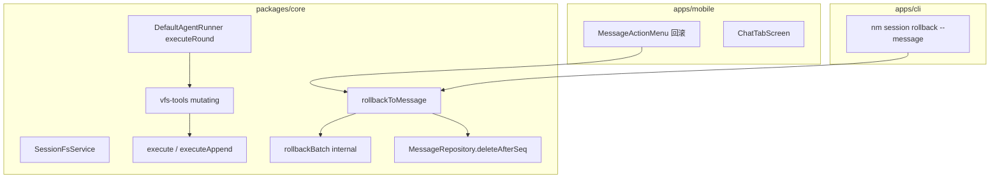

# 移除会话日志 & 消息回滚 技术规格（SPEC）

> PRD：`.apm/kb/docs/Iterations/message-rollback-remove-session-log/prd.md`

## 设计目标

- **一轮一 batch**：Agent 同一 Assistant 消息内的 mutating VFS 工具共用一个 `session_execute_batch`，并持久化 `message_id`。
- **简单回滚**：`rollbackToMessage` = 按 `message_id` 找到锚点之后 batch → 从新到旧循环现有 rollback 逻辑 → 删除 `seq > anchor` 消息；不引入「复合回滚」新底层。
- **移除会话日志**：删除 Mobile `SessionLog` 全链路及 timeline 启发式代码。
- **跨端一致**：Core API + `nm session rollback --message <id>` + Mobile 长按菜单。

## 现状与约束（代码探索）

| 模块 | 现状 | 本迭代 |
|------|------|--------|
| `SessionFsService.execute` | 已支持 `actions[]` 多动作单 batch；每次调用新建 batch | 扩展 **续写 batch**（同 `batchId` 追加 action） |
| `vfs-tools` | 每次 `execute([单 action])` | 经 `executeRound` 合并同轮 mutating 调用 |
| `session_execute_batch` | 仅 `id, session_id, created_at_ms, created_by` | 增加 **`message_id`**（nullable） |
| `DefaultAgentRunner` | `append` Assistant 后逐个 `toolRunner.call`，`toolCtx` 无 message 上下文 | 每轮设置 **`executeRound.messageId`** |
| `MessageRepository` | 有 `delete(id)`、`deleteBySession`；**无** `deleteAfterSeq` | 新增 **`deleteAfterSeq(sessionId, afterSeq)`** |
| `rollbackBatch` | 单 batch 事务内恢复 checkpoint→snapshot；`deleteAfterBatch` 清后续 snapshot 元数据 | **复用**；`rollbackToMessage` 在外层事务中多次调用内部实现 |
| Mobile 会话日志 | `SessionLogScreen` + `timeline-builder` 120s 启发式 | **删除** |
| `checkpointRetention` | 仅 Mobile 会话日志 UI mock 过期；**Core 无 FIFO 淘汰** | 随会话日志删除；过期验收依赖 snapshot 缺失失败路径 |
| CLI `nm session vfs write` | 直写 `VfsService`，**不经** `sessionFs.execute` | 不变；batch 仅 Agent 工具路径产生 |

**数据模型澄清（与 PRD 一致）：**

- `session_execute_checkpoint`：path → `snapshotRev` mapping，**无 content**。
- `session_vfs_snapshot`：存 **完整 content**；rollback 通过 checkpoint 指向的 rev 恢复。

## 总体方案

### 架构



### 一轮一 batch 流程

```text
1. AgentRunner: assistantMsg = session.append("assistant", blocks)
2. executeRound.messageId = assistantMsg.id; executeRound.batchId = null
3. for each tool_use:
     vfs.read → 直接 vfs.read（无 batch）
     vfs.write/replace → sessionFs.executeMutating(action)
       - batchId 为空 → insertBatch(messageId) + 执行 action seq=0
       - batchId 已有 → append action seq=max+1（同 batch）
       - 写 executeRound.batchId = batchId
4. 下一轮 LLM step：重置 executeRound.batchId = null（messageId 更新）
```

### rollbackToMessage 流程

```text
输入: sessionId, projectId, anchorMessageId
1. anchor = messages.findById(anchorMessageId)；校验 sessionId
2. tail = messages.filter(m => m.seq > anchor.seq)
3. batches = execute.listBatches(sessionId)
4. toRollback = batches.filter(b =>
     b.messageId != null && tail.some(m => m.id === b.messageId))
5. legacy = batches.filter(b =>
     b.messageId == null && b.createdAtMs > anchor.createdAtMs
     && hasMutatingActions(b))
   → 若非空：抛 SESSION_FS_ROLLBACK_LEGACY_BATCH（整次失败）
6. conn.transaction:
     for b in sort(toRollback, createdAtMs DESC):
       rollbackBatchInTx(tx, b.id)
     messages.deleteAfterSeq(sessionId, anchor.seq)
```

**语义**：锚点 batch（`message.seq === anchor.seq`）**不在** `toRollback` 内 → Assistant 锚点保留该轮文件写入。

## 最终项目结构

```text
packages/core/src/
  bootstrap/session-fs/session-fs-schema.ts     # + message_id 列（新库 DDL）
  bootstrap/novel-master-bootstrap.ts           # + migrateAddBatchMessageId
  domain/session-fs/model/execute-batch.ts      # + messageId?
  domain/session-fs/repositories/execute.port.ts
  domain/session-fs/repositories/impl/sqlite-execute.repository.ts
  domain/chat/repositories/message.port.ts      # + deleteAfterSeq
  domain/chat/repositories/impl/sqlite-message.repository.ts
  service/session-fs/session-fs.port.ts         # + execute options, rollbackToMessage
  service/session-fs/impl/session-fs.service.ts # executeAppend, rollbackToMessage
  domain/tool/builtin/vfs-tools.ts              # executeRound + executeMutating helper
  service/agent/impl/agent-runner.ts            # 设置 executeRound
  errors/session-fs-errors.ts                   # 新建：ROLLBACK_* 错误码
  test/session-fs/rollback-to-message.test.ts
  test/session-fs/execute-round-batch.test.ts
  test/tool/vfs-tools-round-batch.test.ts

apps/cli/src/session/commands.ts                # + case rollback

apps/mobile/src/
  components/chat/message-edit.ts               # + 回滚 menu item
  screens/tabs/ChatTabScreen.tsx                # handleRollbackFromMessage
  services/message-rollback.service.ts          # 新建（薄封装）
  services/agent-run.service.ts                 # toolCtx.executeRound 可变 bag
  # 删除:
  components/session-log/*
  screens/stack/SessionLogScreen.tsx
  services/session-log.service.ts
  __tests__/timeline-builder.test.ts
  navigation/* SessionLog 引用
```

## 变更点清单

### Core — Schema & 模型

| 文件 | 改动 |
|------|------|
| `session-fs-schema.ts` | `session_execute_batch` 增加 `message_id TEXT` |
| `novel-master-bootstrap.ts` | `migrateAddBatchMessageId`：`pragma_table_info` 检测后 `ALTER TABLE ... ADD COLUMN message_id TEXT` |
| `execute-batch.ts` | `SessionExecuteBatch.messageId?: string \| null` |
| `SessionFsBatchSummary` | 增加 `messageId: string \| null` |

### Core — execute 续写

| 文件 | 改动 |
|------|------|
| `session-fs.port.ts` | `SessionFsExecuteOptions` 增加 `messageId?: string`、`continueBatchId?: string` |
| `session-fs.service.ts` | 抽取 `runActionsInTx`；`continueBatchId` 时跳过 `insertBatch`，`seq` 从 `MAX(seq)+1` 起；新 batch 写入 `message_id` |
| `sqlite-execute.repository.ts` | `insertBatch` 含 `message_id`；新增 `maxActionSeq(batchId)`；`listBatches` SELECT `message_id` |
| `vfs-tools.ts` | `VfsToolContext.executeRound?: { messageId: string; batchId: string \| null }`；mutating 工具走 `executeMutating(ctx, actions, opts)` |

### Core — Agent

| 文件 | 改动 |
|------|------|
| `agent-runner.ts` | `append` Assistant 后：`toolCtx.executeRound = { messageId, batchId: null }`（每 step 新建对象，避免泄漏上轮 batchId） |
| `run-agent.handler.ts` | `toolCtx` 传入可写 `executeRound` bag（与 Mobile 一致） |
| `agent-run.service.ts` (mobile) | 创建 `const executeRound = { messageId: '', batchId: null }` 挂到 `toolCtx` |

### Core — rollbackToMessage

| 文件 | 改动 |
|------|------|
| `session-fs.port.ts` | `rollbackToMessage(sessionId, projectId, messageId): Promise<void>` |
| `session-fs.service.ts` | 实现见上；`rollbackBatchInTx` 从现有 `rollbackBatch` 抽取 |
| `create-session-fs-service.ts` | 注入 `MessageRepository`（或 `MessageService.get` + deleteAfterSeq） |
| `message.port.ts` / repo | `deleteAfterSeq(sessionId, afterSeq)` → `DELETE ... WHERE seq > afterSeq` |
| `session-fs-errors.ts` | `SESSION_FS_ROLLBACK_LEGACY_BATCH`、`SESSION_FS_ROLLBACK_SNAPSHOT_MISSING` 等 |

### CLI

| 文件 | 改动 |
|------|------|
| `session/commands.ts` | `case "rollback"`：`--message` 必填；`resolveProjectSession`；调 `sessionFs.rollbackToMessage` |
| Usage 字符串 | 更新 `nm session <...|rollback>` |

### Mobile — 删除会话日志

| 文件 | 改动 |
|------|------|
| 删除 | `SessionLogScreen.tsx`、`session-log/*`、`session-log.service.ts`、`timeline-builder.test.ts` |
| `RootNavigator.tsx` | 移除 `SessionLog` screen |
| `header-config.ts` / `types.ts` | 移除 `SessionLog` |
| `SessionActionsDrawer.tsx` | 移除「会话日志」项与 `onSessionLog` prop |
| `ChatTabScreen.tsx` | 移除 `onSessionLog` / navigate SessionLog |

### Mobile — 消息回滚

| 文件 | 改动 |
|------|------|
| `message-edit.ts` | 增加 `{ label: '回滚', action: 'rollback', danger: true }`（所有消息可见；与 Fork 并列） |
| `ChatTabScreen.tsx` | `handleRollbackFromMessage`：`agentRunning` 门禁 → `Alert` 确认 → `rollbackToMessage` → `reloadMessages` + `bumpVfsRefresh` |
| `message-rollback.service.ts` | `runtime.sessionFs.rollbackToMessage(...)` |

## 详细实现步骤

### Step 1 — Schema & Repository

1. 更新 `SESSION_FS_SCHEMA_STATEMENTS` 中 `session_execute_batch` DDL（新安装含 `message_id`）。
2. 在 `bootstrapNovelMaster` 增加 idempotent migration。
3. 更新 `SqliteSessionExecuteRepository` CRUD 与 `maxActionSeq`。
4. 在 `SqliteMessageRepository` 实现 `deleteAfterSeq`。

### Step 2 — execute 续写 + vfs-tools

1. 重构 `DefaultSessionFsService.execute`：内层 `runActionsInTx(tx, ctx)`。
2. 支持 `options.continueBatchId` + `options.messageId`（仅新建 batch 时使用后者）。
3. `vfs-tools` 新增内部 `executeMutating`：
   - 无 `executeRound` → 行为与现网一致（单 action 新 batch，`message_id` null），供单测/脚本直调。
   - 有 `executeRound` → 首 mutating 调用带 `messageId`；后续带 `continueBatchId`。
4. 单测：`execute-round-batch.test.ts` 验证同 batch 两 write、`message_id` 正确。

### Step 3 — AgentRunner 接线

1. `DefaultAgentRunner`：Assistant `append` 返回 `ChatMessage`，设置 `executeRound`。
2. 更新 `packages/core/test/agent/agent-runner.test.ts` mock `sessionFs` 记录 execute 调用次数（可选）。
3. Mobile `agent-run.service.ts` 初始化 `executeRound` 对象。

### Step 4 — rollbackToMessage

1. 新建 `session-fs-errors.ts` 并 export。
2. `createSessionFsService` 增加 `messages: MessageRepository` 依赖（或轻量 `{ findById, listBySession, deleteAfterSeq }` port）。
3. 实现 `rollbackToMessage`（单事务）。
4. 单测：`rollback-to-message.test.ts` 覆盖 PRD 场景 B/C/D/E + legacy batch 失败。

### Step 5 — CLI

1. `runSession` 增加 `rollback` 分支。
2. 集成测试或扩展现有 cli session 测试（若有）。

### Step 6 — Mobile

1. 删除会话日志相关文件与引用。
2. 实现消息回滚 UI 与服务。
3. 更新 `message-action-items.test.ts` 断言含 `rollback`。

## 测试策略

### 单元 / 集成（Core）

| 用例 | 断言 |
|------|------|
| 同轮双 write | 1 batch、2 action、`message_id` = assistant id |
| rollback Assistant 锚点 | 后续消息删除；锚点轮文件保留；更晚 batch 撤销 |
| rollback User 锚点 | User 后 Assistant 删除；poem 恢复 |
| 纯文本截断 | 无 batch 时仅删消息 |
| legacy batch（无 message_id 且在锚点之后） | 抛错；消息与 VFS 不变 |
| snapshot 缺失 | 抛错；事务回滚 |
| deleteAfterSeq | 仅删 `seq > N` |

### Mobile

| 用例 | 断言 |
|------|------|
| `buildMessageActionItems` | 含 `rollback` |
| （可选）mock runtime rollbackToMessage 被调用 |

### CLI

| 用例 | 断言 |
|------|------|
| `nm session rollback --message <id>` | 与 Core 单测 C 一致 |

### 手工验收

PRD 场景 A/B/C/E/F。

## 兼容性与迁移

| 项 | 策略 |
|----|------|
| 已有 DB | Migration `ADD COLUMN message_id`；旧 batch 为 NULL |
| 旧 session 回滚 | 锚点之后存在 **无 message_id 的 mutating batch** → **拒绝**并提示「存在无法关联的旧检查点，请使用 `nm session vfs records rollback --batch`」 |
| 新 Agent 对话 | 自动写入 `message_id`，消息回滚可用 |
| `checkpointRetention` pref | 保留 key 无害；移除会话日志后无 UI 读取；后续 Core FIFO 另迭代 |
| `nm session vfs records rollback --batch` | **保留**，作为低级逃生舱 |

## 风险与回滚方案

| 风险 | 缓解 | 回滚 |
|------|------|------|
| 续写 batch 与并发 Agent | Mobile/CLI 已禁止运行中回滚；单连接 SQLite | — |
| `rollbackBatch` 多次调用 snapshot 清理边界 | 按 `createdAtMs DESC` 回滚；同一外层事务 |  revert Core commit |
| legacy batch 阻断回滚 | 明确错误 + CLI batch 回滚 | 文档说明 |
| FIFO 未实现 | 仅 snapshot 缺失时失败；不做假过期 | 后续迭代 Core FIFO |
| 实现范围膨胀 | 严格不改 OpenAI/流式/非 VFS 工具 | — |

**本 SPEC 实现回滚**：按 git revert 迭代 commit；Mobile 恢复 SessionLog 需单独 revert 删除提交。

---

请确认本 `spec.md` 后再进入编码。若 OK，建议实现顺序：Step 1 → 4（Core）→ 5（CLI）→ 6（Mobile）。
