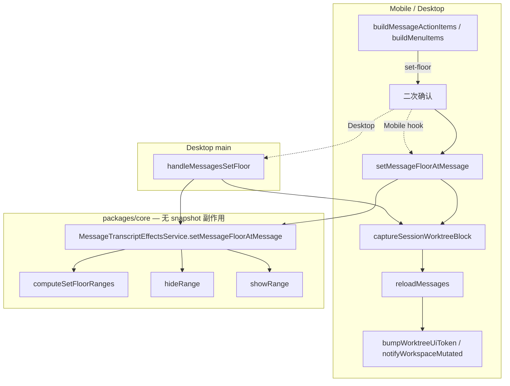

# 消息置位 技术规格（SPEC）

> **PRD**：`.apm/kb/docs/Iterations/message-set-floor/prd.md`  
> **Supersede**：`vfs-user-ops-unified-tool-turn`、`message-delete-worktree-narrow-refresh`、`message-worktree-refresh-tighten` 中 **App 消息 hide/restore/delete 批量多选** 的 UI/运行时表述（Core API 与 CLI 保留）  
> **Supersede（snapshot/dirty）**：`worktree-engine-convergence` 落地后，**正文凡仍出现 `markDirty`/`markSessionWorktreeDirty`/`isDirty` 处均为历史表述**；现行契约以 [T-WEC3/T-WEC4](../worktree-engine-convergence/spec.md#测试策略) 为准：**Core effects 无 snapshot 副作用**，置位 snapshot 由应用层 `captureSessionWorktreeBlock` 负责。本 SPEC 的 **T-SF5**/**T-SF14** 仅保留置位/transcript 与 UI 刷新路径断言，**不再**要求 `isDirty`。  
> **建议分支**：`feature/message-set-floor`

## 设计目标

1. **长按「置位」**：以锚点 `seq=N` 一次完成 `seq<N` hide + `seq≥N` show；仅 **user/assistant 消息行**；工具卡片不支持。
2. **工作树刷新**：置位 **完整继承** hide/unhide 的 UI 刷新路径（Mobile `bumpWorktreeUiToken` + Desktop `notifyWorkspaceMutated`）；snapshot/capture 由应用层白名单执行（WEC [T-WEC3/T-WEC4](../worktree-engine-convergence/spec.md#测试策略)）；Core effects **无** snapshot 副作用；**不**走 delete/rollback 收窄。
3. **会话菜单精简**：移除 hide/restore/delete 三项及 **消息批量多选 UI 物理删除**。
4. **Core 保留**：`hideRange`/`showRange`/`truncateMessagesAfter`、CLI、`visibility-batch-range`/`tail-batch-range` 不删。
5. **双端 parity**：Mobile RN + WebView + Desktop 菜单、确认文案、执行与刷新一致。

## 总体方案

### 语义

```text
锚点 message.seq = N，sessionMaxSeq = M

  N > 1  → hideRange(1, N-1)
  N ≤ M  → showRange(N, M)

消息行不删；VFS 不变；checkpoint 不清理。
```

与 rollback 锚点 **刻意不同**：置点使用用户所选 message 的 **原始 seq**，**不**调用 `resolveRollbackAnchorMessage`。

### 架构分层

> **现行契约（WEC）**：Core 路径仅 transcript hide/show（T-WEC3）；`captureSessionWorktreeBlock` 在应用层（Desktop main `handleMessagesSetFloor`、Mobile `runSetFloor`；T-WEC4/4b）；`notifyWorkspaceMutated` 留 Desktop renderer。



### Core API（新增）

```typescript
/** @module domain/chat/logic/message-set-floor-range */

export function isSetFloorAnchorRole(
  role: string,
): role is 'user' | 'assistant';

export function computeSetFloorRanges(
  floorSeq: number,
  sessionMaxSeq: number,
): {
  readonly hidePrefix: { readonly fromSeq: 1; readonly toSeq: number } | null;
  readonly showSuffix: {
    readonly fromSeq: number;
    readonly toSeq: number;
  } | null;
};
```

```typescript
/** @module service/chat/message-transcript-effects.port — 扩展 */

export interface SetMessageFloorResult {
  readonly hiddenCount: number;
  readonly shownCount: number;
}

/** hide 前缀 + show 后缀；不 truncate；snapshot/capture 见 WEC 应用层白名单（T-WEC3/T-WEC4） */
setMessageFloorAtMessage(
  projectId: string,
  sessionId: string,
  messageId: string,
): Promise<SetMessageFloorResult>;
```

实现要点：

- `listBySession` 解析 `messageId → floorSeq`；找不到抛错。
- `isSetFloorAnchorRole(message.role)` 不满足则抛错（App 菜单已过滤，Core 防御性校验）。
- 先 `hideRange` 再 `showRange`（Repository 幂等过滤）；**不**在 Core 内 markDirty/capture（WEC 落地后由应用层 `captureSessionWorktreeBlock` 负责，见 T-WEC3/T-WEC4）。
- **不**调用 `truncateMessagesAfter`。

### 菜单契约

| 项     | 值                                                                       |
| ------ | ------------------------------------------------------------------------ |
| label  | 置位                                                                     |
| action | `set-floor`                                                              |
| danger | false                                                                    |
| 顺序   | 复制之后、分叉之前                                                       |
| 资格   | `role ∈ {user, assistant}` 且展示行为 `message` 行（非 `user_vfs_turn`） |

**WebView 附加规则**：

- `buildMenuItems(row, hitEl)`：`row.kind !== 'message'` → 无置位。
- `hitEl?.closest('.tool-card, .tool-group-item')` → 无置位（工具子卡片长按仍可出复制/分叉等，与现网一致）。

**WebView `hitEl` 接线**（Step 5 必做）：

1. `onMessagePointerDown`：`state.longPressTarget` 除 `messageId` / `pageX` / `pageY` 外，**新增** `hitEl: event.target`（长按触点 DOM 节点）。
2. 定时器回调：`openContextMenu(target.messageId, target.pageX, target.pageY, target.hitEl)`。
3. `openContextMenu(messageId, pageX, pageY, hitEl)`：调用 `buildMenuItems(row, hitEl)` 生成菜单项（非仅传 `row`）。

共享辅助（双端 `message-edit.ts`）：

```typescript
export function isSetFloorEligibleMessage(message: ChatMessage): boolean {
  return message.role === 'user' || message.role === 'assistant';
}
```

### 工作树刷新矩阵（置位对齐 hide/restore 批量）

> **现行契约（WEC）**：Core 路径不 markDirty/capture（T-WEC3）；Desktop main / Mobile hook 在 effects 成功后 capture（T-WEC4/4b）；UI 刷新路径不变。

| 层级    | 置位成功后                                                                 |
| ------- | -------------------------------------------------------------------------- |
| Core    | 仅 transcript hide/show（**无** snapshot 副作用；T-WEC3）                    |
| 应用层  | `captureSessionWorktreeBlock`（Desktop main / Mobile hook；T-WEC4/4b）     |
| Mobile  | `reloadMessages(true)` + `bumpWorktreeUiToken()`                           |
| Desktop | `reloadMessages()` + `notifyWorkspaceMutated()`（renderer）                |

**禁止**新建独立 worktree 刷新分支；**禁止**因置位跳过应用层 capture 或 UI 刷新（`bump`/`notify`）。

### 批量 UI 删除范围

物理删除 **消息 transcript 批量** 专用代码；`useBatchSelection` 通用能力保留给 Agent/Provider/会话列表等。

| 删除/精简                                                          | 说明                                                                                                                                                              |
| ------------------------------------------------------------------ | ----------------------------------------------------------------------------------------------------------------------------------------------------------------- |
| `MessageBatchHeader.tsx` + 测试                                    | Mobile 顶栏整文件                                                                                                                                                 |
| `ConversationPanel` `#chat-batch-bar` 块                           | Desktop 顶栏 + `batchHint`/`requestBatchConfirm`/批量 `confirmState`                                                                                              |
| `App.tsx` → `MainShell.tsx` → `ChatRail.tsx` → `ConversationPanel` | 删除 `messageBatch` props 传参链；`App.tsx` 移除 `useBatchSelection()` 实例                                                                                       |
| `App.tsx` 会话菜单前三项 + `runSessionAction`                      | 删 hide/restore/delete 菜单项；**删除** `runSessionAction` 导出及调用                                                                                             |
| `useChatTabMessages` 批量块                                        | `enter*MessageBatch`、`confirmVisibilityBatch`、`finishMessageBatchMutation`                                                                                      |
| `ChatTabProvider` `messageBatch` 实例                              | 及 context 导出字段                                                                                                                                               |
| `useChatTabController` 批量勾选分支                                | `handleToggleMessageSelect` 等                                                                                                                                    |
| `ChatConversationPanel`                                            | `visibilityBatchPreview`、`MessageBatchHeader`、`transcriptFlags.batchMode*`                                                                                      |
| WebView `main.ts`                                                  | `batchMode`/`batchModeKind`、checkbox、`.batch-check` 渲染与样式                                                                                                  |
| 双端 `MessageList`                                                 | `batchMode`/`selectedMessageIds` props 与 UI                                                                                                                      |
| `useBatchSelection`                                                | 移除 `enterHide`/`enterRestore`/`enterDelete` 及 `MessageBatchMode` 类型（双端）；**强制补** 通用 `enter()`（与 Mobile 现网对齐，供 Settings 等非 chat 批量场景） |
| Android back                                                       | `useAndroidChatBackHandler` 移除 `messageBatchActive` / `exitMessageBatch` 状态与分支；同步更新 `use-android-chat-back-handler.test.ts`                           |

**保留消费**（不删 Core export）：`visibility-batch-range`、`tail-batch-range`（CLI/压缩）；`truncateMessagesAfter`（回滚/CLI）。

## 最终项目结构

```
packages/core/src/
  domain/chat/logic/message-set-floor-range.ts          # 新增
  service/chat/message-transcript-effects.port.ts       # 扩展 setMessageFloorAtMessage
  service/chat/impl/message-transcript-effects.service.ts
  public/chat.ts                                        # export 新符号

packages/core/test/package-exports/snapshots/
  public-chat-allowlist.json                            # allowlist 快照（Step 2 同步更新）

packages/core/test/chat/
  message-set-floor-range.test.ts                       # 新增
  message-transcript-effects.test.ts                    # 扩展置位用例

apps/mobile/src/
  components/chat/message-edit.ts                       # isSetFloorEligible + 菜单项
  screens/tabs/chat-tab/useChatTabMessages.ts           # set-floor handler；删批量
  screens/tabs/chat-tab/useChatTabController.ts         # 删批量勾选
  screens/tabs/chat-tab/ChatConversationPanel.tsx       # 删批量顶栏/flags
  screens/tabs/chat-tab/ChatTabProvider.tsx             # 移除 messageBatch
  components/chrome/SessionActionsDrawer.tsx            # 删三项
  web/chat-transcript/main.ts                           # buildMenuItems + 删 batch
  components/chat/ChatTranscriptBridge.ts               # 删 batch flags
  components/chat/MessageList.tsx                       # 删 batch UI（legacy）

apps/desktop/
  shared/ipc-types.ts                                   # MESSAGES_SET_FLOOR
  src/main/ipc/handlers/messages.ts                     # handleMessagesSetFloor
  src/main/ipc/handler-registry.ts                      # bindReq 注册
  renderer/ipc/client.ts                                # ipcMessagesSetFloor
  renderer/ipc/invoke-registry.ts                       # invoke 注册
  renderer/layout/MainShell.tsx                         # 删 messageBatch prop
  renderer/layout/ChatRail.tsx                          # 删 messageBatch prop
  renderer/features/chat/message-edit.ts
  renderer/features/chat/ConversationPanel.tsx          # set-floor + 删批量
  renderer/features/chat/MessageList.tsx
  renderer/hooks/useBatchSelection.ts                   # 删 enter*；补 enter()
  renderer/App.tsx                                      # 删会话菜单三项 + messageBatch 实例

apps/mobile/__tests__/
  message-action-items.test.ts                          # 置位资格 + 项序
  message-action-menu.test.tsx                          # 项数更新
  anchored-menu-layout.test.ts                          # MESSAGE_ACTION_MENU_ITEM_COUNT 同步
  use-android-chat-back-handler.test.ts                 # 删 messageBatch 分支断言
  # 删除 message-batch-header.test.tsx

# 删除 apps/mobile/src/components/batch/MessageBatchHeader.tsx
```

## 变更点清单

| 模块           | 文件                                                                                        | 变更                                                                          |
| -------------- | ------------------------------------------------------------------------------------------- | ----------------------------------------------------------------------------- |
| Core 纯函数    | `message-set-floor-range.ts`                                                                | `computeSetFloorRanges`、`isSetFloorAnchorRole`                               |
| Core 服务      | `message-transcript-effects.service.ts`                                                     | `setMessageFloorAtMessage`                                                    |
| Core export    | `public/chat.ts`、`packages/core/test/package-exports/snapshots/public-chat-allowlist.json` | 导出新符号                                                                    |
| Mobile 菜单    | `message-edit.ts`                                                                           | 置位项 + `isSetFloorEligibleMessage`                                          |
| Mobile 执行    | `useChatTabMessages.ts`                                                                     | `set-floor` 确认 + effects + bump                                             |
| Mobile WebView | `main.ts`                                                                                   | `buildMenuItems` 同步；删 batch                                               |
| Mobile 精简    | `SessionActionsDrawer`、`ChatTabProvider` 等                                                | 删批量 wiring                                                                 |
| Desktop 菜单   | `message-edit.ts`                                                                           | 同 Mobile                                                                     |
| Desktop 执行   | `ConversationPanel.tsx`                                                                     | `set-floor` + `notifyWorkspaceMutated`                                        |
| Desktop IPC    | `ipc-types.ts`、`messages.ts`、`handler-registry.ts`、`client.ts`、`invoke-registry.ts`     | `MESSAGES_SET_FLOOR` 全链路注册                                               |
| Desktop 精简   | `App.tsx`、`MainShell.tsx`、`ChatRail.tsx`、`ConversationPanel.tsx`、`useBatchSelection.ts` | 删会话菜单三项；删 `messageBatch` 传参链；删 `runSessionAction`；补 `enter()` |
| 测试           | 见测试策略                                                                                  | 增置位；删批量专测                                                            |

## API 契约

### Desktop IPC

```typescript
// ipc-types.ts — IPC_CHANNELS 增项
MESSAGES_SET_FLOOR: "nm:messages/setFloor",

export type MessagesSetFloorPayload = {
  readonly projectId: string;
  readonly sessionId: string;
  readonly messageId: string;
};

export type MessagesSetFloorResult = {
  readonly hiddenCount: number;
  readonly shownCount: number;
};
```

Handler 委托 `rt.messageTranscriptEffects.setMessageFloorAtMessage`。

**注册步骤**（Step 7 必做，与现有 `MESSAGES_HIDE` 等同级）：

1. `shared/ipc-types.ts`：`IPC_CHANNELS` 增 `MESSAGES_SET_FLOOR: "nm:messages/setFloor"`；导出 `MessagesSetFloorPayload` / `MessagesSetFloorResult` 类型。
2. `src/main/ipc/handlers/messages.ts`：新增 `handleMessagesSetFloor`。
3. `src/main/ipc/handler-registry.ts`：`bindReq(IPC_CHANNELS.MESSAGES_SET_FLOOR, handleMessagesSetFloor)`。
4. `renderer/ipc/client.ts`：导出 `ipcMessagesSetFloor` 包装函数。
5. `renderer/ipc/invoke-registry.ts`：`createInvokeClient` 映射表增 `MESSAGES_SET_FLOOR` → `ipcMessagesSetFloor`。

### App 确认文案（双端一致）

| 字段 | 文案                                               |
| ---- | -------------------------------------------------- |
| 标题 | 置位到此消息？                                     |
| 正文 | 此消息之前将不参与提示词，此消息及之后将恢复可见。 |
| 确认 | 置位                                               |
| 取消 | 取消                                               |

Mobile：`Alert.alert`；Desktop：`ConfirmModal`（非 destructive）。

### Agent 运行中

| 端             | 行为                                                                                |
| -------------- | ----------------------------------------------------------------------------------- |
| Mobile RN      | `uiRunning` 时不打开长按菜单（现网）                                                |
| Mobile WebView | `menuDisabled`（现网）                                                              |
| Desktop        | 菜单可开；`handleMessageAction` 对 `set-floor` 与 fork/rollback 同样 `running` 拦截 |

### 幂等

`hideRange`/`showRange` Repository 过滤已无变更行 → `changes=0`。置位成功且 `hiddenCount+shownCount>0` 时 Toast「已置位」；若 `hiddenCount+shownCount===0` 则 Toast「**上下文已是最新状态**」（双端一致，**锁定**此文案）。

## 兼容性与迁移

| 场景                        | 行为                                    |
| --------------------------- | --------------------------------------- |
| 旧客户端 + 新 DB            | 无 schema 变更；`hidden` 字段已存在     |
| 升级后首次打开              | 会话抽屉无批量三项；用户改长按置位      |
| CLI `nm message hide/show`  | 不变                                    |
| 压缩 `hide-message` 事件    | 不变                                    |
| `useBatchSelection` 非 chat | Agent/Provider/Project 列表批量不受影响 |

## 详细实现步骤

### M1 — Core

- Step 1 — phase-core-set-floor-range — blocking: yes — qa: auto：新增 `message-set-floor-range.ts`（`computeSetFloorRanges`、`isSetFloorAnchorRole`）及 `message-set-floor-range.test.ts`（N=1、N=M、中间锚点、空操作边界）。
- Step 2 — phase-core-effects-api — blocking: yes — qa: auto：扩展 `MessageTranscriptEffectsService.setMessageFloorAtMessage`；实现内 `listBySession` 取 seq/maxSeq → hide/show（**无** Core 内 markDirty/capture，见 WEC T-WEC3）；更新 `public/chat.ts` 与 `packages/core/test/package-exports/snapshots/public-chat-allowlist.json`。
- Step 3 — phase-core-effects-tests — blocking: yes — qa: auto：扩展 `message-transcript-effects.test.ts`（置位 prefix/suffix、不 truncate、role 非法抛错）；`isDirty`/markDirty 断言见 WEC T-WEC3（supersede T-SF5）。

### M2 — Mobile

- Step 4 — phase-mobile-menu-handler — blocking: yes — qa: auto：`message-edit.ts` 增 `isSetFloorEligibleMessage` 与「置位」项；`useChatTabMessages` 增 `set-floor` 分支（确认 → `runtime.messageTranscriptEffects.setMessageFloorAtMessage` → reload + bump）；更新 `message-action-items.test.ts`、`message-action-menu.test.tsx`；同步 `anchored-menu-layout.ts` 中 `MESSAGE_ACTION_MENU_ITEM_COUNT` 及 `anchored-menu-layout.test.ts` 项数/布局断言。
- Step 5 — phase-mobile-webview-menu — blocking: yes — qa: auto：`main.ts` `buildMenuItems(row, hitEl)` 同步置位规则（`row.kind==='message'`、tool-card hit 排除）；**接线** `longPressTarget.hitEl` → `openContextMenu(messageId, pageX, pageY, hitEl)` → `buildMenuItems(row, hitEl)`；`messageMenuAction` 透传 `set-floor`；删除 WebView batch 渲染/flags/CSS。
- Step 6 — phase-mobile-delete-batch-ui — blocking: yes — qa: auto：物理删除 `MessageBatchHeader.tsx` 及测试；精简 `SessionActionsDrawer`、`ChatTabProvider`、`ChatConversationPanel`、`useChatTabController`、`MessageList`（legacy）、`ChatTranscriptBridge`；移除 `enterHide/enterRestore/enterDelete`（Mobile hook，保留 `enter()`）；`ChatTabScreen` 移除 `useAndroidChatBackHandler` 的 `messageBatchActive` / `exitMessageBatch` 传参；更新 `use-android-chat-back-handler.test.ts` 删除 messageBatch 相关用例。

### M3 — Desktop

- Step 7 — phase-desktop-ipc-menu — blocking: yes — qa: auto：`MESSAGES_SET_FLOOR` IPC 全链路（`ipc-types.ts` → `messages.ts` handler → `handler-registry.ts` bindReq → `client.ts` → `invoke-registry.ts`）；`message-edit.ts` 菜单 parity；`ConversationPanel.handleMessageAction` 增 `set-floor`（ConfirmModal + ipc + reload + notify）；Agent `running` 拦截。
- Step 8 — phase-desktop-delete-batch-ui — **blocking: yes** — qa: auto：`App.tsx` 删会话菜单三项及 `useBatchSelection()` 实例；删除 `runSessionAction` 导出与 `#session-actions-menu` 调用；沿 `App.tsx` → `MainShell.tsx` → `ChatRail.tsx` → `ConversationPanel` 移除 `messageBatch` props；删除 `#chat-batch-bar`、批量 preview、`requestBatchConfirm`、批量 `confirmState` 分支（`hide-messages` / `restore-messages` / `delete-messages`）；精简 `MessageList` batch props；Desktop `useBatchSelection` **必做**：移除三 `enter*` 并 **强制补** 通用 `enter()`（与 Mobile 对齐，Settings 等依赖）。

  **Step 8 Desktop 批量附属删除 checklist**（逐项 grep 验收）：

  | 文件                    | 删除项                                                                                                                                                                                                        |
  | ----------------------- | ------------------------------------------------------------------------------------------------------------------------------------------------------------------------------------------------------------- |
  | `App.tsx`               | `useBatchSelection()`、`messageBatch` prop、`runSessionAction` import/调用、`#session-actions-menu` hide/restore/delete 按钮                                                                                  |
  | `MainShell.tsx`         | `messageBatch` prop 类型与透传                                                                                                                                                                                |
  | `ChatRail.tsx`          | `messageBatch` prop 与 `<ConversationPanel messageBatch={...}>`                                                                                                                                               |
  | `ConversationPanel.tsx` | `messageBatch` prop；`#chat-batch-bar` JSX；`batchHint`/`requestBatchConfirm`；`confirmState` 中 `hide-messages`/`restore-messages`/`delete-messages` kind；`handleConfirm` 批量分支；`runSessionAction` 导出 |
  | `MessageList.tsx`       | `batchMode`/`selectedIds` props 与 batch UI                                                                                                                                                                   |
  | `useBatchSelection.ts`  | `enterHide`/`enterRestore`/`enterDelete`/`MessageBatchMode`；**新增** `enter()`                                                                                                                               |

### M4 — 收尾

- Step 9 — phase-integration-tests — blocking: yes — qa: auto：更新 `chat-conversation-panel.integration.test.tsx`、`chat-transcript-webview.test.tsx`、`chat-transcript-rich-styles.test.ts`（去 batch）；清理 `tool-turn-actions.test.ts` 批量 mirror 用例；可选新增 Desktop `message-action-items.test.ts`。
- Step 10 — phase-manual-parity — blocking: no — qa: manual_user：双端对 user/assistant 行置位 → RealPrompt 仅含 suffix；`user_vfs_turn` 长按无置位；置位后工作区 tab 刷新与旧版 hide 批量一致。

## 测试策略

### Supersede 注记（worktree-engine-convergence）

- **T-SF5**：保留 Core 置位/transcript 行为断言（与 T-SF4 互补：`setMessageFloorAtMessage` 后 prefix hidden、suffix visible）；`worktreeSnapshot.isDirty` / `markSessionWorktreeDirty` 断言由 WEC **[T-WEC3](../worktree-engine-convergence/spec.md#测试策略)** supersede（Core 路径不 capture、无 dirty 语义）。
- **T-SF14**：保留 Desktop IPC 委托 `setMessageFloorAtMessage` 与成功后 `notifyWorkspaceMutated` 路径；`captureSessionWorktreeBlock` / `getCapturedBlock` 断言由 WEC **[T-WEC4](../worktree-engine-convergence/spec.md#测试策略)** supersede。

### 验证命令

```bash
# M1
npm run build -w @novel-master/core
npm run test:fast -w @novel-master/core -- \
  test/chat/message-set-floor-range.test.ts \
  test/chat/message-transcript-effects.test.ts

# M2
npm test -w @novel-master/mobile -- \
  __tests__/message-action-items.test.ts \
  __tests__/message-action-menu.test.tsx

# M3
npm run build:main -w @novel-master/desktop
npm test -w @novel-master/desktop
```

### 测试用例

| ID      | blocking | 映射 Step | 描述                                                                                            |
| ------- | -------- | --------- | ----------------------------------------------------------------------------------------------- |
| T-SF1   | yes      | 1         | `computeSetFloorRanges(N=1)` 仅 showSuffix                                                      |
| T-SF2   | yes      | 1         | `computeSetFloorRanges(N=M)` 仅 hidePrefix                                                      |
| T-SF3   | yes      | 1         | `computeSetFloorRanges` 中间 N 同时 hide+show                                                   |
| T-SF4   | yes      | 3         | `setMessageFloorAtMessage` 后 prefix hidden、suffix visible                                     |
| T-SF5   | yes      | 3         | Core 置位 transcript 行为（prefix hidden、suffix visible）；**不**断言 `isDirty`（snapshot 见 T-WEC3） |
| T-SF6   | yes      | 3         | 置位 **不** 调用 truncate；消息条数不变                                                         |
| T-SF7   | yes      | 3         | `role=system`（或非法）抛错                                                                     |
| T-SF8   | yes      | 4         | user 消息菜单含 `set-floor`（在 copy 后、fork 前）                                              |
| T-SF9   | yes      | 4         | `hidden=true` 含置位、无 rollback                                                               |
| T-SF10  | yes      | 4         | 仅 tool_use assistant **仍含** 置位（底层 role=assistant）                                      |
| T-SF11  | yes      | 5         | WebView `user_vfs_turn` 行菜单 **无** set-floor                                                 |
| T-SF12  | yes      | 5         | WebView tool-card hit 菜单 **无** set-floor                                                     |
| T-SF13  | yes      | 6         | 仓库无 `MessageBatchHeader`；SessionActionsDrawer 无 hide/restore/delete 文案                   |
| T-SF14  | yes      | 7         | Desktop IPC `setFloor` 委托 effects；成功后 `notifyWorkspaceMutated` 路径（capture 见 T-WEC4）   |
| T-SF15  | yes      | 8         | Desktop 会话菜单无三项；无 `#chat-batch-bar`；无 `messageBatch` 传参链；`runSessionAction` 已删 |
| T-SF15b | yes      | 8         | Desktop `useBatchSelection` 含 `enter()`、无 `enterHide`/`enterRestore`/`enterDelete`           |
| T-SF16  | yes      | 9         | 集成测无 messageBatch mock；无 `.batch-check` 样式断言                                          |
| T-SF16b | yes      | 6         | `use-android-chat-back-handler.test.ts` 无 `messageBatchActive` 断言                            |
| T-SF17  | no       | 10        | manual_user：置位后 RealPrompt 与预期一致；工作区刷新                                           |
| T-SF18  | yes      | 4/7       | 幂等置位 Toast「上下文已是最新状态」                                                            |

### PRD 验收矩阵

| PRD 验收项       | 测试                       |
| ---------------- | -------------------------- |
| 置位行为         | T-SF4、T-SF1–3             |
| 工具卡片不支持   | T-SF11、T-SF12             |
| 菜单精简         | T-SF13、T-SF15             |
| 工作树刷新继承   | T-SF5（transcript）、T-SF14（notify）、T-WEC3/T-WEC4（snapshot/capture）、T-SF17 |
| 批量 UI 物理删除 | T-SF13、T-SF15、T-SF16     |
| 运行中拦截       | Step 4/7 代码审查 + manual |
| 后端保留         | T-SF6 + CLI 现有测不动     |

## 风险与回滚方案

| 风险                                | 缓解                                                                     | 回滚                                 |
| ----------------------------------- | ------------------------------------------------------------------------ | ------------------------------------ |
| WebView/RN 菜单双份不同步           | Step 4/5 同 PRD 顺序表；T-SF8/11/12                                      | revert `message-edit.ts` + `main.ts` |
| 误删 `useBatchSelection` 通用能力   | 仅删三 `enter*` 与 chat wiring；grep `useBatchSelection` 非 chat 调用    | revert hook 时恢复 enter\*           |
| `user_vfs_turn` Web 仍可 fork       | 仅禁置位，不改编译卡其他菜单                                             | —                                    |
| 置位与 rollback 锚点混淆            | Core 不用 `resolveRollbackAnchorMessage`；SPEC 已写明                    | —                                    |
| Desktop Settings `batch.enter` 缺失 | Step 8 **blocking 必做**：删 `enter*` 后强制补 `enter()`，与 Mobile 对齐 | revert hook 时恢复 enter\*           |

**回滚**：按 M3→M2→M1 revert PR；Core 新 API 可保留（无调用方无害）或一并 revert。

---

## Context Bundle（供 code-dev-loop）

```yaml
iteration_name: message-set-floor
requirement_path: .apm/kb/docs/Iterations/message-set-floor/prd.md
spec_path: .apm/kb/docs/Iterations/message-set-floor/spec.md
explore_summary: Core setMessageFloorAtMessage；菜单 set-floor；删批量 UI；worktree 继承 hide/show
impact_files:
  - packages/core/src/domain/chat/logic/message-set-floor-range.ts
  - packages/core/src/service/chat/impl/message-transcript-effects.service.ts
  - packages/core/test/package-exports/snapshots/public-chat-allowlist.json
  - apps/mobile/src/components/chat/message-edit.ts
  - apps/mobile/src/components/chat/anchored-menu-layout.ts
  - apps/mobile/src/screens/tabs/chat-tab/useChatTabMessages.ts
  - apps/mobile/src/hooks/useAndroidChatBackHandler.ts
  - apps/mobile/src/web/chat-transcript/main.ts
  - apps/desktop/renderer/features/chat/ConversationPanel.tsx
  - apps/desktop/renderer/layout/MainShell.tsx
  - apps/desktop/renderer/layout/ChatRail.tsx
  - apps/desktop/renderer/hooks/useBatchSelection.ts
  - apps/desktop/src/main/ipc/handlers/messages.ts
  - apps/desktop/src/main/ipc/handler-registry.ts
  - apps/desktop/renderer/ipc/invoke-registry.ts
constraints:
  - 工具卡片与 user_vfs_turn 无置位；WebView hitEl 接线必做
  - Core 仅 transcript（无 snapshot 副作用，WEC T-WEC3）；capture 见应用层 T-WEC4/4b；不 truncate；锚点用原始 seq，不 resolveRollbackAnchorMessage
  - 物理删除 MessageBatchHeader 与 #chat-batch-bar
  - useBatchSelection 删 enter* 后强制补 enter()；非 chat 场景保留
blocking_steps: [1, 2, 3, 4, 5, 6, 7, 8, 9]
```
