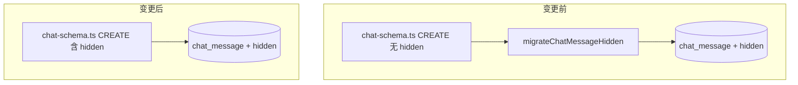

# chat_message.hidden 写入 DDL 技术规格（SPEC）

## 设计目标

- 将 `hidden` 列**唯一声明**在 `chat-schema.ts` 的 `CREATE TABLE chat_message` 中，消除 DDL 与运行时结构不一致。
- **删除** `novel-master-bootstrap.ts` 中的 `migrateChatMessageHidden`（`PRAGMA table_info` + `ALTER TABLE`），去掉 schema 双轨与技术债。
- **不改变** Message 可见性业务行为（hide/show、prompt 过滤、fork/copy）；Repository / Service / CLI 层代码保持不动（仅回归验证）。

## 现状与约束（代码探索）

| 项 | 现状 | 本 feature |
|----|------|------------|
| `chat-schema.ts` L24–34 | `CREATE TABLE chat_message` **无** `hidden` | 增加 `hidden INTEGER NOT NULL DEFAULT 0` |
| `novel-master-bootstrap.ts` L38–57 | `bootstrapNovelMaster` 在 DDL 循环后调用 `migrateChatMessageHidden` | 删除函数与调用；事务内仅 `NOVEL_MASTER_SCHEMA_STATEMENTS` + `seedBuiltinProviders` |
| `sqlite-message.repository.ts` | SELECT/INSERT/UPDATE 已硬编码 `hidden` 列 | **不改** |
| `message.ts` / `message.service.ts` | 模型与 hide/show API 已就绪 | **不改** |
| `apps/cli` message/prompt | hide/show、`[H]`、prompt 过滤已实现 | **不改**（可选手工回归） |
| `test/helpers/novel-master.ts` | `:memory:` 库 → `bootstrapNovelMaster` | 新建库自动获得完整 DDL，测试无需改 |
| `message-visibility.test.ts` | 7 个用例覆盖 hide/show/range/fork/copy | 回归通过即可；可选新增 DDL 断言 |
| 主迭代 `message-visibility/spec.md` | 仍描述 ALTER 迁移方案 | 实现后同步修订（非阻塞编码） |

**SQLite `CREATE TABLE IF NOT EXISTS` 行为（关键约束）**：

- 表**已存在**时，即使 DDL 字符串含 `hidden`，也**不会**为旧表补列。
- 本 feature **明确放弃** bootstrap 自动迁移；无 `hidden` 列的旧库在用户手动 `ALTER` 或重建前，Repository 的 `SELECT … hidden` 会失败。

**列位置约定**：`hidden` 放在 `created_at_ms` 之后、`UNIQUE (session_id, seq)` 之前，与 Repository INSERT 列顺序语义一致（非 SQL 强制，便于阅读）。

---

## 总体方案

### Schema 单一真相源



`bootstrapNovelMaster` 流程（变更后）：

1. `transaction` 内遍历 `NOVEL_MASTER_SCHEMA_STATEMENTS`（含更新后的 `CHAT_SCHEMA_STATEMENTS`）。
2. `seedBuiltinProviders(tx)`。
3. **无** chat_message 专项迁移。

### 兼容性策略

| 场景 | 行为 |
|------|------|
| 全新库 / `:memory:` 测试库 | `CREATE TABLE` 含 `hidden`，一切正常 |
| 旧库（表已存在、无 `hidden` 列） | bootstrap **不修复**；需用户执行：<br>`ALTER TABLE chat_message ADD COLUMN hidden INTEGER NOT NULL DEFAULT 0;`<br>或删除 DB 重建 |
| 旧库（迁移曾跑过、已有 `hidden`） | 继续可用；`CREATE TABLE IF NOT EXISTS` 跳过，列已存在 |

---

## 最终项目结构

```
packages/core/src/bootstrap/
  chat/chat-schema.ts              # 修改：CREATE TABLE 增加 hidden
  novel-master-bootstrap.ts        # 修改：删除 migrateChatMessageHidden

packages/core/test/
  chat/message-visibility.test.ts  # 回归（可选新增 bootstrap/ddl 用例）

.apm/kb/docs/Iterations/message-visibility/
  spec.md                          # 实现后同步：去掉 ALTER 迁移描述
  features/hidden-column-in-ddl/
    prd.md                         # 已确认
    spec.md                        # 本文档
```

**不改动**：`domain/`、`service/`、`apps/cli/`（除非回归发现问题）。

---

## 变更点清单

### 1. `packages/core/src/bootstrap/chat/chat-schema.ts`

在 `chat_message` 的 `CREATE TABLE` 中，`created_at_ms` 后增加：

```sql
hidden INTEGER NOT NULL DEFAULT 0,
```

完整片段（目标态）：

```sql
CREATE TABLE IF NOT EXISTS chat_message (
  id TEXT PRIMARY KEY,
  session_id TEXT NOT NULL,
  seq INTEGER NOT NULL,
  role TEXT NOT NULL,
  content_json TEXT NOT NULL,
  provider TEXT,
  raw_json TEXT,
  created_at_ms INTEGER NOT NULL,
  hidden INTEGER NOT NULL DEFAULT 0,
  UNIQUE (session_id, seq)
)
```

### 2. `packages/core/src/bootstrap/novel-master-bootstrap.ts`

**删除**：

- `bootstrapNovelMaster` 内 L38–39 对 `migrateChatMessageHidden(tx)` 的调用及注释。
- 整个 `migrateChatMessageHidden` 函数（L44–58）。

**保留**：

```typescript
export async function bootstrapNovelMaster(conn: TdbcConnection): Promise<void> {
  await conn.transaction(async (tx) => {
    for (const sql of NOVEL_MASTER_SCHEMA_STATEMENTS) {
      await tx.execute(sql);
    }
    await seedBuiltinProviders(tx);
  });
}
```

### 3. 文档（实现阶段，低优先级）

- 更新 `.apm/kb/docs/Iterations/message-visibility/spec.md`：
  - 「数据库表」改为 CREATE TABLE 内联 `hidden`；
  - 删除 `CHAT_SCHEMA_STATEMENTS` 末尾 ALTER、`migrateChatMessageHidden`、SQLite 3.35 `IF NOT EXISTS` 等过时描述；
  - 风险章节注明旧库手动迁移。

---

## 详细实现步骤

### Phase 1：DDL（约 5 分钟）

1. 编辑 `chat-schema.ts`，按上文加入 `hidden` 列。
2. 本地目视确认 `CHAT_SCHEMA_STATEMENTS` 仅一处 `chat_message` 定义。

### Phase 2：删除迁移（约 5 分钟）

3. 编辑 `novel-master-bootstrap.ts`，移除 `migrateChatMessageHidden` 及调用。
4. 全仓库 `rg migrateChatMessageHidden` 确认为 0 命中（含 `.apm` 文档可后续改）。

### Phase 3：构建与测试

5. `npm run build`（`packages/core`）。
6. `npm test`（`packages/core`），重点 `test/chat/message-visibility.test.ts`。

### Phase 4（可选）：DDL 结构测试

7. 在 `packages/core/test/chat/` 新增或扩展现有用例：
   - `bootstrapNovelMaster` 后 `PRAGMA table_info(chat_message)`；
   - 断言存在 `name === 'hidden'` 且 `dflt_value === 0`（注意 SQLite 返回类型可能是 number/string）。

### Phase 5：文档同步

8. 修订主迭代 `message-visibility/spec.md` 中与迁移相关的段落。

---

## 测试策略

### 自动化（必做）

| # | 命令 | 期望 |
|---|------|------|
| T1 | `cd packages/core && npm run build` | 成功 |
| T2 | `cd packages/core && npm test` | 全部通过 |
| T3 | 聚焦 | `npm test -- test/chat/message-visibility.test.ts` | 7 用例通过 |

现有用例已覆盖（无需改测试即可验证业务）：

- 单条 hide/show
- seq 范围 hide/show
- fork / session copy 保留 `hidden`
- hideRange 边界（fromSeq > toSeq、超范围）

测试路径：`openNovelMasterTestConnection` → `bootstrapNovelMaster` → `:memory:` 新库，**天然命中「新库 DDL」路径**。

### 自动化（可选）

| # | 场景 | 期望 |
|---|------|------|
| T4 | bootstrap 后 `PRAGMA table_info(chat_message)` | 含 `hidden`，`NOT NULL`，默认 `0` |

### 手工 / CLI（抽样，非阻塞）

| # | 步骤 | 期望 |
|---|------|------|
| T5 | 新 DB：`message append` → `hide` → `list` | 对应行有 `[H]` |
| T6 | `prompt render` | 不含 hidden 消息 |

### 负向（不纳入 CI）

| # | 场景 | 期望 |
|---|------|------|
| T7 | 人为构造无 `hidden` 列的 `chat_message` 后 bootstrap | SQL 错误或不保证；文档说明手动 ALTER |

---

## 风险与回滚方案

### 风险

| 风险 | 影响 | 缓解 |
|------|------|------|
| 旧开发库无 `hidden` 列 | `listBySession` / `insert` 报 `no such column: hidden` | 文档 + 一次性 `ALTER` 或删库重建 |
| `CREATE TABLE IF NOT EXISTS` 不升级旧表 | 同上 | 与上相同；**不**在 bootstrap 恢复自动迁移 |
| 误以为仅改 DDL 即可修旧库 | 用户困惑 | PRD/SPEC 与主 spec 明确写清 |

### 回滚

1. 恢复 `chat-schema.ts` 中 `hidden` 行（CREATE 可保留或去掉，对已有库无影响）。
2. 恢复 `migrateChatMessageHidden` 及 bootstrap 调用。
3. `npm run build && npm test`。

回滚后：旧库无列者仍依赖迁移；新库若已用含 `hidden` 的 CREATE 建表则不受影响。

### 验收检查清单

- [ ] `chat-schema.ts` CREATE 含 `hidden INTEGER NOT NULL DEFAULT 0`
- [ ] `novel-master-bootstrap.ts` 无 `migrateChatMessageHidden` / `PRAGMA table_info(chat_message)` / 针对 hidden 的 `ALTER`
- [ ] `rg migrateChatMessageHidden` 在 `packages/` 为 0
- [ ] `packages/core` build + test 通过
- [ ] （可选）DDL pragma 测试通过
- [ ] （可选）主迭代 `message-visibility/spec.md` 已同步
