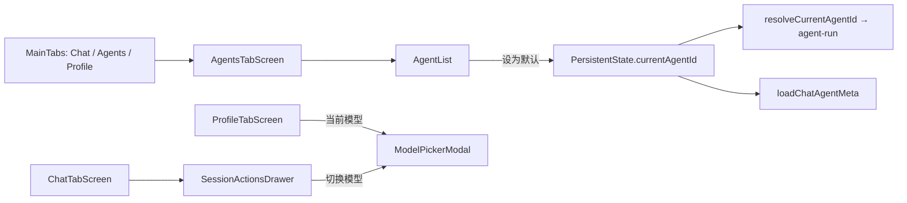
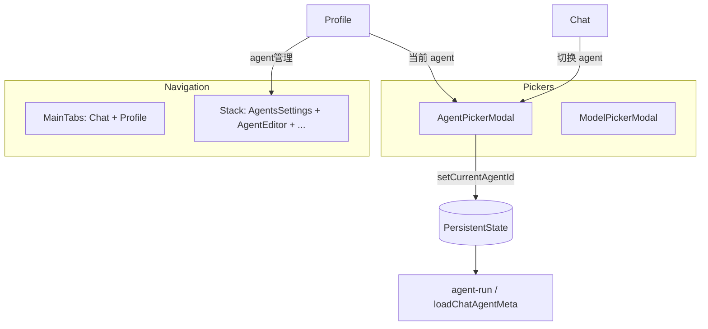

# Mobile Agent 导航与当前 Agent 设置 技术规格（SPEC）

> 需求：[prd.md](./prd.md)  
> 相关：`mobile-app/spec.md`（`PersistentState.currentAgentId`、`AgentList`）、`mobile-fix-v2/spec.md`  
> **范围**：`apps/mobile`；**无 Core  schema 变更**（沿用 `get/setCurrentAgentId`）

## 设计目标

- 底部 Tab 收敛为 **对话 + 我的**；Agent 管理能力迁至 **Stack「agent管理」**。
- 用 **工作区「当前 agent」** + **会话抽屉「切换 agent」** 统一替代「设为默认 / 默认徽标」产品语义。
- **Agent 选择器** 交互对齐现有 `ModelPickerModal`；重命名对齐 `TextPromptModal`（与会话重命名同模式）。
- 最小 diff：复用 `AgentList`、`resolveCurrentAgentId`、`loadChatAgentMeta`，不新增持久化字段。

---

## 现状与约束（代码探索）

### 架构与数据流



| 模块 | 现状 | 本期 |
|------|------|------|
| `RootNavigator.tsx` | 3 Tab：Chat / **Agents** / Profile | 2 Tab；Agents 改为 Stack `AgentsSettings` |
| `AgentsTabScreen.tsx` | Tab 壳 + `AppHeader pageKey=agents` + `AgentList` | **删除**；逻辑迁至 `AgentsSettingsScreen` |
| `AgentList.tsx` | ⋮「设为默认」、卡片「默认」徽标；`isDefault` 来自 `currentAgentId` | 移除默认 UI；**+重命名** |
| `ProfileTabScreen.tsx` | 工作区：当前模型/正则组；配置区 5 项 | **+当前 agent**；配置 **+agent管理** |
| `SessionActionsDrawer.tsx` | 只读「当前模型」；「切换模型」 | **+当前 agent**；**+切换 agent** |
| `ModelPickerModal.tsx` | `setCurrentModelId` + 列表 | 参照实现 **`AgentPickerModal`** |
| `agent-run.service.ts` | `resolveCurrentAgentId`：state → registry 首项 | **不变**；错误文案改指向「agent管理」 |
| `useAndroidChatBackHandler` | 含 `modelPickerOpen` | **+`agentPickerOpen`** 关闭优先 |

### 关键代码锚点

**设为默认（将删除）**

```193:200:apps/mobile/src/components/agent/AgentList.tsx
  const menuItems = (agentId: string, isDefault: boolean) => {
    const items = [];
    if (!isDefault) {
      items.push({label: '设为默认', action: 'set-default'});
    }
    items.push({label: '复制', action: 'duplicate'});
```

**当前 Agent 解析（保持不变）**

```31:41:apps/mobile/src/services/agent-run.service.ts
export async function resolveCurrentAgentId(
  runtime: MobileNovelMasterRuntime,
): Promise<string | undefined> {
  const fromState = await runtime.state.getCurrentAgentId();
  if (fromState != null && fromState !== '') {
    return fromState;
  }
  const ids = await runtime.agentRegistry.listAgentIds();
  return ids[0];
}
```

**Profile 导航模式（agent管理 应一致）**

```117:122:apps/mobile/src/screens/tabs/ProfileTabScreen.tsx
  const navigateTo = (route: keyof RootStackParamList) => {
    const parent = navigation.getParent();
    if (parent) {
      parent.navigate(route);
    }
  };
```

### 技术边界

- **不**改 `AgentDefinition` schema、registry **ID**、CLI。
- **不**改 `AgentEditorScreen` 表单（名称仍可在编辑器改；列表重命名为快捷入口）。
- 「当前 agent」展示名 = `definition.name`；未配置且无 registry 项时展示 **「—」**（与模型一致）。
- 选择器内「当前」标记：`getCurrentAgentId()` 有值则用；否则 **effective** 指针（`resolveCurrentAgentId`）仅用于 **run**，选择器 UI 建议：无显式 state 时不标「当前」，或标 registry 首项——**推荐**：与 `AgentList` 旧逻辑一致，无 state 时首项显示「当前」（避免用户困惑）；选中任意项均 **显式** `setCurrentAgentId`。
- `header-config` 中 Tab 专用键 `agents` 可移除；Stack 用 `AgentsSettings`。
- `AgentTabIcon` 可保留文件（未使用不删，避免无关 diff）或移除 import——**推荐**仅删 `RootNavigator` 引用。

---

## 总体方案



1. **Stack 页 `AgentsSettingsScreen`**：`StackScreenLayout` + 原 `AgentsTabScreen` 内容（`AgentList` + 新建）。
2. **`AgentPickerModal`**：列出 registry agents；选中 → `setCurrentAgentId` → `onSelected` 回调刷新 UI。
3. **`resolveCurrentAgentDisplayLabel(runtime)`**（新 small service）：供 Profile / Drawer 只读展示。
4. **`AgentList` 菜单**：`重命名 | 复制 | 删除`；去掉徽标与 `handleSetDefault` 菜单项（删除时 **仍** 维护 `currentAgentId` 指针，现有逻辑保留）。
5. **重命名**：`TextPromptModal` + `agentRegistry.upsert(id, {...def, name: trimmed})`；空名拒绝（Modal 已有 `canSubmit`）。

---

## 最终项目结构

```
apps/mobile/src/
  components/agent/
    AgentList.tsx                    # 修改：去默认、加重命名
    AgentPickerModal.tsx             # 新增
  screens/stack/
    AgentsSettingsScreen.tsx         # 新增（替代 AgentsTabScreen）
  screens/tabs/
    AgentsTabScreen.tsx              # 删除
    ProfileTabScreen.tsx             # 修改
    ChatTabScreen.tsx                # 修改：agent picker + drawer
  components/chrome/
    SessionActionsDrawer.tsx         # 修改
  hooks/
    useAndroidChatBackHandler.ts     # 修改：agentPickerOpen
  navigation/
    RootNavigator.tsx                # 修改：2 Tab + AgentsSettings route
    types.ts                         # 修改
    header-config.ts                 # 修改
  services/
    agent-display-label.ts           # 新增（可选，或内联于 picker）
    agent-create.ts                  # 新增：createBlankAgent 抽取（原 AgentsTabScreen 逻辑）
  __tests__/
    agent-picker-modal.test.ts       # 新增（推荐）
    use-android-chat-back-handler.test.ts  # 修改：T-B agent picker
```

---

## 变更点清单

| 文件 | 改动 |
|------|------|
| `navigation/RootNavigator.tsx` | 移除 `Agents` Tab；注册 `AgentsSettings` Stack Screen |
| `navigation/types.ts` | `MainTabParamList` 删 `Agents`；`RootStackParamList` 增 `AgentsSettings` |
| `navigation/header-config.ts` | 删 `agents` Tab 项；增 `AgentsSettings: { title: 'agent管理', showBack: true }` |
| `screens/stack/AgentsSettingsScreen.tsx` | **新增** |
| `screens/tabs/AgentsTabScreen.tsx` | **删除** |
| `services/agent-create.ts` | **新增** `createBlankAgent(runtime, navigation)` 或返回 `agentId` |
| `components/agent/AgentPickerModal.tsx` | **新增** |
| `services/agent-display-label.ts` | **新增** `resolveCurrentAgentDisplayLabel` |
| `components/agent/AgentList.tsx` | 去默认 UI/菜单；+重命名 Modal |
| `screens/tabs/ProfileTabScreen.tsx` | 工作区「当前 agent」；配置「agent管理」 |
| `components/chrome/SessionActionsDrawer.tsx` | 当前 agent 只读 + `onSwitchAgent`；菜单「切换 agent」 |
| `screens/tabs/ChatTabScreen.tsx` | `agentPickerOpen`、`AgentPickerModal`、抽屉 wiring、`refreshChatMeta` |
| `hooks/useAndroidChatBackHandler.ts` | +`agentPickerOpen` / `closeAgentPicker` |
| `services/agent-run.service.ts` | 错误提示：「Agent」页 →「agent管理」 |

**明确不改**：Core、`AgentEditorForm`、CLI、`examples/mobile`。

---

## 详细实现步骤

### 步骤 1：导航与 Stack 页

1. `types.ts`：`MainTabParamList = { Chat, Profile }`；`AgentsSettings: undefined`。
2. `header-config.ts`：添加 `AgentsSettings`；移除 `agents`（及 `HeaderPageKey` 中的 `'agents'` 若仅 Tab 用）。
3. 新增 `services/agent-create.ts`：

```ts
/** Creates blank agent in registry; returns new agentId. */
export async function createBlankAgent(runtime, id = `agent-${Date.now()}`): Promise<string>
```

逻辑复制自 `AgentsTabScreen.handleCreate`（name/prompts/runtime）。

4. 新增 `AgentsSettingsScreen.tsx`：

```tsx
<StackScreenLayout pageKey="AgentsSettings">
  <AgentList onCreate={... navigate AgentEditor} />
</StackScreenLayout>
```

5. `RootNavigator`：`withStackLayout('AgentsSettings', AgentsSettingsScreen)`；删除 Agents `Tab.Screen` 与 `AgentTabIcon` import。
6. 删除 `AgentsTabScreen.tsx`。

### 步骤 2：`AgentPickerModal`

参照 `ModelPickerModal`：

- Props：`visible`, `onClose`, `onSelected?: (agentId: string) => void`
- `reload`：`listAgentIds` → `get(id)` → `{ agentId, label: def.name }`
- `currentId` from `getCurrentAgentId()`；列表项 `selected = agentId === currentId || (!currentId && index===0)` **（与旧默认徽标语义一致，仅 UI）**
- `select`：`await setCurrentAgentId(agentId)` → `onSelected` → `onClose`
- 标题：**「选择 Agent」**；空列表提示引导至 agent管理

### 步骤 3：`resolveCurrentAgentDisplayLabel`

```ts
export async function resolveCurrentAgentDisplayLabel(runtime): Promise<string>
```

- `resolveCurrentAgentId` → `get` → `def.name`；无 agent → `—`；get 失败 → 显示 id。

### 步骤 4：`AgentList` 调整

1. 删除：`isDefault` 字段、defaultBadge JSX、`handleSetDefault`、`set-default` 分支、`menuItems` 的 `isDefault` 参数。
2. 新增 state：`renamePrompt?: { agentId, initialName }`。
3. `handleRename(agentId, name)`：`get` → `upsert(id, { ...def, name: trimmed })` → `reload()`。
4. `menuItems`：`重命名 | 复制 | 删除`。
5. `BottomSheetMenu.onSelect`：`rename` → 打开 `TextPromptModal`。
6. 更新文件头注释（不再 mention default marker）。

### 步骤 5：`ProfileTabScreen`

1. `WORKSPACE_AGENT_MENU = { icon: '🤖', label: '当前 agent' }`（图标可与模型区分，如 `🧠`）。
2. `agentLabel` state + `refreshAgentLabel`（`useFocusEffect` 内调用）。
3. 在「当前模型」**下方**插入 `ProfileMenuItem` → 打开 `AgentPickerModal`。
4. `CONFIG_MENU` **首位或「服务商」前** 增加：`{ icon: '🤖', label: 'agent管理', route: 'AgentsSettings' }`。
5. `AgentPickerModal.onSelected` → `refreshAgentLabel`。

### 步骤 6：`SessionActionsDrawer` + `ChatTabScreen`

**Drawer**

- Props：`onSwitchAgent?: () => void`
- 状态 `agentLabel`；`visible` 时 `resolveCurrentAgentDisplayLabel`
- 顶部 info 区改为 **两行**（或两列块）：「当前 agent」「当前模型」（样式复用 `modelInfo`）
- `items`：在「切换模型」**后**插入 `{ label: '切换 agent', action: onSwitchAgent }`

**ChatTabScreen**

- `agentPickerOpen` state；`AgentPickerModal`；`onSelected` → `refreshChatMeta`
- `SessionActionsDrawer.onSwitchAgent={() => setAgentPickerOpen(true)}`
- `useAndroidChatBackHandler` 增加 `agentPickerOpen` / `closeAgentPicker`（与 model picker 同级，对话覆盖层链）

### 步骤 7：文案与清理

- `agent-run.service.ts`：`未配置 Agent。请先在「agent管理」…`
- Grep `Agent」页` / `AgentsTab` 残留并修正。

### 步骤 8：验证

```bash
npm test -w @novel-master/mobile -- agent-picker
npm test -w @novel-master/mobile -- use-android-chat-back-handler
npm run lint -w @novel-master/mobile
npm run build
```

Android 手工 PRD 验收。

---

## 测试策略

### 自动化

| ID | 范围 | 断言 |
|----|------|------|
| T-P1 | `AgentPickerModal` | 选中 agent 调用 `setCurrentAgentId`；关闭 modal |
| T-P2 | `AgentPickerModal` | 空 registry 显示空态文案 |
| T-B4 | `useAndroidChatBackHandler` | `agentPickerOpen` 时 back 关闭 picker，不离开对话 |
| T-L1 | `AgentList`（可选） | rename upsert 新 name（mock runtime） |

运行：

```bash
npm test -w @novel-master/mobile -- agent-picker
npm test -w @novel-master/mobile -- use-android-chat-back-handler
```

### 手工用例（Android，对齐 PRD）

| ID | 场景 |
|----|------|
| T1 | 底部仅「对话」「我的」 |
| T2 | 我的 → agent管理：列表/新建/编辑/批量/⋮ 无「设为默认」 |
| T3 | 列表无「默认」徽标 |
| T4 | ⋮ 重命名 → 列表与「当前 agent」同步 |
| T5 | 我的 → 当前 agent → 选择 → 对话顶栏 agent 名更新 |
| T6 | 对话抽屉：见当前 agent + 切换 agent |
| T7 | 全流程：agent管理新建 → 设当前 → 发消息 → 抽屉切换 → 再发消息 |

### 负向

- ⋮ 菜单无「设为默认」；底部无 Agent Tab。

---

## 风险与回滚方案

| 风险 | 缓解 |
|------|------|
| 用户习惯 3 Tab | PRD 已确认 2 Tab；agent管理 在配置区首屏可见 |
| 移除「设为默认」后未设 state 的用户 | `resolveCurrentAgentId` 仍 fallback 首项；选择器显式化后行为更清晰 |
| `MainTabParamList` 类型变更导致编译错误 | 全仓 grep `Agents` route |
| Drawer 增高两行 info | 保持紧凑 `modelInfo` 样式，避免遮挡操作项 |
| BackHandler 漏接 agent picker | T-B4 + 手工对话页验证 |

**回滚**：恢复 3 Tab + `AgentsTabScreen`；revert AgentList/Profile/Drawer/Picker commits；无 DB 迁移。

---

## 实现后检查清单

- [ ] 2 Tab；`AgentsSettings` Stack 可达
- [ ] 无「设为默认」「默认」徽标；有「重命名」
- [ ] 我的：当前 agent + agent管理
- [ ] 会话抽屉：当前 agent + 切换 agent
- [ ] 单测 + lint（变更文件无新 error）
- [ ] Android T1–T7
