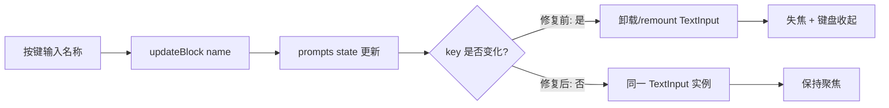

# Mobile Agent Prompt 块名称键盘失焦 Bugfix 技术规格（SPEC）

> 需求：[prd.md](./prd.md)  
> 相关：`mobile-fix-v2/spec.md`（`AgentEditorForm` 脏检测）、`agent-config-shape`、`mobile-app`  
> **范围**：`apps/mobile` 单文件行为修复，无 Core / CLI 变更

## 设计目标

- 消除 Android 上 Prompt 块「名称」字段**按任意字符键即失焦**的阻断问题。
- 以**最小 diff** 修复根因，不引入 Prompt 块数据模型或持久化格式变更。
- 满足 PRD：名称可连续输入；Agent 编辑页其它输入字段无回归。

---

## 现状与约束（代码探索）

### 涉及模块

| 路径 | 职责 |
|------|------|
| `apps/mobile/src/components/agent/AgentEditorForm.tsx` | Agent 编辑主表单；`prompts` 状态、`updateBlock`、`prompts.map` 渲染块卡片 |
| `apps/mobile/src/components/form/FormTextInput.tsx` | 主题化 `TextInput` 封装，无额外失焦逻辑 |
| `apps/mobile/src/components/agent/PromptMacroTextInput.tsx` | 文本块「内容」多行输入 + 宏芯片；**未**把 `value` 编入 `key` |
| `apps/mobile/src/screens/stack/AgentEditorScreen.tsx` | 路由壳 + `useUnsavedGuard`；无列表 key 逻辑 |

### 根因分析

Prompt 块列表项使用 **随编辑内容变化的 React `key`**：

```567:567:apps/mobile/src/components/agent/AgentEditorForm.tsx
                key={`${block.name}-${index}`}
```

用户编辑「名称」时流程为：

1. `onChangeText` → `updateBlock(index, {name: v})` → `setPrompts` 更新 `block.name`
2. `block.name` 变化 → `key` 字符串变化（例如 `block-1-0` → `block-1a-0`）
3. React 判定为**新节点**，卸载旧 `View`（含 `FormTextInput`）并挂载新实例
4. `TextInput` 失去焦点；Android 软键盘收起

这与 PRD 中「任意字符键一次即失焦」完全一致。同页 **Agent 名称**、**maxSteps**、**工具名单**、**文本块内容** 等字段不受影响，因其父级 `key` 不依赖正在编辑的 `value`。

「内容」字段虽也触发 `updateBlock`，但外层卡片 `key` 仅含 `name`，改内容不改 `key`，故仅「名称」暴露该缺陷。

### 对比：仓库内更稳妥的 key 用法

`EventConfigBlocks.tsx` 对事件块使用稳定的 `block.id`，对动作子项使用 `key={\`${block.id}-action-${actionIndex}\`}`（`id` 不随表单文本变）。

`PromptBlock`（Core `AgentDefinition.prompts`）**无** `id` 字段；本期 PRD 明确不扩数据模型，故不在 YAML/Registry 层引入 `blockId`。

### 影响与兼容性

| 项 | 说明 |
|----|------|
| 数据 / API | 无变更 |
| 保存语义 | 仍走 `buildDefinition()` → `agentRegistry.upsert` |
| 脏检测 | `formSnapshotJson` 已含完整 `prompts`，与 `key` 无关 |
| 块排序 / 删除 | 仅改 React 协调策略；`prompts` 数组仍以 `index` 驱动 `updateBlock` / `moveBlock` |
| iOS | 未在 PRD 验收范围；同一根因通常也存在，修复后一并受益，本期不单独验收 |

### 技术边界

- 不修改 `@novel-master/core` 的 `PromptBlock` 类型。
- 不新增 Jest 组件测试基础设施（`apps/mobile` 当前几乎无 RN 组件单测）；以 **Android 手工验收** 为主。
- 不同步 `examples/mobile` 原型。

---

## 总体方案

将 Prompt 块卡片的 React `key` 改为**在单次编辑会话内稳定**、且**不随 `block.name` 或 `block.content` 变化**。

推荐实现（按优先级）：

1. **首选（本期采用）**：`key={String(index)}` 或 `key={\`prompt-block-${index}\`}`  
   - 改 1 行即可修复名称输入失焦。  
   - 列表为受控组件（`value` 均来自 `prompts[index]`），不依赖子组件非受控内部状态。  
   - `moveBlock` 交换数组元素时，index 与元素绑定关系变化，React 会按 index 复用节点；因数据受控，显示仍与 `prompts` 一致（与改 key 前行为同级，可接受）。

2. **备选（仅当 index key 在排序/删除回归中暴露问题时）**：在 `AgentEditorForm` 本地 state 为每块附加 `_clientId`（仅内存，不写入 `AgentDefinition`）。加载与 `addBlock` 时 `crypto.randomUUID()` / 递增 id。改动面更大，**本期不默认采用**。



---

## 最终项目结构

无新增文件；仅修改现有组件：

```
apps/mobile/src/components/agent/
  AgentEditorForm.tsx    # 修改 prompts.map 的 key
```

---

## 变更点清单

| 文件 | 改动 |
|------|------|
| `apps/mobile/src/components/agent/AgentEditorForm.tsx` | `prompts.map` 外层 `View`：`key={`${block.name}-${index}`}` → `key={\`prompt-block-${index}\`}`（或 `key={index}`） |

**明确不改**

- `FormTextInput.tsx`、`PromptMacroTextInput.tsx`
- Core agent 定义、YAML 导入导出
- `AgentEditorScreen.tsx`

---

## 详细实现步骤

### 步骤 1：修复列表 key（必做）

在 `AgentEditorForm.tsx` 第 565–567 行附近，将：

```tsx
key={`${block.name}-${index}`}
```

改为：

```tsx
key={`prompt-block-${index}`}
```

**禁止**继续使用 `block.name`、`block.content`、`block.type` 等会随编辑变化的字段作为 key 的唯一区分部分。

### 步骤 2：本地静态检查

```bash
npm run lint -w @novel-master/mobile
```

### 步骤 3：Android 手工验收（必做，对齐 PRD）

在真机或模拟器上打开任意 Agent → Prompt 块：

1. **主路径**：新建文本块，在「名称」连续输入 `my-prompt-block-01`（≥20 字符），确认无中途失焦、保存后再进显示正确。
2. **编辑已有块**：修改已有块名称，确认同样可连续输入。
3. **同页回归**：Agent 名称、maxSteps、工具名单（多行）、文本块「内容」+ 宏插入，各连续输入/修改 ≥3 次，无「一键失焦」。
4. **排序**：两块以上，↑↓ 调换顺序后名称/内容仍对应正确块。
5. **删除**：删除中间块后，其余块名称字段仍可编辑。

### 步骤 4（可选）：代码库防复发扫描

在 `apps/mobile` 内搜索 `key={\`${.*name` 等模式，确认无其它「可编辑字段编入 key」的同类问题（当前仅 `AgentEditorForm` 一处）。

---

## 测试策略

### 自动化

| 项 | 说明 |
|----|------|
| ESLint | `npm run lint -w @novel-master/mobile` |
| 单测 | 本期不新增；Core agent 测试无需改动 |

### 测试用例（手工，Android）

| ID | Given | When | Then |
|----|-------|------|------|
| T1 | Agent 编辑页有 ≥1 Prompt 块 | 聚焦「名称」，连续输入 20+ 字符 | 全程保持聚焦，键盘不收起，文本完整显示 |
| T2 | 刚通过「添加」新建文本块 | 修改默认名 `block-N` | 同 T1 |
| T3 | 已保存的 Agent，两块不同名称 | 分别编辑两块「名称」 | 均可持续输入；保存后名称正确 |
| T4 | 同页 | 编辑 Agent 名称、maxSteps、工具名单、文本块内容 | 无「单键失焦」 |
| T5 | 两块 Prompt | 使用 ↑↓ 交换顺序 | 各块名称/内容与交换前所属块一致（目视 + 保存验证） |
| T6 | 三块 Prompt | 删除中间块 | 剩余块可编辑名称；保存成功 |

### 负向（修复前缺陷）

- 在「名称」按任意字符键 **一次** → 不得再出现立即失焦 + 键盘收起。

---

## 风险与回滚方案

| 风险 | 可能性 | 缓解 |
|------|--------|------|
| 使用 `index` 作 key，在 `moveBlock` / `deleteBlock` 时 React 复用错位 | 低 | 所有字段受控自 `prompts`；验收 T5/T6 |
| 两块同名块仅用 index 区分 | 已有 | YAML/业务允许重名；UI 头栏仍显示 `block.name`，与改前一致 |
| 未来在块内增加非受控子状态 | 低 | 规范：列表 key 不得依赖可编辑字段；或引入客户端 `blockId` |

**回滚**：恢复 `key={\`${block.name}-${index}\`}` 单行即可；无迁移、无数据回滚。

---

## 实现后检查清单

- [ ] `AgentEditorForm` 列表 `key` 已稳定化
- [ ] `npm run lint -w @novel-master/mobile` 通过
- [ ] Android T1–T6 手工通过
- [ ] 未改动 Core / 持久化格式
