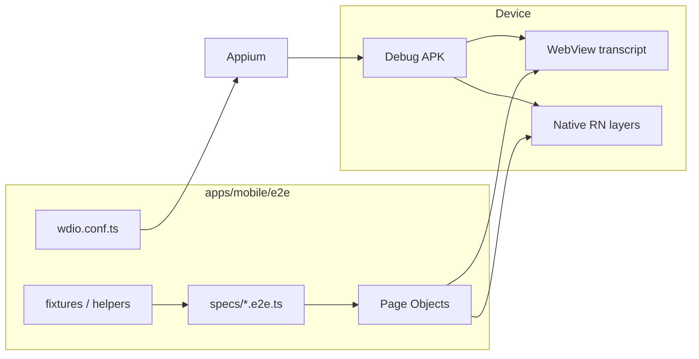

# Mobile Android E2E（Appium + WebdriverIO + TS）技术规格（SPEC）

> PRD：`.apm/kb/docs/Iterations/mobile-android-e2e-appium/prd.md`  
> 关联验收来源：`chat-rollback-vfs-tool-fixes`（VFS/回滚滚动）、`chat-tool-turn-phase-ui`（工具阶段条与块顺序）  
> **并发**：见文末「与其它迭代并发」

## 设计目标

- 在 **独立目录** 建立 Appium + WebdriverIO + TypeScript E2E，**不** 改动 Release/Jest 默认路径。
- 首期自动化 `chat-rollback-vfs-tool-fixes` 中 **Mobile UI 可测** 的四类场景：重命名 Toast、回滚、回滚后 VFS、transcript 块顺序/loading。
- 通过 **少量 testID** + WebView **已有 `data-*` 属性** 稳定定位；不引入真实 LLM。

## 现状与约束（代码探索）

| 模块 | 现状 | E2E 影响 |
|------|------|----------|
| `apps/mobile/package.json` | 仅 `jest` 测试脚本 | 新增 `e2e` script，**不** 改 `pretest`/`test` |
| `apps/mobile/src` | **无 `testID`** | 需 additive `testID`（Toast、VFS、Tab、Composer 等） |
| `accessibilityLabel` | 部分存在（Composer 发送、VFS 工具栏） | 可复用，但不覆盖回滚菜单/Toast |
| 聊天 UI | 默认 `ChatTranscriptWebView`（WebView） | 需 `driver.switchContext('WEBVIEW_*')` |
| `main.ts` transcript | `data-id`（messageId）、`data-action`（rollback、load-older 等） | WebView Page Object 主选择器 |
| `VfsFileManager.tsx` | 重命名经 `TextPromptModal` + `showToast` | 原生 RN，UiAutomator2 可驱动 |
| `ToastHost.tsx` | 纯 Text，无 testID | 加 `testID="toast-message"` |
| `ChatTabScreen.tsx` | 回滚 `Alert.alert` + `handleRollbackFromMessage` | 系统 Alert + WebView 长按菜单 |
| Jest | 84+ 文件，`__tests__/` 含 ChatTabScreen integration mock | **保持独立**，E2E 不共用 mockRuntime |
| CI | 仅 `release.yml` | **首期不改** |
| Android | `MainActivity`，包名见 `android/app/build.gradle` `applicationId` | WDIO `appium:appPackage` / `appActivity` |

**结论**：E2E 为 **additive**；生产链路 = 现有 RN 源码 + Gradle + Release workflow，**不依赖** `e2e/` 目录即可构建运行。

## 总体方案



### 技术栈

| 组件 | 选型 |
|------|------|
| 驱动 | Appium 2.x，Android `UiAutomator2` |
| 客户端 | WebdriverIO 9.x + `@wdio/appium-service` + `@wdio/mocha-framework` |
| 语言 | TypeScript（与 monorepo 一致） |
| 断言 | `expect-webdriverio` / WDIO `expect` |
| App | **debug** build（`assembleDebug`），避免与 release 产物混淆 |

### Fixture 策略（首期）

**主路径：UI 驱动 seed**（零 DB 注入，不碰生产代码路径）

1. 启动 App → 创建项目 → 创建会话  
2. 切工作区 Tab → VFS 创建文件/目录  
3. 切聊天 Tab → 发送 user 消息（可选，若测回滚）

**辅路径（可选 Phase 2）**：`e2e/fixtures/bootstrap.sql` + adb push 到 app SQLite 路径 — **仅 e2e 文档说明**，首期不强制。

**工具 loading / 块顺序**：预置会话通过 **UI 发送 + debug mock** 或 **复制含 tool_use 块的 fixture 消息**（若 UI seed 过重，首期用 `packages/core` test helper 生成 JSON，经 **e2e-only adb 脚本** 注入 — 放在 `e2e/scripts/`，不进入 `src/`）。

### WebView 封装

```typescript
// e2e/pageobjects/chat-transcript.page.ts（示意）
async openWebView(): Promise<void> {
  const contexts = await browser.getContexts();
  const webview = contexts.find(c => String(c).includes('WEBVIEW'));
  await browser.switchContext(webview!);
}
async longPressMessage(messageId: string): Promise<void> {
  const row = await $(`.row.message[data-id="${messageId}"]`);
  await browser.execute((el) => { /* touch long press */ }, row);
}
async tapMenuAction(action: 'rollback'): Promise<void> {
  await $(`[data-action="menu-action"][data-menu-action="${action}"]`).click(); // 需在 boot 菜单项加 data 属性或按文案
}
```

**待加**：WebView 菜单按钮增加 `data-menu-action="rollback"`（additive HTML 属性，不影响用户）。

## 最终项目结构

```
apps/mobile/
  e2e/
    README.md
    package.json              # 可选：e2e 专用 devDeps，或挂到 mobile devDependencies
    tsconfig.json
    wdio.conf.ts
    wdio.shared.conf.ts
    pageobjects/
      app.page.ts             # 启动、Tab 切换
      chat-transcript.page.ts # WebView context、消息、回滚菜单
      vfs.page.ts             # 文件列表、重命名、Toast 断言
      alert.page.ts           # Android Alert（回滚确认）
    helpers/
      context.ts              # NATIVE ↔ WEBVIEW 切换
      scroll-anchor.ts        # 回滚前后锚点 visibility / scrollTop 采样
    specs/
      smoke.launch.e2e.ts
      vfs.rename-conflict.e2e.ts
      chat.rollback.e2e.ts
      chat.tool-order-loading.e2e.ts
    fixtures/
      session-ids.ts          # 常量；或 UI seed 步骤
  src/                        # 仅 additive testID / data-menu-action
    components/chrome/ToastHost.tsx
    components/vfs/VfsFileManager.tsx
    web/chat-transcript/main.ts   # data-menu-action on menu items
  package.json                # +"e2e": "wdio run ./e2e/wdio.conf.ts"
```

## 变更点清单

| 文件 | 变更类型 | 说明 |
|------|----------|------|
| `apps/mobile/e2e/**` | **新增** | 全部 E2E 资产 |
| `apps/mobile/package.json` | 修改 | 增加 `e2e` script + devDependencies（wdio、appium 相关） |
| `ToastHost.tsx` | additive | `testID="toast-message"` on toast container |
| `VfsFileManager.tsx` | additive | 行/重命名输入/确认 `testID` |
| `TextPromptModal` / rename flow | additive | `testID` for rename input & submit |
| `main.ts` menu render | additive | `data-menu-action="rollback"` 等 |
| `ChatComposer.tsx` | 可选 | `testID="chat-composer-input"`（已有 accessibilityLabel 发送） |
| Tab 导航 | additive | `testID="tab-chat"` / `tab-workspace` |
| `.github/workflows/*` | **不改**（首期） | |
| `release.yml` / Gradle release | **不改** | |

## 详细实现步骤

### Phase 1 — 脚手架（可运行 smoke）

1. 创建 `apps/mobile/e2e/`，初始化 `wdio.conf.ts`：
   - `port: 4723`，`path: /`，capabilities：`platformName: Android`，`appium:automationName: UiAutomator2`
   - `appium:app`: 指向 `android/app/build/outputs/apk/debug/app-debug.apk` 或已安装包 + `appPackage`/`appActivity`
   - `@wdio/appium-service` 自动启停 Appium（本地开发）
2. `npm run e2e -- --spec smoke.launch.e2e.ts`：启动 App，断言主 Tab 可见。
3. 编写 `e2e/README.md`：Node 22、ANDROID_HOME、模拟器、`appium driver install uiautomator2`、构建 debug APK。

### Phase 2 — testID / WebView 钩子（additive）

**2a（可与 tool-turn-ui 并行）**

1. `ToastHost` → `testID="toast-message"`  
2. VFS：文件行 `testID` 或稳定 `accessibilityLabel`  
3. `TextPromptModal`：input `testID="text-prompt-input"`，确认 `testID="text-prompt-submit"`  
4. Bottom Tab：`testID` on Chat / Workspace  

**2b（依赖 `chat-tool-turn-phase-ui` 合入 `main.ts` 后）**

5. `main.ts` 菜单：`data-menu-action="rollback"` 等（与 tool-turn 阶段条改动同文件，避免双分支并发改）

**原则**：只加属性，不改业务分支。

### Phase 3 — Page Objects + helpers

1. `app.page.ts`：`launchFresh()`、`switchToChat()`、`switchToWorkspace()`  
2. `chat-transcript.page.ts`：context 切换、按 `data-id` 找消息、long press、菜单、滚动采样  
3. `vfs.page.ts`：进入目录、创建文件、重命名、读 Toast  
4. `alert.page.ts`：`driver.acceptAlert()` / UiAutomator 「回滚」按钮  
5. `scroll-anchor.ts`：回滚前记录锚点 `getLocation()` + WebView `scrollTop`（execute script），回滚后断言偏移 < 阈值

### Phase 4 — rollback-vfs 用例

| Spec | 对齐 PRD | 步骤摘要 |
|------|----------|----------|
| `vfs.rename-conflict.e2e.ts` | rollback-vfs §2 | UI 建 `a.md`、`b.md` → 重命名 b→a → assert toast + 两文件仍在 |
| `chat.rollback.e2e.ts` | §1、§3 UI | UI seed 3+ 消息 → scroll → long press → rollback → assert toast + 消息数 + anchor visible |
| `chat.rollback-vfs.e2e.ts` | §3 | 工作区建文件 → user 消息 → 再改 VFS → 回滚 → VFS 断言 |
| `chat.tool-phase-and-order.e2e.ts` | tool-turn-ui | fixture 会话 → thinking→body→tools 顺序；执行期阶段条；result 后工具组 |

### Phase 5 — 文档与可选本地脚本

1. 根目录或 mobile README 增加「E2E 与 Jest 分工」一段  
2. （可选）`e2e/scripts/build-debug-apk.sh` 封装 `./gradlew assembleDebug`

## 测试策略

### E2E 用例（首期）

| ID | 文件 | 断言要点 |
|----|------|----------|
| E0 | `smoke.launch.e2e.ts` | App 启动、Tab 可见 |
| E1 | `vfs.rename-conflict.e2e.ts` | Toast 含「名称不能重复」；双文件存在 |
| E2 | `chat.rollback.e2e.ts` | 回滚成功 Toast；tail 消息消失；锚点未「跳到页顶」 |
| E3 | `chat.rollback-vfs.e2e.ts` | 回滚后 VFS 文件集与锚点一致 |
| E4 | `chat.tool-phase-and-order.e2e.ts` | thinking→body→tools；执行期「正在执行工具调用…」；无 pending spinner |

### 与 Jest 分工

| 层级 | 工具 | 覆盖 |
|------|------|------|
| Core 逻辑 | `packages/core` node:test | checkpoint、write、rollback 算法 |
| RN 组件/服务 | Jest | message-blocks、scroll 公式、VfsFileManager mock |
| 整机 UX | **Appium E2E** | Tab、WebView 菜单、Toast、Alert、真滚动 |

### 本地运行命令（目标态）

```bash
# 构建 debug APK（一次性）
cd apps/mobile/android && ./gradlew assembleDebug

# 启动模拟器 + Appium（wdio 可自动启 Appium）
cd apps/mobile && npm run e2e

# 单 spec
npm run e2e -- --spec e2e/specs/vfs.rename-conflict.e2e.ts
```

### 失败诊断

- WDIO：`afterTest` hook 保存 `./e2e/artifacts/screenshots/` + `./e2e/artifacts/page-source/`
- 日志打印当前 `getContexts()` 与 active context

## 风险与回滚方案

| 风险 | 缓解 / 回滚 |
|------|-------------|
| WebView flaky | 显式 wait + retry 菜单；减少动画依赖 |
| 用例过慢 | 限制套件规模；UI seed 共享 `before` |
| testID 污染产品感 | 仅测试用 id，用户不可见 |
| 误将 E2E 接入 CI 阻塞 release | PRD/SPEC 明确首期不接；后续单独 PR |
| **整包回滚** | 删除 `apps/mobile/e2e/` +  revert testID commits → 生产链路恢复 |

## 与其它迭代并发

| 可并行（Lane A） | 阻塞至 tool-turn 合入 |
|----------------|----------------------|
| `e2e/**` 脚手架、smoke、Page Objects | `main.ts` `data-menu-action` |
| Toast / VFS / Tab `testID` | E4 `chat.tool-phase-and-order`（阶段条断言） |
| E1 rename-conflict | E2 回滚保留整 turn（tool_result 仍在）断言 |

**合并顺序**：`chat-tool-turn-phase-ui` 先合 → 本迭代补 2b + E4 + E2 turn 断言。

---

**请确认本 SPEC 后进入编码。** 首期实现顺序：Phase 1 → 2a → 3 → E1/E2 骨架 →（tool-turn 后）2b → E4。
