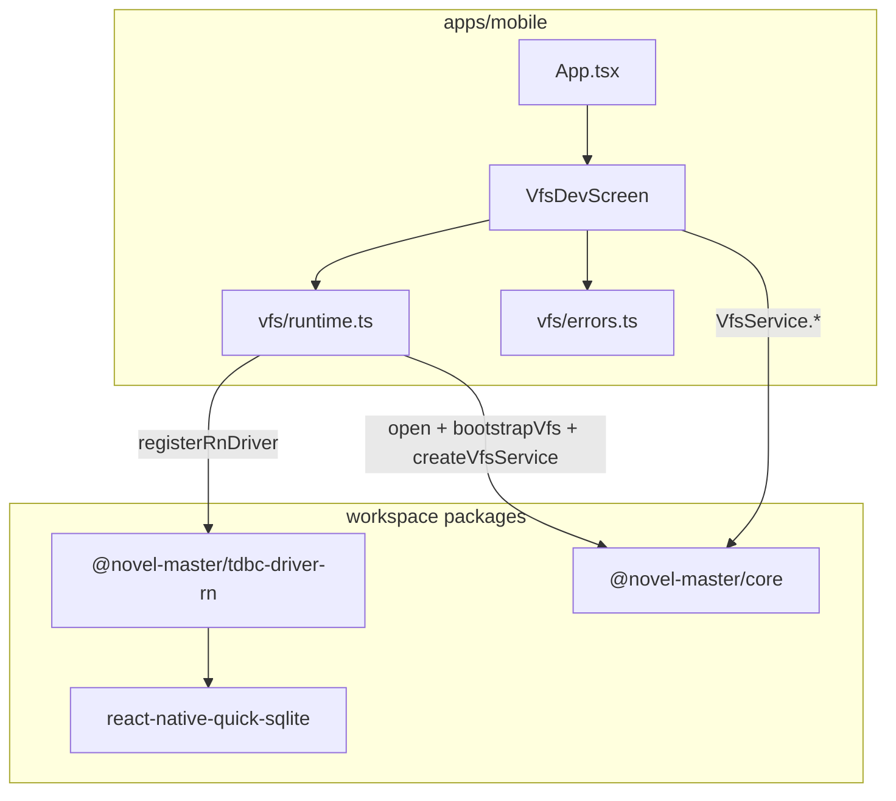

# Mobile App 脚手架 技术规格（SPEC）

## 设计目标

- 在 monorepo 内 **新建** `apps/mobile`（RN CLI init，**不**复制 banzhu），作为 `@novel-master/mobile` workspace 包。
- 通过 Metro monorepo 配置消费 **`@novel-master/core`**（`bootstrapVfs`、`createVfsService`、`VfsService`、`VfsError`）与 **`@novel-master/tdbc-driver-rn`**（`registerRnDriver` + `react-native-quick-sqlite`）。
- 提供 **VFS 开发验证页**，六类操作与 CLI 语义一致：`list` / `read` / `write` / `replace` / `delete` / `glob`（**不含** `grep`；PRD 未要求）。
- **Android Debug** 可运行；iOS 目录可保留、不验收。
- 不修改 `packages/core` VFS 行为；不抽取 CLI 命令到共享包（本期允许 app 内薄封装重复）。

---

## 现状与约束（代码探索）

| 项 | 现状 | 对本迭代影响 |
|----|------|----------------|
| `packages/core` | 导出 `open`、`bootstrapVfs`、`createVfsService`、`VfsService`、`VfsError` 等；VFS 实现无 `node:` 依赖 | 可被 Metro 打包（需先 `tsc` 出 `dist/` 或配置 watch） |
| `packages/core` 包格式 | `"type": "module"`，`main`/`exports` → `./dist/index.js` | App 通过 workspace 依赖解析到 `dist`；**开发前须 build core** |
| `apps/cli` `createVfsRuntime` | `registerBetterSqlite3Driver()` + `tdbc:sqlite:file:${dbPath}` + `mkdir` | **不可直接复用**（Node FS）；app 需 **RN 版 runtime** |
| `apps/cli` VFS 子命令 | `runList`/`runRead`/… 调 `VfsService`，错误经 `formatCliError`（`VfsError`/`TdbcError`） | 验证页调用 **同一 `VfsService` 方法**；错误文案对齐 `formatCliError` 逻辑 |
| `tdbc-driver-rn` | `registerRnDriver()`；`RnDriver.open` 用 `dbName ?? filename`；默认 `QuickSqliteAdapter` | URL `tdbc:sqlite:file:<name>` → quick-sqlite 的 `name` |
| `react-native-quick-sqlite` | peer `>=8.0.0`；`open({ name, location? })` | 须在 `apps/mobile` **dependencies** 安装并 autolink |
| 根 workspaces | `packages/*`、`apps/*`、`scripts/*` | `apps/mobile` 自动入 workspace |
| `tsconfig.base.json` | `NodeNext`、无 RN types | mobile 独立 `tsconfig` 用 `@react-native/typescript-config` |
| banzhu `metro.config.js` | 仅 `buffer` alias，**非** monorepo | **不复制**；采用 RN 官方 monorepo `watchFolders` 模式 |
| PRD | 设备 DB ≠ CLI `.novel-master/novel.db` | 使用 quick-sqlite 应用内库名，见下文 |

**兼容性**：纯新增 `apps/mobile`；不改 core/cli 公共 API。若 Metro 无法解析 workspace ESM，仅在 mobile 侧加配置，不回改 core 为 CJS。

---

## 总体方案

### 架构



### 数据库与 bootstrap 定案

| 决策 | 值 | 理由 |
|------|-----|------|
| 存储 | `react-native-quick-sqlite` 应用私有目录（`location` 默认 / 省略） | 与 PRD「应用私有目录」一致 |
| DB 逻辑名 | `novel-master-vfs` | 与 CLI 路径 `novel.db` 区分，避免误以为共库 |
| TDBC URL | `tdbc:sqlite:file:novel-master-vfs` | 经 `open()` → `RnDriver` → `filename` → quick-sqlite `name` |
| 初始化时机 | **App 启动** `useEffect` 内懒加载单例（`getVfsRuntime()`） | 满足 PRD「启动时 bootstrap」；首屏可先显示「VFS 初始化中…」 |
| 连接生命周期 | 单例 `conn` + `vfs`，进程内复用；**不**在每次按钮点击时 `close` | 开发页简化；`App` unmount 时可 `conn.close()`（可选） |
| 与 CLI 对照 | 同 schema（`bootstrapVfs` DDL 相同），**不同物理文件** | 用 `nm vfs` + 设备页分别验证；不做 sync |

常量（`apps/mobile/src/vfs/constants.ts`）：

```typescript
export const MOBILE_VFS_DB_NAME = "novel-master-vfs";
export const MOBILE_TDBC_URL = `tdbc:sqlite:file:${MOBILE_VFS_DB_NAME}`;
```

### RN 初始化版本

- 使用 **`npx @react-native-community/cli@latest init`** 生成时的 **锁定版本**（写入 `apps/mobile/README.md` 顶部表格：`react-native`、`react`、`@react-native-community/cli`）。
- **不**对齐 banzhu 0.85.1。
- **New Architecture**：init 默认值写入 `android/gradle.properties`；若 quick-sqlite 链接失败，**首期回退** `newArchEnabled=false` 并记录在 README「已知问题」（真机冒烟后定稿）。

### Metro monorepo

`apps/mobile/metro.config.js`（遵循 [React Native Monorepos](https://reactnative.dev/docs/monorepos)）：

- `watchFolders` = monorepo 根目录（`path.resolve(__dirname, '../..')`）。
- `resolver.nodeModulesPaths` = `[apps/mobile/node_modules, root/node_modules]`。
- `resolver.disableHierarchicalLookup = true`（hoist 场景下避免解析到错误副本）。

**不**在首期引入 `@rnx-kit/metro-config`，除非默认配置无法解析 `@novel-master/*`；若失败再追加 `@rnx-kit/metro-resolver-symlinks` 作为回滚 B 方案。

### 构建依赖顺序

Metro 消费 **已编译** 的 `packages/*/dist`：

```bash
npm run build -w @novel-master/core -w @novel-master/tdbc-driver-rn
```

在 `apps/mobile/package.json` 增加：

- `"prestart"`, `"preandroid"`: 上述 build（或根脚本 `mobile:deps`）。

根 `package.json` 可选：

```json
"mobile:start": "npm run start -w @novel-master/mobile",
"mobile:android": "npm run android -w @novel-master/mobile"
```

---

## 最终项目结构

```text
novel-master/
  package.json                    # + mobile:start / mobile:android（可选）
  .nvmrc                          # 22.22.0
  .gitignore                      # 已有 .novel-master/、tmp/；无需为 app DB 新增（非仓库路径）
  packages/
    core/                         # 不变
    tdbc-driver-rn/               # 不变
  apps/
    cli/                          # 不变；对照测试用
    mobile/                       # 【新增】
      package.json                # @novel-master/mobile
      metro.config.js
      babel.config.js
      tsconfig.json
      index.js
      app.json                    # displayName: Novel Master
      README.md
      android/                    # init 生成
      ios/                        # init 生成（不验收）
      src/
        App.tsx                   # 导航：Home + VfsDev
        screens/
          HomeScreen.tsx          # 说明 + 进入 VFS 验证页
          VfsDevScreen.tsx        # 六类操作 UI
        vfs/
          constants.ts
          runtime.ts              # registerRnDriver + open + bootstrap + singleton
          errors.ts               # formatVfsError；VfsError/TdbcError 从 core 引入
      __tests__/
        errors.test.ts            # 占位：formatVfsError
      jest.config.js              # init 自带
```

---

## 变更点清单

| 路径 | 操作 | 说明 |
|------|------|------|
| `apps/mobile/**` | **新增** | RN init + 上述 `src/` |
| `package-lock.json` | 更新 | mobile + quick-sqlite 依赖 |
| `package.json`（根） | 修改 | 可选 `mobile:*` 脚本 |
| `.apm/kb/docs/Iterations/mobile-app-scaffold/spec.md` | 新增 | 本文档 |
| `packages/core` | **不改** | |
| `packages/tdbc-driver-rn` | **不改** | |
| `apps/cli` | **不改** | 对照行为 |

**禁止**：从 banzhu 复制 `src/app`、`android/` 定制业务、图标脚本等。

---

## 详细实现步骤

### 步骤 1：RN 脚手架（M1）

1. 确保 `apps/mobile` 不存在或为空。
2. 在仓库根执行（示例，**实际版本以命令输出为准**）：

   ```bash
   npx @react-native-community/cli@latest init NovelMasterTemp \
     --directory apps/mobile \
     --pm npm \
     --skip-git-init
   ```

   若 CLI 不支持直接写入已有 monorepo 的 `apps/mobile`，则 init 到临时目录再 **移动合并**，并删除临时 `package-lock.json`（仅保留根 lock）。

3. 修改 `apps/mobile/package.json`：
   - `"name": "@novel-master/mobile"`
   - `"private": true`
   - 删除独立 `package-lock.json`（若有）
   - `dependencies` 增加：`@novel-master/core`、`@novel-master/tdbc-driver-rn`、`react-native-quick-sqlite`（具体版本与 RN 兼容矩阵以 npm 为准）

4. 根目录 `npm install`。

5. `README.md` 记录：init 日期、RN/React 版本、JDK/Android SDK 要求。

6. 验证：`cd apps/mobile && npx react-native run-android`（空壳 App 启动）。

### 步骤 2：Metro + TypeScript（M2）

1. 替换/编写 `metro.config.js`（见「Metro monorepo」）。
2. `tsconfig.json` 扩展 `@react-native/typescript-config`，`include`: `src/**/*`。
3. `prestart` / `preandroid` 构建 core 与 tdbc-driver-rn。
4. `App.tsx` 临时 `import { greet } from '@novel-master/core'` 或 `import { VfsError } from '@novel-master/core'` 验证打包。
5. 若 Metro 报无法解析 `@novel-master/core`：
   - 确认根 `node_modules/@novel-master/core`  symlink 存在；
   - 确认 `packages/core/dist` 已生成；
   - 再尝试 `disableHierarchicalLookup` / rnx-kit。

### 步骤 3：VFS Runtime（M2）

`apps/mobile/src/vfs/runtime.ts`：

```typescript
import {
  bootstrapVfs,
  createVfsService,
  open,
  type TdbcConnection,
  type VfsService,
} from "@novel-master/core";
import { registerRnDriver } from "@novel-master/tdbc-driver-rn";
import { MOBILE_TDBC_URL } from "./constants.js";

let conn: TdbcConnection | undefined;
let vfs: VfsService | undefined;
let initPromise: Promise<VfsService> | undefined;

export async function getVfs(): Promise<VfsService> {
  if (vfs) return vfs;
  if (!initPromise) {
    initPromise = (async () => {
      registerRnDriver();
      const c = await open(MOBILE_TDBC_URL, { driver: "rn" });
      await bootstrapVfs(c);
      conn = c;
      vfs = createVfsService(c);
      return vfs;
    })();
  }
  return initPromise;
}

export async function closeVfs(): Promise<void> {
  await conn?.close();
  conn = undefined;
  vfs = undefined;
  initPromise = undefined;
}
```

`apps/mobile/src/vfs/errors.ts`：仅 `formatVfsError(unknown)`（`instanceof` core 的 `VfsError`/`TdbcError`）；**不**重复定义错误类；不含 CLI 的 `exitCodeForError`。

`App.tsx`：`useEffect(() => { getVfs().catch(...) }, [])` 预热；失败在首页显示错误条。

### 步骤 4：VFS 开发验证页（M3）

`VfsDevScreen.tsx` — 单屏 ScrollView，分区表单（UI 不要求美观）：

| 区块 | 输入 | 操作 | 调用 | 成功展示 |
|------|------|------|------|----------|
| List | 目录路径（默认 `/`）、`recursive` 勾选、`depth` 可选 | List | `vfs.list(dir, { recursive, maxDepth })` | 多行 path |
| Read | 文件路径 | Read | `vfs.read(path)` | `content` + `version` |
| Write | 路径、文本、`no-version-check` 勾选 | Write | 对齐 CLI：存在且无 version 时抛 `VfsError CONFLICT`；勾选后 `versionCheck: false` | 显示返回 `version` |
| Replace | 路径、old、new、`replace all` | Replace | `vfs.replace(..., { replaceAll })` | `version` + `replacements` |
| Delete | 路径 | Delete | `vfs.delete(path)` | 「ok」 |
| Glob | pattern、`cwd` 可选 | Glob | `vfs.glob(pattern, { cwd })` | 路径列表 |

- 所有操作 `try/catch`，`setResult(formatVfsError(e))`；**禁止**未捕获 Promise rejection。
- 路径规范：与 CLI 相同，使用以 `/` 开头的 VFS 路径（如 `/dev/note.md`）。
- **不提供** `grep` 区块（PRD 范围）。

`HomeScreen`：简短说明 + 按钮进入 `VfsDevScreen`。

导航：首期可用 `useState<'home'|'vfs'>` 切换，避免强依赖 `@react-navigation/native`（若 init 已带 navigation 包则可选用 Stack）。

### 步骤 5：Android 与 native 模块（M3）

1. 确认 `react-native-quick-sqlite` autolinking（`settings.gradle` / PackageList）。
2. `npx react-native run-android` 真机或模拟器冒烟。
3. 冒烟路径：Write `/smoke.txt` → Read → List `/` → Glob `**/*.txt` → Replace → Delete → Read（应 NOT_FOUND 文案）。

### 步骤 6：测试与文档（M4）

1. `apps/mobile/__tests__/errors.test.ts`：`VfsError` / 普通 `Error` 格式化。
2. 根 `npm test`：mobile 的 `test` 脚本接入 workspace（`jest` 默认可跑占位测试）。
3. `apps/mobile/README.md`：环境、build 顺序、`npm run android`、VFS 页入口、与 CLI 对照示例。
4. 更新 `.apm/kb/docs/monorepo.md` 增加 `apps/mobile` 一行（实现时同步）。

### 步骤 7：知识库

- 已有 `prd.md`；本文 `spec.md`。
- 实现完成后执行 `apm kb index rebuild`。

---

## 测试策略

### 自动化

| ID | 类型 | 内容 |
|----|------|------|
| T-M1 | Jest | `formatVfsError` 对 `VfsError`/`TdbcError`/`Error` 输出 |
| T-M2 | 构建 | 根 `npm run build` 含 core + tdbc-driver-rn 成功 |
| T-M3 | 构建 | `npm test` 全 workspace 绿（mobile 占位用例） |

**不在本期**：Detox E2E、RN driver conformance 在真机跑（已有 driver 包内 Node conformance）。

### 手动冒烟（Android，对应 PRD B1–B6）

| ID | 步骤 | 期望 |
|----|------|------|
| M-B1 | List `/` 与 List `/` + recursive | 与 `nm vfs list` **集合一致**（设备库 vs CLI 库各自独立，仅语义一致） |
| M-B2 | Write `/dev/note.md` + Read | 内容一致；UI 显示 version |
| M-B3 | Replace | Read 为替换后全文 |
| M-B4 | Delete + Read | 显示 `Path not found` 类信息，不崩溃 |
| M-B5 | Glob `**/*.md` | 集合与设备上 `nm vfs glob` 一致 |
| M-B6 | Replace 空 old / 非法路径 | 错误文案可见，不红屏 |

### CLI 对照（开发者）

同一 **逻辑操作** 在 PC 上：

```bash
npm run build -w @novel-master/core -w @novel-master/cli
nm vfs write /dev/note.md --text "hello" --no-version-check
nm vfs read /dev/note.md
```

设备与 PC **数据不共享**；对照的是 **API 语义与错误类型**，不是字节级同一 DB。

---

## 风险与回滚方案

| 风险 | 概率 | 缓解 | 回滚 |
|------|------|------|------|
| Metro 无法打包 workspace ESM | 中 | `watchFolders` + prebuild `dist`；必要时 rnx-kit | 仅 revert `apps/mobile/metro.config.js` |
| quick-sqlite × New Architecture | 中 | 关闭 `newArchEnabled` | `gradle.properties` 恢复 |
| core `dist` 未更新导致运行时旧代码 | 高 | `preandroid` build | 文档强调 build 顺序 |
| init RN 版本与 Node 22 不兼容 | 低 | pin 小版本于 README | 重新 init 到 LTS 组合 |
| 误复制 banzhu 代码 | 低 | code review | 删除 `apps/mobile` 重来 |

**整包回滚**：删除 `apps/mobile` 目录 + 还原根 `package.json`/`package-lock.json` 即可；core/cli 无变更。

---

## 实现计划（并入里程碑）

| 序 | 任务 | 验收 |
|----|------|------|
| 1 | RN init + Android 空壳 | A2 |
| 2 | Metro + workspace 依赖 + prebuild | A1、A3（改 core 类型后 app typecheck 失败） |
| 3 | `vfs/runtime` + App 预热 | 启动无崩溃 |
| 4 | `VfsDevScreen` 六操作 | B1–B6 |
| 5 | README + monorepo.md + 测试占位 | C3 |

---

## 附录：与 CLI 行为对齐要点

| 操作 | CLI 参考 | App 须一致 |
|------|----------|------------|
| list | `apps/cli/src/vfs/commands/list.ts` | `recursive` / `--depth` → `maxDepth` |
| read | `read.ts` + `--meta` | 页内展示 content + version（等价 meta） |
| write | `write.ts` | 默认 version 冲突；支持 no-version-check |
| replace | `replace.ts` | `--all` → `replaceAll` |
| delete | `delete.ts` | 错误码 NOT_FOUND |
| glob | `glob.ts` | optional `cwd` |
| 错误 | `apps/cli/src/vfs/errors.ts` | 同族 `message` 字符串 |

**刻意不做**：CLI `--file` / stdin write、环境变量 `NOVEL_MASTER_DB`、`grep` 子命令。
