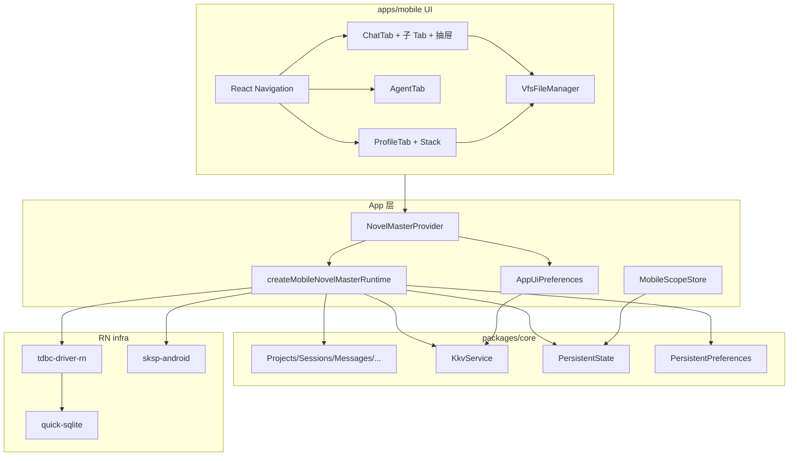

# Novel Master Android App 技术规格（SPEC）

> 需求：[prd.md](./prd.md)  
> UI 权威：[feature-inventory.md](../../../examples/mobile/docs/feature-inventory.md)（对齐 `examples/mobile` 代码）  
> 脚手架：[mobile-app-scaffold/spec.md](../mobile-app-scaffold/spec.md)

## 设计目标

- 在现有 **`apps/mobile`** 上实现 PRD **P0（清单 §0–§13）**：3 Tab IA、双抽屉、VFS 文件管理器、对话 + AgentRunner、配置中心、主题。
- **数据层**与 `apps/cli/src/runtime.ts` 的 `createNovelMasterRuntime` 等价，替换为 RN SQLite + `sksp-android`；**禁止**生产路径依赖原型 mock。
- **本期含 Core 前置改造（C0）**：去 `node:crypto` 依赖、`PersistentState.currentAgentId`、Agent 变异工具经 `SessionFsService.execute`、**重新导出 `KkvService`**；Mobile 用 App 层封装读写 UI 偏好（**不用 AsyncStorage**）。
- **仅 Android** 验收；保留 VFS/SKSP 开发页于「我的 → 开发调试」。
- **P1（§14）** 在 M6 交付：template pull、服务商 CRUD+密钥、会话复制等。

---

## 现状与约束（代码探索）

| 项 | 现状 | 对本迭代影响 |
|----|------|----------------|
| `apps/mobile` | `bootstrapNovelMaster` + `getMobileConnection`（`db/connection.ts`）；`getVfs` 单例；Home/VfsDev/SkspDev | 扩展为全量 runtime；开发页保留 |
| DB | `MOBILE_TDBC_URL` → `novel_master_vfs`（quick-sqlite 私有目录） | 继续用此库名；schema 已是全库非仅 VFS |
| `apps/cli` `createNovelMasterRuntime` | 装配 state/projects/sessions/messages/sessionFs/worktree/providers/agent/regex/compaction | **对照实现** `createMobileNovelMasterRuntime` |
| `CliScopeResolver` | 读 `PersistentState` 的 current project/session | App 用 **MobileScopeContext**（React Context + 同步写 state） |
| `packages/core` `node:crypto` | 部分服务仍 `import { randomUUID } from "node:crypto"`（`message`/`session-fs`/`in-memory-agent-session` 等）；`project`/`session` 已指向待落地的 `@/infra/random-uuid` | **C0-1** 统一 `infra/random-uuid.ts`，RN/Node 均可运行 |
| `PersistentState` | 无 `currentAgentId` | **C0-2** 增 `get/set/resetCurrentAgentId`（KKV `nm-workspace-state`） |
| `createKkvService` | 存在但未从 `@novel-master/core` 主入口导出 | **C0-4** 导出 `createKkvService` + `KkvService` + `KkvError`；App 自封装 UI 偏好 |
| `PersistentPreferences` | 仅 `sessionFsVersionCheck` | 跨端行为配置仍走 typed port；**不**与 App UI module 混写 |
| `AgentRunner` / `vfs.*` 工具 | 工具直连 `VfsService` | **C0-3** 变异工具经 `sessionFs.execute(..., actor: 'assistant')`；只读工具仍用 `vfs` |
| `SessionFsService` port | `listBatches` / `rollbackBatch`；**无** `listActions`/`listCheckpoints` 公开 | 时间线合并逻辑在 App 层；批次详情从 messages 补全 |
| `WorktreeService` | `buildListRows` + `setDirRule`/`setFileRule`；`SortField` 为 `name\|created\|updated`（非原型 ctime/mtime 字符串） | UI 映射：`ctime→created`，`mtime→updated` |
| `examples/mobile` | 完整 IA/交互参考；无网络逻辑 | UI 组件按原型复刻，数据接 runtime |
| Metro | `watchFolders` + `disableHierarchicalLookup` 已配置 | **无需** `node:crypto` alias（C0 后） |
| 依赖 | 无 React Navigation / gesture / bottom-sheet | 本期新增导航与 Sheet 库 |

**兼容性原则**

- **C0** 在 `packages/core`（+ CLI `toolCtx` 对齐）；**M1–M6** 在 `apps/mobile/**`。
- C0 合并后须 `npm run build` / `npm test` 全绿，再开 Mobile UI 里程碑。

---

## 总体方案

### 架构



### 持久化分层（已定案）

| 层 | API | KKV module / 存储 | 谁写 | 示例 |
|----|-----|-------------------|------|------|
| 工作区指针 | `PersistentState` | `nm-workspace-state` | **仅 Core**（App 调 port） | `currentProjectId`, `currentAgentId` |
| 跨端行为配置 | `PersistentPreferences` | `nm-preferences` | **仅 Core**（App 调 port） | `sessionFsVersionCheck` |
| 业务领域 | 各 Service | SQL / 专用 KKV module | Core | Agent、正则、采样… |
| **App UI 偏好** | **`AppUiPreferences`**（App 封装） | **`nm-mobile-ui`** | **App**（经 `KkvService`） | `theme`, `showFullToolParams`… |

**C0-4**：`@novel-master/core` 重新导出：

- `createKkvService(conn)`
- `KkvService`（`get` / `set` / `delete` / `listKeys`）
- `KkvError`

**不恢复** CLI `nm kkv` 子命令（排障仍用 `nm preferences list` + 业务命令）；导出仅供 **库客户端**（Mobile / 未来 Electron）编程使用。

**App 封装**（`apps/mobile/src/storage/app-ui-prefs.ts`）：

```typescript
/** App-owned KKV module; keys are string values (JSON 自行序列化). */
export const APP_UI_KKV_MODULE = "nm-mobile-ui";

export interface AppUiPreferences {
  get(key: string): Promise<string | undefined>;
  set(key: string, value: string): Promise<void>;
  delete(key: string): Promise<void>;
  listKeys(): Promise<string[]>;
}

export function createAppUiPreferences(kkv: KkvService): AppUiPreferences;
```

- `get`：捕获 `KkvError NOT_FOUND` → `undefined`（与 `PersistentState` 一致）。
- **禁止** App 代码直接 `kkv.set("nm-workspace-state", …)` 等 Core 保留 module（code review + 单测只 mock `nm-mobile-ui`）。
- **v1 keys**（对齐原型语义，值均为 string）：

| key | 默认 | 用途 |
|-----|------|------|
| `theme` | `"light"` | `light` / `dark` |
| `checkpointRetention` | `"100"` | 检查点 FIFO UI（Core 未实现淘汰前仅展示） |
| `showFullToolParams` | `"false"` | 工具卡展示 |
| `autoFixJson` | `"true"` | 工具 JSON 展示 |
| `enableVfs` | `"true"` | 扩展设置占位（App 恒 true 亦可） |

**为何不用 Core 再包一层 `ClientUiPreferences` port**：UI 键会随 App 迭代增减；由 **App 封装固定 module** 即可，Core 只提供 primitive `KkvService`，避免 Core port 膨胀。

**与 `persistent-state-and-preferences` 迭代关系**：该迭代为 CLI 收掉 `nm kkv`；本迭代 **仅恢复库级 export**，不改变「工作区/跨端配置仍走 Persistent*」原则。

### 关键定案

| 主题 | 决策 |
|------|------|
| 导航 | `@react-navigation/native` + **bottom-tabs（3）** + **native-stack**（全屏二级页）；抽屉用 **自定义 Modal + 动画**（对齐原型，避免 Drawer 与 ☰ 语义冲突） |
| 状态 | `NovelMasterProvider` 持有 runtime 单例；`useMobileScope()` 提供 projectId/sessionId 并与 `PersistentState` 双向同步 |
| 当前 Agent | `PersistentState.getCurrentAgentId` / `setCurrentAgentId`；未设则 `agentRegistry.listAgentIds()[0]` |
| 主题 / 扩展设置 | **`AppUiPreferences`** → KKV module **`nm-mobile-ui`**（**不用 AsyncStorage**） |
| 工作区模型 | `PersistentState.setCurrentModelId`（与 CLI 一致） |
| 正则当前组 | `PersistentState.setCurrentRegexGroupId` |
| VFS 列表 | `vfs.list` 列目录子项 + `worktree.buildListRows()` 按 path 合并展示/规则状态 |
| 目录规则 Sheet | 映射到 `worktree.setDirRule`（`fill`: filename/header/hidden ↔ FillPolicy） |
| 文件保存 | 用户保存：**`sessionFs.execute` write**（actor `user`）；Agent **`vfs.write` / `vfs.replace`** 经 **`sessionFs.execute`**（actor `assistant`），每次 tool call 一个 batch |
| 真实提示词 | `agentRegistry.get(currentAgentId)` + `buildPromptLlmInput` + `formatPromptLlmInputForCli`（`currentAgentId` 来自 `PersistentState`） |
| 发送消息 | `messages.append` user → `createAgentRunner.run`（流式 `onStream` 更新 UI） |
| 会话日志 | `messages` 中 `tool_use`/`tool_result` 构造工具条；`sessionFs.listBatches` 含 **用户编辑 + Agent 写文件** 批次；按 `createdAtMs` 合并倒序 |
| 回滚 | 检查点条 → `sessionFs.rollbackBatch`；需 batchId（检查点条目携带） |
| Provider §14 | M6：`providers.create/edit` + SKSP 写密钥 + `providerModels.fetch` |

### Core C0 与 RN 兼容（已定案）

C0-1 完成后，Core 不再 import `node:crypto`；Mobile **不需要** `react-native-get-random-values` 与 Metro alias。

**`packages/core/src/infra/random-uuid.ts`（新建）**

- 优先 `globalThis.crypto.randomUUID()`（Node ≥19 / RN Hermes 现代运行时）。
- 无原生 API 时使用 RFC4122 v4 纯 JS fallback（`Math.random` 或 `getRandomValues` 若存在）。
- 以下文件统一改为 `import { randomUUID } from "@/infra/random-uuid.js"`：
  - `service/chat/impl/project.service.ts`（已改 import，补全模块）
  - `service/chat/impl/session.service.ts`
  - `service/chat/impl/message.service.ts`
  - `service/session-fs/impl/session-fs.service.ts`
  - `domain/agent/session/impl/in-memory-agent-session.ts`
- 单测：`packages/core/test/infra/random-uuid.test.ts`（格式 + 多次调用不重复）。

---

## 最终项目结构

```text
apps/mobile/
  index.js
  metro.config.js                     # 保持 monorepo watchFolders；无 crypto shim
  package.json                        # + navigation, gesture, bottom-sheet, …（**无** async-storage）
  src/
    App.tsx                           # Provider + RootNavigator + 启动 bootstrap
    runtime/
      types.ts                        # MobileNovelMasterRuntime（含 kkv + 与 CLI 同构字段）
      create-mobile-runtime.ts        # registerRnDriver + sksp + 全服务装配
      novel-master-context.tsx        # React context, init/error/ready
      mobile-scope.ts                 # 读写 PersistentState + 内存缓存
    navigation/
      types.ts                        # RootStackParamList, TabParamList
      RootNavigator.tsx
      linking.ts                      # 可选，首期可空
    theme/
      tokens.ts                       # 浅色/深色（对齐 CSS 变量）
      ThemeProvider.tsx
    storage/
      app-ui-prefs.ts                 # createAppUiPreferences(kkv)；module nm-mobile-ui
      app-ui-keys.ts                  # theme / checkpointRetention 等 key 常量
    errors/
      format-error.ts                 # 扩展 vfs/errors：Provider/Chat/Tool 等
    hooks/
      useRuntime.ts
      useMobileScope.ts
      useBatchSelection.ts
      useUnsavedGuard.ts
    components/
      chrome/
        AppHeader.tsx                 # 返回/标题/☰/主题
        ProjectDrawer.tsx
        SessionActionsDrawer.tsx
        ToastHost.tsx
      batch/
        ManageHeader.tsx
        ListBatchBar.tsx
      sheet/
        BottomSheetMenu.tsx
        DirectoryRuleSheet.tsx
      vfs/
        VfsFileManager.tsx              # 核心：对齐 vfs-fm
        vfs-row-mapper.ts               # WorktreeListRow + vfs entry → UI
      chat/
        MessageList.tsx
        ToolCallCard.tsx
        ChatComposer.tsx
      agent/
        AgentList.tsx
        AgentEditorForm.tsx
      provider/
        ProviderList.tsx
        ProviderDetail.tsx
        ModelPickerModal.tsx
        AddModelModal.tsx
        SamplingForm.tsx
      regex/
        RegexGroupList.tsx
        RegexRuleList.tsx
        RegexRuleEditor.tsx
      session-log/
        SessionTimeline.tsx
        timeline-builder.ts
    screens/
      tabs/
        ChatTabScreen.tsx               # 子 Tab + Banner + 列表/聊天
        AgentsTabScreen.tsx
        ProfileTabScreen.tsx
      stack/
        AgentEditorScreen.tsx
        RealPromptScreen.tsx
        SessionLogScreen.tsx
        FileEditorScreen.tsx
        ProvidersScreen.tsx
        ProviderDetailScreen.tsx
        ModelSamplingScreen.tsx
        CompactionPolicyScreen.tsx
        GlobalTemplateScreen.tsx
        RegexGroupsScreen.tsx
        RegexRulesScreen.tsx
        RegexRuleEditorScreen.tsx
        SettingsScreen.tsx
        ProviderCreateScreen.tsx        # §14 M6
        ProviderEditScreen.tsx          # §14 M6
      dev/
        DevMenuScreen.tsx               # 跳转 VfsDev / SkspDev
        VfsDevScreen.tsx                # 自 screens/ 迁入或 re-export
        SkspDevScreen.tsx
    services/
      agent-run.service.ts              # 封装 runner.run + 流式
      prompt-preview.service.ts
      vfs-operations.service.ts         # list/write/replace/delete/glob
      worktree-operations.service.ts
      session-log.service.ts
    db/
      connection.ts                     # 保留，由 runtime 调用
    vfs/
      constants.ts
      runtime.ts                        # 变薄：委托 novel-master runtime
      errors.ts                         # 合并到 errors/format-error 或 re-export
```

**删除/弱化**：`HomeScreen` 作为首屏 → 改为 `ChatTabScreen`；`HomeScreen` 仅 dev 入口或移除。

---

## 变更点清单

| 路径 | 操作 | 说明 |
|------|------|------|
| `packages/core/src/index.ts` | **修改** | C0-4：导出 `createKkvService`、`KkvService`、`KkvError` |
| `packages/core/src/infra/random-uuid.ts` | **新增** | C0-1：跨平台 UUID |
| `packages/core/src/service/persistent-state/**` | **修改** | C0-2：`currentAgentId` port + impl + 测试 |
| `packages/core/src/domain/tool/builtin/vfs-tools.ts` | **修改** | C0-3：扩展 `VfsToolContext`，变异工具走 `sessionFs` |
| `packages/core/test/tool/vfs-tools.test.ts` | **修改** | 注入 `sessionFs` mock，断言 `execute` 被调用 |
| `packages/core/test/persistent-state/persistent-state.test.ts` | **修改** | 覆盖 `currentAgentId` |
| `apps/cli/src/agent/commands.ts` | **修改** | `toolCtx` 含 `sessionFs` + scope；`run` 无 `--agent-id` 时读 `state.getCurrentAgentId()` |
| `apps/mobile/package.json` | 修改 | navigation、gesture-handler、screens、@gorhom/bottom-sheet（**无** async-storage / get-random-values） |
| `apps/mobile/src/storage/app-ui-prefs.ts` | **新增** | `createAppUiPreferences` 封装 KKV |
| `apps/mobile/index.js` | 修改 | 入口（无 crypto polyfill） |
| `apps/mobile/src/**` | 新增/重构 | 见上结构 |
| `apps/mobile/src/App.tsx` | 重写 | Provider + Navigation |
| `apps/mobile/__tests__/**` | 新增 | 单元测试（见测试策略） |
| `apps/cli` runtime | 不改装配 | 行为经 C0 + commands 对齐 |
| `examples/mobile` | 不改 | UI 参考 only |
| `.apm/kb/docs/Iterations/mobile-app/spec.md` | 修改 | 本文 |

---

## 详细实现步骤

### C0 — Core 前置（**阻塞 M1**）

#### C0-1 `randomUUID` 去 Node 依赖

1. 新增 `packages/core/src/infra/random-uuid.ts`（见上节）。
2. 替换全部 `node:crypto` import；确认 `grep node:crypto packages/core` 为零。
3. 单测 + 全量 `npm test`。

#### C0-2 `PersistentState.currentAgentId`

1. **`persistent-state.port.ts`** 增加（与其它 pointer 对称）：
   - `getCurrentAgentId(): Promise<string | undefined>`
   - `setCurrentAgentId(id: string): Promise<void>`
   - `resetCurrentAgentId(): Promise<void>`
2. **`persistent-state.service.ts`**：KKV key `currentAgentId`，module 仍为 `nm-workspace-state`。
3. **测试**：set/get/reset/undefined/idempotent reset（并入 `persistent-state.test.ts`）。
4. **CLI 对齐（同 PR）**：`nm agent run` / `continue` 在未指定 `--agent-id` 且未 `--agent-config` 时，若 `state.getCurrentAgentId()` 有值则 `agentRegistry.get(id)`；否则保持现有 fallback（空 definition / 报错语义不变）。
5. **Mobile**：`mobile-scope` 或独立 hook 读写 `currentAgentId`；删除 AsyncStorage `defaultAgentId` 设计。

#### C0-3 Agent 工具 → `SessionFsService.execute`

**目标**：Agent 改文件与用户编辑器一样产生 **batch + checkpoint**，会话日志可 `rollbackBatch`。

**`VfsToolContext` 扩展**（breaking，仅类型扩展字段）：

```typescript
export type VfsToolContext = {
  readonly vfs: VfsService;
  readonly sessionFs: SessionFsService;
  readonly projectId: string;
  readonly sessionId: string;
};
```

**工具行为**：

| 工具 | 实现 |
|------|------|
| `vfs.read` | 仍 `ctx.vfs.read`（只读，不产生无意义 batch） |
| `vfs.list` / `vfs.glob` / `vfs.grep` | 仍 `ctx.vfs.*` |
| `vfs.write` | `sessionFs.execute(sessionId, projectId, [{ function: 'write', path, content }], 'assistant', { versionCheck: input.options?.versionCheck ?? true })` → 取 result 中 `version` |
| `vfs.replace` | `vfs.read` → 内存 replace（复用现有 replace 语义）→ 单次 `execute` write |
| `vfs.delete`（若未来暴露） | `execute` delete action |

**约定**：

- **每个 mutating tool call = 一个 execute batch**（单 action 或 replace 前 read 不计入 batch，read 在 batch 外完成）。
- `actor` 固定 **`assistant`**（与 `SessionFsActor` 一致）。
- `versionCheck`：透传 tool input `options.versionCheck` / `expectedVersion`（write 时映射到 SessionFs `versionCheck` + VFS write options，与 `DefaultSessionFsService.autoWrite` 行为一致）。

**接线**：

1. `createAgentRunner` 不变签名；调用方负责完整 `toolCtx`。
2. **`apps/cli/src/agent/commands.ts`**：`toolCtx: { vfs, sessionFs: rt.sessionFs, projectId, sessionId }`。
3. **`createMobileNovelMasterRuntime`**（M1）：同上。
4. **测试**：
   - `vfs-tools.test.ts`：mock `SessionFsService`，`vfs.write` 工具调用后断言 `execute` 一次、`actor === 'assistant'`。
   - 可选集成测：AgentRunner 跑 mock LLM 返回 `vfs.write` → `listBatches` 非空。

**验收**：C0-1–3 单测绿；CLI `nm agent run` 写文件后 `nm session fs batches list`（或等价）可见 assistant 批次。

#### C0-4 导出 `KkvService`

1. **`packages/core/src/index.ts`** 增加 export：
   - `createKkvService` from `./service/kkv/create-kkv-service.js`
   - `KkvService` from `./service/kkv/kkv.port.js`
   - `KkvError`, `KkvErrorCode` from `./errors/kkv-errors.js`
2. **文档**：package README 或 kb 注明——客户端 **仅写入自有的 module**（Mobile 为 `nm-mobile-ui`）；勿写 `nm-workspace-state` / `nm-preferences` 等 Core 内部 module。
3. **测试**：现有 `packages/core/test/kkv/**` 保持绿；可选 export 冒烟（从 `@novel-master/core` import `createKkvService`）。
4. **CLI**：**不**恢复 `nm kkv` 命令（与 persistent-state 迭代一致）。

**验收**：C0-1–4 全绿。

---

### M1 — Runtime + 导航骨架（PRD A、B、C 部分）

1. **`create-mobile-runtime.ts`**  
   - 复用 `getMobileConnection` 逻辑：`registerRnDriver`、`registerSkspAndroidDriver`、`open(MOBILE_TDBC_URL)`、`bootstrapNovelMaster`。  
   - 装配字段与 CLI runtime 一致（无 `CliScopeResolver`、无 `mkdir`、无 env mock LLM）。  
   - 额外挂载：`kkv: createKkvService(conn)`（供 `createAppUiPreferences` 使用）。  
   - `secretStore = createCompositeSecretStore({ db: createAndroidSecretStore(conn) })`（**无** env store，除非调试开关）。

2. **`novel-master-context.tsx`**  
   - 启动时 `createMobileNovelMasterRuntime()`；`ready | error | loading`。  
   - 构造 `appUi = createAppUiPreferences(runtime.kkv)`，经 Context 提供给 `ThemeProvider` / Settings。  
   - 失败时全屏错误 + 重试（PRD A1）。

3. **`mobile-scope.ts`**  
   - `setCurrentProject` / `setCurrentSession` 写 `PersistentState` 并更新 React state。  
   - 冷启动读取 state；若 project/session 不存在则回退列表首项或空态。

4. **导航**  
   - `RootNavigator`：Tab（Chat, Agents, Profile）+ Stack 宿主。  
   - Stack 注册 §0.2 全部 `pageId` 路由名。  
   - `AppHeader`：`updateHeader` 逻辑端口自原型（chat 子视图标题、agentEditor 动态名等）。

5. **ChatTab 骨架**  
   - 子 Tab：会话 | 项目模板；会话列表 + Banner；`ProjectDrawer` / `SessionActionsDrawer`（先空壳菜单）。  
   - 进入会话 → 聊天 | 会话工作区子 Tab（工作区先占位 `VfsFileManager` 空列表）。

6. **项目/会话 CRUD**  
   - `projects.create/list`、`sessions.create/listByProject/delete`；切换时更新 scope。  
   - 批量删除：projects 循环 `delete`；sessions `sessions.delete`。

**验收**：B1–B3、C1–C2、A2。

### M2 — VFS 文件管理器 + 编辑器（PRD E）

1. **`VfsFileManager`**  
   - Props：`scope: WorktreeScope`、`vfs: VfsService`、`worktree: WorktreeService`。  
   - `list` 当前目录 + `buildListRows` merge → 行 UI（徽章、规则灯、副标题）。  
   - 交互：上级、⋮ 菜单、⋯ 更多、目录进入、文件双击 → `FileEditorScreen`。

2. **`DirectoryRuleSheet`**  
   - 表单字段映射 `SetDirRuleInput`；保存调用 `setDirRule`。

3. **行内规则**  
   - `setFileRule` 循环 inclusion；`setDirRule` 切换 `ruleEnabled`（根目录禁止关）。  
   - `vfs-operations.service`：`create`/`delete`/`rename`（rename = read+write+delete 或 Vfs replace 视 Core API）。

4. **`FileEditorScreen`**  
   - `vfs.read` / `vfs.write`；保存走 **`sessionFs.execute`**（单 write action，`actor: 'user'`）以便检查点。  
   - 未保存 guard（`useUnsavedGuard` + `beforeRemove`）。

5. **三域嵌入**  
   - Chat：`project` / `session` 子 Tab。  
   - Profile：`globalTemplate` 全屏页。

**验收**：C3、E1–E3。

### M3 — 对话 + Agent（PRD D、L1）

1. **`ChatComposer`**  
   - 无 `currentModelId` 时禁用 + 引导 `ModelPickerModal`。  
   - 发送：`messages.append` + `agent-run.service`。

2. **`agent-run.service`**  
   - 读 `state.getCurrentAgentId()` → 无则 `listAgentIds()[0]` → `agentRegistry.get`。  
   - `resolveApplicationModelId`（definition.model + state.getCurrentModelId）。  
   - `createAgentRunner` 同 CLI：`toolCtx: { vfs: sessionVfs, sessionFs, projectId, sessionId }`。  
   - `onStream` → append 文本到当前 assistant 占位 message 或局部 state。

3. **`MessageList` + `ToolCallCard`**  
   - 解析 `content.blocks`；工具状态从 tool_result 匹配 tool_use id。

4. **`RealPromptScreen`**  
   - `prompt-preview.service`：regex llm channel + `buildPromptLlmInput` + `formatPromptLlmInputForCli`。

5. **`updateChatAgentMeta`**  
   - 顶栏 Agent 名 + 模型 label（专属模型不加「工作区」后缀）。

**验收**：D1–D4、L1。

### M4 — 我的 / 配置（PRD F、G、H、I、J）

1. **Profile 菜单** → 各 Stack 屏。  
2. **Provider**：`providers.list`、详情 `savedList`；`AddModelModal` → `providerModels.save`；`ModelSamplingScreen` → `modelSamplingProfiles` CRUD。  
3. **ModelPickerModal** → `state.setCurrentModelId`。  
4. **Agent**：`agentRegistry` list/upsert/delete；**当前 Agent** 写 `state.setCurrentAgentId`；删除当前 Agent 时 `resetCurrentAgentId` 或切到列表首项；编辑器表单对齐原型（专属模型、prompt blocks）。  
5. **Compaction**：`compactionPolicy` store 读写。  
6. **Regex**：`regexConfig` 全套；测试预览用 `compileRegexRule` + `applyRegexRules`（复制 `examples/mobile` 逻辑为 service）。  
7. **Settings**：`AppUiPreferences` 读写 §10.2 项；`sessionFsVersionCheck` **单独**写 `preferences.setSessionFsVersionCheck`（跨端，不进 `nm-mobile-ui`）。  
8. **DevMenu** → 现有 VfsDev/SkspDev。

**验收**：F、G、H、I、J、K1。

### M5 — 会话日志 + 批量 + 打磨（PRD F、B5）

1. **`timeline-builder.ts`**  
   - 输入：`messages` + `sessionFs.listBatches(sessionId)`。  
   - 工具条：从 assistant `tool_use` + user `tool_result` 配对。  
   - 检查点条：每个 batch 一条（`createdAtMs`、`createdBy`）；batch 上关联 checkpoint 路径摘要。  
   - 倒序；`rollbackBatch`；`rollbackInProgress` 锁。

2. **FIFO Banner**  
   - 读 `appUi.get('checkpointRetention')`（默认 `"100"`）；**实际淘汰**依赖后续 Core，首期仅 UI 提示 + 禁用已淘汰条（mock 逻辑可配置测试 id）。

3. **批量管理组件**  
   - 复用 `useBatchSelection`；`ManageHeader` / `ListBatchBar` 双模式。

**验收**：F1–F2、B5、K、L2–L3（C0 后 Agent 写文件批次可回滚）。

### M6 — §14 扩展（PRD M）

1. **ProviderCreate/EditScreen**：`providers.create` / `edit` + SKSP `secretStore.set`。  
2. **拉取模型**：`providerModels.fetch(providerId)`。  
3. **Template pull**：项目模板 Tab / 全局模板页增加「从上级同步」按钮 → `projects.pullTemplate` / `sessions.pullTemplate` + 二次 confirm。  
4. **会话复制**：会话列表菜单 → `sessions.copy`（原型无菜单，App 增加 ⋮ 入口，属 §14）。

**验收**：M1–M3。

---

## 测试策略

### 自动化（Jest）

| ID | 范围 | 内容 |
|----|------|------|
| T0 | `packages/core` C0 | `random-uuid`；`currentAgentId`；`vfs.write`→sessionFs；**`createKkvService` 可从主入口 import** |
| T2 | `vfs-row-mapper` | `WorktreeListRow` → 徽章/副标题文案 |
| T3 | `timeline-builder` | 给定 mock messages + batches → 合并顺序、工具成功/失败态 |
| T4 | `format-error` | `VfsError`/`ProviderError`/`ChatError` message 可读 |
| T5 | `app-ui-prefs` | KKV `nm-mobile-ui` 读写 round-trip；`NOT_FOUND`→undefined |
| T6 | 既有 `errors.test` | 保持绿 |

**不在首期**：Detox E2E、真机 LLM 集成（手工做）。

### 手工冒烟（Android）

按 PRD 验收章 **A–L** 逐项勾选；额外：

- 切换项目后会话列表刷新、Banner 更新。  
- 三域 VFS 路径互不影响。  
- 专属模型 Agent 顶栏显示正确。  
- 正则测试预览与 CLI `nm regex test` 同输入同输出。  
- Chrome 远程调试关闭时 quick-sqlite 正常（README 已说明）。

### CLI 对照（开发者）

同脚手架：设备与 PC **不同 DB**；对比 **语义**（如 `nm project list`、`nm session list`、`nm vfs list` 与 App 同 scope 下集合一致）。

---

## 风险与回滚方案

| 风险 | 缓解 | 回滚 |
|------|------|------|
| C0 breaking `VfsToolContext` | 同 PR 更新 CLI + Core 测试 | revert Core C0 commit |
| Metro 打包 core/dist 过期 | 保持 `preandroid` build 脚本 | 文档强调 build 顺序 |
| Agent `vfs.replace` 与 SessionFs 语义 | replace 先 read 再单 write batch；单测覆盖 | 暂禁 replace 工具 |
| App 误写 Core KKV module | `app-ui-prefs` 固定 `APP_UI_KKV_MODULE`；禁止裸 `kkv` 散落 UI | code review |
| 检查点 FIFO 未实现 | `checkpointRetention` 仅 UI；不做假淘汰 | 隐藏 Banner 或标注「即将支持」 |
| Gemini 无 stream | `onStream` 不触发时整段渲染 | 无 |
| tiktoken 在 RN 失败 | `tokenCounters.heuristic` 用于顶栏 token 示意（可选） | 隐藏 token 行 |
| Navigation 体积与学习成本 | 锁定依赖版本写入 README | 回退自定义 pageStack（工作量大，不推荐） |
| §14 服务商表单复杂度高 | 放 M6，不挡 M1–M5 | 暂保留 Toast「未实现」仅 M4 前 |

**整包回滚**：`apps/mobile` 回到脚手架分支；**C0 若已合并**需单独 revert `packages/core` + CLI agent commands。

### 后续 Core 跟进（非 C0 范围）

| 改动 | 目的 |
|------|------|
| `SessionFsService` 增加 `listBatchDetails` | 富工具日志 |
| 检查点 FIFO 淘汰 | Banner 实际生效；可迁 key 至 `nm-preferences` |
| CLI `nm kkv`（可选） | 排障；非本期 |

---

## 实现计划总览（并入里程碑）

| 序 | 里程碑 | 交付物 | PRD 验收 |
|----|--------|--------|----------|
| 0 | **C0** | Core randomUUID + currentAgentId + Agent→sessionFs + **export KkvService** | （Core/CLI 单测） |
| 1 | M1 | Runtime + 3 Tab + 抽屉 + 项目/会话 | A、B、C |
| 2 | M2 | VfsFileManager + FileEditor + 三域 | E、C3 |
| 3 | M3 | Chat + AgentRunner + RealPrompt | D、L1 |
| 4 | M4 | Profile 全套配置页 | F–J |
| 5 | M5 | SessionLog + Batch + Theme | F、B5、K、L2–L3 |
| 6 | M6 | §14 扩展 | M |

---

## 附录：原型 `pageId` → RN 路由名

| 原型 `pageId` | Stack 路由名 |
|---------------|--------------|
| `agentEditor` | `AgentEditor` |
| `realPrompt` | `RealPrompt` |
| `sessionLog` | `SessionLog` |
| `providers` | `Providers` |
| `providerDetail` | `ProviderDetail` |
| `modelSampling` | `ModelSampling` |
| `compactionPolicy` | `CompactionPolicy` |
| `globalTemplate` | `GlobalTemplate` |
| `regexGroups` | `RegexGroups` |
| `regexRules` | `RegexRules` |
| `regexRuleEditor` | `RegexRuleEditor` |
| `settings` | `Settings` |
| `fileEditor` | `FileEditor` |

Tab：`Chat` | `Agents` | `Profile`（无 `pageId` 后缀）。

---

*C0–M6 已于 `feature/mobile-app-c0` 交付并合并 main；Android 手工冒烟见 PRD 验收章 A–L。*
