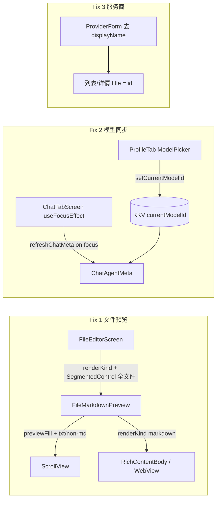

# Mobile Bugfix 技术规格（SPEC）

> **PRD**：[prd.md](./prd.md)  
> **平台**：Android Mobile（验收范围）  
> **关联迭代**：`mobile-vfs-markdown-webview`、`provider-model`

---

## 设计目标

1. **文件预览**：非 `.md` 长文在预览模式下可滚动；所有文件类型均支持 Markdown / 文本 Tab，默认 Tab 按扩展名区分。
2. **模型展示同步**：聊天页模型标识始终反映 KKV `currentModelId`（经 agent pin 解析），从「我的」Tab 切换模型后 **回到聊天 Tab 即更新**。
3. **配置精简**：Mobile 端移除服务商级 `displayName` 编辑与展示，统一使用 **服务商 ID**；Core 数据层不变。

---

## 现状（代码探索）

| 模块 | 路径 | 现状 / 问题 |
|------|------|-------------|
| 文件编辑器 | `apps/mobile/src/screens/stack/FileEditorScreen.tsx` | 预览 `previewFill`；`previewRenderKind` **固定初始值 `'markdown'`**；`SegmentedControl` **仅在** `isMarkdownPreviewPath(path)` 时渲染 |
| 文件预览组件 | `apps/mobile/src/components/vfs/FileMarkdownPreview.tsx` | `.md` + `renderKind='txt'` 在 `previewFill` 下有 `ScrollView`；**非 md 路径**（L126–129）直接返回 `<Text>`，**无 ScrollView** → 无法滑动 |
| 非 md 渲染 | 同上 | `useMarkdown = isMarkdownPreviewPath(path)` **忽略** `renderKind`；非 md 文件切 Markdown Tab 无效 |
| 聊天 Meta 刷新 | `apps/mobile/src/screens/tabs/ChatTabScreen.tsx` | `refreshChatMeta` 仅在 `chatSubview + sessionId` 变化时触发（L78–82）；`useFocusEffect`（L278–283）**不刷新** meta |
| Meta 加载 | `apps/mobile/src/services/chat-agent-meta.ts` | 正确读取 `getCurrentModelId()` + agent pin；**数据源无问题** |
| 模型选择（我的） | `apps/mobile/src/screens/tabs/ProfileTabScreen.tsx` | `ModelPickerModal.onSelected` 仅 `refreshModelLabel()`，**不通知聊天 Tab** |
| 模型选择（聊天） | `apps/mobile/src/screens/tabs/chat-tab/ChatConversationPanel.tsx` | 抽屉内 `ModelPickerModal.onSelected → onRefreshChatMeta` **已正确** |
| 持久化状态 | `packages/core/.../persistent-state.service.ts` | `currentModelId` 存 KKV `nm-workspace-state`；**无 subscribe API** |
| 服务商表单 | `apps/mobile/src/components/provider/ProviderForm.tsx` | 含「显示名称」字段；create/edit 均写入 `displayName` |
| 服务商列表/详情 | `ProvidersScreen.tsx`、`ProviderDetailScreen.tsx`、`ProviderEditScreen.tsx` | 标题用 `displayName?.trim() \|\| id` |
| Agent 表单 | `apps/mobile/src/components/agent/AgentEditorForm.tsx` | 服务商下拉 label 用 `p.displayName?.trim() \|\| p.id` |
| Core Provider | `packages/core/src/domain/provider/model/provider.ts` | `displayName` 字段保留于 DB；**本迭代不改 Core** |

**根因归纳**

| Bug | 根因 |
|-----|------|
| 非 md 无法滑动 | `FileMarkdownPreview` 非 md 分支未包 `ScrollView`（与 md+txt 分支不一致） |
| 模型不同步 | 聊天 Tab **失焦期间**在 Profile 改模型，回 Chat Tab 时 **未 re-fetch** meta |
| displayName 无效 | Mobile UI 部分位置读 displayName，但聊天/模型展示均用 `applicationModelId`；字段对用户无感知价值 |

---

## 总体方案



### Fix 1：预览滚动与 Tab 行为

**渲染模式判定**（新逻辑）：

```ts
// 有效 Markdown 渲染 = 用户选 Markdown Tab，或 md 文件且未显式选 txt
const effectiveMarkdown =
  renderKind === 'markdown' || (isMarkdownPreviewPath(path) && renderKind !== 'txt');
```

简化实现：以 **`renderKind` 为唯一 Tab 驱动**（与 PRD 一致）：

| 文件类型 | 默认 Tab | Markdown Tab | 文本 Tab |
|----------|----------|--------------|----------|
| `.md` / `.markdown` | markdown | FM 拆分 + WebView/RN 渲染 | 全文 monospace + ScrollView |
| 其他 | txt | 全文作 markdown body 渲染（**无 FM 拆分**） | monospace + ScrollView |

**滚动策略**（保持 `FileEditorScreen` 注释：WebView 不外包 ScrollView）：

| 场景 | 滚动容器 |
|------|----------|
| txt / 非 md 纯文本 | RN `ScrollView`（`previewFill` 时 `flex:1`） |
| markdown + WebView 引擎 | `RichDocumentWebView` 内部滚动 |
| markdown + RN 引擎 | RN `ScrollView` + `RichContentBody` |

**FileEditorScreen 变更**：

- 打开文件 / `path` 变化时：`setPreviewRenderKind(isMarkdownPreviewPath(path) ? 'markdown' : 'txt')`
- 预览模式下 **始终** 显示 `SegmentedControl`（移除 `isMarkdownPreviewPath` 条件）

### Fix 2：模型标识同步

**方案**：在 `ChatTabScreen` 现有 `useFocusEffect` 中追加 `refreshChatMeta()`。

- **WHY 不用 Context/EventBus**：KKV 无 subscribe；改动面最小；与 Profile 页 `useFocusEffect → refreshModelLabel` 对称。
- **WHY 足够满足 PRD**：用户从「我的」改模型后必切回「对话」Tab 才能看到聊天页；Tab focus 时刷新即可。
- **已有路径不变**：聊天抽屉内 `ModelPickerModal` 仍走 `onRefreshChatMeta`（即时更新）。

`refreshChatMeta` 内部已调用 `loadChatAgentMeta` + `refreshChatTokenLabel`，agent 名称与 token 估算一并更新。

### Fix 3：移除服务商 displayName（Mobile UI）

- 表单：删除「显示名称」字段；create 不传 `displayName`；edit patch **不包含** `displayName`（避免误清空 DB 时可不传该 key——Core `edit` 对 omitted 字段保持原值）。
- 展示：`provider.id` 替代所有 `displayName?.trim() || id`。
- **保留**：模型级 `displayName`（`AddModelModal`、`FetchModelsSheet`、`resolveModelShortLabel`）；Core schema / seed builtin displayName 不动。

---

## 最终项目结构

无新目录；仅修改现有文件：

```text
apps/mobile/src/
  components/
    vfs/FileMarkdownPreview.tsx       # 滚动 + 非 md markdown 渲染
    provider/ProviderForm.tsx         # 移除 displayName 字段
    agent/AgentEditorForm.tsx         # 服务商 label → id
  screens/
    stack/FileEditorScreen.tsx        # Tab 默认 + 全文件 SegmentedControl
    stack/ProvidersScreen.tsx
    stack/ProviderDetailScreen.tsx
    stack/ProviderEditScreen.tsx
    stack/ProviderCreateScreen.tsx
    tabs/ChatTabScreen.tsx            # useFocusEffect 刷新 meta
apps/mobile/__tests__/
  FileMarkdownPreview.test.tsx        # 新增用例
  provider-form.test.tsx              # NEW（可选，覆盖 toCreateInput/toEditPatch）
  chat-tab-screen.integration.test.tsx # 补充 focus 刷新（可选）
```

---

## 变更点清单

| 文件 | 变更 |
|------|------|
| `FileMarkdownPreview.tsx` | ① 非 md + `renderKind='txt'`（或默认 txt）：`previewFill` 时包 `ScrollView`；② 非 md + `renderKind='markdown'`：跳过 FM，对全文走 markdown 渲染管线；③ 抽取 `wrapPreviewScroll(content)` 复用 |
| `FileEditorScreen.tsx` | ① `path` effect 初始化 `previewRenderKind`；② 预览模式始终显示 SegmentedControl |
| `ChatTabScreen.tsx` | `useFocusEffect` 内调用 `scope.refreshChatMeta()` |
| `ProviderForm.tsx` | 移除 `displayName` 表单项；从 `ProviderFormValues` / `EMPTY_PROVIDER_FORM` / `providerFormToCreateInput` / `providerFormToEditPatch` 去除 |
| `ProviderCreateScreen.tsx` | Toast 文案改为 `已创建服务商：${input.id}` |
| `ProviderEditScreen.tsx` | Header title `编辑 ${provider.id}`；initial 不含 displayName |
| `ProviderDetailScreen.tsx` | Header title → `provider.id` |
| `ProvidersScreen.tsx` | 列表 `title={item.id}` |
| `AgentEditorForm.tsx` | 服务商选项 `label: p.id` |

**不改动**

- `packages/core/**`（Provider 实体、DB、API）
- `resolveModelDisplayLabel`（仍返回 `applicationModelId`）
- 模型级 displayName 相关 UI
- Desktop / CLI

---

## 详细实现步骤

### Step 1：FileMarkdownPreview 滚动与非 md Markdown

1. 新增内部 helper `PreviewScrollWrap({ previewFill, children })`：当 `previewFill` 为 true 时返回 `ScrollView`（样式复用现有 `rnBodyScroll` / `rnBodyContent`），否则直接返回 children。
2. 重构 L126–129 非 md 分支：
   - `renderKind === 'txt'`（或非 markdown 默认）：`PreviewScrollWrap` + monospace `Text`。
   - `renderKind === 'markdown'`：将 **全文** 作为 `body`（不调用 `splitMarkdownFrontMatter`），走与 md 正文相同的 WebView / RN 分支（`useWebViewPreview` 条件改为基于 body 长度与 engine，不要求 `useMarkdown` path）。
3. 保持 md 文件现有 FM + 未闭合提示逻辑不变。
4. 确认 `previewFill=false` 的调用方（若有）行为不退化。

**验证**：手动打开长 `.txt` 预览可滑动；`.txt` 切 Markdown Tab 可渲染 `# heading` 等语法。

### Step 2：FileEditorScreen Tab 默认与控件

1. 在读取文件完成的 `useEffect` 或独立 `useEffect([path])` 中：
   ```ts
   setPreviewRenderKind(isMarkdownPreviewPath(path) ? 'markdown' : 'txt');
   ```
2. 将 SegmentedControl 条件从 `previewMode && isMarkdownPreviewPath(path)` 改为 `previewMode`。
3. 确认切换 path 后 Tab 重置为默认值。

**验证**：`.md` 默认 Markdown；`.txt` 默认文本；Tab 可切换。

### Step 3：聊天页模型同步

1. 在 `ChatTabScreen.tsx` 的 `useFocusEffect`（L278–283）中加入：
   ```ts
   scope.refreshChatMeta().catch(() => undefined);
   ```
2. 依赖数组加入 `scope.refreshChatMeta`。
3. 不修改 `loadChatAgentMeta` 或 KKV 层。

**验证**：聊天页打开会话 → 切「我的」改模型 → 回「对话」→ 右上角模型名立即变化。

### Step 4：移除服务商 displayName UI

1. `ProviderForm`：删字段与相关 patch/create 逻辑。
2. 更新 4 个 Provider 屏幕 + `AgentEditorForm` 展示为 `id`。
3. 跑现有 `provider-edit-screen.test.tsx`；mock 中 `displayName` 可保留（Core 仍返回），不影响测试。

**验证**：创建/编辑表单无「显示名称」；列表与详情显示 ID。

### Step 5：测试与回归

1. 单元测试（见下）。
2. Android 手工走 PRD 验收清单。

---

## 测试策略

### 自动化

| 用例 ID | 文件 | 断言 |
|---------|------|------|
| T1 | `FileMarkdownPreview.test.tsx` | 非 md 路径 + `previewFill` + 默认 txt：存在 `ScrollView`，长内容可挂载 |
| T2 | 同上 | 非 md + `renderKind='markdown'`：挂载 `RichContentBody` 或 `RichDocumentWebView`（mock engine） |
| T3 | 同上 | 非 md + `renderKind='txt'`：不挂载 WebView |
| T4 | `FileMarkdownPreview.test.tsx` | 回归：md + webview + FM 仍正常 |
| T5 | `provider-form.test.tsx`（新建） | `providerFormToCreateInput` 输出无 `displayName`；`providerFormToEditPatch` 不含 `displayName` key |
| T6 | `chat-tab-screen.integration.test.tsx`（可选） | mock `useFocusEffect` 触发后 `loadChatAgentMeta` 被调用 |

运行：

```bash
pnpm --filter @novel-master/mobile test -- FileMarkdownPreview provider-form chat-tab-screen
```

### 手工（Android）

1. 会话内打开 `test_file.txt`（>1 屏）→ 预览可滑动。
2. 打开 `.md` → 默认 Markdown；切文本可滑动。
3. `.txt` 切 Markdown Tab → 有渲染且可滑动。
4. 聊天页记模型 A → 我的改 B → 回对话 → 显示 B。
5. Agent pin 模型时，改工作区模型 → 仍显示 pin 模型。
6. 服务商列表/详情/创建/编辑：无 displayName 字段，标题为 ID。

---

## 风险与回滚方案

| 风险 | 缓解 | 回滚 |
|------|------|------|
| 非 md 走 Markdown 渲染遇到超大文件卡顿 | 沿用现有 `RICH_CONTENT_MAX_CHARS` / WebView overLimit 降级 | 限制非 md 仅 txt Tab（PRD 不允许）或 revert FileMarkdownPreview 非 md markdown 分支 |
| `useFocusEffect` 每次回 Chat Tab 多一次 async 读 KKV | 开销极小（单次 get + agent get）；可接受 | 移除 focus 刷新，改 Context revision（更大改动） |
| 移除 displayName 后 builtin seed 仍带 displayName 但 UI 不展示 | PRD 明确用 ID；builtin 以 id 识别（openai 等） | 恢复 Form 字段（纯 UI revert） |
| edit patch 误传 `displayName: null` 清空 DB | edit patch **省略** displayName 字段 | 确认 `providerFormToEditPatch` 不含该 key |

**回滚**：三处改动相互独立，可逐文件 `git revert`；无 DB migration。

---

## 实现顺序建议

1. Step 1 + Step 2（文件预览，可独立验收）
2. Step 3（模型同步，单行改动）
3. Step 4（服务商 UI，批量机械改动）
4. Step 5（测试 + 手工）

预估改动量：**~200 行**，无 Core 变更，**1 PR** 可交付。
