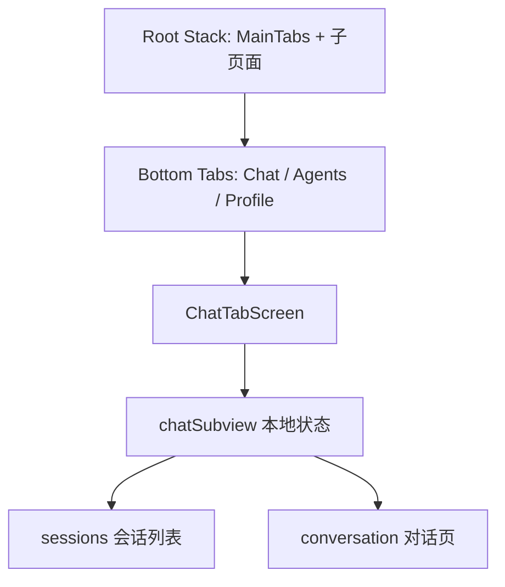
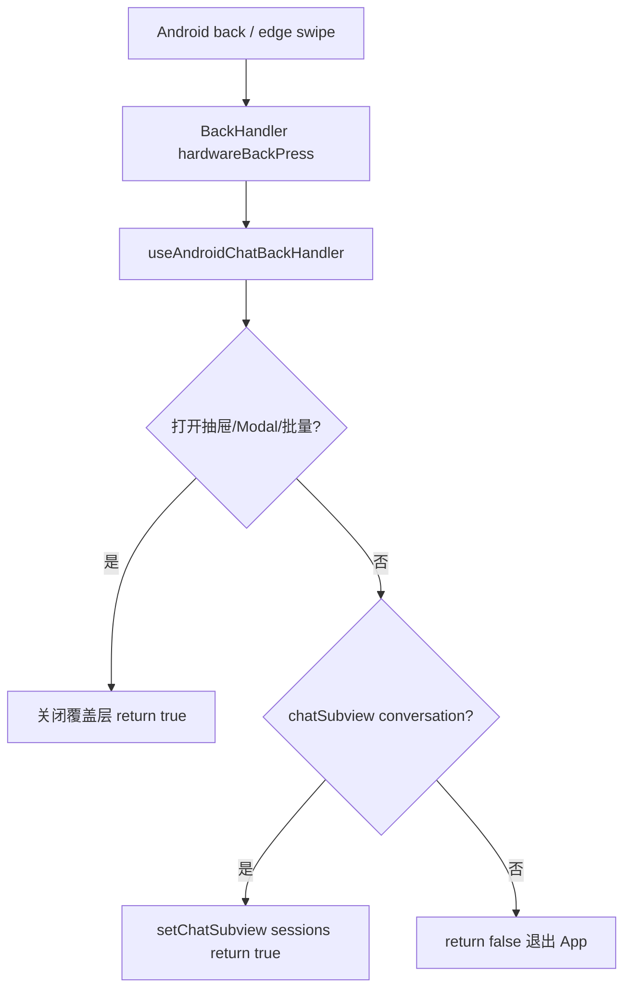

# Mobile 聊天对话页返回导航 Bugfix 技术规格（SPEC）

> 需求：[prd.md](./prd.md)  
> 相关：`mobile-app/spec.md`、`mobile-fix-v2/spec.md`（Chat Tab 子视图架构）  
> **范围**：`apps/mobile`，仅 Android 系统返回行为

## 设计目标

- 在聊天 Tab 内用**本地状态** `chatSubview` 区分「会话列表 / 对话页」时，让 Android **系统返回**（含边缘侧滑，统一走 `hardwareBackPress`）与顶栏返回一致。
- **对话页**：拦截返回 → `chatSubview = 'sessions'`，不退出 App。
- **会话列表**：不拦截 → 沿用系统默认（从 Tab 根退出 App）。
- 最小改动：不新增 Stack Screen、不升级 React Navigation。

---

## 现状与约束（代码探索）

### 导航架构



| 事实 | 位置 |
|------|------|
| 对话页**不是**独立 `Stack.Screen`，而是 `ChatTabScreen` 内条件渲染 | `ChatTabScreen.tsx` L846–1077 vs L1079+ |
| 顶栏返回已调用 `setChatSubview('sessions')` | `setChat` → `onBackFromConversation` L313；`AppHeader` L37–47 |
| 全项目**无** `BackHandler` 注册 | `apps/mobile` grep 为空 |
| Chat Tab 为 `MainTabs` 唯一可见屏时，Android 返回默认**结束 Activity** | RN + 单屏 Tab 常见行为 |
| `useFocusEffect` 已在 Chat Tab 使用 | `ChatTabScreen.tsx` L299 |

### 根因

系统返回未拦截时，Navigation 认为当前在 **Tab 根**，一次返回即退出应用；而 UI 上用户仍处于「对话子视图」，与顶栏返回（仅改本地 state）**不同源**，造成 PRD 描述缺陷。

### 相关状态（返回时需考虑的覆盖层）

| 状态 | 对话页 | 会话列表 | 期望返回优先级 |
|------|--------|----------|----------------|
| `sessionDrawerOpen` | ✓ | — | 先关抽屉 |
| `messageMenuTarget` | ✓ | — | 先关菜单 |
| `messageBatch.active` | ✓ | — | 先退出批量模式 |
| `messageEditPrompt` / `modelPickerOpen` | ✓ | — | 先关 Modal |
| `sessionRenamePrompt` | 两视图均有 | | 先关 Modal |
| `projectDrawerOpen` | — | ✓ | 先关抽屉 |
| `sessionBatch.active` | — | ✓ | 先退出批量 |
| `sessionListPanel === 'template'` | — | ✓ | 建议先切回「会话」子 Tab（体验，非 PRD 强制） |
| `chatSubview === 'conversation'` | ✓ | — | → `sessions` |
| 默认 | — | ✓ | `return false` 退出 App |

**不处理（本期）**：`navigation.navigate` 打开的 Stack 页（`RealPrompt` 等）由各自 Screen / `StackScreenLayout` 的 `goBack` 负责；Chat Tab 失焦后 `useFocusEffect` 清理监听，不会冲突。

### 技术边界

- 仅 `Platform.OS === 'android'` 注册 `BackHandler`。
- **不**修改 `RootNavigator`、Tab 配置、`gestureEnabled`（对话非 Stack 屏，无效）。
- **不**清空 `sessionId`：与顶栏返回一致，保留列表高亮与再进会话能力（`setChatSubview('sessions')` 仅此一项）。
- iOS：无 `hardwareBackPress`；若未来需对齐，另用 `navigation` 方案，本期不实现。

---

## 总体方案

1. 抽取 **`backFromConversation`**（`useCallback`）：`setChatSubview('sessions')`，供 `setChat.onBackFromConversation` 与系统返回共用。
2. 新增 **`useAndroidChatBackHandler`**（`apps/mobile/src/hooks/useAndroidChatBackHandler.ts`）：
   - 在 `useFocusEffect` 内 `BackHandler.addEventListener('hardwareBackPress', handler)`；
   - Tab 失焦时 `remove`；
   - `handler` 按上表优先级处理覆盖层，最后处理 `chatSubview` / 列表默认。
3. 在 **`ChatTabScreen`** 调用该 hook，传入当前 UI 状态与 setter。

边缘侧滑与返回键：Android 10+ 预测性返回同样触发 `hardwareBackPress`，**无需**单独处理手势。



---

## 最终项目结构

```
apps/mobile/src/
  hooks/
    useAndroidChatBackHandler.ts   # 新增
  screens/tabs/
    ChatTabScreen.tsx                # 接入 hook + 统一 backFromConversation
  __tests__/
    use-android-chat-back-handler.test.ts   # 新增（可选但推荐）
```

**不新增/修改**：`RootNavigator.tsx`、`AppHeader.tsx`（行为已通过共享 callback 对齐）、Core。

---

## 变更点清单

| 文件 | 改动 |
|------|------|
| `hooks/useAndroidChatBackHandler.ts` | **新增**：Android 返回链与 `useFocusEffect` 生命周期 |
| `screens/tabs/ChatTabScreen.tsx` | `backFromConversation` 复用；`useAndroidChatBackHandler(...)` |
| `__tests__/use-android-chat-back-handler.test.ts` | **新增**：覆盖对话页拦截、列表放行、抽屉优先关闭 |

---

## 详细实现步骤

### 步骤 1：实现 `useAndroidChatBackHandler`

**入参（建议对象）**：

```ts
type AndroidChatBackState = {
  chatSubview: 'sessions' | 'conversation';
  sessionListPanel: 'sessions' | 'template';
  // 覆盖层
  sessionDrawerOpen: boolean;
  messageMenuOpen: boolean;
  messageBatchActive: boolean;
  messageEditOpen: boolean;
  modelPickerOpen: boolean;
  sessionRenameOpen: boolean;
  projectDrawerOpen: boolean;
  sessionBatchActive: boolean;
};

type AndroidChatBackActions = {
  backFromConversation: () => void;
  closeSessionDrawer: () => void;
  closeMessageMenu: () => void;
  exitMessageBatch: () => void;
  closeMessageEdit: () => void;
  closeModelPicker: () => void;
  closeSessionRename: () => void;
  closeProjectDrawer: () => void;
  exitSessionBatch: () => void;
  showSessionsPanel: () => void; // setSessionListPanel('sessions')
};
```

**逻辑（伪代码）**：

```ts
if (Platform.OS !== 'android') return;

const handler = (): boolean => {
  if (sessionDrawerOpen) { closeSessionDrawer(); return true; }
  if (messageMenuOpen) { closeMessageMenu(); return true; }
  if (messageBatchActive) { exitMessageBatch(); return true; }
  if (messageEditOpen) { closeMessageEdit(); return true; }
  if (modelPickerOpen) { closeModelPicker(); return true; }
  if (sessionRenameOpen) { closeSessionRename(); return true; }

  if (chatSubview === 'conversation') {
    backFromConversation();
    return true;
  }

  if (projectDrawerOpen) { closeProjectDrawer(); return true; }
  if (sessionBatchActive) { exitSessionBatch(); return true; }
  if (sessionListPanel === 'template') {
    showSessionsPanel();
    return true;
  }

  return false;
};

useFocusEffect(useCallback(() => {
  const sub = BackHandler.addEventListener('hardwareBackPress', handler);
  return () => sub.remove();
}, [deps]));
```

文件头注释说明：仅 Chat Tab 聚焦时生效；对话子视图与系统返回对齐。

### 步骤 2：改造 `ChatTabScreen`

1. 定义 `const backFromConversation = useCallback(() => setChatSubview('sessions'), []);`
2. `setChat` 内 `onBackFromConversation: backFromConversation`（替换内联 lambda）。
3. 调用 `useAndroidChatBackHandler({ state, actions })`，actions 绑定现有 setter（如 `() => setSessionDrawerOpen(false)`）。

### 步骤 3：单元测试（推荐）

`use-android-chat-back-handler.test.ts`：

- `Platform.OS = 'android'`（jest mock）
- mock `BackHandler.addEventListener`，在 `useFocusEffect` 触发后拿到 `handler`
- **T-B1**：`chatSubview: 'conversation'` → `handler()` 为 `true`，`backFromConversation` 被调用
- **T-B2**：`chatSubview: 'sessions'` 且无覆盖层 → `handler()` 为 `false`
- **T-B3**：`sessionDrawerOpen: true` → 关闭抽屉、`true`，且不调用 `backFromConversation`

（可用 `@testing-library/react-hooks` 或 `react-test-renderer` + 轻量测试组件包装 hook，与现有 `apps/mobile/__tests__` 风格一致。）

### 步骤 4：静态检查

```bash
npm run lint -w @novel-master/mobile
npm test -w @novel-master/mobile -- use-android-chat-back-handler
```

### 步骤 5：Android 手工验收（必做，对齐 PRD）

按 PRD §验收标准 T1–T4 在真机/模拟器执行。

---

## 测试策略

### 自动化

| 命令 | 目的 |
|------|------|
| `npm test -w @novel-master/mobile -- use-android-chat-back-handler` | Hook 逻辑 |
| `npm run lint -w @novel-master/mobile` | 无新增 error |
| `npm run build` |  monorepo 编译（可选，无类型跨包） |

现有 `chat-tab-screen.integration.test.tsx` **不必**改（未覆盖 BackHandler）；若时间允许可增加一条「进入对话后 mock back」集成测，**非本期必做**。

### 测试用例（手工，Android）

| ID | Given | When | Then |
|----|-------|------|------|
| T1 | 对话页（聊天子 Tab） | 边缘侧滑一次 | 回会话列表，App 不退出 |
| T2 | 对话页 | 系统返回键一次 | 同 T1 |
| T3 | 对话页 | 顶栏返回 | 同 T1（与 T2 状态一致） |
| T4 | 会话列表 | 返回键/侧滑一次 | 退出 App 或回桌面 |
| T5 | 对话页打开会话操作抽屉 | 返回一次 | 仅关抽屉；再返回 → 列表 |
| T6 | 列表 → 对话 → 返回 → 进另一会话 | 完整流程 | 无白屏/Tab 丢失 |
| T7 | 消息批量选择模式 | 返回一次 | 退出批量，仍留对话页 |

### 负向

- 对话页侧滑**不得**直接退出 App（修复前缺陷）。

---

## 风险与回滚方案

| 风险 | 缓解 |
|------|------|
| Tab 未失焦时监听泄漏 | 必须用 `useFocusEffect` 清理 subscription |
| 与 `TextInput` 等子组件返回冲突 | Chat 内输入框一般不消费 `hardwareBackPress`；若个别机型异常，在 SPEC 备注机型复测 |
| `template` 子 Tab 返回行为 | 先切回「会话」再二次返回退出；若产品不同意可去掉 `showSessionsPanel` 分支 |
| 其它 Tab 误拦截 | Hook 仅在 `ChatTabScreen` 挂载且 focus 时注册 |

**回滚**：删除 `useAndroidChatBackHandler.ts` 及 `ChatTabScreen` 调用，恢复 `onBackFromConversation` 内联即可；无数据迁移。

---

## 实现后检查清单

- [ ] 对话页系统返回 → 会话列表
- [ ] 会话列表系统返回 → 退出 App
- [ ] 顶栏返回与系统返回状态一致
- [ ] 覆盖层（抽屉/Modal/批量）优先关闭
- [ ] Hook 单测 + lint
- [ ] Android 手工 T1–T7
