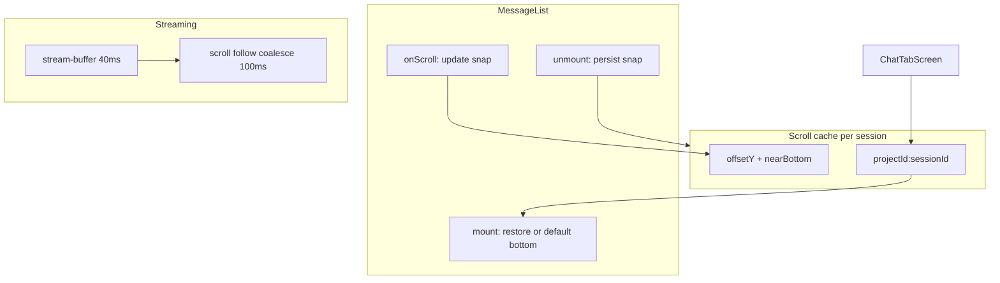

# Mobile 聊天稳定性与体验修复 技术规格（SPEC）

> **PRD**：[prd.md](./prd.md)  
> **平台**：Android  
> **分支建议**：`fix/mobile-chat-stability-fixes`（从 `main` 拉出）

---

## 设计目标

1. **消除「先顶后底」闪跳**：会话列表 remount / 工作区 ↔ 聊天切换时 **恢复滚动快照**，不把 remount 误判为首次加载。
2. **流式稳定**：贴底跟随 **节流**；上翻不打扰；流式结束切换 **无高度闪动**。
3. **键盘稳定**：`adjustResize` 触发的 `onContentSizeChange` **不**误触发贴底；编辑弹层保持可见。
4. **富文本**：完成根因记录 + **可落地**优化（节流、减少 FlatList 重绘）；默认 pref 仍为关。
5. **思维链 Markdown**：复用 `RichContentBody` 管线。
6. **P0 服务商保存**：保存 AK 路径 **零闪退**（JS + native 错误边界）。
7. **工具并发**：本迭代 **文档化评估 + 不改为并行**（见 §7）；后续迭代可单独立项。

---

## 代码探索结论（现状）

### 闪跳根因（已定位）

`MessageList.tsx` L143–165：组件 **remount** 时 `prevMessageCountRef === 0` 且 `messages.length > 0` 会执行：

```ts
nearBottomRef.current = true;
scrollToEndIfNearBottom();
```

**触发场景**（与 PRD 一致）：

| 场景 | 机制 |
|------|------|
| 聊天 ↔ **会话工作区**（`conversationPanel`） | `MessageList` 卸载/重建，`chatMessages` 仍在 `ChatTabScreen` 状态内 |
| 其它导致 `MessageList` remount | 同上 |

分页数据 **未丢失**（`chatMessages` + `hasMoreMessages` 保留）；丢失的是 **scroll offset / nearBottom**。

### 流式抖动

| 因素 | 位置 |
|------|------|
| 每 40ms flush → `streamingText` 更新 | `stream-buffer.service.ts` |
| 每次 delta → `useEffect` → `scrollToEndIfNearBottom` | `MessageList` L167–172 |
| `onContentSizeChange` → 再次 `scrollToEndIfNearBottom` | L238–241 |
| 富文本开启时历史消息 `RenderHTML` 重排 | `RichContentBody` + `extraData` |

流式 tail 本身已是 **纯 Text**（L192、`forcePlainText`）；抖动主要来自 **频繁 scrollToEnd + 列表高度变化**。

### 富文本

- Pref：`readChatRichTextEnabled`（默认 **关**，`app-ui-keys.ts`）。
- 渲染：`ChatMessageBody` → `RichContentBody` → `react-native-render-html`；`renderKey={messageId:richRenderEpoch}`。
- 限制：`RICH_CONTENT_MAX_CHARS = 12_000`。
- 用户观测「关 HTML 就不抖」与 **RenderHTML 布局成本 + onContentSizeChange 连锁 scroll** 一致；需在实现 PR 附 **根因小节**（见 Step 4）。

### 思维链

`ThinkingBlockCard.tsx` 仅用 `<Text>`；流式 thinking 同组件（`MessageList` L264–267）。

### 服务商保存（P0）

| 路径 | 错误处理 |
|------|----------|
| `ProviderCreateScreen` | `try/catch` + toast ✅ |
| `ProviderEditScreen` | `try/finally`，**无 catch**；依赖 `ProviderForm.handleSave` 捕获 ⚠️ |
| `ProviderForm.handleSave` | `catch` + toast ✅ |
| `providerFormToEditPatch` + `secretStore.set` | SKSP Android Keystore；失败抛 `SkspError` / native |

**可疑点**：`navigation.goBack()` 在 `try` 成功路径内；若 native 层未捕获异常可能导致 **进程退出**；需在保存路径加 **显式 catch**、**仅在成功 goBack**、并补 **集成测试/手工** 保存 AK。

### 工具并发（评估结论）

`agent-runner.ts` L269–292：**同一 assistant 轮内多个 tool use 串行** `await toolRunner.call(...)`。

| 项 | 结论 |
|----|------|
| 现状 | **串行**；顺序与 `toolUses` 数组一致 |
| 改并行风险 | VFS write/replace 竞态、worktree 一致性、doom-loop 检测窗口 |
| **本迭代决策** | **维持串行**；在 SPEC/CHANGELOG 记录评估；不在本 PR 改 core |
| 后续可选 | 只读工具（`vfs.read` 等）有限并行 — 需 core 白名单 + 合并 `tool_result` 顺序 |

---

## 总体方案



### 滚动缓存（核心）

新增 **`apps/mobile/src/services/chat-list-scroll-cache.ts`**（内存 Map，进程内有效）：

```ts
export type ChatListScrollSnapshot = {
  readonly offsetY: number;
  readonly nearBottom: boolean;
};

export function scrollCacheKey(projectId: string, sessionId: string): string;
export function getScrollSnapshot(key: string): ChatListScrollSnapshot | undefined;
export function setScrollSnapshot(key: string, snap: ChatListScrollSnapshot): void;
export function clearScrollSnapshot(key: string): void;
```

**`MessageList` 新增 props**：

```ts
initialScroll?: ChatListScrollSnapshot | null;
onScrollSnapshot?: (snap: ChatListScrollSnapshot) => void;
/** 无缓存的新会话：默认贴底 */
defaultScrollToBottom?: boolean;
```

**挂载逻辑（替换 L156–158 盲目贴底）**：

1. 若 `initialScroll?.nearBottom` → `scrollToEnd({animated: false})`（一次，`requestAnimationFrame`）。
2. Else 若 `initialScroll` → `scrollToOffset({offset: initialScroll.offsetY, animated: false})`。
3. Else 若 `defaultScrollToBottom` → 贴底。
4. **Remount 且已有 `initialScroll`** → **禁止**走 `prevCount === 0` 的默认贴底分支。

**卸载/更新**：`useEffect` cleanup 与 `onScroll` 同步写入 `onScrollSnapshot`（节流 100ms）。

**`ChatTabScreen`**：

- `conversationPanel` 从 `chat` 切走前：通过 ref 或最后一次 snapshot 写入 cache。
- 回到 `chat`：传 `initialScroll={getScrollSnapshot(key)}`。
- **新 session**（`sessionId` 变化且无 cache）：`defaultScrollToBottom={true}`。
- **不** 在 panel 切换时调用 `reloadMessages()`（当前 `useEffect` 仅 `chatSubview`+`sessionId`，已满足）。

### 流式 scroll 节流

在 `MessageList`：

- 抽取 `scheduleScrollToEnd()`：`requestAnimationFrame` + **100ms 最小间隔**（`lastScrollToEndMs`）。
- `streamingText/Thinking` 的 `useEffect` 与 `onContentSizeChange` **共用**该调度器。
- `nearBottomRef === false` 时 **永不**调度。

### 键盘

- **聊天页**：依赖 `adjustResize`（已配置）；**禁止**在 `onContentSizeChange` 中无条件贴底（仅 `nearBottomRef`）。
- **`MessageEditModal`**：已有 KAV 注释（L75）；保存后关闭不触发列表 reload 抖动（已有 `handleSaveMessageEdit` → `reloadMessages` — 可改为 `void refreshChatTokenLabel` + reload，与 perf 迭代一致，非必须本 PR）。
- 可选：`Keyboard` API `keyboardDidShow` 时若 `nearBottomRef`，单次贴底（**debounced**）。

---

## 最终项目结构

```
apps/mobile/src/
  services/
    chat-list-scroll-cache.ts          # 新增
  components/chat/
    MessageList.tsx                    # 缓存 restore + scroll 节流
    ThinkingBlockCard.tsx              # RichContentBody 集成
  screens/tabs/
    ChatTabScreen.tsx                  # 传 initialScroll / 写 cache
  screens/stack/
    ProviderEditScreen.tsx             # P0 catch + 成功才 goBack
  components/provider/
    ProviderForm.tsx                   # （可选）submit 后 reset saving 统一

apps/mobile/__tests__/
  message-list-scroll.test.ts          # 新增：remount 不盲目 scrollToEnd
  thinking-block-card.test.tsx         # 新增：rich 开启时 RenderHTML
  provider-edit-screen.test.tsx        # 新增：save 失败 toast 不 navigate

.apm/kb/docs/Iterations/mobile-chat-stability-fixes/
  prd.md
  spec.md
  investigation-rich-text-jitter.md  # 实现阶段补充（根因记录，可选同 PR）
```

---

## 变更点清单

| ID | 文件 | 变更 |
|----|------|------|
| S1 | `chat-list-scroll-cache.ts` | 新增 session 滚动快照 |
| S2 | `MessageList.tsx` | restore、节流、remount 修复、snapshot 回调 |
| S3 | `ChatTabScreen.tsx` | 接 cache；panel 切换 persist/restore |
| S4 | `MessageList` + 文档 | 富文本优化 + `investigation-rich-text-jitter.md` |
| S5 | `ThinkingBlockCard.tsx` | 条件 `RichContentBody`（同 pref） |
| S6 | `ProviderEditScreen.tsx` | `catch` + 失败不 `goBack` |
| S7 | （无 core 改动） | 工具并发评估写入 spec §7 / CHANGELOG |
| S8 | 测试 | 见测试策略 |

---

## 详细实现步骤

### Step 0 — P0 服务商保存（优先合入可独立 commit）

**`ProviderEditScreen.tsx`** 对齐 `ProviderCreateScreen`：

```ts
onSubmit={async values => {
  setSaving(true);
  try {
    const patch = providerFormToEditPatch(values);
    // ... edit ...
    showToast('已保存');
    navigation.goBack();
  } catch (err) {
    showToast(toastMessage('保存失败', err));
  } finally {
    setSaving(false);
  }
}}
```

**验证**：手工 — 编辑服务商、输入新 AK、保存；模拟 SKSP 失败（可 mock `secretStore.set` 抛错）→ toast、**不**退出 App。

### Step 1 — 滚动缓存

1. 实现 `chat-list-scroll-cache.ts`。
2. `MessageList`：新增 props；ref 标记 `hasRestoredScrollRef`；改 L143–165 分支逻辑。
3. `ChatTabScreen`：
   - `const scrollKey = projectId && sessionId ? scrollCacheKey(...) : null`
   - `conversationPanel` 变为 `workspace` 时 `setScrollSnapshot`（从 MessageList 回调）
   - 渲染 `MessageList` 时 `initialScroll={scrollKey ? getScrollSnapshot(scrollKey) : null}`

**默认行为**：无 snapshot 的新 session → 贴底（PRD 验收）。

### Step 2 — 流式 scroll 节流

1. `scheduleScrollToEnd` 100ms coalesce。
2. 流式结束（`streamingText/Thinking` 清空）：若 `nearBottomRef`，**一次**贴底；避免与 `messages` 增长双重 scroll — 在 `handleStreamReset` 侧不额外 scroll（MessageList 内 messages effect 已处理 append）。

### Step 3 — 思维链 Markdown

**`ThinkingBlockCard.tsx`**：

- 新增 props：`richTextEnabled?: boolean`、`richRenderEpoch?: number`、`contentId?: string`。
- 展开时：若 `richTextEnabled && !isRichContentOverLimit(text)` → `<RichContentBody variant="chat-assistant" … />`（或新增 `chat-thinking` variant，样式略灰）。
- 否则保持 `Text`。
- `MessageList` 传入与 assistant 相同 `chatRichTextEnabled` / `richRenderEpoch`；流式 thinking 的 `contentId="stream-thinking"`。

### Step 4 — 富文本根因与优化

**调查记录**（PR 描述或 `investigation-rich-text-jitter.md`）必须包含：

| 假设 | 验证 |
|------|------|
| Remount 盲目 `scrollToEnd` | Step 1 修复 |
| `onContentSizeChange` + 贴底 | Step 2 节流 |
| `RenderHTML` 布局慢 | 富文本开/关对比录屏 |
| `extraData={{chatRichTextEnabled, richRenderEpoch}}` 整表刷新 | 改为缩小 `extraData` 或 `React.memo` row |

**优化（本 PR 必做）**：

- 滚动节流（Step 2）。
- `ChatMessageBody` / row：`React.memo` 已存在；确保 `renderItem` 不 inline 新函数（已有 `useCallback` 检查）。
- **不改**默认 pref。

### Step 5 — 键盘

- 确认 Step 2 后 `onContentSizeChange` 不引发键盘抖动。
- `MessageEditModal`：手工验收编辑长消息；必要时 `KeyboardAvoidingView` 仅 iOS（Android 注释已说明）。

### Step 6 — 工具并发（仅文档）

在 PR / KB 记录 **§7 评估结论**；**无代码变更**。

### Step 7 — 测试

见下节。

---

## 测试策略

### 自动化

```bash
npm test -w @novel-master/mobile
npm test -w @novel-master/core   # 无 agent 变更时回归即可
```

| ID | 文件 | 断言 |
|----|------|------|
| T1 | `message-list-scroll.test.ts` | mock FlatList：传入 `initialScroll={offsetY:100,nearBottom:false}` remount 后 **不**调用 `scrollToEnd` |
| T2 | `message-list-scroll.test.ts` | 无 initialScroll、messages>0 → 调用 `scrollToEnd` |
| T3 | `thinking-block-card.test.tsx` | `richTextEnabled` + markdown → 非纯 Text（mock RenderHTML） |
| T4 | `provider-edit-screen.test.tsx` | `providers.edit` reject → toast、**未** `goBack` |
| T5 | 既有 `message-edit-modal.test.tsx` | 回归 |

### 手工（Android）

| ID | 步骤 |
|----|------|
| M1 | 会话内上翻 → 切工作区 → 切回聊天 → **位置恢复** |
| M2 | 底部 → 切换 → 回底部 **无闪跳** |
| M3 | 底部流式 30s → 主观不抖 |
| M4 | 上翻中流式 → **不**回底部 |
| M5 | 聚焦输入框 → 键盘弹收 **不**剧烈跳 |
| M6 | 编辑消息 → 气泡可见 |
| M7 | 富文本开/关对比 |
| M8 | 展开 thinking markdown（列表/代码块） |
| M9 | 保存 AK **不**闪退 |

---

## 风险与回滚方案

| 风险 | 缓解 |
|------|------|
| `scrollToOffset` 在 content 未 layout 前无效 | `onLayout` + 单次 restore 重试 |
| 缓存与 `loadOlderMessages` prepend | 已有 `maintainVisibleContentPosition`；prepend 时 `nearBottom=false`（L154–155） |
| 富文本仍慢 | 保持默认关；超长降级 |
| SKSP native 崩溃 | P0 加 JS catch；仍崩溃则 sksp-android 另开 issue |
| 工具并行未做 | PRD 已接受；用户预期「优化」需在 PR 说明 **评估后延后** |

**回滚**：revert `fix/mobile-chat-stability-fixes`；滚动缓存为纯 additive，可单独 revert S1–S3。

---

## 分步实施计划（建议 commit）

1. `fix(mobile): provider edit save error handling (P0)`
2. `fix(mobile): restore chat list scroll on panel remount`
3. `perf(mobile): throttle stream scroll-to-end`
4. `feat(mobile): markdown rendering for thinking blocks`
5. `docs(mobile): rich text jitter investigation`
6. `test(mobile): scroll cache and provider edit`

---

## 工具并发评估（交付物）

**写入 PR 正文 / 本 SPEC 存档**：

- **现状**：`DefaultAgentRunner` 每 step 内对 `toolUses` **for-await 串行**。
- **收益**：并行可缩短多 read 工具轮次 latency。
- **风险**：VFS 写、session 消息 append 顺序、UI tool card 到达顺序。
- **本迭代**：**不实现并行**。
- **后续**：core 增加「只读工具白名单 + Promise.all + 保序 tool_results」单独 iteration。

---

**请确认本 SPEC**。确认后可使用 `/subagent-inline-loop` 按 Step 0→7 在 `fix/mobile-chat-stability-fixes` 实现。
