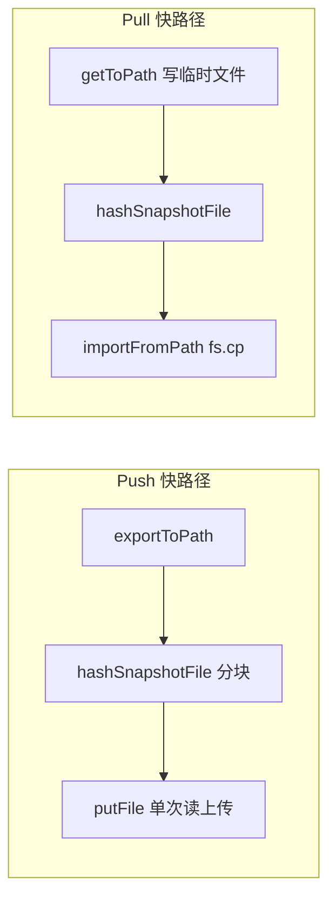

# cloud-sync-mobile-file-io-perf Bug 修复规格（SPEC）

## 根因分析

云同步与本地备份**共用** `exportDatabaseBackupToPath`（checkpoint → `fs.cp` → scrub，原生层，~85ms），但 Coordinator 随后要求：

1. `readSnapshotBytes`：6MB base64 解码为 `Uint8Array`（~9.6s，JS 主线程）
2. `computeSha256Hex`：Mobile 内联纯 JS SHA256（~23s，JS 主线程）
3. `storage.put(body)`：整包上传
4. Pull 反向：`get` 整包进内存 → 哈希 → `importDatabaseBackupFromBytes`（`bytesToBase64` 写盘）

本地导出使用 `saveDocuments(fileUri)`，文件不经 JS 内存，故体感快。

## 修复方案

在 Core 层增加**可选**文件路径级快照 IO；Mobile/Desktop 在能力齐备时走快路径，否则回退 bytes 路径（向后兼容）。



## 变更点清单

| 路径 | 操作 | 说明 |
|------|------|------|
| `packages/core/.../object-storage.port.ts` | 修改 | 可选 `putFile` / `getToPath` |
| `packages/core/.../db-sync.port.ts` | 修改 | 可选 `importSnapshotFromPath` |
| `packages/core/.../cloud-sync-coordinator.ts` | 修改 | 检测能力，走文件快路径 |
| `packages/cloud-sync-driver-s3/...` | 修改 | `putFile` / `getToPath` + 单测 |
| `apps/mobile/.../snapshot-file-hash.ts` | 新增 | `@noble/hashes` + `readStream` 分块哈希 |
| `apps/mobile/.../db-backup.service.ts` | 修改 | `importDatabaseBackupFromPath` |
| `apps/mobile/.../cloud-sync.service.ts` | 修改 | 注入快路径依赖 |
| `apps/desktop/.../db-backup.service.ts` | 修改 | `importDatabaseBackupFromPath` |
| `apps/desktop/.../cloud-sync.service.ts` | 修改 | `hashSnapshotFile` + 快路径 |

## 详细改动说明

### Coordinator

- `hashSnapshotFile?` + `importTempPath?` 注入
- Push：`supportsFilePush` = `hashSnapshotFile` + `storage.putFile` → 跳过 `readSnapshotBytes`
- Pull：`supportsFilePull` = `hashSnapshotFile` + `getToPath` + `importSnapshotFromPath`

### Mobile 哈希

- `hashSnapshotFile`：`react-native-blob-util` `readStream` 512KB 分块 + `@noble/hashes/sha256` 增量 update
- 不将 6MB 整包载入 JS 堆

### 导入

- `importDatabaseBackupFromPath`：`closeMobileConnection` → `fs.cp(src, dbPath)` → 恢复 provider 三表
- 避免 `bytesToBase64` + `writeFile(base64)`

### 本期不做

- GetObject HTTP 层流式下载（`getToPath` 仍为 get → 写盘）
- Push `putFile` 上传时仍一次读入内存（已消除 hash 前的第二次完整读）

## 测试策略

### 测试用例

- `coordinator.test.ts`：CS-P1b（文件 Pull）、CS-P5b（文件 Push）
- `s3-object-storage.test.ts`：`putFile`、`getToPath`
- `db-backup.service.test.ts`：`importDatabaseBackupFromPath` 使用 `cp`

### 验证命令

```bash
npm run build -w @novel-master/core -w @novel-master/cloud-sync-driver-s3
npx tsx --test packages/core/test/cloud-sync/coordinator.test.ts
npm test -w @novel-master/cloud-sync-driver-s3
npx jest apps/mobile/__tests__/db-backup.service.test.ts
```

## 风险与回滚方案

| 风险 | 缓解 |
|------|------|
| 快路径能力检测失败回退 bytes | 保留原 `readSnapshotBytes` / `importSnapshot` 路径 |
| `readStream` 在部分 RN 版本异常 | 可回退 `sha256Hex(bytes)` |
| 回滚 | revert `a25dc07a` + `31d5797b` 两个提交 |

## 提交

- `a25dc07a` feat(core): 云同步支持可选文件路径级快照 IO
- `31d5797b` perf(mobile): 云同步文件路径 IO 与分块哈希优化
