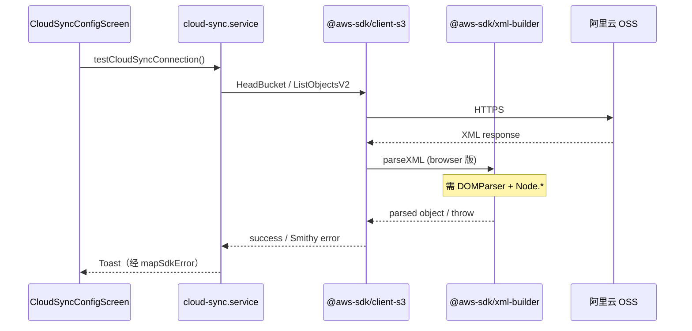

# Mobile 云同步 RN 兼容修复 技术规格（SPEC）

> 需求：[prd.md](./prd.md)  
> 前置：[cross-device-cloud-sync/spec.md](../cross-device-cloud-sync/spec.md)（云同步架构与 Mobile 集成约定）  
> 分支：`feature/mobile-cloud-sync-rn-compat`

## 设计目标

| # | PRD 目标 | 设计要点 |
|---|----------|----------|
| 1 | 消除 `DOMParser` 阻断 | 在 Mobile 入口补齐 Hermes 缺失的 `DOMParser` + `Node` 常量，使 `@aws-sdk/xml-builder` browser 解析器可工作 |
| 2 | 全链路 S3 可用 | 不改动 core / driver / Desktop；仅 Mobile 运行时与错误映射 |
| 3 | 用户可读错误 | Mobile `mapSdkError` 对齐 Desktop `mapStorageError` 规则，并兜底反序列化/技术异常 |
| 4 | 可回归 | Jest 覆盖 polyfill 冒烟 + 错误映射；真机 OSS 手工验收 |

**不在本 SPEC**：iOS 专项验收、新云同步能力、弃用 AWS SDK、Desktop 改动。

---

## 总体方案

### 根因与修复策略



**已确认调用链**（`node_modules/@aws-sdk/xml-builder`）：

- `package.json` 的 `react-native` 字段将 `./dist-cjs/xml-parser` 映射到 **`xml-parser.browser.js`**
- browser 解析器首行即 `new DOMParser()`，并引用 `Node.TEXT_NODE` / `Node.ELEMENT_NODE`
- Hermes **两者皆无** → ReferenceError → Smithy 包装为 `Deserialization error`

**主修复（推荐）**：在 `apps/mobile/src/polyfills.ts`（`index.js` 已最先 import）注入：

1. `globalThis.DOMParser` ← `@xmldom/xmldom`
2. `globalThis.Node` ← 最小常量 shim（`ELEMENT_NODE: 1`, `TEXT_NODE: 3` 等 browser 解析器用到的值）

这与 AWS SDK「RN 走 browser XML 解析器」的设计一致，改动面最小，不影响 Desktop / driver。

**不采用** Metro 将 `xml-parser` 重定向到 Node 版（`fast-xml-parser`）作为主方案：虽可行，但违背 SDK `react-native` 字段意图，且 Node 版依赖 `nodable_entities` 路径，Metro 条件解析更脆弱。可作为回滚备选记录在 §风险。

### 错误映射

Desktop `mapStorageError`（`apps/desktop/src/main/services/cloud-sync.service.ts`）已覆盖 AUTH / NETWORK 关键字匹配；Mobile `mapSdkError` 仅映射 2 个 `name`，其余原样抛出 → 用户看到 `DOMParser` / `Deserialization error`。

将 Mobile 错误映射**提取为独立纯函数**（便于单测），规则与 Desktop 对齐并扩展 Smithy/S3 结构：

| 输入特征 | `CloudSyncError.code` | 用户文案 |
|----------|----------------------|----------|
| `CredentialsProviderError`, `InvalidAccessKeyId`, `SignatureDoesNotMatch`, message 含 access denied / 403 | `AUTH` | 云存储凭据无效或权限不足 |
| `NoSuchBucket`, `NotFound`, message 含 nosuchbucket / 404 | `NETWORK` | 无法访问该存储桶，请检查 Bucket 名称 |
| message 含 network / timeout / econnrefused / enotfound | `NETWORK` | 无法连接云存储，请检查网络与 Endpoint |
| message 含 `DOMParser` / `Deserialization` / `ReferenceError` | `NETWORK` | 云存储连接失败，请检查网络与配置 |
| 其它未知 SDK 错误 | `NETWORK` | 云存储连接失败，请检查网络与配置 |

已有 `CloudSyncError`（`NOT_CONFIGURED`、`NEED_PULL_FIRST` 等）原样透传。

---

## 最终项目结构

```
apps/mobile/
  index.js                          # 已有：import './src/polyfills'（不变）
  package.json                      # + @xmldom/xmldom
  src/
    polyfills.ts                    # + DOMParser / Node shim
    services/
      cloud-sync.service.ts         # mapSdkError → 调用新模块
      map-cloud-sync-sdk-error.ts   # 新增：纯函数错误映射
  __tests__/
    polyfills-aws-xml.test.ts       # 新增：polyfill 后 parseXML 冒烟
    map-cloud-sync-sdk-error.test.ts # 新增：错误映射表
    cloud-sync.service.test.ts      # 补充：映射集成用例
```

**不变**：`packages/core`、`packages/cloud-sync-driver-s3`、`apps/desktop`、Metro `runtimeConfig.native` 解析。

---

## 变更点清单

| 路径 | 操作 | 说明 |
|------|------|------|
| `apps/mobile/package.json` | 修改 | 添加 `@xmldom/xmldom` 依赖 |
| `package-lock.json` | 修改 | lockfile 更新 |
| `apps/mobile/src/polyfills.ts` | 修改 | 注入 `DOMParser`、`Node` |
| `apps/mobile/src/services/map-cloud-sync-sdk-error.ts` | 新增 | SDK 错误 → `CloudSyncError` |
| `apps/mobile/src/services/cloud-sync.service.ts` | 修改 | `mapSdkError` 委托新模块 |
| `apps/mobile/__tests__/polyfills-aws-xml.test.ts` | 新增 | XML 解析冒烟 |
| `apps/mobile/__tests__/map-cloud-sync-sdk-error.test.ts` | 新增 | 映射单测 |
| `apps/mobile/__tests__/cloud-sync.service.test.ts` | 修改 | 反序列化/DOMParser 兜底用例 |

---

## 详细实现步骤

### Step 1 — DOM / XML polyfill

**文件**：`apps/mobile/src/polyfills.ts`

```typescript
import { DOMParser } from '@xmldom/xmldom';

// 在现有 polyfill import 之后、App 之前执行
if (typeof globalThis.DOMParser === 'undefined') {
  globalThis.DOMParser = DOMParser as unknown as typeof DOMParser;
}

if (typeof globalThis.Node === 'undefined') {
  globalThis.Node = {
    ELEMENT_NODE: 1,
    ATTRIBUTE_NODE: 2,
    TEXT_NODE: 3,
    CDATA_SECTION_NODE: 4,
    ENTITY_REFERENCE_NODE: 5,
    ENTITY_NODE: 6,
    PROCESSING_INSTRUCTION_NODE: 7,
    COMMENT_NODE: 8,
    DOCUMENT_NODE: 9,
    DOCUMENT_TYPE_NODE: 10,
    DOCUMENT_FRAGMENT_NODE: 11,
  } as unknown as typeof Node;
}
```

**依赖**：`npm install @xmldom/xmldom -w @novel-master/mobile`（版本 `^0.8.10`，与 monorepo 已有 lock 条目一致）。

**验证**：真机重新打包后，原复现用例（阿里云 OSS、Path style 开、同 Desktop 桶）「测试连接」不再出现 `DOMParser`。

### Step 2 — SDK 错误映射模块

**文件**：`apps/mobile/src/services/map-cloud-sync-sdk-error.ts`

- 导出 `mapCloudSyncSdkError(error: unknown): CloudSyncError`
- 实现逻辑见 §总体方案表格；优先读 `error.name`、`error.$metadata.httpStatusCode`（Smithy 结构），再 fallback 到 `message.toLowerCase()`
- `cloud-sync.service.ts` 中 `mapSdkError` 改为一行委托

**注意**：最终返回类型统一为 `CloudSyncError`（与 Desktop `mapStorageError` 一致），避免 `Error` 原样泄漏到 Toast。

### Step 3 — 自动化测试

**`polyfills-aws-xml.test.ts`**：

```typescript
// 模拟 Hermes：删除 DOMParser/Node 后加载 polyfills，再调用 @aws-sdk/xml-builder parseXML
import '../src/polyfills';
import { parseXML } from '@aws-sdk/xml-builder';

const sample = `<?xml version="1.0"?><Error><Code>NoSuchBucket</Code><Message>...</Message></Error>`;
expect(() => parseXML(sample)).not.toThrow();
expect(parseXML(sample).Error.Code).toBe('NoSuchBucket');
```

测试开头需 `delete (globalThis as any).DOMParser` / `Node` 以模拟 RN 环境（Node 测试运行时默认有 DOM 时）。

**`map-cloud-sync-sdk-error.test.ts`**：表驱动用例覆盖 AUTH、NoSuchBucket、network timeout、Deserialization error、DOMParser message。

**`cloud-sync.service.test.ts`**：`testCloudSyncConnection` 在 mock SDK 抛出 `Deserialization error` 时，断言 reject 的 `message` 为用户向中文。

### Step 4 — 真机手工验收（Android + 阿里云 OSS）

| ID | 步骤 | 期望 |
|----|------|------|
| M1 | 与 Desktop 相同 OSS 配置，测试连接 | 「连接成功」 |
| M2 | 错误 SK | 「凭据无效或权限不足」类文案 |
| M3 | 错误 Bucket | 「无法访问该存储桶」类文案 |
| M4 | Desktop Push → Android Pull | 数据可见 |
| M5 | Android Push → Desktop Pull | 数据可见 |

记录设备型号、App 版本、OSS Region/Endpoint。

---

## 测试策略

### 自动化

| 命令 | 范围 |
|------|------|
| `npm test -w @novel-master/mobile -- --testPathPattern="polyfills-aws-xml|map-cloud-sync-sdk-error|cloud-sync.service"` | 新增 + 既有 cloud-sync 用例 |
| `npm run test:fast` | 全仓回归 |

### 测试用例

1. **polyfill**：无 `DOMParser` 环境下 `parseXML` 解析 S3 错误 XML 不抛 ReferenceError  
2. **映射**：`InvalidAccessKeyId` → `AUTH` + 中文  
3. **映射**：`NoSuchBucket` → 桶不可达文案  
4. **映射**：`Deserialization error: ...` → 通用连接失败文案，不含 `Deserialization`  
5. **映射**：`Property 'DOMParser' doesn't exist` → 通用连接失败文案（兜底）  
6. **集成**：`testCloudSyncConnection` mock SDK 失败时 Toast 文案合规  
7. **回归**：既有 pull/push/not configured 用例仍绿  

### 不做的自动化

- 真机连阿里云 OSS（网络 + 凭据依赖，放手工 M1–M5）

---

## 风险与回滚方案

| 风险 | 缓解 | 回滚 |
|------|------|------|
| `@xmldom/xmldom` 与 browser 解析器语义差异 | S3 响应 XML 结构简单；Step 3 冒烟测覆盖 | 移除 polyfill 依赖与代码 |
| polyfill 增加包体积（~50KB） | 仅 Mobile 依赖，不影响 Desktop | 同上 |
| 阿里云 OSS Region 留空导致签名/Endpoint 问题 | 修复后暴露真实业务错误；可在验收文档注明推荐填 `oss-cn-*` | 非本迭代代码回滚范畴 |
| Metro 缓存旧 bundle | 验收前 `npx react-native start --reset-cache` | — |

**备选方案（仅主方案失败时）**：在 `metro.config.js` 增加 `resolveAwsXmlParser`，将 `@aws-sdk/xml-builder` 内 `./xml-parser` 解析重定向到 `xml-parser.js`（`fast-xml-parser`）。回滚主方案时可单独尝试。

**回滚**：revert `feature/mobile-cloud-sync-rn-compat` 上本 SPEC 相关 commit；Desktop / core 无影响。

---

## 实现顺序（建议 commit）

1. `fix(mobile): polyfill DOMParser for AWS SDK XML on Hermes`  
2. `fix(mobile): map cloud sync SDK errors to user-facing CloudSyncError`  
3. `test(mobile): polyfill and SDK error mapping for cloud sync`  

每步后运行 `npm test -w @novel-master/mobile`；全部完成后真机 M1–M5。
