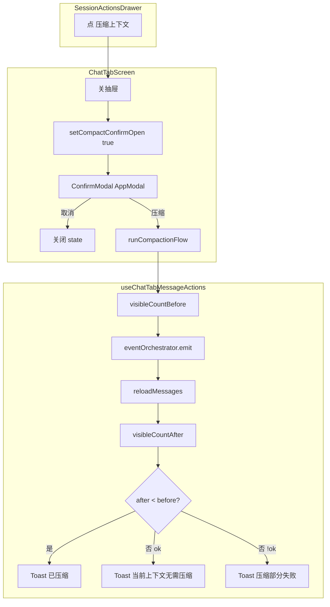

# Mobile 压缩上下文确认与反馈修复 技术规格（SPEC）

> **PRD**：[prd.md](./prd.md)  
> **平台**：Android + iOS（`apps/mobile`）  
> **分支建议**：`fix/mobile-compact-context-confirm`  
> **性质**：Mobile UI 确认层修复 + 结果反馈；无 Core / DB / 路由变更。

---

## 设计目标

1. **消除 RN Alert 时序问题**：关 `SessionActionsDrawer` 后不再同步 `Alert.alert`。
2. **对齐 Desktop 交互**：React 确认弹层 + state 驱动，文案与 Desktop `ConfirmModal` 一致。
3. **可判定的结果反馈**：压缩前后对比可见消息数，区分「已压缩」与「无需压缩」。
4. **守卫不静默**：scope 缺失等场景补 Toast。
5. **最小改动面**：复用 `AppModal`；不新增 Core API。

---

## 现状（代码探索）

| 模块 | 路径 | 现状 / 问题 |
|------|------|-------------|
| 会话操作抽屉 | `apps/mobile/src/components/chrome/SessionActionsDrawer.tsx` | 点项时 `onClose()` 后 `item.action?.()` |
| 压缩入口接线 | `apps/mobile/src/screens/tabs/ChatTabScreen.tsx` L441–444 | 关抽屉 → `messageActions.handleCompactSession()` |
| 压缩逻辑 | `apps/mobile/src/screens/tabs/chat-tab/useChatTabMessages.ts` `handleCompactSession` | 关抽屉后 **同步** `Alert.alert`；确认后 `eventOrchestrator.emit(EVENT_SESSION_COMPACTION_REQUESTED, …)` |
| 事件执行 | `packages/core/.../event-orchestrator.service.ts` | 无配置时 `{ ok: true }` 空跑；有 `hide-message` 时可能 **静默 no-op**（消息不足） |
| hide-message | `packages/core/.../hide-message.handler.ts` | `ids.length === 0` 或 `range == null` 时 **return**，不抛错 |
| Desktop 参照 | `apps/desktop/renderer/App.tsx` L377–400 | `setConfirmCompact(true)` + `<ConfirmModal>`，非 Alert |
| Mobile 确认组件 | `apps/mobile/src/components/ui/TextPromptModal.tsx` | 已有 `AppModal` + fade 居中面板模式，可复用布局 |
| Mobile 确认组件 | **无** `ConfirmModal` | 需新增轻量组件 |
| 可见消息计数 | `packages/core/.../depth-from-tail.ts` `listVisibleForDepth` | 可用于压缩前后对比 |
| 测试 | `apps/mobile/__tests__/chat-*` | `SessionActionsDrawer` 被 mock；**无** 压缩确认路径测试 |

**根因**

| 现象 | 根因 |
|------|------|
| 点压缩无反应 | `AppModal` 关闭动画未完成时调用 `Alert.alert`，RN 上确认框常不显示 |
| 确认后消息仍可见（短会话） | 默认 `startDepth: 6` 无匹配范围，`hide-message` 静默 no-op，但仍 Toast「已压缩」 |
| scope 异常无反馈 | `projectId == null \|\| sessionId == null` 时 **静默 return** |

---

## 总体方案



### 方案要点

1. **确认 UI 上提到 `ChatTabScreen`**（与 `TextPromptModal` 会话重命名同级），由 `compactConfirmOpen` state 控制；**不再**在 `handleCompactSession` 内 `Alert.alert`。
2. **抽屉回调仅打开确认**：`onCompactSession` → `setCompactConfirmOpen(true)`（抽屉仍先关闭）。
3. **新增 `ConfirmModal`**（Mobile）：API 对齐 Desktop（`visible/title/message/confirmLabel/cancelLabel/onConfirm/onCancel/busy`），实现参照 `TextPromptModal` 布局（`AppModal` + fade + 双按钮），无文本输入。
4. **压缩执行函数** `runCompactionFromConfirm`：从 `handleCompactSession` 拆出 Alert 后的 async 主体；`handleCompactSession` 改名为「请求压缩」仅做守卫 + 打开确认（或 ChatTabScreen 直接调守卫后开 modal）。
5. **可见消息对比**：emit 前 `listVisibleForDepth(await messages.listBySession(sessionId)).length`；`reloadMessages(true)` 后再计一次；减少则「已压缩」，否则且 `result.ok` 则「当前上下文无需压缩」。

---

## 最终项目结构

```text
apps/mobile/src/
  components/ui/
    ConfirmModal.tsx          # 新增
  screens/tabs/
    ChatTabScreen.tsx         # compactConfirmOpen + ConfirmModal + 接线
    chat-tab/
      useChatTabMessages.ts   # 拆分 runCompaction；移除 Alert；补 scope Toast
apps/mobile/__tests__/
  confirm-modal.test.tsx      # 新增（可选组件快照/交互）
  chat-tab-compact-context.test.tsx  # 新增（守卫 + 可见数反馈逻辑单测）
```

---

## 变更点清单

| 文件 | 变更 |
|------|------|
| `components/ui/ConfirmModal.tsx` | **新增** RN 确认弹层 |
| `ChatTabScreen.tsx` | `compactConfirmOpen` state；渲染 `ConfirmModal`；`onCompactSession` 改为开确认 |
| `useChatTabMessages.ts` | 导出 `requestCompactSession`（守卫）+ `runCompactionSession`（async 执行 + 反馈）；删除 `Alert.alert` 压缩块；scope null → `showToast` |
| `useChatTabMessages.ts` | 可选：抽出 `countVisibleMessages(runtime, sessionId)` 小函数（同文件内 private） |
| `__tests__/chat-tab-compact-context.test.tsx` | 单测：守卫、emit 后 toast 分支（mock runtime） |

**不改动**

- `SessionActionsDrawer.tsx`（仍只调 `onCompact`）
- `packages/core/**`
- Desktop

---

## 详细实现步骤

### M1 — 新增 `ConfirmModal`

**`ConfirmModal.tsx`**（参照 `TextPromptModal` + Desktop API）：

```typescript
type Props = {
  visible: boolean;
  title: string;
  message: string;
  confirmLabel?: string;   // default 确定
  cancelLabel?: string;    // default 取消
  danger?: boolean;        // 确认按钮用 tokens.danger
  busy?: boolean;
  onConfirm: () => void | Promise<void>;
  onClose: () => void;
};
```

- `AppModal` + `animationType="fade"` + 居中 panel。
- 标题、正文、`取消` / 确认按钮横排（与 `TextPromptModal` actions 一致）。
- `busy` 时禁用按钮，确认文案「处理中…」。
- `testID`: `confirm-modal`, `confirm-modal-confirm`, `confirm-modal-cancel`。

### M2 — `ChatTabScreen` 接线

1. `const [compactConfirmOpen, setCompactConfirmOpen] = useState(false)`。
2. 替换 `onCompactSession`：

```typescript
onCompactSession={() => {
  scope.setSessionDrawerOpen(false);
  if (!messageActions.requestCompactSession()) {
    return; // 守卫已 Toast
  }
  setCompactConfirmOpen(true);
}}
```

3. 渲染（与 `sessionRenameModal` 并列）：

```tsx
<ConfirmModal
  visible={compactConfirmOpen}
  title="压缩上下文"
  message="将按照事件配置压缩上下文。是否继续？"
  confirmLabel="压缩"
  onClose={() => setCompactConfirmOpen(false)}
  onConfirm={async () => {
    setCompactConfirmOpen(false);
    await messageActions.runCompactionSession();
  }}
/>
```

> **WHY state 在 ChatTabScreen**：与 `TextPromptModal` / Desktop `App.tsx` 一致；避免在 hook 内嵌 Modal 导致多实例或导航 focus 问题。

### M3 — 重构 `useChatTabMessageActions`

**删除** `handleCompactSession` 内的 `Alert.alert` 整块。

**新增**：

```typescript
const requestCompactSession = useCallback((): boolean => {
  if (agentRunning) {
    showToast(toastMessage('请稍候', 'Agent 运行中无法压缩'));
    return false;
  }
  if (projectId == null || sessionId == null) {
    showToast(toastMessage('无法压缩', '请先选择项目与会话'));
    return false;
  }
  return true;
}, [...]);

const runCompactionSession = useCallback(async () => {
  if (projectId == null || sessionId == null) return;
  try {
    const allBefore = await runtime.messages.listBySession(sessionId);
    const visibleBefore = listVisibleForDepth(allBefore).length;

    const result = await runtime.eventOrchestrator.emit(
      EVENT_SESSION_COMPACTION_REQUESTED,
      { sessionId, projectId, trigger: 'manual' },
    );
    await reloadMessages(true);
    void refreshChatTokenLabel();

    const allAfter = await runtime.messages.listBySession(sessionId);
    const visibleAfter = listVisibleForDepth(allAfter).length;

    if (!result.ok) {
      showToast(toastMessage('压缩部分失败', result.failures[0]?.error));
    } else if (visibleAfter < visibleBefore) {
      showToast('已压缩');
    } else {
      showToast('当前上下文无需压缩');
    }
  } catch (error) {
    showToast(toastMessage('压缩失败', error));
  }
}, [...]);
```

- `listVisibleForDepth` 从 `@novel-master/core/compaction` 或现有 mobile 已用的 core 路径导入（与 `regex-test.service.ts` 一致）。
- **保留** `handleCompactSession` 作 deprecated 别名或删除，改 export `requestCompactSession` + `runCompactionSession`。

### M4 — 测试

1. **`confirm-modal.test.tsx`**：`visible=true` 渲染标题/按钮；点取消调 `onClose`。
2. **`chat-tab-compact-context.test.ts`**（纯函数或 hook 测）：
   - `requestCompactSession`：agentRunning → false + toast
   - `runCompactionSession`：mock emit + messages；`visibleAfter < visibleBefore` → 「已压缩」；相等 → 「当前上下文无需压缩」；`!result.ok` → 失败 toast

### M5 — 构建与手工验收

- `npm run test --workspace=@novel-master/mobile`（或项目等价命令）
- 手工：Android 真机/模拟器重复 T1–T3（PRD）10 次

---

## 测试策略

### 单元 / 组件

| ID | 文件 | 断言 |
|----|------|------|
| U1 | `confirm-modal.test.tsx` | 标题、确认/取消回调 |
| U2 | `chat-tab-compact-context.test.ts` | 守卫 false 不调 emit |
| U3 | 同上 | visible 减少 → 「已压缩」 |
| U4 | 同上 | visible 不变 + ok → 「当前上下文无需压缩」 |
| U5 | 同上 | `!result.ok` → 失败 toast |

### 手工 / 回归

| ID | 步骤 | 预期 |
|----|------|------|
| M1 | 长会话 → 压缩 → 确认 | 较早消息隐藏 + 「已压缩」 |
| M2 | 新会话（<7 条可见）→ 压缩 → 确认 | 「当前上下文无需压缩」 |
| M3 | 压缩 → 取消 | 无变化 |
| M4 | Agent 运行中点压缩 | Toast 拦截，无确认框 |
| M5 | 同抽屉其他菜单项 | 无回归 |

---

## 风险与回滚方案

| 风险 | 缓解 |
|------|------|
| `ConfirmModal` 与 `SessionActionsDrawer` 连续两个 Modal | 先关抽屉再 `setState(true)`；`AppModal` 使用 fade 而非 slide；若仍偶发，可在 `onCompactSession` 用 `requestAnimationFrame` / `setTimeout(0)` 延迟开确认（**仅作 fallback，首版可不加**） |
| 可见数对比误报（并发刷新） | 压缩前禁止并发压缩；Agent 运行中已拦截 |
| `listVisibleForDepth` 导入路径 | 使用 `@novel-master/core/compaction` 公开导出，与 mobile runtime 一致 |

**回滚**：删除 `ConfirmModal`；恢复 `handleCompactSession` 内 `Alert.alert` 单提交 revert。

---

## 兼容性与迁移

- 无数据迁移；无 API 变更。
- 用户可见：短会话成功路径 Toast 由「已压缩」改为「当前上下文无需压缩」——属 **预期行为修正**，见 PRD T6。
