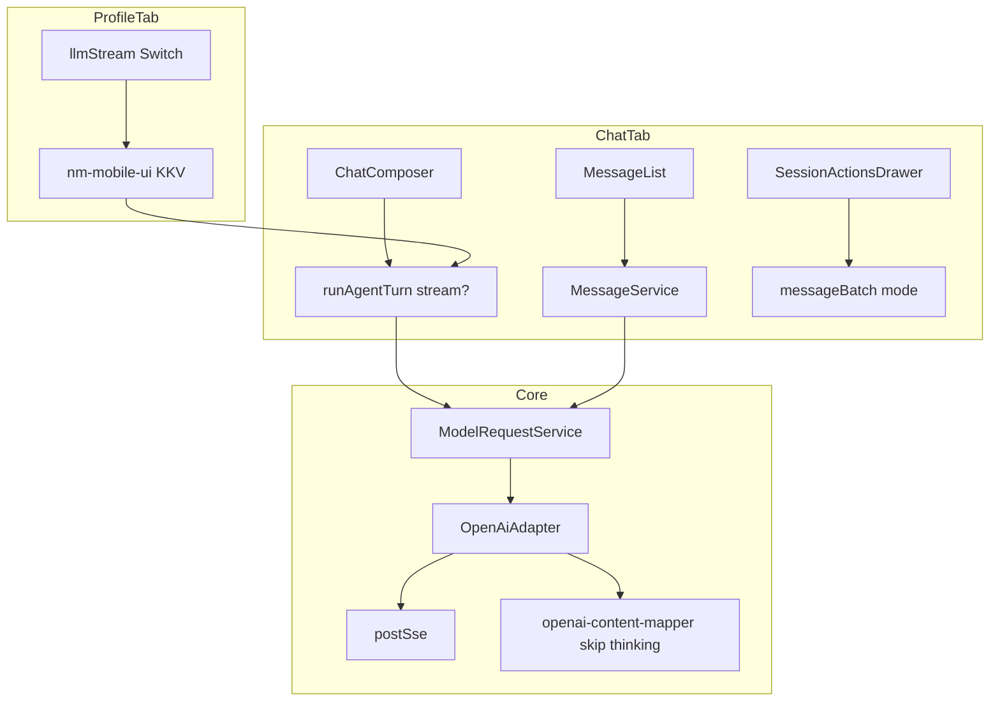

# Mobile Fix v2 技术规格（SPEC）

> 需求：[prd.md](./prd.md)  
> 相关：`mobile-app/spec.md`、`mobile-llm-streaming/spec.md`、`provider-model/spec.md`  
> **分支**：`feature/mobile-fix-v2`

## 设计目标

- 补齐 **会话内消息 CRUD（编辑/删除/批量删）** 与 **工作区对话偏好（流式开关）**。
- **思考过程**与**可见回复**分离展示；Core 出站 OpenAI 兼容请求时剥离 `thinking`。
- 修复 Agent 配置 **假 dirty**、批量删 **布局**、会话抽屉 **Modal 触摸**。
- 提供 **应用图标** 从 `icon.webp` 一键生成脚本。

---

## 现状与约束（代码探索）

| 模块 | 修复前 | 本期 |
|------|--------|------|
| `MessageService` | 仅有 `delete` / `append` | + `updateContent` |
| `openai-content-mapper` | 出站 `thinking` → `ProviderError` | 出站跳过 `thinking` |
| `message-blocks.ts` | thinking 并入 `textParts` 或隐藏 | `thinkingParts` + `ThinkingBlockCard` |
| `agent-run.service.ts` | `stream: true` 写死 | 读 `llmStream` 偏好 |
| `AgentEditorForm` | snapshot 含预填 provider → 假 dirty | `formSnapshotJson` + 加载前 `baseline=null` |
| `MessageList` 批量模式 | 气泡 `flex:1` 左对齐 | 左列 checkbox + 右侧气泡对齐 |
| `SessionActionsDrawer` | 嵌套 Pressable 冒泡 | 全屏遮罩 + 面板 View |
| App 图标 | RN 默认 | `generate-app-icons.mjs` |

**依赖**

- 流式传输仍走 Core `postSse`（`main` 已合入）；本迭代 **不修改** `postSse` 实现。
- Metro：勿在 `index.js` 顶层 import 全量 `@novel-master/core`（历史约束不变）。

---

## 总体方案



### 1. Core — 消息更新

**`MessageRepository.updateContent(id, contentJson)`**  
**`MessageService.updateContent(messageId, content)`** — `assertMessageContent` 后写库。

单测：`packages/core/test/chat/chat.services.test.ts`（delete + updateContent）。

### 2. Core — 出站剥离 thinking

**`openai-content-mapper.ts`**

- `blocksToOpenAiMessageContent`：`case "thinking": break`（不再 throw）。
- `chatMessagesToOpenAi`：过滤 `b.type !== "thinking"`。

单测：`protocol-openai.test.ts` — `omits thinking blocks from outbound history`。

### 3. Mobile — 消息 UI

| 能力 | 实现 |
|------|------|
| 长按菜单 | `BottomSheetMenu`：编辑 / 删除 |
| 编辑 | `TextPromptModal` + `editableTextFromMessage`（**仅 `text` 块**） |
| 批量删 | `SessionActionsDrawer` → `messageBatch.enter()`；`ManageHeader` + `MessageList` `batchMode` |
| 布局 | `batchCheckboxCol` 固定宽 36px；`batchBubbleCol` 内 `alignItems` 按 role |

**文件**

- `apps/mobile/src/components/chat/message-edit.ts`
- `apps/mobile/src/components/chat/MessageList.tsx`
- `apps/mobile/src/components/chat/message-blocks.ts`
- `apps/mobile/src/screens/tabs/ChatTabScreen.tsx`
- `apps/mobile/src/components/chrome/SessionActionsDrawer.tsx`

### 4. Mobile — 思考过程展示

**`ThinkingBlockCard.tsx`**

- 标题「思考过程」+ 折叠；折叠时**仅标题**，不展示正文摘要。
- `defaultExpanded`：历史默认 `false`；流式 `streamingThinking` 传 `defaultExpanded`。

**`message-blocks.ts`**

- `MessageListItem.thinkingParts`；与 `textParts` 分轨。
- 助手消息：先 thinking 卡，再 text 气泡。

**流式**

- `agent-run.service`：`thinking-delta` → `onStreamThinking`
- `ChatTabScreen`：`streamingThinking` state

### 5. Mobile — 工作区流式开关

| 项 | 值 |
|----|-----|
| KKV 模块 | `nm-mobile-ui` |
| 键 | `llmStream`（`true` / `false`） |
| 默认 | `true` |

**文件**

- `storage/app-ui-keys.ts`、`storage/llm-stream-pref.ts`
- `components/ui/ProfileSwitchItem.tsx`
- `screens/tabs/ProfileTabScreen.tsx`
- `components/chat/ChatComposer.tsx` → `runAgentTurn(..., { stream })`

`stream: false` 时不注册 `onStream`，完成后靠 `onMessagesChanged` 刷新列表。

### 6. Mobile — Agent 脏状态

**`formSnapshotJson({ name, maxSteps, modelEnabled, prompts, ...(modelEnabled ? { providerId, vendorModelId } : {}) })`**

- `savedBaseline` 初始 `null`；`null` 期间 `onDirtyChange(false)`。
- `loadAgent` 末行按**已保存定义**写 baseline（非 UI 预填 provider）。
- `handleSave` 后 `setSavedBaseline(snapshot)`。

### 7. 应用图标

```bash
# 源图：仓库根 icon.webp
npm run icons -w @novel-master/mobile
```

输出：Android `mipmap-*`；iOS `AppIcon.appiconset` + 更新 `Contents.json`。  
说明见 `apps/mobile/README.md`「App launcher icon」。

---

## 最终项目结构

```text
packages/core/src/
  domain/chat/repositories/message.port.ts          # + updateContent
  domain/chat/repositories/impl/sqlite-message.repository.ts
  service/chat/message.port.ts                      # + updateContent
  service/chat/impl/message.service.ts
  infra/llm-protocol/logic/openai-content-mapper.ts   # skip thinking outbound
  test/chat/chat.services.test.ts
  test/provider/protocol-openai.test.ts

apps/mobile/
  scripts/generate-app-icons.mjs                    # 新增
  src/components/chat/
    ThinkingBlockCard.tsx                           # 新增
    message-edit.ts                                 # 新增
    MessageList.tsx                                 # 改
    message-blocks.ts                               # 改
    ChatComposer.tsx                                # 改
  src/components/ui/ProfileSwitchItem.tsx           # 新增
  src/components/chrome/SessionActionsDrawer.tsx    # 改
  src/components/agent/AgentEditorForm.tsx          # 改
  src/screens/tabs/ChatTabScreen.tsx                  # 改
  src/screens/tabs/ProfileTabScreen.tsx             # 改
  src/services/agent-run.service.ts                 # 改
  src/storage/llm-stream-pref.ts                    # 新增
  src/storage/app-ui-keys.ts                        # + llmStream
  android/.../mipmap-*/ic_launcher*.png             # 生成
  ios/.../AppIcon.appiconset/                       # 生成

icon.webp                                           # 源图（仓库根）
```

---

## 变更点清单

| 文件 | 变更 |
|------|------|
| Core message 层 | `updateContent` 全链路 + 单测 |
| `openai-content-mapper.ts` | 出站忽略 thinking |
| `ThinkingBlockCard.tsx` | 思考 UI |
| `MessageList` / `message-blocks` | 分轨展示 + 批量布局 |
| `ChatTabScreen` | 批量删/编辑/流式 state |
| `SessionActionsDrawer` | 批量删入口 + Modal 布局 |
| `llm-stream-pref` / `ProfileTabScreen` | 流式开关 |
| `AgentEditorForm` | 脏检测 |
| `generate-app-icons.mjs` | 图标生成 |

---

## 详细实现步骤

### P1 — 消息编辑删除（已提交 `5223c21`）

1. Core `updateContent` + 单测。  
2. Mobile 长按菜单、批量删、`SessionActionsDrawer` 入口。  
3. 手工 M1–M3。

### P2 — Thinking 展示 + 出站（工作区未提交）

1. Core mapper 跳过 thinking；更新单测。  
2. `ThinkingBlockCard` + `message-blocks` + 流式 `onStreamThinking`。  
3. 手工 M4–M5。

### P3 — 流式开关（工作区未提交）

1. `APP_UI_KEY_LLM_STREAM` + read/write helpers。  
2. Profile UI + `ChatComposer` / `runAgentTurn`。  
3. 手工 M6。

### P4 — Agent dirty + 批量布局 + 抽屉（工作区未提交）

1. `formSnapshotJson`；手工 M7。  
2. `MessageList` batch 列布局；手工 M8。  
3. `SessionActionsDrawer` overlay 结构。

### P5 — 图标（工作区未提交）

1. `npm run icons`；卸载重装验证桌面图标。

---

## 测试策略

### Core 自动

| 用例 | 命令/位置 |
|------|-----------|
| chat.services | `message delete` / `updateContent` |
| protocol-openai | `omits thinking blocks from outbound history` |
| 全量 | `npm test -w @novel-master/core` |

### Mobile 手工

| ID | 步骤 |
|----|------|
| M1–M8 | 见 PRD 验收表 |
| ICON | `icons` 脚本后重装 App 看启动图标 |

### 建议补测（非本期必达）

- `formSnapshotJson` 单测（modelEnabled false 时 provider 不参与）
- `readLlmStreamEnabled` 单测（可选）

---

## 风险与回滚方案

| 风险 | 缓解 |
|------|------|
| 非流式长回复等待久 | UI 副标题说明；用户自行开启流式 |
| thinking 仍占 DB 体积 | 与 streaming 存储一致；出站已忽略 |
| 批量删误触 | 确认 Alert |
| 图标脚本依赖 sharp | `devDependency`；CI 可不跑 |

**回滚**

- 消息 API：revert Core `updateContent`（旧客户端不调用则无影响）。  
- 流式开关：删 KKV 键或默认改回 `true`。  
- thinking UI：revert `message-blocks` / `ThinkingBlockCard`。

---

## 提交与合并状态（2026-05）

| 提交 | 说明 |
|------|------|
| `99cdef7` | 迭代脚手架 |
| `5223c21` | 消息编辑/删除/批量删 |
| 工作区 | thinking UI、流式开关、Agent dirty、图标、mapper、布局/抽屉等（**待提交**） |

合入 `main` 前建议：`npm test -w @novel-master/core` + 手工 M1–M8。

---

## 已确认

- [x] 批量删除入口：会话抽屉  
- [x] thinking 出站忽略、UI 分轨展示  
- [x] 流式/非流式工作区开关，默认流式  
- [x] 不实现流式失败自动非流式重试  
