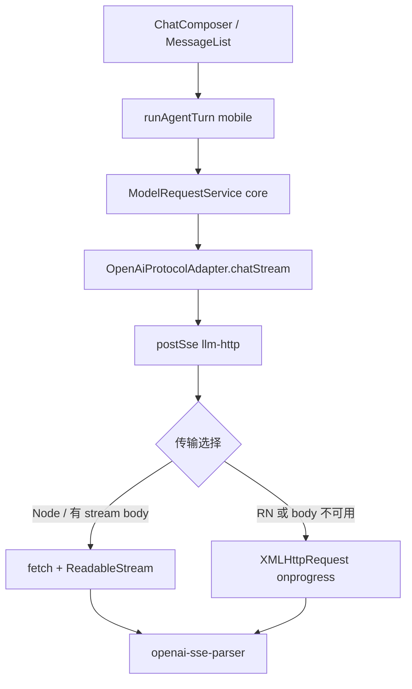

# Mobile LLM 流式输出 技术规格（SPEC）

> 需求：[prd.md](./prd.md)  
> 相关：`provider-model/spec.md`、`mobile-app/spec.md`

## 设计目标

- RN（Android 优先）上 OpenAI 兼容协议 **真·SSE 流式**，修复 `fetch` + `response.body === null`。
- **LLM HTTP 统一在 Core**：扩展 `http-util` / 新增 SSE 传输模块；adapter 不再直接假设 `fetch().body`。
- **`apps/mobile` 本期零业务改动**（不新增 `openai-xhr-stream`、不注册钩子、不改 `create-mobile-runtime` 流式逻辑）。
- **不降级**：HTTP/SSE/解析失败 → `ProviderError` 直抛 → `ChatComposer` 红字；禁止 `stream: false` 重试。
- CLI / Node：`postSse` 内部仍用 `fetch` + `ReadableStream`，零回归。

---

## 现状与约束（代码探索）

| 模块 | 现状 | 本期 |
|------|------|------|
| `ModelRequestService` | 调 `getProtocolAdapter().chat()` | 不变 |
| `openai.adapter.ts` | `chatStream` 直接 `this.fetchFn` + `parseSseStream(body)` | `postSse` + 共用 parser |
| `http-util.ts` | `fetchJson`、`assertOk` | 新增 `postSse`（及可选 `supportsFetchStreamBody`） |
| `configureLlmFetch` | 注入 `FetchFn` 给 adapter（mobile `__DEV__` 日志） | 不变；**仅影响** `fetchJson` / 非流式 / listModels |
| `agent-run.service.ts` | `stream: true` | 不变 |
| `ChatComposer` | `catch` → `setError(formatError(err))` | 满足「失败即报错」 |

**调用链（不变）**：

```text
apps/mobile → runAgentTurn → modelRequests.request → OpenAiProtocolAdapter.chatStream
                                                      → Core postSse → SSE parser
```

**Metro**：禁止在 `index.js` 顶层 import 全量 `@novel-master/core`（历史教训）；本期 **无需** 在 runtime 注册流式实现。

---

## 总体方案

### 架构



### 1. Core — LLM SSE 传输（`postSse`）

**位置**：`packages/core/src/infra/llm-protocol/logic/llm-sse-transport.ts`（或扩展现有 `http-util.ts`，若单文件过大则拆分）。

**API（草案）**：

```typescript
export type SseByteHandler = (chunk: string) => void;

export interface PostSseOptions {
  readonly fetchFn?: FetchFn;
  readonly signal?: AbortSignal;
  readonly logTag?: string; // default: novel-master/llm-sse
}

/**
 * POST 并增量交付 SSE 文本块（已解码为 UTF-8 字符串片段）。
 * 4xx/5xx → ProviderError HTTP_ERROR（与 assertOk 一致）。
 */
export async function postSse(
  url: string,
  init: RequestInit,
  onChunk: SseByteHandler,
  providerId?: string,
  options?: PostSseOptions,
): Promise<{ status: number; contentType: string | null }>;
```

**传输选择（本期采用组合策略）**：

| 条件 | 路径 |
|------|------|
| `shouldUseXhrForSse()` 为 true | **XHR**（不发起会 `body===null` 的 fetch 流式读） |
| 否则 | **fetch** + `response.body.getReader()` |

`shouldUseXhrForSse()` 实现建议（可缓存模块级结果）：

1. `typeof XMLHttpRequest !== "undefined"` **且** `globalThis.navigator?.product === "ReactNative"` → `true`  
2. 否则 `false`（Node/CLI/Bun 无 RN product，走 fetch）

**禁止**：`body == null` 时改 `stream: false` 重试同一轮对话。

**XHR 实现要点**：

- `open("POST", url)`；设置 `Authorization`、`Content-Type` 及 `init.headers`。
- `onprogress`：`responseText.slice(processedLength)` → `onChunk` → 更新游标。
- `onload`：处理末段；`status` 非 2xx → `ProviderError`（附 `responseText` 摘要，≤500 字）。
- `onerror` / 超时 → `ProviderError HTTP_ERROR`。
- 日志前缀：`[novel-master/llm-sse]`，`__DEV__` 或现有 debug 开关下输出 method/url/status/首 chunk 长度（勿打全量 API Key）。

**fetch 路径要点**：

- 与现 `chatStream` 相同：`fetchFn` → `assertOk` → `body == null` 时若未走 XHR 预判，抛明确 `ProviderError`（提示环境不支持 stream body，**非**「请注册 App XHR」）。

**依赖**：仅使用标准 Web API（`fetch`、`XMLHttpRequest`、`TextDecoder`），**不** `import "react-native"`。

### 2. Core — OpenAI SSE 解析（`openai-sse-parser.ts`）

从 `openai.adapter.ts` 抽出增量解析，供 fetch reader 与 `postSse` 的 `onChunk` **共用**：

- `createOpenAiSseParserState()` / `feedOpenAiSseChunk(state, chunk, onStream?)` / `finishOpenAiSse(state)`  
- 内部仍用 `openAiStreamDeltaToEvents`、`openAiStreamAccumulatorsToBlocks`。  
- 现有 `parseSseStream(ReadableStream)` 改为：reader 循环 → `feedOpenAiSseChunk`。

**不** 将 parser 导出给 `apps/mobile`（无 App 消费者）；测试在 `packages/core` 内。

### 3. Core — `openai.adapter.ts`

- `chatStream`：构建 URL/headers/body（保持现有 `buildBody` 私有方法即可，**无需** 为 App 导出 `buildOpenAiChatRequestBody`）。  
- 调用 `postSse(url, { method, headers, body }, (chunk) => feedOpenAiSseChunk(...))`。  
- 完成后 `finishOpenAiSse` → `LlmChatResult` + `onStream({ type: "done", result })`。  
- `chatNonStream` / `listModels` 继续 `fetchJson(this.fetchFn, ...)`。

### 4. `apps/mobile`

| 项 | 本期 |
|----|------|
| 新增 `src/llm/*` | **无** |
| `setup-llm-transport.ts` | **无** |
| `create-mobile-runtime.ts` | **无** 流式相关改动 |
| `setup-llm-fetch.ts` | 可选保留，`__DEV__` 日志非流式 fetch |

### 5. 为何不必原生 / 不必改 App

- RN 自带 `XMLHttpRequest`；智谱已返回 `text/event-stream`。  
- 模型 HTTP 本就在 Core；在 App 再包一层 XHR 会造成 **双归属** 与 body 构建漂移。

---

## 最终项目结构

```text
packages/core/src/infra/llm-protocol/
  logic/
    http-util.ts                 # 保留 fetchJson；或 re-export postSse
    llm-sse-transport.ts         # 新增：postSse、shouldUseXhrForSse、xhr/fetch 实现
    openai-sse-parser.ts         # 新增：feed / finish / parseSseStream 重构
  impl/
    openai.adapter.ts            # 改：chatStream → postSse + parser
  test/infra/llm-protocol/
    openai-sse-parser.test.ts    # 新增
    llm-sse-transport.test.ts    # 新增（mock fetch / mock XHR）

apps/mobile/
  # 本期无流式相关文件变更
```

**明确不做**：

- `openai-stream-registry.ts`、`registerOpenAiStreamChat`（除非单测需要 inject transport，用可选 `PostSseOptions.fetchFn` 即可）。  
- `apps/mobile` 内任何 `XMLHttpRequest` 引用。

---

## 变更点清单

| 文件 | 变更 |
|------|------|
| `llm-sse-transport.ts` | 新增 `postSse`、RN 判定、XHR/fetch 双路径 |
| `openai-sse-parser.ts` | 抽出解析；adapter 复用 |
| `openai.adapter.ts` | `chatStream` 使用 `postSse`；删除仅针对「请注册 XHR」的文案 |
| `http-util.ts` | 视情况 re-export 或保持 adapter 直引 transport |
| `packages/core/src/index.ts` | **不** 导出 parser/transport 给 App（仅内部或 `@internal`） |
| `apps/mobile` | **无** 流式功能 diff |

**后续迭代（非本期）**：`anthropic.adapter.ts` / `gemini.adapter.ts` 的 `chatStream` 复用同一 `postSse`。

---

## 详细实现步骤

### P1 — SSE 解析抽出

1. 实现 `openai-sse-parser.ts`，从 `openai.adapter.ts` 迁出 `parseSseStream` 逻辑。  
2. 单测 SSE-01～04（增量、`[DONE]`、usage、tool delta 若已有 fixture）。  
3. `openai.adapter.ts` 仍暂用原 fetch 路径 + 新 parser，确认 `npm test -w @novel-master/core` 通过。

### P2 — `postSse` 传输层

1. 实现 `llm-sse-transport.ts` + `shouldUseXhrForSse`。  
2. 单测：TRANS-01（mock fetch reader 分块）、TRANS-02（mock XHR progress）、TRANS-03（401 → ProviderError）、TRANS-04（RN 判定为 true 时不调用 fetch）。  
3. `chatStream` 切换为 `postSse`；删除 `body == null` 后无意义的 fallback 注释。

### P3 — 错误与文档

1. 统一错误为 `ProviderError`；**不实现** `stream: false` fallback（CR 检查项）。  
2. 更新 `packages/core` 内 llm-protocol 模块注释（说明 RN 走 XHR）。  
3. 可选：根目录或 mobile README 一句「流式由 Core `postSse` 处理，无需 App 配置」。

### P4 — 手工验收（Android）

M-01～M-04（见下）；**无需** M-04 强制 `[llm-xhr]`，改为可选 `[llm-sse]`。

---

## 测试策略

### Core 单测

| 用例 | 期望 |
|------|------|
| SSE-01～04 | parser：增量、边界、`[DONE]`、usage |
| TRANS-01 | fetch mock：`onChunk` 多次调用 |
| TRANS-02 | XHR mock：两次 `onprogress` → 两次 chunk |
| TRANS-03 | HTTP 401 → `ProviderError` |
| TRANS-04 | `navigator.product === 'ReactNative'` → 使用 XHR 分支（fetch 若被调用则测试失败） |
| ADAPTER-01 | `chatStream` 集成：mock `postSse` 或端到端 fixture |

### Mobile

- **无新增单测**（本期无 App 代码）。  
- 手工 M-01～M-04。

### 手工（Android）

| ID | 期望 |
|----|------|
| M-01 | 短消息：流式 + 落库 |
| M-02 | 长回答：`streamingText` 持续增长 |
| M-03 | 飞行模式：仅错误，无完整回复 |
| M-04 | 可选 log：`[novel-master/llm-sse]` |

### 回归

- `npm test -w @novel-master/core` 全绿。  
- CLI / E2E 流式 provider 用例与改动前一致。

---

## 风险与回滚方案

| 风险 | 缓解 |
|------|------|
| RN 判定误判 | 以 `navigator.product` 为主；单测覆盖；文档注明 |
| XHR `responseText` 内存 | 与非流式整包同级；长会话后续优化 |
| `configureLlmFetch` 不包装 `postSse` | 流式日志用 `llm-sse` 内置；非流式仍用 logging fetch |
| Anthropic 在 RN 仍失败 | 本期范围外；PRD 已列后续复用 `postSse` |

**回滚**

1. Revert Core `postSse` + adapter 改动 → RN 再现 `Empty streaming response body`。  
2. **禁止** 产品侧长期依赖 `stream: false` 作为正式方案（仅紧急 hotfix，非本期设计）。

---

## 与旧 SPEC 的差异（2026-05 修订）

| 旧方案 | 新方案 |
|--------|--------|
| XHR 在 `apps/mobile` | XHR 在 Core `postSse` |
| `registerOpenAiStreamChat` | 删除；传输在 adapter 内自动选择 |
| App `ensureMobileLlmTransport` | 不需要 |
| 导出 parser 给 mobile | parser 仅 Core 内部 |
| `[novel-master/llm-xhr]` | `[novel-master/llm-sse]` |

---

## 已确认（2026-05）

- [x] **不降级** — 失败直接报错。  
- [x] **传输在 Core** — App 不改流式代码。  
- [x] **OpenAI 兼容 + Mobile 验收** — Anthropic/Gemini 后续。  

**可以按本 SPEC 在 `packages/core` 进入编码。**
