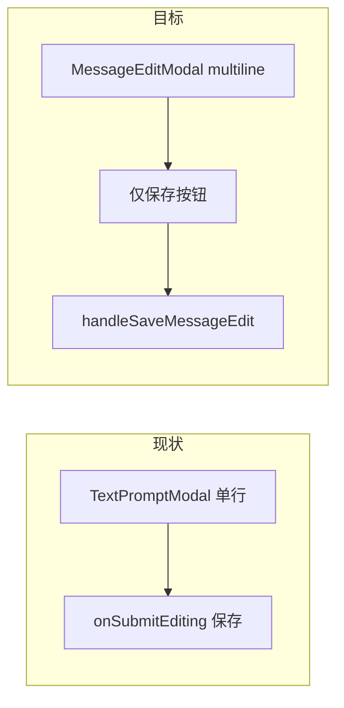

# 聊天消息编辑输入框优化 技术规格（SPEC）

## 设计目标

在 **Android Mobile** 聊天「编辑消息」弹窗中：

| PRD 目标 | 技术落点 |
|----------|----------|
| 多行可读 | 专用多行 `TextInput`，`minHeight` ≥ 底部输入区，上限内滚动 |
| 回车换行 | `multiline` + 禁用 `onSubmitEditing` 保存 + Android `blurOnSubmit={false}` |
| 范围收敛 | 新建 `MessageEditModal`，**不修改** `TextPromptModal` |
| 保存不变 | 仍 `handleSaveMessageEdit` → `runtime.messages.updateContent` + `textBlocks(trimmed)` |

**不在本 SPEC**：Core `updateContent` 语义变更、富文本编辑、非聊天场景的 `TextPromptModal` 改造。

---

## 现状与根因（代码探索）

### 调用链

```
MessageActionMenu「编辑」
  → ChatTabScreen setMessageEditPrompt({ messageId, initialText })
  → TextPromptModal（单行）
  → onConfirm(trimmed) → handleSaveMessageEdit → updateContent
```

相关文件：

| 文件 | 职责 |
|------|------|
| `apps/mobile/src/screens/tabs/ChatTabScreen.tsx` L1136–1151 | 挂载 `TextPromptModal`，`messageEditOpen` 状态 |
| `apps/mobile/src/components/ui/TextPromptModal.tsx` | 通用单行弹窗；`returnKeyType="done"` + `onSubmitEditing` → 保存 |
| `apps/mobile/src/components/chat/message-edit.ts` | `editableTextFromMessage`（多 text 块用 `\n\n` 拼接） |
| `apps/mobile/src/components/chat/ChatComposer.tsx` L214–232 | 参考：`multiline`，`minHeight: 40`，`maxHeight: 120`，无 `onSubmitEditing` |
| `apps/mobile/src/hooks/useAndroidChatBackHandler.ts` | `messageEditOpen` 时系统返回关闭弹窗（无需改逻辑，仅换组件） |

### 根因

1. **高度**：`TextPromptModal` 的 `input` 样式无 `minHeight` / `multiline`，默认单行。
2. **回车**：`returnKeyType="done"` 与 `onSubmitEditing={handleConfirm}` 使回车等价于提交/收键盘。
3. **保存 trim**：`TextPromptModal` 对 `onConfirm` 传入 `value.trim()`；`handleSaveMessageEdit` 再次 `trim()`——**保留内部换行**，仅去掉首尾空白（与 PRD 一致）。

### 兼容性

- `editableTextFromMessage` 已支持 assistant/user 纯 text（含 thinking 块过滤）；含 `tool_use` 仍不可编辑——本期不改。
- 保存 API 不变；多行正文写入单个 `text` block（与当前 `textBlocks(trimmed)` 一致）。

---

## 总体方案

新增 **`MessageEditModal`**（chat 专用），从 `TextPromptModal` 复制面板骨架（`AppModal` + 取消/保存），输入区对齐 **`ChatComposer`** 的多行策略并略放大默认可视高度以满足 PRD「约 4 行」。



### 输入框行为（与 ChatComposer 对齐并增强）

| 属性 | ChatComposer | MessageEditModal（建议） |
|------|--------------|---------------------------|
| `multiline` | ✓ | ✓ |
| `minHeight` | 40 | **120**（约 4 行 @ fontSize 16） |
| `maxHeight` | 120 | **min(280, windowHeight × 0.35)**，超出内部滚动 |
| `blurOnSubmit` | （默认） | **`false`**（Android 回车不换行失焦） |
| `returnKeyType` | （默认） | **不设 `done`**，不设 `onSubmitEditing` |
| `textAlignVertical` | — | **`top`**（Android 多行顶对齐） |
| `scrollEnabled` | 隐式（maxHeight） | `true`（达 max 后滚动） |

### 键盘与弹窗布局

- 外层：`KeyboardAvoidingView`（`behavior={Platform.OS === 'ios' ? 'padding' : 'height'}`）或面板 `maxHeight: '85%'` + 输入区 `flexGrow: 0`，避免键盘遮住「保存」。
- 弹窗仍居中；**不**改为全屏 Sheet（PRD 未要求）。

### 保存语义

- `canSubmit = value.trim().length > 0 && !saving`（与现 `TextPromptModal` 一致）。
- `onConfirm` 传入 **`value.trim()`**（保留中间换行）。
- `ChatTabScreen`：`onConfirm` 仍先 `setMessageEditPrompt(undefined)` 再 `handleSaveMessageEdit`——行为不变。

---

## 最终项目结构

```
apps/mobile/src/
  components/
    chat/
      MessageEditModal.tsx      # NEW
      message-edit.ts           # 不变
    ui/
      TextPromptModal.tsx       # 不变（单行）
  screens/tabs/
    ChatTabScreen.tsx           # TextPromptModal → MessageEditModal
  hooks/
    useAndroidChatBackHandler.ts  # 不变（仍用 messageEditOpen）

apps/mobile/__tests__/
  message-edit-modal.test.tsx   # NEW
```

---

## 变更点清单

| 文件 | 变更 |
|------|------|
| `MessageEditModal.tsx` | **新建**：多行编辑弹窗 |
| `ChatTabScreen.tsx` | 替换 import 与 JSX；props 对齐原 `TextPromptModal` 调用 |
| `TextPromptModal.tsx` | **无改动** |
| `message-edit.ts` / `handleSaveMessageEdit` | **无改动**（除非测试需导出常量） |

可选（非必须）：抽取 `chat-input-metrics.ts` 共享 `minHeight`/`maxHeight` 常量——**本期不抽**，在 `MessageEditModal` 内注释「对齐 ChatComposer」即可，避免扩散。

---

## 详细实现步骤

### 步骤 1：新建 `MessageEditModal`

1. Props：`visible`, `title`, `label?`, `placeholder?`, `initialValue`, `confirmLabel`, `onClose`, `onConfirm(value: string)`。
2. 状态与 `TextPromptModal` 相同：`value` / `saving` / `visible` 时同步 `initialValue`。
3. `TextInput`：
   - `multiline`
   - `blurOnSubmit={false}`
   - 移除 `returnKeyType="done"`、`onSubmitEditing`
   - 样式：`minHeight: 120`, `maxHeight` 用 `Dimensions.get('window').height`
   - `textAlignVertical: 'top'`
4. 用 `KeyboardAvoidingView` 包裹 `panel`（`keyboardVerticalOffset` 可取 0 或安全区，真机微调）。
5. 模块头注释：仅聊天消息编辑；回车换行；保存仅按钮。

### 步骤 2：接入 `ChatTabScreen`

1. `import { MessageEditModal } from '../../components/chat/MessageEditModal'`。
2. 将 L1136–1151 的 `<TextPromptModal …>` 换为 `<MessageEditModal …>`，props 一一对应。
3. 确认 `messageEditOpen: messageEditPrompt != null` 仍有效。

### 步骤 3：手工验收（Android）

- PRD A1–A3、B1–B3、C1–C3。

---

## 测试策略

### 自动化（Jest + react-test-renderer）

| ID | 用例 |
|----|------|
| T1 | `MessageEditModal` 渲染时 `TextInput` 带 `multiline={true}` |
| T2 | 无 `onSubmitEditing` / `returnKeyType` 不为 `done`（通过 props 断言或 shallow 检查） |
| T3 | 仅空白时「保存」`disabled`；有正文 `trim` 后可提交 |
| T4 | `onConfirm` 收到含内部 `\n` 的字符串（模拟输入后点保存） |

现有 `message-edit.test.ts` 覆盖 `editableTextFromMessage`，**不改动**。

### 手工（Android）

| PRD | 场景 |
|-----|------|
| A1–A3 | 长文/多行打开编辑，按钮可见 |
| B1–B2 | 回车换行、键盘不收 |
| B3 | 保存后列表更新 |
| C1 | 会话重命名仍为单行 |
| C2 | 系统返回关闭编辑弹窗 |

### 构建

- `npm test -w @novel-master/mobile`
- `npm run build`（monorepo）

---

## 风险与回滚方案

| 风险 | 缓解 |
|------|------|
| 键盘遮挡保存按钮 | `KeyboardAvoidingView` + `maxHeight` 限制输入区 |
| Android 回车仍收键盘（厂商键盘） | `blurOnSubmit={false}`；真机验收 |
| 极长文性能 | `maxHeight` 封顶 + `TextInput` 内部滚动 |
| 误改 `TextPromptModal` | 独立组件，代码评审只看 `MessageEditModal` + `ChatTabScreen` |

**回滚**：删除 `MessageEditModal.tsx`，`ChatTabScreen` 恢复 `TextPromptModal` 一行调用。

**分支建议**：`fix/mobile-message-edit-multiline`

---

## 与 PRD 完成矩阵

| PRD 验收 | SPEC 落点 |
|----------|-----------|
| A1–A3 布局 | `minHeight` 120、`maxHeight`、KeyboardAvoiding |
| B1–B3 回车/保存 | 去掉 `onSubmitEditing` / `done`；仅按钮保存 |
| C1 其它弹窗 | 不改 `TextPromptModal` |
| C2 返回键 | 沿用 `messageEditOpen` |
| C3 空白不可保存 | `trim()` + `canSubmit` |

确认本 SPEC 后再进入编码。
