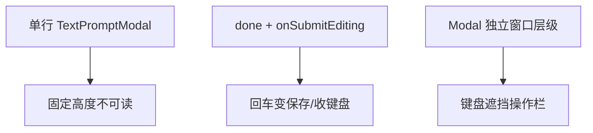
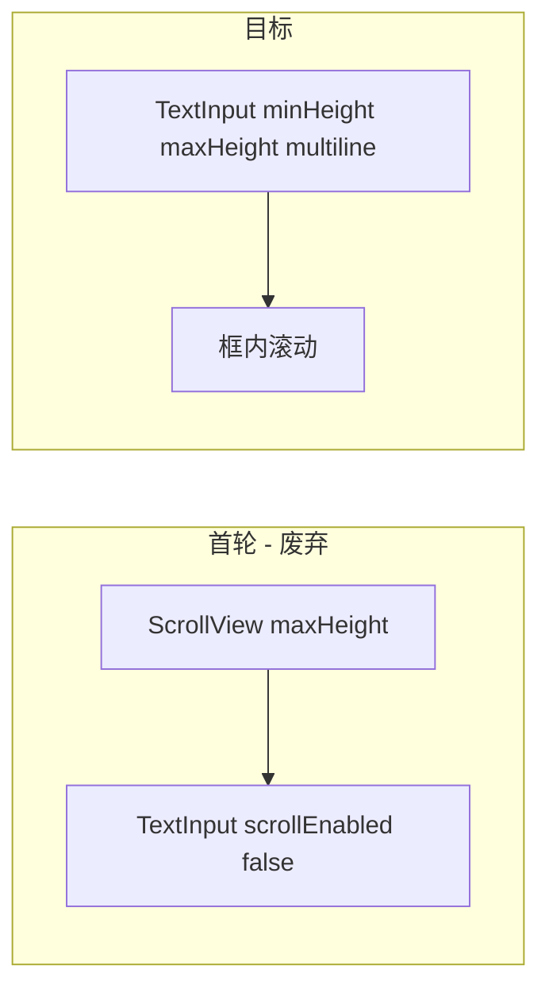

# 聊天消息编辑多行输入 技术规格（SPEC）

> **PRD**：[prd.md](./prd.md)  
> **平台**：Android Mobile（RN **0.85.3**）  
> **状态**：`MessageEditModal` 已存在但未过真机验收 → **返工实现**  
> **分支建议**：`fix/mobile-message-edit-multiline`

---

## 设计目标

| PRD 目标 | 技术落点 |
|----------|----------|
| G1 多行可读 | `TextInput` 直接设 `minHeight` / `maxHeight`，**不**用外层 `ScrollView` |
| G2 回车换行 | `multiline` + `submitBehavior="newline"`；无 `onSubmitEditing` / `returnKeyType="done"` |
| G3 键盘不挡按钮 | 弹窗底对齐 + `panel` 高度约束；Android **不**叠 `KeyboardAvoidingView behavior="height"` |
| G4 范围收敛 | 仅改 `MessageEditModal`；`TextPromptModal` 与其它调用方不动 |
| G5 保存不变 | `ChatConversationPanel` → `onSaveMessageEdit` → `updateContent` + `applyTextEditToMessage` |

**不在本 SPEC**：Core `updateContent` 语义、富文本编辑、引入 `react-native-keyboard-controller`（除非 §6 分层策略进入 Tier 2 且单独立项）。

---

## 问题拆解（RN 常见三类坑）

本需求不是单一 bug，而是三个独立问题叠加：



| 问题 | 社区共识 | 本项目落点 |
|------|----------|------------|
| 回车行为 | RN 0.73+ 用 [`submitBehavior`](https://reactnative.dev/docs/textinput#submitbehavior)；`multiline` 默认换行 | 显式 `submitBehavior="newline"` |
| 多行增高 | `minHeight` + `maxHeight` 设在 `TextInput` 上，超出后 **框内滚动** | **照抄 `ChatComposer` 模式** |
| Modal + 键盘 | `Modal` 与主 Activity 的 `adjustResize` 不同步；KAV `height` 在 Android 常恶化布局 | 底对齐弹窗；主窗口 `adjustResize` 托底 |

**无**「消息编辑弹窗」专用 npm 包；社区方案 = 正确 `TextInput` 属性 + 布局模式。参考：[RN #39427](https://github.com/facebook/react-native/issues/39427)、[submitBehavior 引入 commit](https://github.com/facebook/react-native/commit/1e3cb9170794afa03a3b4b15f75b711dace7a774)。

---

## 现状（代码基线）

### 调用链（当前）

```
MessageActionMenu「编辑」
  → ChatTabScreen messageEditPrompt state
  → ChatConversationPanel <MessageEditModal />
  → onConfirm(trimmed) → onClose → onSaveMessageEdit
  → runtime.messages.updateContent + reloadMessages
```

| 文件 | 职责 |
|------|------|
| `apps/mobile/src/screens/tabs/ChatTabScreen.tsx` | `messageEditPrompt` 状态；`messageEditOpen` 供返回键 |
| `apps/mobile/src/screens/tabs/chat-tab/ChatConversationPanel.tsx` | 挂载 `MessageEditModal` |
| `apps/mobile/src/screens/tabs/chat-tab/useChatTabMessages.ts` | `handleSaveMessageEdit` |
| `apps/mobile/src/components/chat/MessageEditModal.tsx` | **待返工** |
| `apps/mobile/src/components/ui/TextPromptModal.tsx` | 单行通用弹窗（**不改**） |
| `apps/mobile/src/components/chat/ChatComposer.tsx` | **已验证**的多行参考实现 |
| `apps/mobile/src/components/chat/message-edit.ts` | `editableTextFromMessage` |
| `apps/mobile/src/hooks/useAndroidChatBackHandler.ts` | `messageEditOpen` 时返回关闭弹窗 |
| `apps/mobile/android/app/src/main/AndroidManifest.xml` | `windowSoftInputMode="adjustResize"` |

### 首轮实现缺陷（须删除）

当前 `MessageEditModal.tsx` 存在以下 **反模式**，是真机失败的主要原因：

| 缺陷 | 现状代码 | 问题 |
|------|----------|------|
| `ScrollView` 包 `TextInput` | L99–124 | Android 嵌套滚动：高度不增长、手势冲突、光标跳动 |
| `scrollEnabled={false}` on `TextInput` | L121 | 与外层 `ScrollView` 职责混乱 |
| 仅 `blurOnSubmit={false}` | L120 | 部分厂商键盘仍收键盘；RN 0.85 应使用 `submitBehavior` |
| 居中 `justifyContent: 'center'` | backdrop style | 键盘弹出时操作栏易被挡 |
| Android `KeyboardAvoidingView` 禁用但仍包裹 | L75–88 | 结构冗余；历史上 `behavior="height"` 曾导致 panel 溢出 |

### 参考：`ChatComposer`（已通过产品验收）

```293:301:apps/mobile/src/components/chat/ChatComposer.tsx
  input: {
    flex: 1,
    minHeight: 40,
    maxHeight: 120,
    borderWidth: StyleSheet.hairlineWidth,
    borderRadius: 8,
    paddingHorizontal: 12,
    paddingVertical: 8,
    fontSize: 16,
  },
```

`ChatComposer` 的 `TextInput`：**仅** `multiline`，无 `ScrollView` 包裹，无 `onSubmitEditing`，无 `returnKeyType="done"`。

---

## 总体方案

**返工 `MessageEditModal`**：保留 `AppModal` + 标题/标签/取消/保存骨架；输入区 **完全对齐 `ChatComposer` 模式**，仅放大默认高度。



### `TextInput` 属性（目标）

| 属性 | ChatComposer | MessageEditModal |
|------|--------------|------------------|
| `multiline` | ✓ | ✓ |
| `submitBehavior` | （默认 newline） | **`"newline"`**（显式） |
| `minHeight` | 40 | **120**（约 4 行 @ 16px） |
| `maxHeight` | 120 | **`min(280, windowHeight × 0.32)`** |
| `textAlignVertical` | — | **`"top"`**（Android） |
| `returnKeyType` | 默认 | **不设** |
| `onSubmitEditing` | 无 | **无** |
| `blurOnSubmit` | 默认 | **不设**（由 `submitBehavior` 接管） |
| 外层 `ScrollView` | 无 | **无** |

`maxHeight` 计算需为标题、label、操作栏、padding、键盘留出空间；实现时用 `Dimensions.get('window').height` 一次即可。

### 弹窗布局（键盘 Tier 1 — 本期默认）

1. **Backdrop 底对齐**：`justifyContent: 'flex-end'`，`paddingBottom` 含安全区（可用 `useSafeAreaInsets` 或固定 24 + inset）。
2. **Panel 约束**：`maxHeight: '85%'`、`width: '100%'`、`maxWidth: 360`；`overflow: 'hidden'`。
3. **Android 不用** `KeyboardAvoidingView behavior="height"`（与 `adjustResize` 双重收缩，注释已记录）。
4. **iOS**（若共用）：可保留 `KeyboardAvoidingView behavior="padding"` + 小 `keyboardVerticalOffset`。

### 保存语义（不变）

- `canSubmit = value.trim().length > 0 && !saving`
- `onConfirm(trimmed)` — 保留内部 `\n`，去掉首尾空白
- `ChatConversationPanel`：`onConfirm` 内先 `onCloseMessageEdit()` 再 `onSaveMessageEdit`（与现网一致）
- `handleSaveMessageEdit` 内再次 `trim()` + 空串 toast（双保险，不改）

---

## 变更点清单

| 文件 | 变更 |
|------|------|
| `MessageEditModal.tsx` | **返工**：删 `ScrollView`；`submitBehavior`；底对齐；`minHeight`/`maxHeight` 直挂 `TextInput` |
| `message-edit-modal.test.tsx` | 更新断言：无 `ScrollView` 包裹；`submitBehavior === 'newline'`；无 `onSubmitEditing` |
| `TextPromptModal.tsx` | **无改动** |
| `ChatConversationPanel.tsx` | **无改动**（已接入） |
| `ChatTabScreen.tsx` / `useChatTabMessages.ts` | **无改动** |

---

## 实现步骤

### 步骤 1：返工 `MessageEditModal.tsx`

1. 删除 `ScrollView` 及 `inputScroll` 样式。
2. `TextInput` 增加 `submitBehavior="newline"`；移除 `blurOnSubmit`、`scrollEnabled={false}`。
3. 样式合并：`minHeight: 120`，`maxHeight: inputMaxHeight`（与 `ChatComposer` 同模式）。
4. Backdrop：`justifyContent: 'flex-end'`，适当 `paddingBottom`。
5. 移除 Android 侧无效的 `KeyboardAvoidingView` 包裹（或仅 iOS 条件渲染）。
6. 模块头注释更新：对齐 `ChatComposer`；禁止 `ScrollView` 包裹。

### 步骤 2：更新单测

| ID | 用例 |
|----|------|
| T1 | `TextInput.multiline === true` |
| T2 | `submitBehavior === 'newline'`；无 `onSubmitEditing`；`returnKeyType` 非 `done` |
| T3 | 仅空白时保存 disabled；有正文可提交 |
| T4 | `onConfirm` 收到含内部 `\n` 的 trim 后字符串 |
| T5 | 树中 **无** 包裹 `TextInput` 的 `ScrollView`（结构断言） |

### 步骤 3：Android 真机验收

PRD A1–A3、B1–B4、C1–C3。建议机型：至少 1 台国产输入法（搜狗/ Gboard）+ 系统默认键盘。

### 步骤 4：构建

```bash
npm test -w @novel-master/mobile
npm run build
```

---

## 键盘分层策略（超出本期时）

仅当 Tier 1 真机仍不满足 PRD **B3** 时，按序升级；**每一级需产品确认再引入**。

| Tier | 手段 | 成本 | 说明 |
|------|------|------|------|
| **1（本期）** | 底对齐 Modal + `TextInput` maxHeight + `adjustResize` | 零依赖 | 优先 |
| 2 | `AppModal` 试 `statusBarTranslucent`；微调 `paddingBottom` | 低 | 部分机型 Modal resize 改善 |
| 3 | 引入 [`react-native-keyboard-controller`](https://kirillzyusko.github.io/react-native-keyboard-controller/) `KeyboardAvoidingView` + `automaticOffset` | 中（+reanimated） | 1.13+ 支持 Modal；**单独立项** |
| 4 | 改为 `@gorhom/bottom-sheet` 编辑 Sheet | 高（UX 变更） | 不在本 PRD |

---

## 风险与回滚

| 风险 | 缓解 |
|------|------|
| 厂商键盘回车仍收键盘 | `submitBehavior="newline"` + 真机矩阵；文档记录已知例外 |
| 极长文性能 | `maxHeight` 封顶 + `TextInput` 内滚动 |
| 底对齐视觉与居中 Modal 不同 | 产品接受「编辑贴底」更贴近输入法；若不接受再评估 Tier 3 |
| 误改 `TextPromptModal` | Code review 范围仅 `MessageEditModal` + 测试 |

**回滚**：`git revert` 返工提交；或临时恢复 `TextPromptModal` 单行（不推荐，功能回退）。

---

## PRD ↔ SPEC 矩阵

| PRD | SPEC 落点 |
|-----|-----------|
| A1–A2 | `minHeight: 120`、`maxHeight`、`textAlignVertical: top` |
| A3, B3 | 底对齐 backdrop、`panel maxHeight: 85%` |
| B1–B2 | `submitBehavior="newline"`；无 `onSubmitEditing` |
| B4 | `onConfirm(trimmed)` → 现有 save 链 |
| C1 | 不改 `TextPromptModal` |
| C2 | `messageEditOpen` 不变 |
| C3 | `canSubmit` + `handleSaveMessageEdit` 空串 toast |

---

## 首轮 vs 返工对照（评审用）

| 项 | 首轮 SPEC（废弃） | 本 SPEC |
|----|-------------------|---------|
| 高度策略 | `ScrollView` + `TextInput scrollEnabled false` | `TextInput` 直挂 `min/maxHeight` |
| 回车 | `blurOnSubmit={false}` | `submitBehavior="newline"` |
| 键盘 | 居中 + KAV 可选 | 底对齐；Android 不叠 KAV height |
| 接入点 | `ChatTabScreen` 直挂 | 已在 `ChatConversationPanel`（不改） |
| 新依赖 | 无 | 仍无（Tier 1） |

确认本 SPEC 后进入编码返工。
