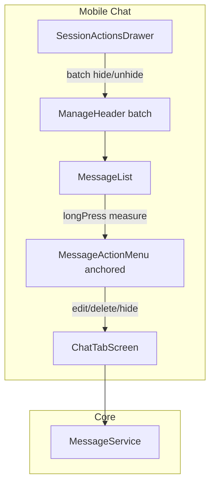

# 移动端消息编辑与 hidden 状态 技术规格（SPEC）

## 设计目标

- 在 **不改动 Core 数据模型** 的前提下，完成 Mobile 会话聊天的：
  1. **微信/QQ 式**单条消息长按操作浮层（编辑 / 隐藏 / 删除）；
  2. **hidden 消息仍在时间线展示**（灰显 + 标签），与「仅不进 LLM」的 Core 语义一致；
  3. **批量 hide/show**，交互链路与现网 **批量删除消息** 一致（多选 + 顶栏确认）。
- 复用 `MessageService.updateContent`、`hide`、`show`；批量场景对选中 `messageId` **逐条**调用（非 `hideRange`）。

## 现状与约束（代码探索）

| 模块 | 现状 | 本迭代 |
|------|------|--------|
| `MessageService`（Core） | 已有 `updateContent`、`hide`/`show`/`hideRange`/`showRange` | Mobile 直接调用；**不改 Core** |
| `create-mobile-runtime.ts` | 已注入 `createMessageService(conn)` | 无需改 |
| `ChatTabScreen` | 长按 → `BottomSheetMenu`（**屏幕底部**）；`messageBatch` + `ManageHeader` 批量删除；`handleSaveMessageEdit` 已接 `updateContent` | 换锚定浮层；扩展批量模式 |
| `message-edit.ts` | `editableTextFromMessage`：仅 `text`+`thinking` 块，导出可编辑纯文本 | 保持；菜单侧不展示「编辑」当返回 null |
| `message-blocks.ts` | `buildChatListItems` **`filter(!m.hidden)`** | **改为全量消息 + hidden 样式** |
| `buildToolResultByUseId` | 跳过 `hidden` 消息的 `tool_result` | **配对用全量 messages**，避免隐藏 result 导致 tool 卡「pending」 |
| `MessageList` | `onLongPress` 已有；`batchMode` + checkbox | 增加锚点测量；hidden 样式；批量时仍可选中 hidden 行 |
| `SessionActionsDrawer` | 仅「批量删除消息」 | 增加「批量隐藏消息」「批量取消隐藏」 |
| `ManageHeader` | 批量态固定「删除」按钮 | 泛化主操作按钮文案/颜色 |
| prompt 相关 service | `session-log`、`session-prompt-input`、`chat-prompt-tokens`、`regex-apply-channel` 已 `filter(!hidden)` | **保持过滤**，仅改聊天列表展示 |
| 依赖 | 无 Popover 库 | 自研 `MessageActionMenu`（Modal + 绝对定位） |

**与 [message-visibility](../message-visibility/prd.md) 关系**：Core/CLI 的 `hidden` 与 prompt 过滤已交付；本 SPEC 只改 **Mobile 聊天 UI 展示语义**（列表不再剔除 hidden）。

---

## 总体方案



### 1. 聊天列表：hidden 可见

- `buildChatListItems(messages)` 遍历 **全部** `messages`（不再 `filter(!m.hidden)`）。
- `MessageListItem` 增加可选 `hidden: boolean`（或由 `message.hidden` 传入渲染层）。
- `MessageList` 对 hidden 气泡：`opacity` 降低 + 角标文案「已隐藏」（`tokens.textSecondary`）。
- **Tool 卡**：仍由非 hidden 的 assistant 消息产出；`buildToolResultByUseId(messages)` 使用 **完整** 列表配对 `tool_result`（含 hidden 用户消息上的 result）。

### 2. 长按操作浮层（微信/QQ 式）

新建 `MessageActionMenu`：

- **全屏透明 Modal** + 半透明遮罩；点击遮罩关闭。
- 菜单主体为 **横向动作条**（圆角卡片，3–4 项）：`编辑` | `隐藏`/`取消隐藏` | `删除`（删除可用 `tokens.danger`）。
- 位置：长按气泡时对该行 `View` 执行 `measureInWindow`，菜单锚定在气泡 **上方或下方**（视剩余屏幕空间 clamp），水平方向与气泡中心对齐并限制在屏幕内边距内。
- **不用** `BottomSheetMenu` 作为消息长按主交互（保留该组件给 VFS 等场景）。

`ChatTabScreen` 组装菜单项（与现逻辑一致）：

| 条件 | 菜单项 |
|------|--------|
| `editableTextFromMessage(msg) != null` | 编辑 |
| `msg.hidden` | 取消隐藏 |
| else | 隐藏 |
| 始终 | 删除 |

- `agentRunning === true` 时：**禁用长按**（与现网批量删除一致，不弹菜单）。

### 3. 单条 hide/show

- 菜单选择 → `runtime.messages.hide(id)` / `show(id)` → `reloadMessages()`。
- 无二次确认（与单条删除不同；删除保留 `Alert`）。

### 4. 编辑

- 菜单「编辑」→ 现有 `TextPromptModal` + `handleSaveMessageEdit`（`textBlocks(trimmed)` + `updateContent`）。
- 不改动「保存后行为」（不删后续、不重跑 Agent）。

### 5. 批量 hide/show（对齐批量删除）

**状态机**（`ChatTabScreen`）：

```typescript
type MessageBatchPurpose = 'delete' | 'hide' | 'unhide' | null;
// messageBatchPurpose !== null 时 messageBatch.active 视为 true（或 enter 时同时设置）
```

| 入口（`SessionActionsDrawer`） | purpose | 顶栏主按钮 | 确认文案 |
|------------------------------|---------|------------|----------|
| 批量删除消息（已有） | `delete` | 删除（红色） | 确定删除 N 条？ |
| 批量隐藏消息（新） | `hide` | 隐藏（主色） | 确定隐藏 N 条？ |
| 批量取消隐藏（新） | `unhide` | 取消隐藏（主色） | 确定取消隐藏 N 条？ |

- 复用 `useBatchSelection`、`MessageList` 的 `batchMode` / checkbox（**含 hidden 消息**，便于批量取消隐藏）。
- `ManageHeader` 扩展：
  - `primaryActionLabel`、`onPrimaryAction`、`primaryActionTone?: 'danger' | 'primary'`
  - 删除批量仍用 `danger`，hide/unhide 用 `primary`
- 执行：对 `selectedIds` 顺序调用 `hide` 或 `show`；完成后 `messageBatch.exit()` + `setMessageBatchPurpose(null)` + `reloadMessages()`。
- `agentRunning` 时拒绝进入任一批量模式（复用现有 Toast）。

**互斥**：进入新 purpose 前先 `exit` 清空选中；同一时刻仅一种批量 purpose。

### 6. Core 边界

- **无** schema / `MessageService` 变更。
- **不**在 Mobile 使用 `hideRange`（无 seq 楼层 UI）；CLI 保留 range API。

---

## 最终项目结构

```text
apps/mobile/src/
  components/
    chat/
      MessageActionMenu.tsx          # 新建：锚定操作浮层
      MessageList.tsx                # hidden 样式；longPress 测量；ref
      message-blocks.ts              # 全量列表 + tool 配对
      message-edit.ts                # 可选：isMessageEditable 导出
    batch/
      ManageHeader.tsx               # 泛化主操作按钮
    chrome/
      SessionActionsDrawer.tsx       # 两个新入口
  screens/tabs/
    ChatTabScreen.tsx                # 浮层状态；批量 purpose；hide/show 处理
  __tests__/
    message-blocks.test.ts           # hidden 仍出现在 items
    message-action-menu.test.ts      # 新建：菜单项构建纯函数（可选）
    message-edit.test.ts             # 新建：editable 规则（可选）

packages/core/                       # 无变更（仅消费）
```

---

## 变更点清单

| # | 文件 | 改动 |
|---|------|------|
| 1 | `message-blocks.ts` | 去掉 `filter(!m.hidden)`；`buildToolResultByUseId` 用全量 messages |
| 2 | `MessageList.tsx` | hidden 样式；`onLongPress` + `measureInWindow`；向父组件回传 anchor |
| 3 | `MessageActionMenu.tsx` | 新建锚定菜单 UI |
| 4 | `ChatTabScreen.tsx` | 接入 `MessageActionMenu`；移除消息 `BottomSheetMenu`；`hide`/`show`；`messageBatchPurpose` |
| 5 | `ManageHeader.tsx` | 可配置主操作（删除/隐藏/取消隐藏） |
| 6 | `SessionActionsDrawer.tsx` | `onBatchHideMessages` / `onBatchUnhideMessages` |
| 7 | `message-edit.ts` | 文档注释；可选导出 `buildMessageActionItems(msg)` 供测试 |
| 8 | 测试 | 见下 |

---

## 详细实现步骤

### M1 — 列表与单条 hidden（优先）

1. 修改 `message-blocks.ts` + 单测：hidden 消息仍生成 `MessageListItem`；新增用例「hidden 消息仍在 items 中」。
2. `buildToolResultByUseId`：遍历全部 messages（仅配对 map，不用于是否展示 tool 卡）。
3. `MessageList`：hidden 气泡 opacity + 「已隐藏」小字；thinking 块同样灰显。
4. 实现 `MessageActionMenu`（硬编码 44pt 最小触控高度、横排分隔线）。
5. `ChatTabScreen`：长按 → measure → 打开菜单；实现 `handleHideMessage` / `handleShowMessage`；删除保留确认 Alert。
6. 移除会话聊天对 `BottomSheetMenu`（message 目标）的依赖。
7. 手工：隐藏后打开「会话日志」确认无该条。

### M2 — 编辑回归

1. 确认 `editableTextFromMessage` 对 user/assistant 纯文本均返回非 null（含仅 thinking+text 的 assistant 消息——当前规则允许，保存后仅写回 text 块，**保持现行为**）。
2. 手工/单测：assistant 编辑保存；tool 消息无编辑项。

### M3 — 批量 hide/unhide

1. 扩展 `ManageHeader` API；`ChatTabScreen` 增加 `messageBatchPurpose` 与两个 drawer 回调。
2. 实现 `confirmBatchHide` / `confirmBatchUnhide`（Alert 含条数）。
3. `SessionActionsDrawer` 增加两行操作。
4. 手工：非连续多选 3 条 hide；CLI `nm message list` 校验；批量取消隐藏。

### M4 — 收尾

1. `npm test -w @novel-master/mobile`。
2. 更新本迭代 PRD 无；无需改 `monorepo.md`（可选一行「消息长按菜单」）。

---

## 测试策略

### 单元测试（Jest）

| ID | 文件 | 断言 |
|----|------|------|
| T1 | `message-blocks.test.ts` | `hidden: true` 的 text 消息仍出现在 `buildChatListItems` 结果中 |
| T2 | `message-blocks.test.ts` | hidden 用户消息的 `tool_result` 仍进入 `buildToolResultByUseId`，assistant `tool_use` 为 success |
| T3 | `message-edit.test.ts` | 纯 text user/assistant 可编辑；含 `tool_use` 返回 null |
| T4 | `message-action-items.test.ts`（可选纯函数） | hidden 消息菜单含「取消隐藏」；未 hidden 含「隐藏」；可编辑含「编辑」 |

### 手工 / 验收（对齐 PRD）

| ID | 场景 |
|----|------|
| H1 | 长按气泡，菜单贴近气泡非底部全屏 |
| H2 | 单条 hide → 灰显 + 会话日志无该条 |
| H3 | 单条取消隐藏 → 恢复样式 + 进入 prompt |
| H4 | 批量隐藏 3 条（可不连续） |
| H5 | Agent 运行中无法长按菜单 / 无法进批量 hide |
| H6 | 编辑 assistant 纯文本保存持久化 |
| H7 | CLI `nm message list` 与 Mobile hidden 一致 |

### Core 回归

- 无需改 Core 测试；可选 CLI smoke：`nm message hide` 与 Mobile 同库验证。

---

## 风险与回滚方案

| 风险 | 缓解 | 回滚 |
|------|------|------|
| `measureInWindow` 在滚动列表中偏移 | 长按瞬间测量；菜单 close 后清 anchor；列表滚动时关闭菜单 | 回退 `MessageActionMenu`，临时恢复 `BottomSheetMenu` |
| hidden 消息导致列表变长 | 可接受；与 PRD 一致 | 恢复 `filter(!m.hidden)` |
| tool 卡与 hidden 消息交错显乱 | tool 卡仍跟可见 assistant 消息；配对用全量 result | 调整配对策略 |
| 批量误触 hide 大量消息 | Alert 二次确认 + 主按钮 selectedCount===0 禁用 | — |
| `ManageHeader` API 变更影响其他调用方 | 仅 `ChatTabScreen` 传入新 props；删除批量默认行为不变 | 保留旧 props 默认值 |

**回滚**：纯 Mobile 改动，revert 分支即可；DB 无迁移。

---

## SPEC 定稿（原 PRD 待确认项）

| 项 | 决策 |
|----|------|
| 操作浮层形态 | `MessageActionMenu`：Modal + `measureInWindow` 锚定横条，非 BottomSheet |
| 批量入口 | 抽屉两项：「批量隐藏消息」「批量取消隐藏」；与「批量删除」并列 |
| 批量实现 | `messageBatchPurpose` + 泛化 `ManageHeader`；逐条 `hide`/`show` |
| Core 变更 | **无** |

---

编码前请确认本 SPEC。确认后可按 M1→M4 实施。
