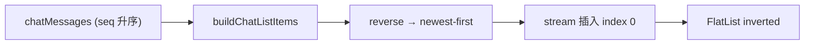

# Mobile 聊天消息列表（RN 倒序 + 滚动优化）技术规格（SPEC）

> **状态：已废弃（2026-06）** — 见 [mobile-webview-chat-transcript/spec.md](../mobile-webview-chat-transcript/spec.md)。  
> **勿继续实现**；`feature/mobile-inverted-chat-list` 上的改动（含 offset pin、scroll lock、MessageMenuOverlay 等）**不纳入**新迭代。

> **PRD**：[prd.md](./prd.md)  
> **平台**：Android + iOS  
> **分支建议**：~~`feature/mobile-inverted-chat-list`~~ → 改用 `feature/mobile-webview-chat-transcript`
---

## 设计目标

1. **倒置 FlatList**：`newest-first` 数据 + `inverted={true}`，index 0 锚定视觉底部，去掉 `scrollToEnd` 主路径。
2. **行为不退化**：行 UI（气泡、Thinking、Tool、Batch、富文本、流式）复用现网组件；Core/DB 仍 seq 升序。
3. **prepend 稳定**：加载更早消息后视口不跳（`maintainVisibleContentPosition` + 正确 prepend 检测）。
4. **快照可迁移**：`ChatListScrollSnapshot` 增加 `schemaVersion`；旧缓存作废，默认贴底。
5. **可观测性**：UI/滚动语义变动大，实现阶段必须接入 **结构化埋点**（dev 默认可用），便于双端真机对照 PRD 验收与回归。

---

## 代码探索结论（现状）

| 模块 | 路径 | 现状 | 本迭代改动 |
|------|------|------|------------|
| 列表 | `MessageList.tsx` | 升序 `data`；`scrollToEnd` / `onContentSizeChange` 贴底；`ListHeaderComponent`=加载更早 | **inverted + 删 scrollToEnd 主路径** |
| 行模型 | `message-blocks.ts` | `buildChatListItems` 按 messages **升序** 展开 message→tool | **新增 newest-first 导出** |
| 流式 | `stream-buffer.service.ts` | 40ms flush → `streamingText/Thinking` | **不变** |
| 快照 | `chat-list-scroll-cache.ts` | `{offsetY, nearBottom}` 内存 Map | **+schemaVersion + 校验** |
| 集成 | `ChatTabScreen.tsx` | 传 `listHeaderComponent`、分页、`cachedChatScroll` | **接口不变** |
| 单测 | `message-list-scroll.test.ts` | 断言 `scrollToEnd` / `scrollToOffset` | **改为 inverted 语义** |

### 升序列表问题（根因）

```text
messages 升序 → items 升序 → FlatList 非 inverted
  → 贴底依赖 scrollToEnd + onContentSizeChange
  → 与 maintainVisibleContentPosition、RenderHTML 变高形成反馈环
```

### newest-first + inverted 数据流



**Tool 行顺序**：对 `buildChatListItems` 完整结果做 **一次** `.reverse()` 即可。  
升序 items 形如 `[…, M, T1, T2, N]`，reverse 后 `[N, T2, T1, M, …]`；inverted 下 index 0=N 贴底，T2/T1 在其上方，与现网视觉一致。**禁止** reverse 两次。

### 流式尾行位置

```ts
// 目标 data 顺序（index 0 = 视觉底部）
[ {kind:'stream'}?,  ...newestFirstItems ]
```

现网在升序末尾 `push({kind:'stream'})`；倒序后改为 **`unshift` 到 index 0**（或在 compose 时 `[stream?, ...items]`）。

---

## 总体方案

### FlatList 配置（定案）

| 属性 | 值 | 说明 |
|------|-----|------|
| `inverted` | `true` | index 0 在视觉底部 |
| `data` | newest-first | 见上 |
| `ListFooterComponent` | `listHeaderComponent` prop | ChatTab 语义不变；inverted 下 footer=视觉顶部 |
| `maintainVisibleContentPosition` | `{ minIndexForVisible: 1, autoscrollToTopThreshold: 10 }` | prepend 时锚定；`minIndexForVisible: 1` 避免 stream 行干扰（实现时若需调整为 0/2，在 PR 注明真机原因） |
| `contentContainerStyle` | `{ flexGrow: 1 }` | 消息不足一屏时沉底 |
| `scrollEventThrottle` | `16` | 保持 |

### 贴底 / nearBottom（inverted 语义）

用户语义不变：**距视觉底部 ≤ 80px** 视为 `nearBottom`。

实现（inverted FlatList）：

```ts
// contentOffset.y 接近 0 表示贴底（滚动向上阅读历史时 y 增大）
const distanceFromBottom = contentOffset.y; // inverted 下直接用 offset.y
nearBottom = distanceFromBottom <= NEAR_BOTTOM_THRESHOLD_PX;
```

`offsetY` 写入快照时存 **distanceFromBottom**（非升序列表的 `contentSize - offset - viewport`），保证 ChatTab 侧「离底距离」语义一致。

### 滚动恢复

| 场景 | 行为 |
|------|------|
| 无缓存 / 旧 schema | `nearBottom=true`，**不调用** scrollToEnd；inverted 自然贴底 |
| 缓存 `nearBottom=true` | `scrollToOffset({ offset: 0 })` |
| 缓存 `nearBottom=false` | `scrollToOffset({ offset: snap.offsetY })` |

**删除**：`scheduleScrollToEnd`、`onContentSizeChange → scrollToEnd`、cached near-bottom 时的 `scrollToEnd`。

**保留**：`onScroll` 更新 snapshot；unmount 时 persist；prepend 检测（仍用 `messages[0]?.id` 变化，因 `chatMessages` 仍为升序）。

### 流式跟随

- `nearBottomRef.current === true` 时：**不主动 scroll**（新 token 插入 index 0，inverted 自动可见）。
- 仅当变高导致偏离贴底时，可选 `scrollToOffset({ offset: 0 })` 且节流（100ms）；首版可省略，真机抖再补。

### 快照 schemaVersion

```ts
export const CHAT_LIST_SCROLL_SCHEMA_VERSION = 1 as const;

export type ChatListScrollSnapshot = {
  readonly schemaVersion: typeof CHAT_LIST_SCROLL_SCHEMA_VERSION;
  readonly offsetY: number;      // distance from visual bottom, px
  readonly nearBottom: boolean;
};
```

- `getScrollSnapshot` / `setScrollSnapshot`：写入必须带 `schemaVersion: 1`。
- `MessageList` mount：`initialScroll?.schemaVersion !== 1` → 视为无缓存（`defaultScrollToBottom` 逻辑不变）。
- 进程内旧条目无 version：读取时丢弃。

---

## 埋点与可观测性（必须）

> **背景**：inverted 滚动语义与升序列表相反，肉眼难区分「正常贴底」与「错误 offset」。本迭代 **必须** 加埋点，作为 M4 真机验收与后续 CR 的证据链。  
> **现状**：mobile 无 Firebase/Amplitude 等第三方 SDK；沿用项目惯例——**结构化 `console.info` + 可 mock 的薄封装**（参考 `setup-llm-fetch.ts` 的 dev 开关思路）。

### 模块设计

新增 `apps/mobile/src/services/chat-list-telemetry.ts`：

```ts
/** Dev 默认开启；生产可通过常量关闭（不依赖远程配置）。 */
export const CHAT_LIST_TELEMETRY_ENABLED =
  typeof __DEV__ !== 'undefined' ? __DEV__ : false;

export type ChatListTelemetryEvent =
  | { name: 'list_mount'; ... }
  | { name: 'scroll_restore'; ... }
  // 见下表
  ;

export function emitChatListTelemetry(event: ChatListTelemetryEvent): void;
```

**约束**：

| 规则 | 说明 |
|------|------|
| 禁止 PII | 不得记录消息正文、thinking 内容、tool 参数；仅 id/hash、计数、px、boolean |
| 节流 | `scroll_snapshot` ≥ 500ms；`near_bottom_transition` 仅在 boolean 翻转时上报 |
| 前缀 | 统一 `[ChatListTelemetry]`，便于 `adb logcat` / Xcode 过滤 |
| 可测 | `emitChatListTelemetry` 可被 Jest mock；禁用时必须为 no-op |

### 事件清单（必须实现）

| 事件 | 触发点 | 关键字段 | 对应 PRD |
|------|--------|----------|----------|
| `list_mount` | `MessageList` 首次 mount / session 切换 remount | `itemCount`, `hasStreamTail`, `inverted: true`, `initialSchemaVersion`, `hasInitialScroll`, `defaultScrollToBottom` | 贴底 T1 |
| `legacy_cache_discarded` | `initialScroll` 无/错 schema | `reason: 'missing' \| 'wrong_version'`, `seenVersion` | schemaVersion |
| `scroll_restore` | `onContentSizeChange` 或 layout 后执行 restore | `mode: 'near_bottom' \| 'offset' \| 'skipped'`, `offsetY`, `nearBottom` | T6 |
| `scroll_snapshot` | `onScroll` 节流写入 snapshot 时 | `offsetY`, `nearBottom`, `contentHeight`, `layoutHeight` | 流式 T3/T4 |
| `near_bottom_transition` | `nearBottom` true↔false | `from`, `to`, `offsetY`, `streamingActive` | 流式 T4 |
| `prepend_detected` | `messages[0].id` 变化且非首 mount | `prependedCount`（估算）, `wasNearBottom`, `offsetYBefore` | T5 |
| `stream_follow_gate` | 流式 token 导致 `data` 变长时 | `nearBottom`, `didInvokeScroll`（应为 false）, `itemCount` | T3 |
| `load_older_ui_shown` | `ListFooterComponent`（加载更早）首次 layout | `visible: boolean` | T5 |

**可选（M3+）**：`mvcp_adjust` —— 仅在 prepend 后 1s 内 `contentOffset` 突变 > 40px 时上报，用于抓 MVCP 失效。

### 接入点

| 文件 | 埋点 |
|------|------|
| `MessageList.tsx` | 上表全部（主采集点） |
| `chat-list-scroll-cache.ts` | `legacy_cache_discarded`（读取校验失败时） |
| `ChatTabScreen.tsx` | **不新增**（经 `MessageList` props 间接覆盖） |

### 验收用法

真机走 PRD T1–T6 时，过滤 `[ChatListTelemetry]`：

- T1：`list_mount` 且 **无** `scroll_restore.mode=offset`（首屏不强行 restore）
- T3：流式期间 `stream_follow_gate.didInvokeScroll=false` 且 `near_bottom_transition` 无 to=false→true 抖动
- T4：上翻后 `near_bottom_transition.to=false`，且无 `scroll_restore.mode=near_bottom`
- T5：`prepend_detected` 后 `scroll_snapshot.offsetY` 在 200ms 内变化 ≤ 40px（人工对照 log 时间戳）
- T6：`scroll_restore` 字段与离开前最后一次 `scroll_snapshot` 一致

---

## 最终项目结构

```text
apps/mobile/src/
  components/chat/
    MessageList.tsx          # 主要改动
    message-blocks.ts        # +buildChatListItemsNewestFirst
  services/
    chat-list-scroll-cache.ts
    chat-list-telemetry.ts   # 新增：结构化埋点（dev 默认开）
    stream-buffer.service.ts # 不变
  screens/tabs/
    ChatTabScreen.tsx        # 不改 props 契约（可选读缓存校验）
apps/mobile/__tests__/
  message-list-scroll.test.ts
  message-blocks.test.ts     # 可选：reverse 顺序用例
```

---

## 变更点清单

| 文件 | 改动 |
|------|------|
| `message-blocks.ts` | 新增 `buildChatListItemsNewestFirst(messages)`：`return buildChatListItems(messages).reverse()`；文件头注释说明 reverse 一次与 tool 顺序不变量 |
| `MessageList.tsx` | `inverted`；`data` 用 newest-first + stream 在 index 0；`ListFooterComponent={listHeaderComponent}`；重写 `syncNearBottomFromScroll`；删 scrollToEnd 状态机；MVCP + flexGrow；快照带 schemaVersion |
| `chat-list-scroll-cache.ts` | 类型 + `isValidScrollSnapshot(snap)` 校验 schemaVersion；丢弃旧缓存时 `emitChatListTelemetry` |
| `chat-list-telemetry.ts` | **新增**；事件类型 + `emitChatListTelemetry` + dev 开关 |
| `ChatTabScreen.tsx` | **最小改动**：`handleChatScrollSnapshot` 写入时已含 version（经 MessageList）；可读 `getScrollSnapshot` 时不改 |
| `message-list-scroll.test.ts` | mock 断言改为 `inverted` prop、`scrollToOffset(0)` 贴底恢复、无 `scrollToEnd` |
| `chat-list-telemetry.test.ts` | **新增**：禁用时 no-op；关键路径调用 `emit`（mock spy） |

**不改动**：`ThinkingBlockCard`、`ToolCallCard`、`RichContentBody`、`stream-buffer`、`loadOlderMessages` 分页逻辑。

---

## 详细实现步骤

### M1 — 倒置骨架 + 贴底 + 流式

1. `buildChatListItemsNewestFirst` + 单测（newest 在 index 0；tool 在对应 message 上方）。
2. `MessageList`：`inverted={true}`，`data=[stream?, ...items]`，`contentContainerStyle flexGrow:1`。
3. 重写 `syncNearBottomFromScroll`（inverted offset 语义）。
4. 删除 `scheduleScrollToEnd` 及所有调用；`onContentSizeChange` 仅处理 pending restore。
5. 无缓存首屏：依赖 inverted 贴底，不 scroll。
6. **埋点 M1**：接入 `chat-list-telemetry.ts`；`list_mount`、`scroll_snapshot`、`near_bottom_transition`、`stream_follow_gate`。

**验证**：空会话沉底；单条消息贴底；流式 plain text 贴底跟随（手工 + logcat 对照 `stream_follow_gate`）。

### M2 — 加载更早 + 快照

1. `listHeaderComponent` → `ListFooterComponent`。
2. 配置 `maintainVisibleContentPosition`；prepend 检测保留 `messages[0].id` 变化时 **不** 强制贴底。
3. `ChatListScrollSnapshot` + schemaVersion；读取校验；旧缓存丢弃。
4. 恢复：`nearBottom → offset 0`；否则 `scrollToOffset(offsetY)`。
5. **埋点 M2**：`legacy_cache_discarded`、`scroll_restore`、`prepend_detected`、`load_older_ui_shown`。

**验证**：加载更早后阅读位置稳定（手工 T5 + `prepend_detected` log）；工作区 ↔ 聊天恢复（`scroll_restore` 对照 T6）。

### M3 — 清理 + 回归

1. 删除死代码（`scrollToEndTimerRef`、`lastScrollToEndMsRef`、`mountContentOffsetRef` 若可被 initialScroll 替代则简化）。
2. 富文本 / Thinking / Batch / 长按 / Tool 全量回归。

### M4 — 单测 + 双端验收

1. 更新 `message-list-scroll.test.ts`。
2. Android API 26+ & iOS 真机走 PRD 验收清单。

---

## 测试策略

### 单元测试（Jest）

| ID | 文件 | 用例 |
|----|------|------|
| U1 | `message-blocks.test.ts` | `buildChatListItemsNewestFirst`：两消息 + tool 行 reverse 后 index 0 为最新消息；tool 在 message 之上（index 更大） |
| U2 | `message-list-scroll.test.ts` | FlatList 含 `inverted: true` |
| U3 | 同上 | 无缓存 mount **不** 调用 `scrollToEnd` |
| U4 | 同上 | `initialScroll { schemaVersion:1, nearBottom:true }` → `scrollToOffset({offset:0})` |
| U5 | 同上 | `initialScroll { schemaVersion:1, nearBottom:false, offsetY:120 }` → `scrollToOffset({offset:120})` |
| U6 | 同上 | 无 schemaVersion / version≠1 → 不 restore offset（等同新会话） |
| U7 | `chat-list-scroll-cache.test.ts`（可选） | `isValidScrollSnapshot` 拒绝旧格式 |
| U8 | `chat-list-telemetry.test.ts` | `CHAT_LIST_TELEMETRY_ENABLED=false` 时 `emit` 不输出 |
| U9 | 同上 | `MessageList` mount 触发 `list_mount`（jest.spyOn emit） |
| U10 | 同上 | 旧 schema `initialScroll` 触发 `legacy_cache_discarded` |

### 手工验收（对齐 PRD）

| ID | 场景 |
|----|------|
| T1 | 无缓存打开会话 → 直接贴底，无闪跳 |
| T2 | 不足一屏 → 沉底 |
| T3 | 底部流式 → 跟随、不周期抖 |
| T4 | 上翻流式 → 不自动回底 |
| T5 | 加载更早 → 视觉顶部出现，位置稳定 |
| T6 | 工作区 ↔ 聊天 → 快照恢复 |
| T7 | 富文本/Thinking/Tool/Batch/长按 → 与现网一致 |
| T8 | **埋点**：T1–T6 各场景 logcat 出现预期事件且无矛盾字段（见 §埋点验收用法） |

### 构建验证

```bash
npm test -w @novel-master/mobile -- --testPathPattern="message-list-scroll|message-blocks|chat-list-telemetry"
npm run build -w @novel-master/mobile
```

---

## 风险与回滚方案

| 风险 | 缓解 | 回滚 |
|------|------|------|
| inverted + RenderHTML 变高仍抖 | M3 真机对比；必要时流式 thinking 降 throttle 或短文本 plain | revert 本分支 |
| MVCP 双端差异 | SPEC 固定 minIndexForVisible；Android/iOS 各测 T5 | 临时调参，不改 Core |
| 快照 schema 升级 | 旧缓存丢弃默认贴底，一次性体验 | 可接受 |
| `ListEmptyComponent` inverted 位置异常 | 空态文案居中/沉底微调 style | 仅 UI tweak |
| 埋点噪声 / 性能 | 节流 + 仅 dev 默认开；scroll 500ms | 关 `CHAT_LIST_TELEMETRY_ENABLED` |

**回滚**：revert `feature/mobile-inverted-chat-list`；快照 Map 在进程内，无持久化迁移风险；埋点模块整文件删除即可。

---

## 与 PRD 完成矩阵

| PRD 目标 | SPEC 落点 |
|----------|-----------|
| 贴底 | M1 inverted + 删 scrollToEnd |
| 流式 | M1 stream@index0 + nearBottom 门控 |
| prepend | M2 Footer + MVCP |
| 行为不退化 | M3 回归 + 行 UI 不改 |
| schemaVersion | M2 §快照 |
| 可观测性 / 埋点 | §埋点 + M1/M2 接入 + U8–U10 + T8 |

---

**本 SPEC 已废弃。** 新工作请确认 [mobile-webview-chat-transcript/spec.md](../mobile-webview-chat-transcript/spec.md)，在 `feature/mobile-webview-chat-transcript` 按 M0→M4 实施。
