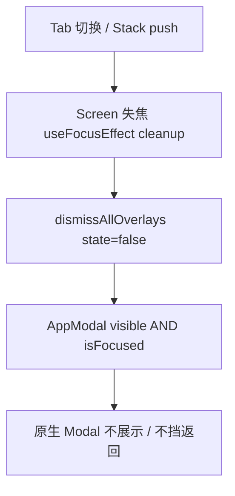

# Mobile 菜单/弹层导航卡顿与无法返回 Bugfix 技术规格（SPEC）

> 需求：[prd.md](./prd.md)  
> 相关：`mobile-chat-conversation-back/spec.md`（`useAndroidChatBackHandler`）、`mobile-agent-nav-refactor/spec.md`  
> **范围**：`apps/mobile`；无 Core 变更

## 设计目标

- 消除 **Tab/Stack 导航后 RN `Modal` 仍挡触摸/返回** 的幽灵遮罩问题。
- **统一策略**：失焦卸层 + Modal 聚焦门闩，覆盖 PRD 所列全部弹层。
- **最小侵入**：不重写导航结构、不用 `unmountOnBlur`（避免 Tab 状态丢失）。
- 与现有 **`useAndroidChatBackHandler`** 兼容：失焦后 overlay state 为 false，BackHandler 与 Modal 一致。

---

## 现状与约束（代码探索）

### 根因

React Navigation **Bottom Tab 默认保持 Screen 挂载**（`ChatTabScreen` / `ProfileTabScreen` 切 Tab 时不 unmount）。

RN `Modal` 渲染在 **原生窗口顶层**，与 React 树中 Tab 可见性无关。典型故障链：

1. 用户在 **对话 Tab** 打开 `ProjectDrawer` / `SessionActionsDrawer` / picker → `visible=true`
2. 用户点击 **底部「我的」Tab** → UI 显示 Profile，但 **ChatTabScreen 仍挂载**，Modal **`visible` 仍为 true**
3. 原生 Modal 继续拦截触摸与 **Android 返回** → 表现为「无法返回、像透明层挡住」

**竞态（慢菜单）**：`setState(true)` 已调度、Modal 动画未结束即切 Tab，同样出现「state 真 + 页面假」不同步。

### 现状缺口

| 事实 | 位置 |
|------|------|
| 全 App **无** Tab/Stack blur 统一关层 | grep 无 overlay dismiss hook |
| `useAndroidChatBackHandler` 仅在 Chat **聚焦** 时注册 | `useFocusEffect` + `BackHandler` |
| 失焦后 BackHandler 卸载，但 **Modal 仍可挡返回** | ChatTabScreen overlay state 未 reset |
| 共享组件均直接用 RN `Modal` | `BottomSheetMenu`、`TextPromptModal`、pickers、drawers 等 |
| `ProjectDrawer` 外层 Modal + 内嵌 `BottomSheetMenu` / `TextPromptModal` | 仅在外层 `visible=false` 时 reset 内层（L61–68） |
| `MessageActionMenu` | `visible && layout != null`，无 focus 门闩 |

### Modal 使用点（须纳入修复）

**共享组件（改 `AppModal`）**

- `components/sheet/BottomSheetMenu.tsx`
- `components/ui/TextPromptModal.tsx`
- `components/provider/ModelPickerModal.tsx`
- `components/agent/AgentPickerModal.tsx`
- `components/regex/RegexGroupPickerModal.tsx`
- `components/chrome/SessionActionsDrawer.tsx`
- `components/chrome/ProjectDrawer.tsx`（外层 Modal）
- `components/chat/MessageActionMenu.tsx`
- `components/provider/FetchModelsSheet.tsx`
- `components/provider/AddModelModal.tsx`
- `components/sheet/DirectoryRuleSheet.tsx`
- `components/vfs/VfsFileManager.tsx`（内联 rename Modal）

**Screen 级 overlay state（改 `useDismissOverlaysOnBlur`）**

| Screen / 容器 | 主要 overlay state |
|---------------|-------------------|
| `ChatTabScreen` | `projectDrawerOpen`, `sessionDrawerOpen`, `modelPickerOpen`, `agentPickerOpen`, `messageMenuTarget`, `messageEditPrompt`, `sessionRenamePrompt`, `menuSessionId` |
| `ProfileTabScreen` | `modelPickerVisible`, `agentPickerVisible`, `regexGroupPickerVisible` |
| `AgentList` | `menuAgentId`, `renamePrompt` |
| `ProvidersScreen` | `menuProviderId` |
| `ProviderDetailScreen` | `addVisible`, `fetchVisible`, `menuVendorId` |
| `RegexGroupsScreen` | `menuGroupId`, `createVisible`, `editGroupId` |
| `RegexRulesScreen` | 若有 ⋮ / modal state（grep 确认后一并纳入） |
| `EventsConfigScreen` | `addEventVisible`, `addActionEventId` |
| `EventConfigBlocks` | `depPickerOpen` |
| `VfsFileManager` | `menuPath`, `moreOpen`, `dirRuleOpen`, `prompt` |
| `AgentEditorForm` | `addBlockVisible` |

### 技术边界

- **不** 使用 Tab `unmountOnBlur: true`（会话列表滚动、对话流式状态会丢）。
- **不** 改菜单项、业务 API、Core。
- iOS 可顺带受益于 `AppModal`（`useIsFocused` 通用），本期 **仅 Android 验收**。
- `Alert.alert` 为系统对话框，**不在** RN Modal 修复范围。

---

## 总体方案

**双层防护**（互补，必须同时做）：



### 1. `AppModal`（聚焦门闩）

新建 `components/ui/AppModal.tsx`：

- 包装 RN `Modal`，内部 `useIsFocused()`（`@react-navigation/native`）
- **`effectiveVisible = visible && isFocused`**
- 透传 `onRequestClose` 等 props；模块头注释说明：**防止失焦 Tab 上 Modal 挡全局**
- 所有共享弹层 **仅** 通过 `AppModal` 渲染（禁止新增裸 `Modal`）

**嵌套**：`ProjectDrawer` 外层 + 内层 `BottomSheetMenu`/`TextPromptModal` 均走 `AppModal`；父 `visible=false` 或父 Screen 失焦时，内层 `isFocused` 同为 false。

### 2. `useDismissOverlaysOnBlur`（状态卸层）

新建 `hooks/useDismissOverlaysOnBlur.ts`：

```ts
/** Calls dismiss when the hosting screen loses focus (Tab switch or Stack cover). */
export function useDismissOverlaysOnBlur(dismiss: () => void): void
```

- `useFocusEffect(useCallback(() => () => dismiss(), [dismiss]))`
- 各 Screen/容器在 `dismiss` 内 **一次性** 将所有 overlay boolean / nullable state 复位
- **ChatTabScreen**：抽 `dismissAllOverlays`（含 `clearMessageMenu` 等），现有 `useAndroidChatBackHandler` 的 close 函数可复用同一套 setter

### 3. 与 `useAndroidChatBackHandler` 的关系

- 失焦时 `dismissAllOverlays` 先执行 → handler 读到的 `sessionDrawerOpen` 等为 false → 无冲突
- 聚焦且 overlay 开：handler 仍 **先关层**（现有优先级不变）
- **不要求** 在 Profile Tab 注册全局 BackHandler 关 Chat 的 Modal（失焦 + AppModal 已解决）

### 4. 竞态

- `setX(true)` 与 Tab 切换同一事件循环：`blur cleanup` 在 focus 丢失时运行，应 **晚于** 或 **覆盖** 未完成展示的 open
- 若 open 在 blur 之后（极端）：`AppModal` 的 `isFocused=false` 仍阻止原生 Modal 显示
- 用户回到原 Tab：因 state 已被 dismiss，**不会** 自动重开菜单（符合 PRD「导航时卸弹层」）

---

## 最终项目结构

```
apps/mobile/src/
  components/ui/
    AppModal.tsx                         # 新增
  hooks/
    useDismissOverlaysOnBlur.ts          # 新增
  components/sheet/BottomSheetMenu.tsx   # Modal → AppModal
  components/ui/TextPromptModal.tsx
  components/provider/ModelPickerModal.tsx
  components/agent/AgentPickerModal.tsx
  components/regex/RegexGroupPickerModal.tsx
  components/chrome/SessionActionsDrawer.tsx
  components/chrome/ProjectDrawer.tsx
  components/chat/MessageActionMenu.tsx
  components/provider/FetchModelsSheet.tsx
  components/provider/AddModelModal.tsx
  components/sheet/DirectoryRuleSheet.tsx
  components/vfs/VfsFileManager.tsx
  screens/tabs/ChatTabScreen.tsx         # dismissAll + hook
  screens/tabs/ProfileTabScreen.tsx
  components/agent/AgentList.tsx
  components/agent/AgentEditorForm.tsx
  components/events/EventConfigBlocks.tsx
  screens/stack/*.tsx                    # 见变更清单
  __tests__/
    app-modal.test.tsx                   # 新增
    use-dismiss-overlays-on-blur.test.ts # 新增
```

---

## 变更点清单

| 文件 | 改动 |
|------|------|
| `components/ui/AppModal.tsx` | **新增** |
| `hooks/useDismissOverlaysOnBlur.ts` | **新增** |
| 上表所有 Modal 组件 | `Modal` → `AppModal` |
| `ChatTabScreen.tsx` | `dismissAllOverlays` + hook |
| `ProfileTabScreen.tsx` | `dismissAllOverlays` + hook |
| `AgentList.tsx` | dismiss menu/rename + hook |
| `AgentEditorForm.tsx` | dismiss `addBlockVisible` + hook（或经 `AgentEditorScreen` 包装 dismiss prop） |
| `VfsFileManager.tsx` | dismiss 全部 overlay + hook |
| `EventConfigBlocks.tsx` | dismiss + hook |
| Stack screens（Providers、ProviderDetail、RegexGroups、RegexRules、EventsConfig 等） | 各 screen dismiss + hook |
| `useAndroidChatBackHandler.ts` | **不改逻辑**；确认 Chat dismiss 覆盖其 state 字段 |

**不改**：`RootNavigator` Tab 配置、Core、PRD 业务行为。

---

## 详细实现步骤

### 步骤 1：`AppModal`

1. 实现 `AppModal`，导出与 `Modal` 相同 props 类型（`ModalProps` 或 Pick 常用字段）。
2. 单元测试（mock `@react-navigation/native` 的 `useIsFocused`）：
   - `visible=true, isFocused=false` → 传给 RN Modal 的 `visible` 为 false
   - `visible=true, isFocused=true` → true

### 步骤 2：迁移共享 Modal 组件

按文件将 `import { Modal } from 'react-native'` 改为 `AppModal`（12 个组件，见上表）。

`ProjectDrawer`：外层 Modal 改 `AppModal`；内层已用 `BottomSheetMenu`/`TextPromptModal`，迁移后自动受益。

### 步骤 3：`useDismissOverlaysOnBlur`

1. 实现 hook + 单测：mount → simulate cleanup → `dismiss` 被调用一次。
2. **ChatTabScreen** — 示例：

```ts
const dismissAllOverlays = useCallback(() => {
  setProjectDrawerOpen(false);
  setSessionDrawerOpen(false);
  setModelPickerOpen(false);
  setAgentPickerOpen(false);
  setMessageMenuTarget(undefined);
  setMessageMenuAnchor(undefined);
  setMessageEditPrompt(undefined);
  setSessionRenamePrompt(undefined);
  setMenuSessionId(undefined);
}, []);

useDismissOverlaysOnBlur(dismissAllOverlays);
```

3. **ProfileTabScreen** — 关闭三个 picker visible。
4. **AgentList** — `setMenuAgentId(undefined); setRenamePrompt(undefined)`。
5. 其余 Stack / VFS / Events / AgentEditor — 各 screen grep `visible=` / menu state，逐一 dismiss。

### 步骤 4：Agent 编辑器

`AgentEditorForm` 为 Stack 内子组件：在 **`AgentEditorScreen`** 包一层 `useDismissOverlaysOnBlur(() => setAddBlockVisible(false))`，或将 `addBlockVisible` dismiss 通过 ref/callback 从 Form 暴露 — **推荐** Form 内直接调用 hook（Form 仅在 Editor Screen 内使用）。

### 步骤 5：RegexRulesScreen 等漏网扫描

实现前对 `apps/mobile/src` 再 grep `<Modal` 与 `BottomSheetMenu`，确保 **零裸 Modal**。

### 步骤 6：验证

```bash
npm test -w @novel-master/mobile -- app-modal
npm test -w @novel-master/mobile -- use-dismiss-overlays-on-blur
npm test -w @novel-master/mobile -- use-android-chat-back-handler
npm run lint -w @novel-master/mobile
npm run build
```

Android 手工 PRD T1–T8。

---

## 测试策略

### 自动化

| ID | 内容 |
|----|------|
| T-M1 | `AppModal` focus 门闩 |
| T-M2 | `useDismissOverlaysOnBlur` cleanup 调用 dismiss |
| T-M3 | 回归 `use-android-chat-back-handler` 全绿 |

### 手工（Android，PRD T1–T8）

| ID | 要点 |
|----|------|
| T1 | 项目抽屉 → 切我的 → 可点、返回可用 |
| T2 | 会话操作抽屉 → 切我的 |
| T3 | 模型/agent picker → 切 Tab |
| T4 | 我的 picker → 切对话 |
| T5 | agent ⋮ → 进编辑器 / 切 Tab |
| T6 | 长按消息菜单 → 切 Tab |
| T7 | 项目抽屉 ⋮ 重命名 Modal → 切 Tab |
| T8 | 全流程后杀进程重启 |

### 竞态抽测

- 点击 ☰ **立即** 点底部 Tab（不等动画结束）→ 3 次内返回可预期。

---

## 风险与回滚方案

| 风险 | 缓解 |
|------|------|
| 组件在非 Navigation 树内使用 `AppModal` | 当前 Modal 均在 Screen 下；若测试工具裸 render，mock `useIsFocused=true` |
| 失焦 dismiss 后用户期望回 Tab 菜单仍开 | PRD 明确导航时关层；不回开 |
| 嵌套 Modal 动画卡顿 | 不改为本迭代性能目标；双层防护优先 correctness |
| 漏改某个 Stack 页 | grep `<Modal` CI 门禁（可选 eslint 规则后续） |

**回滚**：revert `AppModal` + hook commits；恢复裸 `Modal`。

---

## 实现后检查清单

- [ ] 无裸 `Modal`（共享层）
- [ ] Chat / Profile / AgentList / 主要 Stack 页均已 `useDismissOverlaysOnBlur`
- [ ] 单测 T-M1–M3 通过
- [ ] Android T1–T8 通过
- [ ] `useAndroidChatBackHandler` 回归通过
