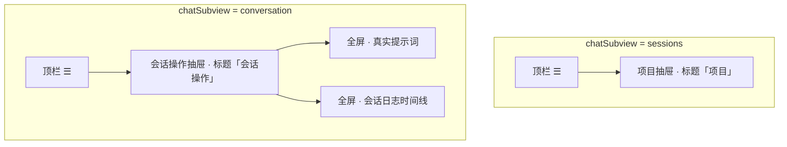

# 移动端原型 — 会话操作抽屉与会话日志 技术规格（SPEC）

## 设计目标

- 在 `examples/mobile` 静态原型内落实 [prd.md](./prd.md)：顶栏 ☰ **按 `chatSubview` 分流**；会话内打开 **「会话操作」** 抽屉；移除 Chip 与独立「工具日志 / 检查点」全屏页。
- 新增 **「会话日志」** 全屏页：工具执行与检查点创建 **统一时间线**（时间倒序），保留回滚与关联检查点交互（mock）。
- 不引入后端、不改动 monorepo 内 `packages/*`；保持 `file://` 双击可打开。

---

## 现状与约束（代码探索）

| 项 | 现状 | 影响 |
|----|------|------|
| 导航状态 | `appState.chatSubview`: `'sessions' \| 'conversation'`；`navigateToPage` + `pageStack` 管理全屏二级页 | ☰ 行为在 `openDrawer()` 内分支即可，无需新路由库 |
| 顶栏 ☰ | `#drawerBtn` → `openDrawer()` 固定打开 `#projectDrawer` | 需按 `chatSubview` 打开不同抽屉；`updateHeader('chat')` 时同步 `aria-label` |
| 抽屉 DOM | 单一 `#drawerOverlay` + `#projectDrawer`（`.project-drawer.open`） | 可复用同一 overlay；新增 `#sessionActionsDrawer`，**同一时刻只 open 一个** |
| Chip 入口 | `#chatPanelChat .context-chips` 三按钮 → `setupContextChips()` → `realPrompt` / `logs` / `checkpoints` | 删除 HTML + `setupContextChips()`；`#chatPanelChat .messages` 的 `padding-bottom: 52px` 可减小 |
| 全屏页 | `#logsPage`、`#checkpointsPage`；`pageConfig.logs` / `pageConfig.checkpoints` | 合并为 `#sessionLogPage` + `pageConfig.sessionLog` |
| 回滚 mock | `setupCheckpoints()`：`.rollback-btn` confirm + Toast；`.checkpoint-link` → `navigateToPage('checkpoints')` | 迁至 `setupSessionLog()`；链接改为页内回滚或滚动高亮（原型用 **直接 confirm 回滚** 更简单） |
| 项目切换 | `setupProjectsAndSessions()` 点项目 → `closeDrawer()` + `showSessionListView()` | 保持不变；会话抽屉不参与项目切换 |
| 样式 | `.project-drawer`、`.log-*`、`.checkpoint-*` 分块定义 | 抽屉基类共享；时间线条目复用/扩展 log、checkpoint 样式 |
| 文档 | `README.md` 仅写「☰ 项目抽屉」；`feature-inventory.md` §3.3 Chip、§6 分栏 | 实现时同步 §3.3、§6、README |

**兼容性**：纯前端原型改动；无持久化、无 URL 路由；外部不依赖 `logs` / `checkpoints` 页面 id（仅原型内部）。

**技术边界（PRD）**：不接真实检查点 API；FIFO 淘汰仅静态 mock 一条「不可用」条目即可满足验收。

---

## 总体方案

### 信息架构（变更后）



### 抽屉策略

- **共享** `#drawerOverlay`（z-index 不变）。
- **两个** `<aside>`：`#projectDrawer`（现有）、`#sessionActionsDrawer`（新增）。
- `openDrawer()`：
  - `appState.chatSubview === 'conversation'` → `closeDrawer()` 后只打开 `sessionActionsDrawer`；
  - 否则 → 只打开 `projectDrawer`。
- `closeDrawer()`：移除两个 drawer 的 `open`，隐藏 overlay。
- 选菜单项：先 `closeDrawer()`，再 `navigateToPage('realPrompt' \| 'sessionLog', true)`。

### 会话日志时间线（原型数据）

- 静态 HTML 若干 `.timeline-item`，`data-kind="tool"|"checkpoint"`。
- 按展示顺序 **时间倒序**（新在上）；与现 mock 时间文案一致（2 分钟前、5 分钟前、1 小时前…）。
- **tool**：左侧色条 success/failed（复用 `.log-item` 语义）；工具名、摘要、可选 `检查点: cp_xxx` 链接。
- **checkpoint**：类型标签「检查点」；id、时间、来源、**回滚到此** 按钮。
- 页顶保留 `info-banner.warning`（最多保留 100 个…）。
- 可选 1 条 `data-expired="true"` 的 tool 条目：回滚按钮 disabled + 文案「检查点已移除」。

### 真实提示词

- 保留 `#realPromptPage` 与现有 `<pre>` mock，无结构变更。

---

## 最终项目结构

变更仅落在 `examples/mobile/`（无新目录）：

```text
examples/mobile/
├── index.html          # 改：Chip 删除；sessionActionsDrawer；sessionLogPage；删 logs/checkpoints 页
├── app.js              # 改：抽屉分流、sessionLog 路由、setupSessionLog、删 setupContextChips 等
├── styles.css          # 改：抽屉/菜单/时间线；可选精简 chip 与 compose 浮动样式
├── README.md           # 改：☰ 分流、会话操作、会话日志
└── docs/
    └── feature-inventory.md   # 改：§3.3、§6
```

---

## 变更点清单

| 文件 | 变更 |
|------|------|
| `index.html` | 删除 `context-chips` 块；`drawerBtn` 的 `aria-label` 改为由 JS 设置；新增 `#sessionActionsDrawer`；`#logsPage`/`#checkpointsPage` → `#sessionLogPage` + `.session-timeline`；保留 `#realPromptPage` |
| `app.js` | `pageConfig`：`sessionLog` 替换 `logs`/`checkpoints`；`elements.sessionActionsDrawer`；重写 `openDrawer`/`closeDrawer`；`updateHeader` 更新 ☰ label；`setupSessionActionsDrawer`；`setupSessionLog` 替代 `setupCheckpoints`；删除 `setupContextChips`；`init()` 注册调整 |
| `styles.css` | `.side-drawer` 或 `.session-actions-drawer` 与 project 共享定位动画；`.drawer-menu` / `.drawer-menu-item`；`.session-timeline`、`.timeline-item`、`.timeline-kind`；删除或保留未用 `.chip` 规则；调整 `#chatPanelChat .messages` 底部 padding |
| `README.md` | 信息架构：会话列表 ☰=项目；会话内 ☰=会话操作 |
| `docs/feature-inventory.md` | §3.3 改为「会话操作抽屉」；§6 改为「会话日志（统一时间线）」 |

---

## 详细实现步骤

### 步骤 1：`index.html` — 会话操作抽屉

在 `#projectDrawer` 之后增加：

```html
<aside id="sessionActionsDrawer" class="side-drawer session-actions-drawer" aria-label="会话操作">
  <div class="drawer-header">
    <h2>会话操作</h2>
  </div>
  <nav class="drawer-menu">
    <button type="button" class="drawer-menu-item" data-session-action="real-prompt">真实提示词</button>
    <button type="button" class="drawer-menu-item" data-session-action="session-log">会话日志</button>
  </nav>
</aside>
```

- 为 `#projectDrawer` 增加类名 `side-drawer`（与 session 抽屉共用动画规则），保留 `project-drawer` 亦可。

### 步骤 2：`index.html` — 移除 Chip

删除 `chat-compose-dock` 内整个 `context-chips` 容器（约 109–113 行）。

### 步骤 3：`index.html` — 会话日志页

- 删除 `#logsPage`、`#checkpointsPage`。
- 新增 `#sessionLogPage.page`，结构示例：

```html
<div id="sessionLogPage" class="page">
  <div class="info-banner warning">…最多保留 100 个检查点…</div>
  <div class="session-timeline">
    <!-- tool 条目：复用 log-header / log-summary / log-checkpoint 结构，外加 timeline-kind -->
    <!-- checkpoint 条目：checkpoint-id、source、rollback-btn -->
    <!-- 一条 expired mock（可选） -->
  </div>
</div>
```

- 条目顺序（新→旧）：`read_file`+cp_1234 → `cp_1234` 检查点行 → `write_file`+cp_1233 → … → `cp_1232` 手动保存。

### 步骤 4：`styles.css`

1. 将 `.project-drawer` 抽为 `.side-drawer`（`position/transform/width` 相同），`.project-drawer` 与 `.session-actions-drawer` 均 `@extend` 或并列选择器。
2. `.drawer-menu`：纵向列表；`.drawer-menu-item`：全宽、左对齐、padding 16px、底部分割线；`:active` 背景。
3. `.session-timeline`：padding 16px；`.timeline-item`：卡片 + `margin-bottom`；`.timeline-kind`：小标签（工具 / 检查点）。
4. `.timeline-item--checkpoint` 与现有 `.checkpoint-item` 视觉对齐；`.timeline-item--tool` 与 `.log-item` 对齐。
5. 删除或注释 `.context-chips*`、`.chip`（若无引用）；`#chatPanelChat .messages { padding-bottom: 16px; }`（或 0）。

### 步骤 5：`app.js` — 状态与元素缓存

```javascript
// pageConfig
sessionLog: { title: '会话日志', showBack: true, showNav: false },
// 删除 logs、checkpoints

elements.sessionActionsDrawer = document.getElementById('sessionActionsDrawer');
```

### 步骤 6：`app.js` — 抽屉开关

```javascript
function openProjectDrawer() { /* overlay + projectDrawer.open */ }
function openSessionActionsDrawer() { /* overlay + sessionActionsDrawer.open */ }

function openDrawer() {
  if (appState.currentPage === 'chat' && appState.chatSubview === 'conversation') {
    openSessionActionsDrawer();
  } else {
    openProjectDrawer();
  }
}

function closeDrawer() {
  // 两个 drawer 都 remove open；overlay hidden
}
```

- `setupDrawer`：`drawerBtn` → `openDrawer`；overlay → `closeDrawer`（不变）。

### 步骤 7：`app.js` — `updateHeader` 与 ☰ 无障碍

在 `pageId === 'chat'` 分支末尾（或统一处）：

```javascript
if (elements.drawerBtn) {
  const inConversation = appState.chatSubview === 'conversation';
  elements.drawerBtn.setAttribute(
    'aria-label',
    inConversation ? '打开会话操作' : '打开项目列表',
  );
}
```

### 步骤 8：`app.js` — `setupSessionActionsDrawer`

- 监听 `[data-session-action]`：
  - `real-prompt` → `closeDrawer()` + `navigateToPage('realPrompt', true)`
  - `session-log` → `closeDrawer()` + `navigateToPage('sessionLog', true)`

### 步骤 9：`app.js` — `setupSessionLog`

- 合并原 `setupCheckpoints` 逻辑：
  - `.rollback-btn`（在 `#sessionLogPage` 内）→ confirm + Toast mock。
  - `.checkpoint-link`：不再 `navigateToPage('checkpoints')`；改为 `confirm` 回滚对应 `data-checkpoint-id`（与 PRD「从记录回滚」一致）。
  - `[data-expired="true"]` 内按钮 disabled 或点击 Toast「检查点已移除」。
- 可选：`appState.rollbackInProgress` 布尔，第二次点击 Toast「回滚进行中」（轻量满足 PRD）。

### 步骤 10：`app.js` — 清理

- 删除 `setupContextChips` 及 `init` 中调用。
- 全局搜索 `logs`、`checkpoints`、`navigateToPage('logs'`、`navigateToPage('checkpoints'` 确保无残留。

### 步骤 11：文档

- `README.md`：补充「会话列表 ☰ → 项目」「会话内 ☰ → 会话操作（真实提示词、会话日志）」。
- `feature-inventory.md`：
  - §3.3：会话内顶栏 ☰ → 会话操作抽屉（2 项）；删除 Chip 表。
  - §6：重命名为「会话日志」；统一时间线；回滚在条目上完成。

### 步骤 12：自检

- 浏览器手动走 PRD 验收标准（见下「测试用例」）。
- 确认 `file://` 打开无控制台报错。

---

## 测试策略

**类型**：仅 **手动 UI 验收**（原型无 test runner）。

**环境**：Windows / macOS，Chrome 或 Safari 移动模拟；`start examples/mobile/index.html`。

### 测试用例

| ID | 步骤 | 预期 |
|----|------|------|
| T1 | 对话 Tab，会话列表，点 ☰ | 左侧「项目」抽屉；无「会话操作」菜单项 |
| T2 | 进入任一会话（聊天 Tab），点 ☰ | 「会话操作」标题；仅「真实提示词」「会话日志」 |
| T3 | 会话操作抽屉打开，点遮罩 | 抽屉关闭 |
| T4 | 会话内聊天面板 | 输入区上方无 Chip |
| T5 | 会话操作 → 真实提示词 | 全屏标题「真实提示词」；返回后会话与 Tab 状态保持 |
| T6 | 会话操作 → 会话日志 | 全屏标题「会话日志」；无「工具日志」「检查点」标题页 |
| T7 | 会话日志页 | 单列表、含「工具」与「检查点」两类条目；无子 Tab |
| T8 | 会话日志 → 检查点条目「回滚到此」→ 确认 | Toast「正在回滚…」→「回滚成功」 |
| T9 | 会话日志 → 工具条目检查点链接 → 确认 | 同上（或明确提示），不跳转已删除的 checkpoints 页 |
| T10 | 全局 UI | 无入口进入 `logs`/`checkpoints` 页（DevTools 无对应 active page） |
| T11 | 项目抽屉切换项目 | Toast + 回到会话列表；`closeDrawer` 生效 |
| T12 | 会话内「会话工作区」Tab 下点 ☰ | 仍为会话操作抽屉（T2） |

---

## 风险与回滚方案

| 风险 | 缓解 | 回滚 |
|------|------|------|
| 双抽屉同时 `open` 类名残留 | `openDrawer` 先 `closeDrawer()` 再开目标；`closeDrawer` 清两者 | Git 还原 `index.html` / `app.js` / `styles.css` |
| 删除 Chip 后输入区布局跳动 | 同步改 `padding-bottom` 与 `chat-compose-dock` | 恢复 chip HTML + CSS |
| `checkpoint-link` 行为变更与产品预期不符 | SPEC 采用「直接 confirm 回滚」；若需仅滚动定位，实现前改 PRD | 保留链接跳检查点页（不推荐，与 PRD 冲突） |
| 样式类名迁移遗漏 | 全局搜 `logsPage`/`checkpointsPage` | 单 commit 仅 examples/mobile |

**回滚**：本迭代仅触及 `examples/mobile` 与 kb 文档；`git checkout -- examples/mobile` 即可恢复交互；kb 中 `spec.md` 可保留或一并 revert。

---

## 实现后

- 执行 `apm kb index rebuild`。
- **请确认本 SPEC 后再进入编码**（不自动改代码）。
