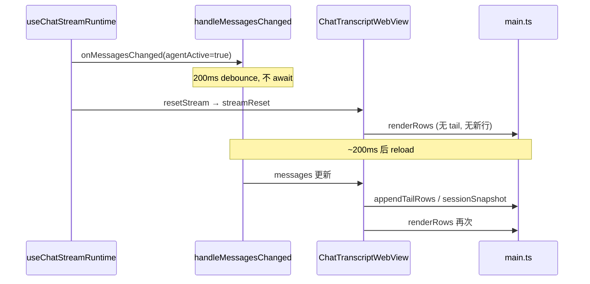
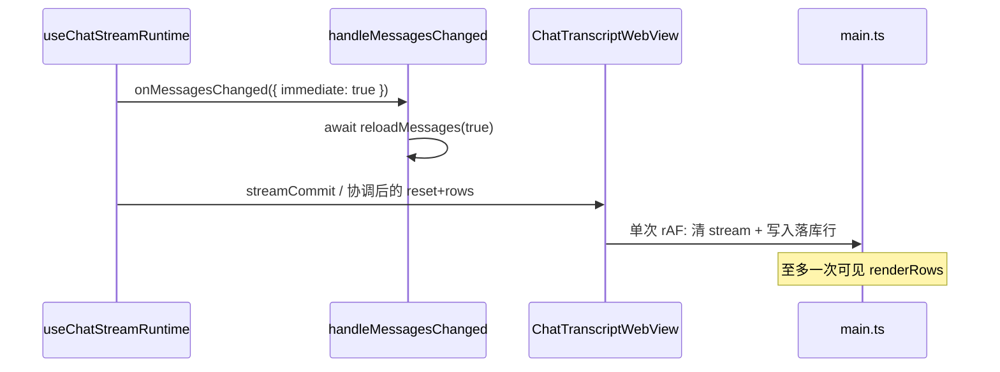

# Mobile 流式结束频闪修复 技术规格（SPEC）

> **PRD**：[prd.md](./prd.md)  
> **前置**：[mobile-webview-chat-transcript/spec.md](../mobile-webview-chat-transcript/spec.md)、[mobile-stream-tail-waiting-ui/spec.md](../mobile-stream-tail-waiting-ui/spec.md)  
> **建议分支**：`fix/mobile-stream-end-flicker`

## 设计目标

1. 消除 WebView 流式结束时的 **reload/reset 时序空窗** 与 **双次 `renderRows` 频闪**。
2. 纯文本 assistant（无 tool）结束走 **单次 DOM 过渡**（原子 commit 或等价方案）。
3. tool 回合保持 **full snapshot** 契约；流式进行中增量路径 **不退化**。
4. 改动限于 **Mobile WebView + RN 编排**；不引入 library rewrite。

## 总体方案

### 问题根因（现状）



### 目标架构



### 三件套落点

| PRD 项 | 技术方案 |
|--------|----------|
| **#1 修时序** | 收尾路径强制 **immediate reload**；`flushAgentStepUi` / `flushRunUi` 仅在 reload 完成后 reset |
| **#2 合并重绘** | 新 bridge 消息 **`streamCommit`**：Web 侧单次 handler 内清 `state.stream` + 合并 rows + `renderRows()` 一次 |
| **#3 单行 patch** | 纯文本 assistant：`streamCommit` payload 含 **单行** enriched row；Web 将 `#stream-tail` **promote** 为 `.row.message` 或 insert 后立即移除 tail，避免空帧 |

**tool 回合**：不走 `streamCommit` 单行路径；仍 `sendSessionSnapshot('preserve')`。`streamCommit` 可与 snapshot 互斥——有 pending full snapshot 时 skip 单行 commit。

---

## 最终项目结构

无新包；改动集中在：

```
apps/mobile/src/
├── components/chat/
│   ├── flush-run-ui.ts              # 扩展 immediate reload 契约
│   ├── ChatTranscriptWebView.tsx    # streamCommit、messages effect 协调
│   └── ChatTranscriptBridge.ts      # 新 bridge 类型
├── screens/tabs/
│   ├── ChatTabScreen.tsx            # handleMessagesChanged 传 immediate 标志
│   └── chat-tab/
│       ├── useChatTabMessages.ts    # forceImmediate reload API
│       └── useChatStreamRuntime.ts  # 收尾调用 immediate reload + streamCommit
└── web/chat-transcript/
    └── main.ts                      # streamCommit handler、promoteStreamTailToRow
```

---

## 变更点清单

### P0 — RN 编排层

#### 1. `useChatTabMessages.ts`

- 扩展 `handleMessagesChanged(refresh, options?)`：
  - `options.immediate?: boolean` — 为 true 时 **绕过** 200ms coalesce，**await** `reloadMessages(true)`。
  - `options.agentRunning?: boolean` — 显式传入；immediate 路径忽略 coalesce。
- `flushRunUi` / `flushAgentStepUi` 调用侧传 `{ immediate: true }`。

#### 2. `flush-run-ui.ts`

- 签名扩展：

```typescript
export type FlushMessagesChanged = (
  options?: { immediate?: boolean },
) => void | Promise<void>;

export async function flushRunUi(
  onMessagesChanged: FlushMessagesChanged,
  onStreamReset: () => void,
): Promise<void> {
  await onMessagesChanged({ immediate: true });
  onStreamReset();
}
```

- `flushAgentStepUi` 同理；`tool_results` 阶段在 runtime 内仍只调 `onMessagesChanged({ immediate: true })`（不 reset）。

#### 3. `useChatStreamRuntime.ts`

- `handleStreamReset` 扩展为可选 **`commitRows`** 模式：
  - 纯文本 assistant step：reload 完成后，由 WebView ref 调 **`commitStreamTail(rows)`** 而非裸 `resetStream()`。
  - `RUN_FINISHED`：若最后一步已在 assistant commit 处理过且 tail 已清，**reset 幂等**。
- 保持 `tool_results` → 仅 immediate reload，无 reset。

#### 4. `ChatTabScreen.tsx`

- `handleMessagesChanged` wrapper 将 `agentRunningRef` 与 `immediate` 正确下传。

### P0 — WebView bridge

#### 5. `ChatTranscriptBridge.ts`

新增：

```typescript
type StreamCommitPayload = {
  readonly rows: readonly TranscriptRow[]; // 通常 1 行 assistant
  readonly scrollIntent?: 'preserve' | 'none';
};
// postMessage: { type: 'streamCommit', payload: StreamCommitPayload }
```

#### 6. `ChatTranscriptWebView.tsx`

- 新增 `commitStreamTail(rows, scrollIntent)`：
  - 设 `streamActiveRef = false`；
  - post **`streamCommit`**（**不** 先 post `streamReset`）；
  - 清 pending RAF / delta 缓冲；
  - **不** 在 commit 后再 `flushPendingSnapshot` 若 payload 已含完整行（避免双绘）。
- **messages effect 协调**：
  - 若本回合已通过 `streamCommit` 写入行，messages effect 检测 `prevCount` 对齐后 **skip** 重复 `appendTailRows` / `sessionSnapshot`（用 `lastCommitMessageIdRef` 或行数指纹）。
  - tool 分支逻辑 **不变**：`needsFullSnapshot` → `sendSessionSnapshot('preserve')`。
- `resetStreamTail` 保留给 abort / 无落库行场景；与 `streamCommit` 互斥。

#### 7. `main.ts`（Web boot script）

新增 handler `streamCommit`：

```javascript
case 'streamCommit':
  clearStreamRichUpgrade();
  state.stream = { text: '', thinking: '', textHtml: '', thinkingHtml: '', toolInvoking: false };
  applyAppendTailRows(payload.rows); // 或 merge 入 state.rows 后
  promoteOrRemoveStreamTail();       // #stream-tail → 正式 .row.message 或 remove
  renderRows();                      // 单次全量
  scheduleStickIfNearBottom(payload.scrollIntent);
  break;
```

**`promoteStreamTailToRow`（纯文本路径）**：

- 若 `#stream-tail` 存在且 `state.rows` 新增行与 stream 文本一致：
  - 将 tail DOM **替换**为正式 row HTML（复用 `renderRow`），**不** 先 `innerHTML=''` 再插入。
- 若无 tail（waiting-first 已清）：fallback 为 `applyAppendTailRows` + `renderRows()`（仍单次 commit handler）。

**`streamReset` 调整**：

- 仅用于 abort / 错误 / 无 commit payload 场景；
- 若 RN 已发 `streamCommit`，Web **不应** 再收到 `streamReset`（RN 侧保证）。

### P1 — legacy MessageList

- 共享 `immediate reload` 修复后，legacy 自动减少空窗；
- **不** 新增 `streamCommit` bridge（legacy 无 WebView）；
- 若仍有空窗，可选：`handleStreamReset` 延迟到 `messages` state 更新后（follow-up）。

---

## 详细实现步骤

### Step 1 — immediate reload（#1）

1. 改 `useChatTabMessages.handleMessagesChanged` 支持 `{ immediate: true }`。
2. 改 `flush-run-ui.ts` 类型与调用。
3. `useChatStreamRuntime` 的 `onMessagesChanged` 包装传 immediate。
4. 单测：`flush-run-ui.test.ts` 断言 immediate 路径 await reload。

### Step 2 — streamCommit bridge（#2）

1. `ChatTranscriptBridge.ts` 增加 `streamCommit` 类型。
2. `ChatTranscriptWebView.commitStreamTail` 实现。
3. `main.ts` 增加 `streamCommit` case + 单次 `renderRows`。
4. boot-script 测试：guard `case 'streamCommit'` 存在。

### Step 3 — 纯文本单行 promote（#3）

1. `useChatStreamRuntime`：assistant step 且无 tool_use 时，reload 后调 `buildTranscriptRows` / `selectTailTranscriptRows` 取 **新增 assistant 行**，传 `commitStreamTail`。
2. `main.ts` 实现 `promoteStreamTailToRow`（text/thinking 与 row 一致时原位转换）。
3. `ChatTranscriptWebView` messages effect：commit 后 dedupe snapshot。

### Step 4 — tool / 多步回归

1. assistant+tool_use → 仍 `sessionSnapshot`；**不** 走 streamCommit。
2. `STEP_COMMITTED(tool_results)` → immediate reload only。
3. 多步序列单测（见测试策略）。

### Step 5 — 手工验收

- Android：纯文本贴底结束录屏；tool 多轮；abort 中途。

---

## 测试策略

### 现有测试扩展

| 文件 | 新增/扩展 |
|------|-----------|
| `flush-run-ui.test.ts` | immediate reload await；tool_results 不 reset |
| `use-chat-stream-runtime.test.ts` | T-S1~S4：STEP_COMMITTED 序列、stale 事件 |
| `chat-transcript-webview.test.tsx` | T-W1~W5：appendTail vs snapshot；streamCommit 顺序；dedupe |
| `chat-transcript-boot-script.test.ts` | T-B1：含 `streamCommit` case |

### 测试用例

#### 时序（P0）

- **T-S1** `STEP_COMMITTED(assistant)` + agentActive=true → `onMessagesChanged({ immediate: true })` await 完成后才 `resetStream`/`commitStreamTail`。
- **T-S2** `STEP_COMMITTED(tool_results)` → immediate reload，**无** reset。
- **T-S3** 序列 assistant → tool_results → assistant → RUN_FINISHED → flush 次数与 reset 幂等。
- **T-S4** stale RUN_FINISHED / STEP_COMMITTED → 无 flush。

#### Bridge / DOM（P0）

- **T-W1** tool_results-only user + uiRunning → `sessionSnapshot`，非 appendTail。
- **T-W2** 纯 text assistant + uiRunning → `appendTailRows`（run 中）或 `streamCommit`（step 结束）。
- **T-W3** streamCommit 后 messages effect **不** 再发重复 snapshot。
- **T-W4** abort 无 commit → `streamReset` 仍清 tail。
- **T-B1** boot script 含 `streamCommit` + 单次 `renderRows` 路径。

#### 回归（P0）

- **T-R1** 流式 delta 仍 incremental；text 路径禁止整泡 rebuild（既有 boot-script 守护保持）。
- **T-R2** tool_use assistant snapshot 后 toolPhase pending 正确（既有 build-transcript-rows 用例保持）。

### 运行命令

```bash
npm test -w @novel-master/mobile -- --testPathPattern="flush-run-ui|use-chat-stream-runtime|chat-transcript-webview|chat-transcript-boot-script|build-transcript-rows"
```

---

## 风险与回滚方案

| 风险 | 缓解 | 回滚 |
|------|------|------|
| streamCommit 与 snapshot 重复 | `lastCommitMessageIdRef` dedupe | Feature flag 或 revert bridge |
| promote DOM 与 rich html 不一致 | 本期 P0 以 **rich 关** 为主；rich 开 fallback 为 commit 内带 html | rich 路径继续 full snapshot |
| immediate reload 增加 tool 期间 DB 读 | 仅 **step/run 收尾** immediate，非每 delta | 恢复 coalesce 仅非收尾路径 |
| waiting-first tail promote | commit 前读 `state.stream` 全量 | 已有 state 驱动 renderRows |

**回滚**：Revert 分支；默认引擎仍为 webview，无 schema 变更。

---

## 兼容性与迁移

- **无** 用户配置变更；无 KKV 迁移。
- **Desktop**：不改动；`flush-run-ui` 若共享类型仅 mobile 侧扩展 optional 参数。
- **与 stream-display-rewrite**：本 spec 为 WebView 补丁；rewrite 合入时可弃用 `streamCommit`，由 library flushing 状态机替代。
