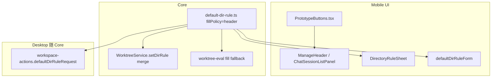

# Mobile 按钮尺寸回归与 VFS 目录规则默认值 技术规格（SPEC）

## 设计目标

1. **Mobile 按钮**：将 `PrototypeButtons` 恢复为 pre-`064a061` 紧凑视觉，一次改动覆盖所有 Primary/Secondary 使用点。
2. **目录规则默认**：Core `DEFAULT_WORKTREE_DIR_RULE.fillPolicy` 改为 `header`，作为 `setDirRule` 合并、`worktree-eval` 缺省、Mobile/Desktop `defaultDirRuleForm` 的唯一来源。
3. **语义不变**：未持久化规则的目录仍为「规则·关」；`ruleEnabled` 保存逻辑不变；不迁移存量 worktree 行。

## 总体方案



- **按钮**：仅改 `PrototypeButtons.tsx` StyleSheet 与 Secondary 配色；不新增组件、不改各页面布局。
- **填充默认**：单点修改 `DEFAULT_WORKTREE_DIR_RULE`；Mobile `defaultDirRuleForm` / `DirectoryRuleSheet` 已读该常量，无需额外 Mobile 逻辑。
- **Desktop**：`workspace-actions.defaultDirRuleRequest` 已引用 Core 常量；可选将 `DirectoryRuleModal` 的 `useState` 初值从硬编码 `"hidden"` 改为 `DEFAULT_WORKTREE_DIR_RULE.fillPolicy`（避免打开 Sheet 首帧闪动，非必须）。

## 最终项目结构

```
apps/mobile/src/components/ui/
  PrototypeButtons.tsx              # 紧凑样式回归

packages/core/src/domain/worktree/logic/
  default-dir-rule.ts               # fillPolicy: "header"

packages/core/test/worktree/
  default-dir-rule.test.ts          # 新建：断言默认 fillPolicy

apps/mobile/__tests__/
  fill-policy-mobile.test.ts        # 新增 defaultDirRuleForm 断言（可选独立文件）
  prototype-buttons.test.ts         # 新建：样式常量快照（可选）

.apm/kb/docs/Iterations/virtual-worktree/
  spec.md                           # 文档：fill=hidden → fill=header（一行）

apps/desktop/renderer/features/workspace/
  DirectoryRuleModal.tsx            # 可选：初值对齐 Core
```

## 变更点清单

| 文件 | 操作 | 说明 |
|------|------|------|
| `apps/mobile/src/components/ui/PrototypeButtons.tsx` | 修改 | 恢复紧凑尺寸；Secondary 用 `tokens.bgSecondary` + `tokens.text`，去 border |
| `packages/core/.../default-dir-rule.ts` | 修改 | `fillPolicy: "header"` |
| `packages/core/test/worktree/default-dir-rule.test.ts` | 新建 | 断言 `DEFAULT_WORKTREE_DIR_RULE.fillPolicy === "header"` |
| `apps/mobile/__tests__/fill-policy-mobile.test.ts` | 修改 | 增加 `defaultDirRuleForm` 默认 fill 为 `header` |
| `.apm/kb/docs/Iterations/virtual-worktree/spec.md` | 修改 | 默认 `fill=header` 描述 |
| `apps/desktop/.../DirectoryRuleModal.tsx` | 可选 | `useState` 初值 / `normalizeFillPolicy` 未知值 fallback 对齐 Core |

**不变**：`BottomSheetMenu`、`ManageHeader` 布局、`setDirRule` 的 `ruleEnabled` 合并、`normalizeFillPolicyForMobile`（`full`→`hidden`）、存量 DB 数据。

## 详细实现步骤

### 步骤 1：PrototypeButtons 紧凑回归

参考 git `476a908`（保留当前 `fullWidth` prop）：

```typescript
// styles
primary: {
  paddingHorizontal: 14,
  paddingVertical: 8,
  borderRadius: 8,
  alignItems: 'center',
  justifyContent: 'center',
},
secondary: {
  paddingHorizontal: 14,
  paddingVertical: 8,
  borderRadius: 8,
  // 无 borderWidth
},

// SecondaryButton style
backgroundColor: tokens.bgSecondary,
// secondaryText color: tokens.text（非 tokens.primary）
```

删除 `minHeight: 44`（紧凑样式不强制 44pt 控件高度；若 PRD 验收要求可点区域，可对 `Pressable` 加 `hitSlop` 而非放大视觉——本迭代按 PRD 视觉回归，不额外加 hitSlop 除非真机验收反馈）。

**影响页面**（只读验证，不改文件）：

- `ManageHeader` → 会话「管理」
- `ChatSessionListPanel` → 「新建会话」
- `AgentList`、`ProvidersScreen`、`ProviderDetailScreen`、`RegexRulesScreen`、`RegexGroupsScreen`、`ProjectDrawer`、`StickyFormFooter`、`CloudSyncConfigScreen`

### 步骤 2：Core 默认 fillPolicy

`default-dir-rule.ts`：

```typescript
fillPolicy: "header" as const satisfies FillPolicy,
```

更新模块 TSDoc：缺省填充策略为头信息（Markdown front matter / 文件头）。

**行为影响**（规则已开启时）：

- `worktree-eval`：`params.dirRule?.fillPolicy ?? DEFAULT` → 新目录保存规则后，未命中 head/tail 的 auto 文件显示为**头信息**而非不展示。
- `WorktreeService.setDirRule`：新建规则且未传 `fillPolicy` 时合并为 `header`。
- **不**影响 `ruleState === 规则·关` 的目录（eval 仍走「父目录规则关 → 不展示」）。

### 步骤 3：测试与文档

1. 新建 `packages/core/test/worktree/default-dir-rule.test.ts`（或并入现有 worktree 测试文件）断言常量。
2. `apps/mobile/__tests__/fill-policy-mobile.test.ts` 增加：

```typescript
import { defaultDirRuleForm } from '../src/services/worktree-operations.service';

it('defaultDirRuleForm uses Core default header fill', () => {
  expect(defaultDirRuleForm('/docs').fillPolicy).toBe('header');
  expect(defaultDirRuleForm('/docs').ruleEnabled).toBe(true);
});
```

3. 更新 `virtual-worktree/spec.md` 第 117 行表格：`fill=header`。
4. （可选）Desktop `DirectoryRuleModal` 初值：

```typescript
import { DEFAULT_WORKTREE_DIR_RULE } from "@novel-master/core";
const [fillPolicy, setFillPolicy] = useState<UiFillPolicy>(
  DEFAULT_WORKTREE_DIR_RULE.fillPolicy,
);
```

### 步骤 4：构建与真机

```bash
npm run build -w @novel-master/core
npm test -w @novel-master/core -- default-dir-rule
npm test -w @novel-master/mobile -- fill-policy
```

Android 真机：会话列表按钮视觉；新建目录 → 目录规则 Sheet 默认「头信息」。

## 测试策略

### 测试用例

| ID | 层 | 描述 |
|----|-----|------|
| B1 | mobile | `PrototypeButtons` StyleSheet：`paddingVertical` 8、`borderRadius` 8、`fontSize` 14；Secondary 无 `borderWidth` |
| B2 | mobile | 快照或 smoke：Primary/Secondary 渲染不 throw（可选） |
| D1 | core | `DEFAULT_WORKTREE_DIR_RULE.fillPolicy === 'header'` |
| D2 | core | `setDirRule` 仅传 `logicalPath` + 启用时持久化 fill 为 header（现有 get-dir-rule 测试可扩展） |
| D3 | mobile | `defaultDirRuleForm('/x').fillPolicy === 'header'` |
| D4 | core | `worktree-eval`：规则开 + auto 文件 + 默认 fill → 头信息展示（若有现成 eval 用例可补断言） |
| R1 | manual | 未保存规则的目录 badge 仍为「关闭」 |

**不修改**：`worktree-materialize.test.ts` 中显式 `fillPolicy: "hidden"` 的用例（测试 intentional hidden，非默认值）。

### 命令

```bash
npm run build -w @novel-master/core
npm test -w @novel-master/core -- worktree
npm test -w @novel-master/mobile -- fill-policy
```

## 风险与回滚方案

| 风险 | 缓解 |
|------|------|
| 紧凑按钮可点区域变小 | PRD 已接受；若验收反馈难点，单独迭代 hitSlop，不恢复 44px 视觉 |
| 规则开启后 auto 文件从「不展示」变为「头信息」，真实提示词变长 | 符合产品意图；仅影响**新保存/新建**规则，存量已存 `hidden` 不变 |
| Desktop Modal 打开首帧仍显示 hidden | 可选步骤 3 对齐初值 |
| Dark mode Secondary `bgSecondary` 对比度 | 沿用历史 token，与 pre-064a061 一致 |

**回滚**：

1. Revert `default-dir-rule.ts` fillPolicy → `hidden`。
2. Revert `PrototypeButtons.tsx` 至 main @ 合并前。
3. 单测与 virtual-worktree 文档一并 revert。

**分支建议**：`fix/mobile-ui-vfs-defaults`（从当前 `main` 拉出）。
