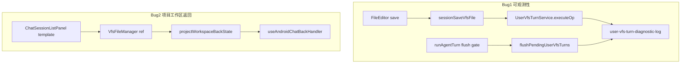

# Mobile 用户操作可观测性与项目工作区返回 技术规格（SPEC）

> 需求：[prd.md](./prd.md)  
> 前置：`vfs-user-ops-unified-tool-turn/spec.md`（user ops 两阶段语义）、`import-export-navigation-fix/spec.md`（聊天工作区 goUp 桥接模式）

## 设计目标

在 **最小改动面** 内交付 PRD 两项能力：

| # | PRD 能力 | 设计要点 |
|---|----------|----------|
| 1 | user ops（edit）可诊断日志 | Core 统一 `[user-vfs-turn]` 结构化日志；`__DEV__` 或 `NM_USER_VFS_DIAG_LOG=1` 启用；**不改变** save / pending / flush 语义 |
| 2 | 「项目工作区」目录级返回 | 复用 `VfsFileManager` ref + `useAndroidChatBackHandler` 桥接；与「聊天工作区」同模式，**独立 state** 避免与 conversation 污染 |

**不在本 SPEC**：user ops 行为修复、顶栏 ← 统一、iOS 手势、Desktop 专项日志 UI。

---

## 总体方案



### 1. user ops 诊断日志

#### 现状

| 环节 | 位置 | 缺口 |
|------|------|------|
| 保存映射 | `buildUserVfsSaveOp` / `mapUserSaveToToolUses` | 无 noop/edit/write 可观测输出 |
| execute | `DefaultUserVfsTurnService.executeOp` | 失败有 toast，无结构化 pending 长度 |
| flush 门控 | `runAgentTurn` L195–201 | flag off / `userVfsTurn==null` 静默跳过 |
| flush | `flushPendingUserVfsTurns` | pending 非空但 net diff 空时静默清 pending |

Mobile 已有 `[cloud-sync]`、`[novel-master/agent-run]` 等 `__DEV__` + `console.warn` 模式（`cloud-sync-progress-log.ts`、`agent-run.service.ts`）。

#### 方案

**A. Core 新增诊断模块** `packages/core/src/infra/diagnostic/user-vfs-turn-diagnostic-log.ts`

| 导出 | 职责 |
|------|------|
| `USER_VFS_TURN_LOG_TAG` | 固定 `'[user-vfs-turn]'` |
| `isUserVfsTurnDiagnosticLogEnabled()` | `process.env.NM_USER_VFS_DIAG_LOG === '1'` **或** 全局 `__DEV__ === true` |
| `userVfsTurnDiagnosticLog(event, detail?)` | `console.warn(TAG, event, detail)`；未启用时 no-op |
| `summarizeUserVfsSaveMapping(mapped)` | `{ kind, path?, hunkCount?, writeReason? }` — 不含正文 |
| `summarizeWorkspaceFlushDiff(diff)` | 仅 path 列表与计数，**不输出** file content |

**启用规则**

- Debug 包（Metro `__DEV__`）：默认开启。
- Release 包：默认关闭；设置 `NM_USER_VFS_DIAG_LOG=1` 可强制开启（供 adb 复现）。
- **禁止**记录：文件全文、old/new hunk 字符串、API Key；仅 path、长度、hunk 数、计数。

**B. 埋点位置与事件名**

| 事件 | 触发点 | detail 字段（示例） |
|------|--------|---------------------|
| `save_map` | Mobile `sessionSaveVfsFile`（`buildUserVfsSaveOp` 前调用 `mapUserSaveToToolUses` 一次专用于日志） | `sessionId`, `path`, `kind`, `hunkCount`, `writeReason`, `baselineLen`, `contentLen` |
| `save_skip_noop` | `sessionSaveVfsFile` 当 `op == null` | `sessionId`, `path` |
| `execute_start` | `executeOp` 入口 | `sessionId`, `toolNames[]`, `path`（从 actionXml attrs 或首 tool input 解析） |
| `execute_ok` | `executeOp` 成功写 pending 后 | `sessionId`, `pendingCount` |
| `execute_fail` | `executeOp` 失败返回 | `sessionId`, `errorName`, `partialFailure?` |
| `flush_gate_skip` | `runAgentTurn` 未进入 flush | `sessionId`, `reason`: `flag_off` \| `no_service` |
| `flush_start` | `flushPendingUserVfsTurns` pending 非空 | `sessionId`, `pendingCount` |
| `flush_skip_no_pending` | pending 空 | `sessionId` |
| `flush_diff` | diff 计算后 | `sessionId`, `...summarizeWorkspaceFlushDiff`, `actionsXmlEmpty` |
| `flush_skip_empty_diff` | net diff 空，清 pending | `sessionId`, `pendingCount` |
| `flush_ok` | 写入 UA + capture | `sessionId`, `flushed: true` |
| `flush_fail` | flush 抛错（含 capture 失败） | `sessionId`, `errorName` |

**C. Mobile 薄封装（可选）** `apps/mobile/src/services/user-vfs-turn-diagnostic-log.ts`

- Re-export Core 函数 + 一行注释：`npx react-native log-android | findstr user-vfs-turn`
- `FileEditorScreen.handleSave` 在 session+flag 分支入口打 `save_attempt`（`path`, `scopeKind`, `isDirty`）

> **注意**：`sessionSaveVfsFile` 为记录 `save_map` 会 **额外调用一次** `mapUserSaveToToolUses`（仅日志 enabled 时），与 `buildUserVfsSaveOp` 内映射重复但纯函数、可接受；**不**改为共用返回值以免影响本期「零行为变更」审查面。

### 2. 「项目工作区」系统返回

#### 现状

```134:137:apps/mobile/src/hooks/useAndroidChatBackHandler.ts
    if (sessionListPanel === 'template') {
      showSessionsPanel();
      return true;
    }
```

`ChatSessionListPanel` 中 project `VfsFileManager` **未**挂 `ref` / `onDirectoryChange`（L139–147）。  
「聊天工作区」已在 `ChatConversationPanel` + `ChatTabScreen.workspaceBackState` 完成桥接（`import-export-navigation-fix` Phase 4）。

#### 方案

**独立 state**（避免 conversation 卸载后 stale `workspaceBackState` 误用于 template）：

1. **`ChatTabScreen`**
   - `projectWorkspaceVfsRef = useRef<VfsFileManagerHandle>(null)`
   - `projectWorkspaceBackState` + `setProjectWorkspaceBackState`（结构与 conversation 相同）
   - 传入 `ChatSessionListPanel`；注册 hook 时增加 `projectWorkspaceCanGoUp` / `projectWorkspaceGoUp`

2. **`ChatSessionListPanel`**
   - 新增 props：`projectWorkspaceVfsRef`, `onProjectWorkspaceBackStateChange`
   - 复制 `ChatConversationPanel.emitWorkspaceBackState` 模式：
     - 当 `visible && sessionListPanel === 'template'` 且 ref 就绪 → 上报 `{ canGoUp, goUp }`
     - 否则 → `null`
   - project `VfsFileManager`：`ref={projectWorkspaceVfsRef}`，`onDirectoryChange={emitProjectWorkspaceBackState}`

3. **`useAndroidChatBackHandler`**
   - `AndroidChatBackState` 扩展：
     ```typescript
     projectWorkspaceCanGoUp?: boolean;
     projectWorkspaceGoUp?: () => void;
     ```
   - `sessionListPanel === 'template'` 分支改为：
     ```typescript
     if (sessionListPanel === 'template') {
       if (projectWorkspaceCanGoUp && projectWorkspaceGoUp) {
         projectWorkspaceGoUp();
         return true;
       }
       showSessionsPanel();
       return true;
     }
     ```
   - overlay 优先级（`projectDrawerOpen`、`sessionBatchActive`）**不变**，仍先于 template 目录逻辑。

4. **conversation 工作区**：继续使用现有 `workspaceCanGoUp` / `workspaceGoUp`，**不修改**分支逻辑。

---

## 最终项目结构

```
packages/core/src/
  infra/diagnostic/
    user-vfs-turn-diagnostic-log.ts    # 新增
  service/chat/impl/
    user-vfs-turn.service.ts           # 改：execute/flush 埋点
  service/agent/logic/
    run-agent-turn.ts                  # 改：flush_gate_skip

packages/core/test/
  diagnostic/user-vfs-turn-diagnostic-log.test.ts   # 新增

packages/core/src/public/chat.ts       # 改：export 诊断 API（可选，或仅 internal import）

apps/mobile/src/
  services/
    vfs-operations.service.ts          # 改：save_map / save_skip_noop
    user-vfs-turn-diagnostic-log.ts    # 新增（re-export + 注释）
  screens/stack/
    FileEditorScreen.tsx               # 改：save_attempt
  screens/tabs/
    ChatTabScreen.tsx                  # 改：project ref/state + hook 接线
  screens/tabs/chat-tab/
    ChatSessionListPanel.tsx           # 改：ref + emit back state
  hooks/
    useAndroidChatBackHandler.ts       # 改：template goUp 分支

apps/mobile/__tests__/
  use-android-chat-back-handler.test.ts   # 改：T-B5 拆分 + 新增 T-B5c/d

.apm/kb/docs/Iterations/mobile-user-ops-logging-project-workspace-back/
  prd.md
  spec.md
  diagnostic-log.md                    # 新增：日志采集说明
```

---

## 变更点清单

| 文件 | 变更 | 说明 |
|------|------|------|
| `packages/core/src/infra/diagnostic/user-vfs-turn-diagnostic-log.ts` | 新增 | 日志 gate + summarize  helpers |
| `packages/core/src/service/chat/impl/user-vfs-turn.service.ts` | 修改 | execute/flush 事件 |
| `packages/core/src/service/agent/logic/run-agent-turn.ts` | 修改 | flush 门控 skip 日志 |
| `packages/core/src/public/chat.ts` | 修改 | export 诊断函数（供 Mobile 复用） |
| `apps/mobile/src/services/vfs-operations.service.ts` | 修改 | save 路径日志 |
| `apps/mobile/src/services/user-vfs-turn-diagnostic-log.ts` | 新增 | re-export |
| `apps/mobile/src/screens/stack/FileEditorScreen.tsx` | 修改 | save_attempt |
| `apps/mobile/src/hooks/useAndroidChatBackHandler.ts` | 修改 | project goUp |
| `apps/mobile/src/screens/tabs/ChatTabScreen.tsx` | 修改 | project state 接线 |
| `apps/mobile/src/screens/tabs/chat-tab/ChatSessionListPanel.tsx` | 修改 | ref + emit |
| `apps/mobile/__tests__/use-android-chat-back-handler.test.ts` | 修改 | template 目录/根分支 |
| `diagnostic-log.md` | 新增 | 手工采集步骤 |

**不改**：`buildUserVfsSaveOp` 语义、`flushPendingUserVfsTurns` 决策、`VfsFileManager` goUp 实现、`ChatConversationPanel` 工作区桥接。

---

## 详细实现步骤

### Phase 1 — Core 诊断模块

1. 实现 `user-vfs-turn-diagnostic-log.ts`（gate、summarize、log 函数）。
2. 单测 `user-vfs-turn-diagnostic-log.test.ts`：
   - 默认（无 env、无 `__DEV__`）→ log 不调用 `console.warn`
   - `NM_USER_VFS_DIAG_LOG=1` → 调用
   - `summarizeWorkspaceFlushDiff` 不含 content 字段

### Phase 2 — Core 埋点

1. `executeOp`：`execute_start` / `execute_ok` / `execute_fail`。
2. `flushPendingUserVfsTurns`：`flush_start`、`flush_skip_no_pending`、`flush_diff`、`flush_skip_empty_diff`、`flush_ok`；catch 路径 `flush_fail`。
3. `runAgentTurn`：flag 或 service 缺失时 `flush_gate_skip`。
4. `public/chat.ts` export 诊断 API。

### Phase 3 — Mobile save 路径日志

1. `user-vfs-turn-diagnostic-log.ts` re-export。
2. `sessionSaveVfsFile`：enabled 时 `mapUserSaveToToolUses` → `save_map`；`op==null` → `save_skip_noop`。
3. `FileEditorScreen`：`save_attempt`（path、scopeKind、isDirty）。

### Phase 4 — 项目工作区返回

1. `ChatSessionListPanel`：props + `emitProjectWorkspaceBackState` + VfsFileManager ref/onDirectoryChange。
2. `ChatTabScreen`：`projectWorkspaceVfsRef`、`projectWorkspaceBackState`、传给 hook 与 panel。
3. `useAndroidChatBackHandler`：template 分支 goUp 优先。
4. 更新测试 T-B5 → 根目录仍 `showSessionsPanel`；新增 T-B5c（`projectWorkspaceCanGoUp: true` → goUp）。

### Phase 5 — 文档与验收

1. 编写 `diagnostic-log.md`（见下节）。
2. `npm run build`；`npm run test -w @novel-master/core`；`npm test -w @novel-master/mobile`（back handler）。
3. Android 手工：项目工作区 `/a/b` 侧滑 → `/a`；根目录 → 「会话」Tab；edit 保存 + 发送 → logcat 可见完整事件链。

---

## 日志采集说明（`diagnostic-log.md` 摘要）

1. 使用 **Debug 构建**（或 Release + `NM_USER_VFS_DIAG_LOG=1`）。
2. 连接设备：`adb logcat | findstr /i "user-vfs-turn"`（Windows）或 `adb logcat | grep user-vfs-turn`。
3. 复现步骤：
   - 进入会话 → FileEditor 打开**已有文件** → 修改 → 保存（观察 `save_map` / `execute_ok`）。
   - **不发送**：确认无 `flush_*`（或仅 gate，取决于是否有历史 pending）。
   - 发送消息：观察 `flush_start` → `flush_diff` → `flush_ok` 或 `flush_skip_empty_diff`。
4. 判定表：

| 日志模式 | 含义 |
|----------|------|
| `save_skip_noop` | 保存被映射为 noop，无 pending |
| `execute_ok` + 无 `flush_*` | 未发送，pending 未 flush |
| `flush_skip_empty_diff` | pending 有值但 checkpoint 净 diff 空 |
| `flush_ok` | UA 已写入，transcript 应有卡片 |

---

## 测试策略

### 自动化

| ID | 层级 | 用例 |
|----|------|------|
| D-1 | core | `isUserVfsTurnDiagnosticLogEnabled` env / `__DEV__` 分支 |
| D-2 | core | `summarizeWorkspaceFlushDiff` 不含正文 |
| D-3 | core | mock `console.warn`，`executeOp` 成功 emit `execute_ok`（log enabled fixture） |
| D-4 | core | `flush_skip_empty_diff` 当 net diff 空（现有 F4 测试 + log 断言可选） |
| T-B5d | mobile | template 根目录 → `showSessionsPanel`，不调 goUp |
| T-B5c | mobile | template 子目录 `projectWorkspaceCanGoUp: true` → goUp，不调 showSessionsPanel |
| T-B1c/d | mobile | 回归 conversation workspace（不变） |

### 手工（Android）

1. **Bug2**：项目工作区进入子目录 → 侧滑 → 上级目录；根目录 → 「会话」Tab；聊天工作区子目录行为不退化。
2. **Bug1**：edit 保存 + 发送 → logcat 五项均可判定；保存未发送 → 无卡片且日志说明 pending 未 flush。

---

## 风险与回滚方案

| 风险 | 缓解 | 回滚 |
|------|------|------|
| Release 包日志泄漏路径 | 默认关；仅 env 强制开；不 log 正文 | 移除 diagnostic 模块 import |
| 双次 `mapUserSaveToToolUses` 性能 | 仅 log enabled 时；save 非热路径 | 去掉 save_map 预映射 |
| project/conversation state 混淆 | 独立 `projectWorkspaceBackState` | revert ChatTabScreen + handler |
| template ref 未就绪 | `canGoUp` 默认 false → 等同现网切 Tab | 与 import-export 风险表一致 |

**功能回滚**：Phase 1–3 与 Phase 4 可独立 revert；无 schema migration。

---

## 兼容性与迁移说明

- user ops 落库、pending、flush、transcript **零迁移**。
- 新增 env `NM_USER_VFS_DIAG_LOG` 可选，不影响现网默认行为。
- Bug2 仅改变 `sessionListPanel === 'template'` 下 Android 返回语义；与 `import-export-navigation-fix` 中聊天工作区设计对齐。
