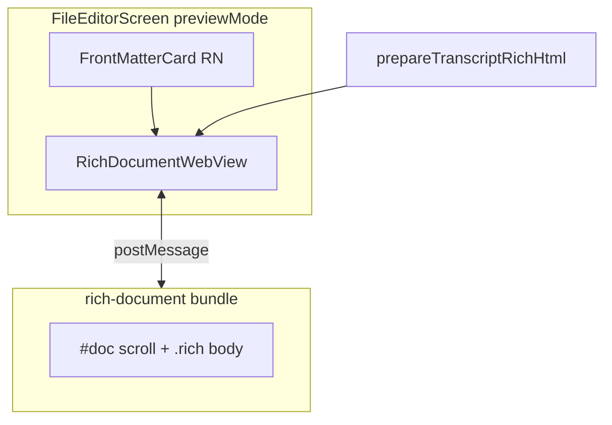

# Mobile 工作区 Markdown 预览（WebView 引擎）技术规格（SPEC）

> **PRD**：[prd.md](./prd.md)  
> **平台**：Android + iOS  
> **分支建议**：`feature/mobile-vfs-markdown-webview`（从 `main` 拉出）  
> **关联迭代**：[mobile-webview-chat-transcript/spec.md](../mobile-webview-chat-transcript/spec.md)

---

## 设计目标

1. **预览正文单 WebView**：`.md` 预览正文用浏览器排版；Front Matter 保留 RN。
2. **复用富文本管线**：Markdown → `prepareTranscriptRichHtml` → sanitize → Web `innerHTML`（与聊天一致）。
3. **共享 CSS**：从 `transcript-html.ts` 抽出 rich 样式，聊天 transcript 与文档预览共用。
4. **轻量桥**：无 scroll/stream/menu；仅 `init` / `setDocument` / `ready` / 可选 `themeUpdate`。
5. **可回滚**：KKV `vfsMarkdownPreviewEngine` 默认 `webview`，可切 `rn`。

---

## 现状（代码探索）

| 模块 | 路径 | 现状 |
|------|------|------|
| 文件编辑器 | `apps/mobile/src/screens/stack/FileEditorScreen.tsx` | 预览：`ScrollView` + `FileMarkdownPreview` |
| MD 预览 | `apps/mobile/src/components/vfs/FileMarkdownPreview.tsx` | FM：RN 卡片；正文：`RichContentBody` variant `file-preview` |
| RN 富文本 | `apps/mobile/src/components/rich-content/RichContentBody.tsx` | `react-native-render-html` + `prepareRichHtml` |
| Web 聊天富文本 | `apps/mobile/src/components/rich-content/prepare-transcript-rich-html.ts` | `markdown-it` + `sanitizeRichHtml` |
| Web 聊天 CSS | `apps/mobile/src/web/chat-transcript/transcript-html.ts` | `.bubble.rich` / list / blockquote 规则 |
| 长度限制 | `apps/mobile/src/components/rich-content/rich-content-limits.ts` | `RICH_CONTENT_MAX_CHARS = 12_000` |
| 聊天 WebView 参考 | `apps/mobile/src/components/chat/ChatTranscriptWebView.tsx` | postMessage 双向、theme 注入 |

**关键约束**

- `FileEditorScreen` 预览需展示 **未保存** `content` state，不能仅 `vfs.read` 磁盘。
- 非 `.md` 路径不走 WebView，保持 RN `Text` monospace。
- 聊天页已占一个 WebView；文件预览为 **另一路由**，生命周期互斥，可接受第二套 bundle。

---

## 总体方案



### 布局（定案）

```text
┌ Toolbar 保存 | 路径 | 预览/编辑 (RN) ─┐
├ Stats 字数/更新时间 (RN) ──────────────┤
├ Front Matter 卡片 (RN, 可选) ────────┤
├ 错误/提示 (RN, FM 未闭合等) ─────────┤
├ RichDocumentWebView (flex:1) ────────┤  ← 仅 Markdown 正文
└ (无嵌套 ScrollView 包 WebView) ──────┘
```

**WHY 去掉外层 ScrollView**：WebView 自带滚动；RN ScrollView 嵌 WebView 会导致高度测量与双滚动条。FM 较短，固定于 WebView 上方 RN `View` 即可。

---

## 最终项目结构

```text
apps/mobile/src/
  web/
    rich-content-styles.ts          # NEW 共享 rich CSS 字符串（从 transcript-html 抽出）
    rich-document/
      document-html.ts            # NEW HTML 模板 + boot IIFE
      main.ts                       # NEW buildRichDocumentBootScript()
  components/
    vfs/
      FileMarkdownPreview.tsx       # MOD 正文 → RichDocumentWebView
      RichDocumentWebView.tsx       # NEW RN wrapper
      RichDocumentBridge.ts         # NEW 桥类型
  storage/
    vfs-markdown-preview-engine.ts  # NEW flag（mirror chat-transcript-engine）
  screens/stack/
    FileEditorScreen.tsx            # MOD 预览区布局（去 ScrollView 或仅包 FM）
```

**MOD** `apps/mobile/src/web/chat-transcript/transcript-html.ts`：import 共享 `rich-content-styles.ts`，删除重复 CSS 块。

---

## RN ↔ Web 桥协议

### 传输

与 chat-transcript 相同：`postMessage` JSON，`v: 1`, `type`, `payload`。

### RN → Web

| type | payload | 说明 |
|------|---------|------|
| `init` | `{ theme }` | WebView `onLoad` 后发送 |
| `setDocument` | `{ mode: 'html' \| 'plain', html?: string, plain?: string, overLimit?: boolean }` | 预览内容更新 |
| `themeUpdate` | `{ theme }` | 主题变化 |

### Web → RN

| type | payload |
|------|---------|
| `ready` | `{ version: 1 }` |
| `log` | dev 可选 |

**无** scrollSnapshot、streamDelta、menu — 刻意保持最小。

---

## 变更点清单

| 文件 | 变更 |
|------|------|
| `rich-content-styles.ts` | 抽出 `.rich` 通用规则（p/ol/ul/li/blockquote/code/pre/a） |
| `transcript-html.ts` | 引用共享 styles |
| `rich-document/main.ts` | IIFE：`setDocument` 写 `#doc` innerHTML 或 textContent；overLimit 显示 hint |
| `RichDocumentWebView.tsx` | WebView + theme + `setDocument` effect on content change |
| `FileMarkdownPreview.tsx` | FM 逻辑不变；`body` → `RichDocumentWebView`；flag 分支 `RichContentBody` |
| `vfs-markdown-preview-engine.ts` | `default: 'webview'`；KKV key `vfsMarkdownPreviewEngine` |
| `FileEditorScreen.tsx` | 预览区：`View flex:1` + FM + RichDocumentWebView；移除包裹全页的 ScrollView |
| `README.md` | 文档 flag 与回滚说明 |

---

## 详细实现步骤

### M0 — 共享样式 + POC

1. 创建 `rich-content-styles.ts`，从 `transcript-html.ts` 迁移 `.bubble.rich` / `.thinking-body.rich` 规则为 **`.rich-doc`**（或 `.rich` 通用类）：
   - 列表 `padding-left: 1.35em`
   - blockquote、code、pre、链接色 CSS 变量
2. 更新 `transcript-html.ts` 引用共享片段（聊天气泡 selector 仍包一层 `.bubble.rich`）。
3. 实现 `rich-document` HTML 模板 + boot script：
   - `#doc.rich` 容器，`overflow-y: auto; height: 100%`
   - `handleHostMessage` 处理 `init` / `setDocument` / `themeUpdate`
4. `RichDocumentWebView`：props `{ html?: string; plain?: string; overLimit?: boolean; tokens }`
5. Flag + 单元测试：`buildRichDocumentBootScript` 含 `setDocument`；`rich-content-styles` 含 list padding。

### M1 — 接入 FileMarkdownPreview

1. `FileMarkdownPreview`：
   - `useMarkdown && split.closed && body` → 若 flag `webview`：`prepareTranscriptRichHtml(body)` + `RichDocumentWebView`
   - overLimit → `mode: 'plain'` + `overLimit: true`
   - flag `rn` → 现有 `RichContentBody`
2. `FileEditorScreen`：预览布局改为 column，WebView `flex:1`。
3. `themeUpdate`：订阅 `useTheme`，内容不变时也推送 theme。

### M2 — 回归与默认

1. 真机 PRD T1–T11。
2. 默认 `webview`；README 更新。
3. 可选：deprecated 注释 on `RichContentBody` file-preview variant（保留至 flag 移除）。

---

## 测试策略

### 单元测试

| ID | 文件 | 断言 |
|----|------|------|
| U1 | `rich-document-boot-script.test.ts` | boot 含 `setDocument`、`MENU` 无 menu |
| U2 | `rich-content-styles.test.ts` | 共享 CSS 含 list padding |
| U3 | `rich-document-bridge.test.ts` | round-trip `setDocument` envelope |
| U4 | `vfs-markdown-preview-engine.test.ts` | 默认 webview；KKV rn  override |
| U5 | `prepare-transcript-rich-html.test.ts` | 已有；sanitize 仍 pass |
| U6 | `FileMarkdownPreview.test.tsx` | mock WebView：webview flag 挂载 RichDocumentWebView |

### 真机（PRD T1–T11）

人工清单写入 PRD；**T2 列表边界**、**T9 长文滚动** 必测。

### 命令

```bash
npm test -w @novel-master/mobile -- --testPathPattern="rich-document|rich-content-styles|vfs-markdown|FileMarkdown"
```

---

## 风险与回滚

| 风险 | 处理 |
|------|------|
| WebView 首次加载慢 | 可接受；仅进入预览时 mount |
| FM + WebView 布局 | FM 固定高度 RN；WebView flex 1 |
| 与聊天 CSS 漂移 | 单文件 `rich-content-styles.ts` |

**回滚**：`vfsMarkdownPreviewEngine='rn'` → `RichContentBody`，无需 reinstall。

---

## 兼容性与迁移

- 不影响 `chatTranscriptEngine`。
- `RichContentBody` 保留；仅 file-preview 主路径切换。
- 无 DB / Core 变更。

---

**请确认本 SPEC**。确认后在 `feature/mobile-vfs-markdown-webview` 按 M0→M2 实施；使用 `/subagent-inline-loop` 时以本目录为唯一事实来源。
