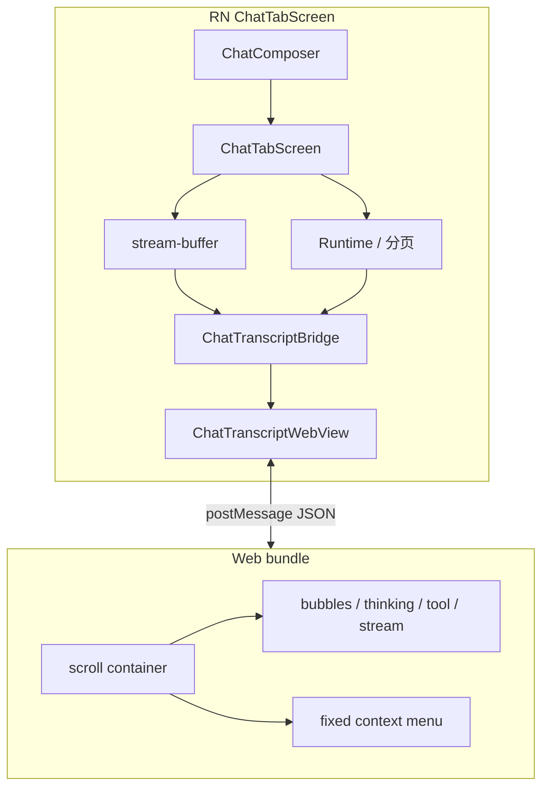

# Mobile 聊天 Transcript（WebView 引擎）技术规格（SPEC）

> **PRD**：[prd.md](./prd.md)  
> **平台**：Android + iOS  
> **分支建议**：`feature/mobile-webview-chat-transcript`（从 `main` 拉出；**不要** 在 `feature/mobile-inverted-chat-list` 上继续开发）  
> **废弃**：[mobile-native-chat-list/spec.md](../mobile-native-chat-list/spec.md)

---

## 设计目标

1. **单 WebView transcript**：一个 `react-native-webview` 占据 `ChatTabScreen` 消息区；DOM 负责滚动、富文本、流式 tail、prepend 锚定。
2. **RN 壳不变**：Composer、Runtime、分页、Agent 流、编辑/回滚 Modal、导航仍在 RN。
3. **桥契约可测**：RN↔Web 消息 JSON schema 固定，Jest 覆盖序列化与 handler；禁止隐式 `postMessage` 字符串。
4. **行为不退化**：对齐 PRD T1–T11；尤其 **T7 长按不跳**。
5. **可回滚**：Feature flag `legacy-rn` 保留至 M4；Web 路径为默认。

---

## 为何废弃 RN 列表路线（记录）

```text
RN FlatList（升序或 inverted）
  + VirtualizedList 回收/重测
  + RenderHTML 异步变高
  + scrollToEnd / MVCP / offset 补丁
  → 多轮仍无法稳定（含 long-press contentHeight 跳变）

WebView transcript
  + 单 scroll container
  + CSS fixed 菜单
  + 浏览器 scroll anchoring / column-reverse
  → 复杂度转移到桥 + Web UI，滚动语义可预测
```

---

## 架构总览



### 布局（定案）

```text
┌ AppHeader (RN) ─────────────────────┐
├ ChatMetaBar / StreamMetrics (RN) ───┤
├ ChatTranscriptWebView (flex:1) ─────┤  ← 仅此块 Web
├ ChatComposer (RN) ──────────────────┤
└ Bottom sheets / Modals (RN) ────────┘
```

---

## RN ↔ Web 桥协议

### 传输

- RN → Web：`webViewRef.injectJavaScript` 或 `postMessage`（Web 侧 `document.addEventListener('message')` / `window.ReactNativeWebView.onMessage`）。
- Web → RN：`window.ReactNativeWebView.postMessage(JSON.stringify(envelope))`。
- 所有消息：**单 JSON 对象**，字段 `v: 1`, `type`, `payload`。

### RN → Web（Host → Transcript）

| type | 用途 | payload 要点 |
|------|------|----------------|
| `init` | WebView load 完成 | `theme`, `flags`（richText, showFullToolParams, batchMode） |
| `sessionSnapshot` | 切换会话 / reload | `sessionKey`, `rows[]`, `hasMore`, `stream` |
| `prependPage` | 加载更早完成 | `rows[]`（仅新增 older 行）, `prependedCount` |
| `streamDelta` | 流式增量 | `kind: 'text' \| 'thinking'`, `delta` |
| `streamReset` | 流结束/中止 | — |
| `messagePatch` | 单条更新（编辑/隐藏） | `messageId`, `patch` |
| `themeUpdate` | 主题切换 | `theme` |
| `flagsUpdate` | 富文本/Batch 开关 | `flags` |

**`rows[]` 形状**（与 `message-blocks` 对齐，seq 升序传入，Web 自行排 DOM）：

```ts
type TranscriptRow =
  | { kind: 'message'; id: string; role: 'user' | 'assistant'; hidden: boolean; text: string; thinking: string }
  | { kind: 'tool'; toolUseId: string; name: string; input: Record<string, unknown>; status: string; resultContent?: string }
  | { kind: 'stream'; text: string; thinking: string };
```

RN 侧由 **`buildTranscriptRows(messages, streamState)`** 生成（可包装现有 `buildChatListItems`，**不要求** inverted/reverse）。

### Web → RN（Transcript → Host）

| type | 用途 | payload 要点 |
|------|------|----------------|
| `ready` | DOM 就绪 | `version` |
| `scrollSnapshot` | 节流上报 | `schemaVersion: 2`, `offsetY`, `nearBottom`, `scrollHeight`, `clientHeight` |
| `loadOlder` | 用户滚到顶 / 点击加载更早 | — |
| `openMessageMenu` | 长按 | `messageId`, `pageX`, `pageY`（**手指坐标**，禁止 Web 内 measure 列表 cell 高度） |
| `openToolFile` | Tool 卡片点文件 | `path` |
| `toggleMessageSelect` | Batch | `messageId` |
| `log` | 可选 dev | `level`, `message`, `fields` |

### 长按菜单（定案）

- **V1 推荐**：Web 内 `position: fixed` 菜单（复制/编辑/回滚等 action 仍 **`postMessage` 到 RN** 执行，因需 Runtime/Modal）。  
- **禁止**：长按时用 RN Modal 触发 FlatList/WebView **resize** 或 **scrollToOffset 补丁**。  
- RN 侧 `MessageEditModal` / rollback 等 **保持现有实现**；仅入口从 `MessageList` 改为 bridge 事件。

---

## Web 内滚动语义

### 贴底 / nearBottom

- `nearBottom`：`scrollHeight - scrollTop - clientHeight <= 80`（常规 DOM，**非** inverted FlatList）。  
- 打开会话无缓存：`scrollTop = scrollHeight`（或 `column-reverse` 容器 `scrollTop = 0`），**不** 依赖 RN `scrollToEnd`。

### 流式跟随

- `nearBottom === true` 时，stream tail 更新后 Web 内 **`scrollIntoView` / scrollTop 贴底**（rAF 节流，≤ 1 次/帧）。  
- RN **不** 对 WebView 调 native scroll API。

### prepend 稳定

- 记录 `prependedScrollHeight` 与 `prependedScrollTop`；prepend 后：  
  `scrollTop += scrollHeight - prependedScrollHeight`  
  或使用 CSS **`overflow-anchor: auto`**（Chrome/WebView 支持度需在 M2 真机验证，不通过则用算术锚定）。

### 快照 schema v2

```ts
export const CHAT_TRANSCRIPT_SCROLL_SCHEMA_VERSION = 2 as const;

export type ChatTranscriptScrollSnapshot = {
  readonly schemaVersion: typeof CHAT_TRANSCRIPT_SCROLL_SCHEMA_VERSION;
  /** Distance from visual bottom, px (DOM semantics). */
  readonly offsetY: number;
  readonly nearBottom: boolean;
};
```

- v1（inverted RN）读取时 **丢弃**，`emit` `legacy_cache_discarded`。  
- 存储仍用 `chat-list-scroll-cache.ts`（可重命名为 `chat-transcript-scroll-cache.ts`，或同文件兼容 v2）。

---

## 富文本

- Web 内：**markdown-it**（`html: true`）+ **DOMPurify**（或等价）→ `innerHTML` / patch DOM。  
- 规则对齐 `apps/mobile/src/components/rich-content/prepare-rich-html.ts`（测试向量可共享 fixture）。  
- User 气泡：plain text（与现网一致）。  
- Stream tail：plain text；thinking 块在 rich 开启时可用简化 MD。  
- **禁止** 在 Web transcript 再嵌套 RN `RenderHTML`。

---

## 项目结构（目标）

```text
apps/mobile/
  package.json                    # + react-native-webview
  src/
    components/chat/
      ChatTranscriptWebView.tsx   # RN wrapper
      ChatTranscriptBridge.ts     # 类型 + encode/decode + handlers
      message-blocks.ts           # 保留；+ buildTranscriptRows（可选）
      MessageList.tsx             # M4 删除或 @deprecated legacy-only
    web/chat-transcript/
      index.html                  # 或 TS 入口生成
      main.ts                     # boot, message router
      scroll.ts                   # nearBottom, prepend anchor, stick bottom
      render/                     # row renderers
      menu.ts                     # fixed context menu
      theme.css                   # CSS variables from init.theme
    services/
      chat-transcript-scroll-cache.ts  # v2（或扩展 scroll-cache）
      chat-transcript-telemetry.ts
    screens/tabs/
      ChatTabScreen.tsx           # 替换 MessageList → ChatTranscriptWebView
  __tests__/
    chat-transcript-bridge.test.ts
    chat-transcript-scroll.test.ts
    build-transcript-rows.test.ts
```

### Metro / 资产加载

- **定案**：Web 源码编译为 **单文件 HTML string**（`metro` + `raw-loader` 或 build script `npm run mobile:web-transcript:bundle`）注入 WebView `source={{ html, baseUrl }}`。  
- `baseUrl` 设 `https://novel-master.local/` 避免相对路径问题。  
- 实现阶段若 inline 过大，可改 `source={{ uri: 'file:///android_asset/...' }}`（Android asset / iOS bundle），SPEC 实施时二选一并写入 README。

---

## Feature flag

```ts
/** KKV or __DEV__ override; default 'webview' after M1. */
export type ChatTranscriptEngine = 'legacy-rn' | 'webview';
```

- `ChatTabScreen`：`engine === 'webview' ? ChatTranscriptWebView : MessageList`。  
- M4 移除 `legacy-rn` 与 inverted 专用代码路径。

---

## 变更点清单（相对 main）

| 区域 | 改动 |
|------|------|
| 依赖 | `react-native-webview` |
| 新增 | `ChatTranscriptWebView`, `ChatTranscriptBridge`, `web/chat-transcript/*` |
| 修改 | `ChatTabScreen` 接线 stream/prepend/menu/scroll |
| 修改 | scroll cache schema v2 |
| 可选保留 | `message-blocks.ts`, `stream-buffer.service.ts` |
| 废弃 | `MessageList` inverted 主路径、`chat-list-telemetry` 中 FlatList 专用事件（或 adapter） |
| **不 merge** | `feature/mobile-inverted-chat-list` 上的 offset pin / scroll lock / MessageMenuOverlay 实验 |

---

## 实现步骤

### M0 — 桥 POC

1. 安装 `react-native-webview`；空 WebView 加载 `index.html`，`ready` 握手。  
2. `sessionSnapshot`：仅 `message` 行 plain text；`streamDelta` 更新 tail。  
3. 贴底/沉底；`scrollSnapshot` 上报。  
4. `ChatTabScreen` feature flag 切换。  
5. 单测：`ChatTranscriptBridge` round-trip。

**验证**：T1/T2/T3（plain text only）。

### M1 — 行类型齐全

1. Thinking / Tool / hidden / 空状态 DOM。  
2. `loadOlder` → RN `prependOlderMessages` → `prependPage`。  
3. prepend 算术锚定（或 overflow-anchor）。  
4. `buildTranscriptRows` 单测对齐 `buildChatListItems` 视觉顺序。

**验证**：T5 + Tool 卡片可点。

### M2 — 富文本 + 快照 v2

1. Web 内 rich pipeline；`flagsUpdate.richText`。  
2. schema v2 读写；T6 工作区切换恢复。  
3. Telemetry：`list_mount` 等价 → `transcript_ready`, `scroll_restore`, `prepend_detected`。

**验证**：T6/T8 富文本与 Thinking。

### M3 — 长按 + Batch + 主题

1. Web fixed menu；`openMessageMenu` → RN 现有 edit/rollback/copy。  
2. Batch checkbox 与 `toggleMessageSelect`。  
3. `themeUpdate` CSS variables。  

**验证**：**T7 必过**（录屏 + log 无 scrollHeight 突变 > 40px）。

### M4 — 清理与回归

1. 默认 engine=webview；删除或隔离 legacy `MessageList`。  
2. 全量 PRD T1–T11；双端真机。  
3. README 补充 WebView transcript 说明。

---

## 测试策略

### 单元测试（Jest）

| ID | 文件 | 用例 |
|----|------|------|
| U1 | `chat-transcript-bridge.test.ts` | RN→Web `sessionSnapshot` JSON schema |
| U2 | 同上 | Web→RN `scrollSnapshot` v2 解析 |
| U3 | `build-transcript-rows.test.ts` | message+tool 顺序与 legacy 视觉一致 |
| U4 | `chat-transcript-scroll.test.ts` | prepend 锚定算术（纯函数） |
| U5 | `chat-transcript-scroll-cache.test.ts` | v1 拒绝、v2 接受 |
| U6 | Web `scroll.test.ts`（node/jsdom） | nearBottom 计算 |

### 手工验收

PRD T1–T11；**T7** 为 merge 阻塞项。

### 构建

```bash
npm test -w @novel-master/mobile -- --testPathPattern="chat-transcript|build-transcript"
npm run build -w @novel-master/mobile
```

---

## 风险与回滚

| 风险 | 缓解 | 回滚 |
|------|------|------|
| WebView 长按仍跳 | fixed menu + 禁止 RN layout 联动；测 scrollHeight | 查 Web 内 remount |
| 超长会话卡顿 | M2+ 虚拟列表或限制 DOM 节点 + prepend 卸载远端 | 减 PAGE_SIZE |
| Bridge 流式卡顿 | rAF 合并 delta；阈值 4KB 与 stream-buffer 一致 | 加大 flush 间隔 |
| 键盘遮挡 | RN `KeyboardAvoidingView` 仅包 Composer；WebView flex 缩小 | 调 layout |
| 双栈维护 | 桥类型单文件真相；CR 必跑 bridge 单测 | flag → legacy-rn |

**回滚**：`chatTranscriptEngine='legacy-rn'` 回到 **main 上未 inverted 的 MessageList**（或 tag 点）；勿回滚到 inverted 分支。

---

## 与 PRD 完成矩阵

| PRD 目标 | SPEC 落点 |
|----------|-----------|
| 贴底/沉底 | Web scroll.ts + M0 |
| 流式 | streamDelta + nearBottom gate M0 |
| prepend | prependPage + 锚定 M1 |
| 长按不跳 | Web fixed menu M3 |
| 行为不退化 | M1–M3 行渲染 + M4 回归 |
| 可回滚 | Feature flag § |
| 废弃 inverted | 不 merge inverted 分支 |

---

**请确认本 SPEC**。确认后在 `feature/mobile-webview-chat-transcript` 按 M0→M4 实施；使用 `/subagent-inline-loop` 时以本目录为唯一事实来源。
