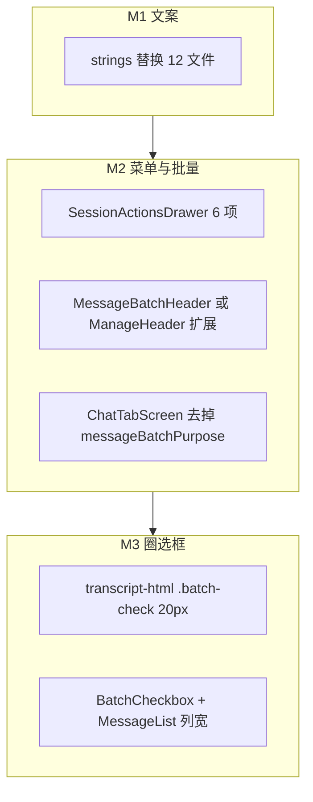

# Mobile 工作区命名统一与会话菜单精简 技术规格（SPEC）

> **PRD**：[prd.md](./prd.md)  
> **平台**：Android + iOS（`apps/mobile`）  
> **分支建议**：`feature/mobile-workspace-rename-menu`（从 `main` 拉出）  
> **性质**：用户可见文案 + 会话批量 UI 重组 + 多选圈选框尺寸；无 Core / DB / 路由变更。

---

## 设计目标

1. **三级工作区命名统一**：全局 / 项目 / 聊天工作区，用户可见字符串一次替换完毕。
2. **会话抽屉精简**：8 项操作 → 6 项；批量入口合并为「批量操作」。
3. **批量三按钮**：进入多选后顶栏并列删除 / 隐藏 / 恢复，移除 `messageBatchPurpose` 单入口模式。
4. **圈选框缩小**：WebView `.batch-check` 与 RN `BatchCheckbox` 视觉对齐缩小，整行仍可点选。
5. **零行为变更**：压缩、重命名、查看提示词、messages.delete/hide/show 语义不变。

---

## 现状（代码探索）

### 文案触点（`rg` 结果，用户可见）

| 现文案 | 文件 |
|--------|------|
| 全局模板 | `ProfileTabScreen.tsx` L61、`header-config.ts` L28、`GlobalTemplateScreen.tsx` hint L36 |
| 项目模板 | `ChatTabScreen.tsx` L1457、`AppHeader.tsx` L41 |
| 会话工作区 | `ChatTabScreen.tsx` L1172/L1337、`ToolCallCard.tsx` L75、`main.ts` L200、`RealPromptScreen.tsx` L82 |
| 会话菜单 | `SessionActionsDrawer.tsx` L79–86 |
| 压缩会话 | `SessionActionsDrawer.tsx` L83、`ChatTabScreen.tsx` L931 Alert |
| 真实提示词 | `SessionActionsDrawer.tsx` L82、`header-config.ts` L20 |
| 模板覆盖确认 | `TemplatePullButton.tsx` L22/L24 |

### 会话批量状态机（`ChatTabScreen.tsx`）

```text
SessionActionsDrawer
  onBatchDelete/Hide/Unhide → enterMessageBatch(purpose)
       ↓
messageBatchPurpose: 'delete' | 'hide' | 'unhide' | null
messageBatch (useBatchSelection)
       ↓
ManageHeader batchMode — 单一 primaryActionLabel + hint 随 purpose 变化
       ↓
ChatTranscriptWebView / MessageList — batchMode + selectedMessageIds
```

- `enterMessageBatch`：Agent 运行中 Toast 拦截（L798）。
- 确认函数：`confirmMessageBatchDelete` / `confirmBatchHideMessages` / `confirmBatchUnhideMessages`（L841+）— **可复用**，仅改触发入口。
- `exitMessageBatch` 清除 purpose + selection（L791）。

### 多选圈选框尺寸（现网）

| 路径 | 实现 | 现尺寸 |
|------|------|--------|
| WebView（默认） | `transcript-html.ts` `.batch-check` | 28×28px，`border-radius: 14px`，`margin-top: 8px`，`font-size: 14px` |
| legacy RN | `BatchCheckbox.tsx` | 22×22 方框，`borderWidth: 2`，`marginRight: 10` |
| legacy RN 列 | `MessageList.tsx` `batchCheckboxCol` | `width: 36`，`paddingTop: 10` |

WebView `main.ts` L371–374：`batch-row` 整行 `data-action="toggle-select"`，热区已覆盖整行。

### `ManageHeader` 约束

- 批量模式仅支持 **右侧单一** `primaryActionLabel`（L43–61）。
- 其他消费者（`ProjectDrawer`、`AgentList`、`ProvidersScreen` 等）仍用单删除按钮 — **不得破坏**。

### 测试现状

- `chat-tab-screen.integration.test.tsx` / `legacy-scroll.test.tsx`：mock `SessionActionsDrawer`、`ManageHeader`。
- `chat-transcript-rich-styles.test.ts`：断言 `CHAT_TRANSCRIPT_HTML` CSS 片段。
- **无** 文案快照测试；本迭代新增 CSS 尺寸断言 + 可选 `ManageHeader` 单测。

---

## 总体方案



### 批量顶栏布局（定案）

```text
┌──────────────────────────────────────────────────────┐
│ 取消    已选 N 项          删除  隐藏  恢复           │
│ 选择要操作的消息（hint，可选）                        │
└──────────────────────────────────────────────────────┘
```

- 三操作按钮 `selectedCount === 0` 时 `textTertiary` 且 `disabled`。
- 删除用 `tokens.danger`；隐藏 / 恢复用 `tokens.primary`。
- **移除** `messageBatchPurpose`；hint 固定为「选择要操作的消息」。

### 圈选框目标尺寸（定案）

| 路径 | 目标 |
|------|------|
| WebView `.batch-check` | **20×20px**，`border-radius: 10px`，`border-width: 1.5px`，`font-size: 11px`，`margin-top: 6px`；`.batch-row` `gap: 6px` |
| RN `BatchCheckbox` | **18×18px**，`borderWidth: 1.5`，`borderRadius: 4`，`fontSize: 11`，`marginRight: 8` |
| RN `batchCheckboxCol` | `width: 28`，`paddingTop: 8` |

热区：WebView 保持整行 `toggle-select`；RN `BatchCheckbox` `hitSlop={8}` 不变。

---

## 最终项目结构

```text
apps/mobile/src/
  components/
    batch/
      ManageHeader.tsx              # MOD 可选 batchActions；或
      MessageBatchHeader.tsx        # NEW（推荐：仅 ChatTab 消息批量）
      BatchCheckbox.tsx             # MOD 缩小尺寸
    chrome/
      SessionActionsDrawer.tsx      # MOD 6 项 + 单批量回调
      AppHeader.tsx                 # MOD 文案
    chat/
      ToolCallCard.tsx              # MOD hint
      MessageList.tsx               # MOD batchCheckboxCol
    template/
      TemplatePullButton.tsx        # MOD 确认文案
  navigation/
    header-config.ts                # MOD 标题
  screens/
    stack/
      GlobalTemplateScreen.tsx      # MOD hint
      RealPromptScreen.tsx          # MOD 说明文案
    tabs/
      ChatTabScreen.tsx             # MOD 文案 + 批量顶栏 + 抽屉接线
      ProfileTabScreen.tsx          # MOD 入口标签
  web/chat-transcript/
    transcript-html.ts              # MOD .batch-check / .batch-row
    main.ts                         # MOD tool hint 文案
```

---

## 变更点清单

| 文件 | 变更 |
|------|------|
| `ProfileTabScreen.tsx` | `全局模板` → `全局工作区` |
| `header-config.ts` | `GlobalTemplate` title、`RealPrompt` title |
| `GlobalTemplateScreen.tsx` | hint「模板」→「工作区」 |
| `AppHeader.tsx` | `项目模板` → `项目工作区` |
| `ChatTabScreen.tsx` | Tab 文案；压缩 Alert；`MessageBatchHeader`；去掉 `messageBatchPurpose`；`enterMessageBatch()` 无参 |
| `SessionActionsDrawer.tsx` | 菜单 6 项；props 合并为 `onBatchMessages` |
| `TemplatePullButton.tsx` | 三处确认框工作区措辞 |
| `RealPromptScreen.tsx` | `会话工作区` → `聊天工作区` |
| `ToolCallCard.tsx` | hint 后缀 |
| `main.ts` | Web tool hint |
| `transcript-html.ts` | `.batch-check` / `.batch-row` 尺寸 |
| `BatchCheckbox.tsx` | 缩小方框 |
| `MessageList.tsx` | `batchCheckboxCol` 宽度 |
| `MessageBatchHeader.tsx` | **NEW** 三按钮顶栏（推荐，避免污染 ManageHeader 其他场景） |
| `__tests__/chat-transcript-rich-styles.test.ts` | 断言 `.batch-check` 20px |
| `__tests__/message-batch-header.test.tsx` | **NEW** 三按钮 disabled/enabled |
| `__tests__/session-actions-drawer.test.tsx` | **NEW** 可选：菜单项标签 |

---

## 详细实现步骤

### M0 — 分支与基线

1. `git checkout main && git pull`
2. `git checkout -b feature/mobile-workspace-rename-menu`
3. `rg` 全量扫描确认无遗漏（T6 清单）；提交 PRD（若未在 main）。

### M1 — 文案替换（单提交）

按 PRD §A/E 逐文件替换用户可见字符串。**不改** 路由名、`SessionListPanel` 枚举值 `template`、注释中的 historical「template」若仅开发者可见可保留。

`GlobalTemplateScreen` hint 建议：

```text
全应用共享；项目可通过「从上级同步」拉取此处工作区内容。
```

`TemplatePullButton`：

```text
将从全局工作区覆盖当前项目工作区，本地修改将丢失。确定继续？
将从项目工作区覆盖当前聊天工作区，本地修改将丢失。确定继续？
```

压缩 Alert（`ChatTabScreen`）：标题 `压缩上下文`；正文可改为「将按照事件配置压缩上下文。是否继续？」（可选）。

### M2 — 会话抽屉 + 批量三按钮

**`SessionActionsDrawer`**

- `items` 数组改为 6 项（见 PRD T7）。
- Props：删除 `onBatchDeleteMessages` / `onBatchHideMessages` / `onBatchUnhideMessages`；新增 `onBatchMessages?: () => void`。
- 模块头注释补充：抽屉仅负责展示与回调，批量语义由 `ChatTabScreen` 承担。

**`MessageBatchHeader`（新建，推荐）**

```typescript
type Props = {
  selectedCount: number;
  onCancel: () => void;
  onDelete: () => void;
  onHide: () => void;
  onRestore: () => void;  // user label「恢复」
};
```

- 顶栏一行三按钮；`selectedCount === 0` 时三按钮 disabled。
- `ChatTabScreen` 在 `messageBatch.active` 时渲染 `MessageBatchHeader`，**替换** 原 `ManageHeader` 消息批量块（L1187–1218）。

**`ChatTabScreen` 状态简化**

- 删除 `MessageBatchPurpose` 类型与 `messageBatchPurpose` state。
- `enterMessageBatch()` 无参：仅 `messageBatch.enter()` + agent 守卫。
- `exitMessageBatch` 不再 `setMessageBatchPurpose`。
- `SessionActionsDrawer`：`onBatchMessages={() => { close drawer; enterMessageBatch(); }}`
- 三按钮分别接 `confirmMessageBatchDelete` / `confirmBatchHideMessages` / `confirmBatchUnhideMessages`。
- 确认框「取消隐藏」按钮文案可改为「恢复」与顶栏一致（Alert 内按钮，非 must）。

### M3 — 圈选框尺寸

**`transcript-html.ts`**

- 按「圈选框目标尺寸」表更新 CSS。
- 注释说明：视觉缩小、点击依赖 `.batch-row` 整行。

**`BatchCheckbox.tsx` + `MessageList.tsx`**

- 同步缩小；`BatchCheckbox` 顶注释注明与 WebView 20px 圆视觉对齐（RN 用 18px 方框）。

### M4 — 测试与文档

1. `chat-transcript-rich-styles.test.ts`：增加 `width: 20px` / `height: 20px` 断言。
2. `message-batch-header.test.tsx`：selectedCount 0/1 时按钮 enabled 状态。
3. 跑 mobile 相关测试 + 根 `npm run build`。
4. 可选：`apps/mobile/README.md` 一句术语说明（非 must）。

---

## 测试策略

### 单元 / 组件测试

| ID | 文件 | 断言 |
|----|------|------|
| U1 | `chat-transcript-rich-styles.test.ts` | `CHAT_TRANSCRIPT_HTML` 含 `.batch-check` 且 `20px` |
| U2 | `message-batch-header.test.tsx` | `selectedCount=0` 时三操作 `disabled`；`=2` 时可 press |
| U3 | `chat-transcript-boot-script.test.ts` | 回归：`batch-row` / `toggle-select` 仍存在 |
| U4 | `chat-transcript-bridge.test.ts` | 回归：`batchMode` / `selectionUpdate` 不变 |

### 真机 / 手工（映射 PRD T1–T18）

| PRD | 验证方式 |
|-----|----------|
| T1–T6 | 目视 + `rg` 清零（apps/mobile 用户字符串） |
| T7–T10 | 会话抽屉与导航 |
| T11–T15 | 批量三按钮 + 确认流 |
| T16–T17 | 圈选框比例（WebView 默认 + legacy-rn KKV） |
| T18 | Tab 切换、流式、勾选回归 |

### 命令

```bash
npm test -w @novel-master/mobile -- --testPathPattern="chat-transcript|message-batch|session-actions"
npm run build
```

---

## 风险与回滚

| 风险 | 处理 |
|------|------|
| 三按钮顶栏窄屏溢出 | `flexShrink` + `fontSize: 13`；真机 T11 必测 |
| 漏改文案 | M1 末尾 `rg` gate；T6 |
| `ManageHeader` 误改破坏 VFS/Agent 批量 | 使用独立 `MessageBatchHeader`，不动 `ManageHeader` |
| 圈选框太小难点 | 整行可点；RN `hitSlop` 保留 |

**回滚**：revert 分支；无数据迁移、无 flag。

---

## 兼容性与迁移

- `chatTranscriptEngine`、消息 API、VFS scope 不变。
- `SessionActionsDrawer` props 为 **breaking**（仅 `ChatTabScreen` 消费）— 单 callsite 同步改。
- 内部类型 `SessionListPanel = 'template'` 保留（非用户可见）。

---

**请确认本 SPEC**。确认后在 `feature/mobile-workspace-rename-menu` 使用 `/subagent-inline-loop` 按 M0→M4 实施；以本目录 `spec.md` 为唯一事实来源。
