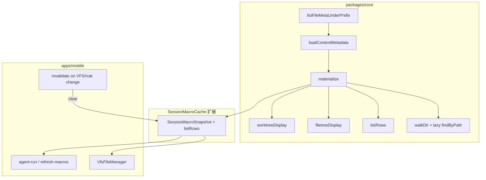

# Mobile 会话工作区与 Worktree 性能 技术规格（SPEC）

> **PRD**：[prd.md](./prd.md)  
> **范围**：Core 能力 + Mobile 会话工作区验收；CLI 随 Core 行为变更自动受益，不单独列验收。  
> **非目标**：VFS 正文 zip 压缩、external 大文件、聊天消息列表性能。

## 设计目标

1. **工作区列表零正文 IO**：`buildListRows` 等价路径仅读 path / mtime / entry_kind / worktree 规则表。
2. **一次物化、多处复用**：同一会话快照同时提供 `listRows`、`filetreeDisplay`、`worktreeDisplay`，取代「宏缓存 + 工作区再 `buildListRows`」的双扫。
3. **宏正文按需读**：`worktreeDisplay` 生成时，仅对 `display` 为 `full` / `header` 的文件调用 `findByPath`；`hidden` / `filename` 不读 `content`。
4. **失效可预期**：Mobile 会话 VFS / 规则变更后快照作废；Agent / `refresh-macros` 仍按既有时机全量 refresh。
5. **语义不变**：列表顺序、规则灯、inclusion/display 标签与现行 `DefaultWorktreeService` + `orderedDirectChildPaths` 一致。

## 现状与约束（代码探索）

### 瓶颈根因

`DefaultWorktreeService.loadContext()`（`packages/core/src/service/worktree/impl/worktree.service.ts`）：

1. `vfs.scanContents(physicalPrefix)` — SQL 拉取**全部文件 `content`**。
2. 对每个 scanned 行再 `vfs.findByPath` — **第二次**读全文。
3. `buildListRows` / `renderDisplay` / `renderFileTree` 各调一次 `loadContext()`，三次重复（若连续调用）。

`walkDir` 仅在 `displayBlocks != null` 时用 `contentByPath`；**列表行不依赖正文**（`computeDisplay` 仅用 path、mtime、规则）。

### 已有轻量 API（未用于 worktree）

`SqliteVfsEntryRepository.listEntriesUnderPrefix` 已只查 `path, entry_kind`（`sqlite-vfs-entry.repository.ts:279`）。**缺少 `mtime_ms`**，需新增元数据查询。

### 宏缓存（仅字符串）

`DefaultSessionMacroCache`（`session-macro-cache.service.ts`）仅存 `worktreeDisplay` + `filetreeDisplay`，**无 `listRows`**。

### Mobile 调用链

| 入口 | 现状 |
|------|------|
| `VfsFileManager.reload` | `worktree.buildListRows()` 全量正文（`VfsFileManager.tsx:125`） |
| `agent-run.service` | `macroCache.refresh` → `renderDisplay` + `renderFileTree`（再扫正文） |
| `refresh-macros.handler` | 同上 |
| `session-prompt-input.service` | **绕过缓存**，直接 `renderDisplay` + `renderFileTree` |
| `migrateWorktreeDirRename` | `buildListRows`（元数据化后自动变轻） |

会话工作区通过 `ChatTabScreen` 挂载 `VfsFileManager`；`bumpVfsRefresh` 仅改 `key` 强制 remount，**不**清理 `macroCache`。

### 兼容性

- `WorktreeService` 公开 API 保持 `buildListRows` / `renderDisplay` / `renderFileTree`；内部改为共享 `materialize` 或 `loadContextMetadata`。
- `SessionMacroCache` 对外仍用 `(projectId, sessionId)`；扩展 snapshot 字段，不破坏 `agent-runner` 的 `macro?.worktreeDisplay` 读取。
- `worktreeScopeKey(session)` 仅为 `session:${sessionId}`（`worktree-scope.ts`）；缓存 key **必须**继续用 `projectId + sessionId`（与 macro cache 一致），避免跨项目会话 id 碰撞。

## 总体方案



**分层：**

1. **Repository**：`listFileMetaUnderPrefix(prefix)` → `{ path, mtimeMs }[]`（仅 `entry_kind = 'file'`）。
2. **WorktreeService**：`loadContextMetadata()` 替代列表/文件树所需的 `loadContext()`；`materialize(): Promise<WorktreeMaterialized>` 单次 metadata + 单次 DFS（列表 + display blocks + filetree 字符串）。
3. **懒读正文**：`walkDir` 在写 display block 时，按 `DisplayState` 决定是否 `findByPath`（`filename` 传空串即可，`renderFileBlock` 已处理）。
4. **快照缓存**：扩展 `SessionMacroSnapshot` 增加 `listRows`；`refresh` 的 loader 改为 `() => worktree.materialize()`。
5. **Mobile**：`getOrRefreshSessionWorktreeSnapshot(runtime, scope)`；会话工作区 `reload` 用快照中的 `listRows`；写操作后 `macroCache.clear(projectId, sessionId)`。

## 最终项目结构

```
packages/core/src/
  domain/vfs/repositories/
    vfs-entry.port.ts                    # + listFileMetaUnderPrefix
    impl/sqlite-vfs-entry.repository.ts  # 实现
  service/worktree/
    worktree.port.ts                     # + WorktreeMaterialized, materialize()
    impl/worktree.service.ts             # metadata + materialize + lazy content
    model/worktree-materialized.ts       # 新增类型（可选独立文件）
  service/prompt/
    session-macro-cache.port.ts          # SessionMacroSnapshot + listRows
    impl/session-macro-cache.service.ts  # 存完整 snapshot
  service/events/impl/actions/
    refresh-macros.handler.ts            # materialize()

packages/core/test/
  worktree/worktree-materialize.test.ts  # 新增：无 scanContents、懒读
  vfs/sqlite-vfs-entry.repository.test.ts # listFileMetaUnderPrefix

apps/mobile/src/
  services/worktree-snapshot.service.ts  # getOrRefresh / invalidate
  components/vfs/VfsFileManager.tsx      # 会话 scope 走 snapshot
  services/agent-run.service.ts
  services/session-prompt-input.service.ts
  services/vfs-operations.service.ts     # 可选：集中 invalidate 钩子
  screens/stack/FileEditorScreen.tsx     # session 保存后 invalidate

.apm/kb/docs/Iterations/mobile-worktree-vfs-perf/
  spec.md
```

## 变更点清单

| 文件 | 变更 |
|------|------|
| `vfs-entry.port.ts` / `sqlite-vfs-entry.repository.ts` | 新增 `listFileMetaUnderPrefix` |
| `worktree.port.ts` | 导出 `WorktreeMaterialized`；`materialize()` |
| `worktree.service.ts` | `loadContextMetadata`；`materialize`；`buildListRows`/`render*` 委托；`walkDir` 懒读；废弃列表路径对 `scanContents` 的依赖 |
| `session-macro-cache.port.ts` | `SessionMacroSnapshot.listRows` |
| `session-macro-cache.service.ts` | `refresh` 存 `listRows` |
| `refresh-macros.handler.ts` | `wt.materialize()` |
| `index.ts` | 导出新类型（若新增） |
| `worktree-snapshot.service.ts` | **新建** Mobile 快照获取/失效 |
| `VfsFileManager.tsx` | `scope.kind === 'session'` 时用 snapshot.listRows；失效后 refresh |
| `agent-run.service.ts` | `refresh(..., () => wt.materialize())` |
| `session-prompt-input.service.ts` | `macroCache.get` 或 `getOrRefresh`，禁止直接 render |
| `FileEditorScreen.tsx` | session 保存成功 `invalidate` |
| `VfsFileManager.tsx` | 规则 toggle / 目录规则保存 / zip 导入 / CRUD 成功后 `invalidate` |
| `ChatTabScreen.tsx` | `bumpVfsRefresh` 时同时 `invalidate`（或 VFM 内统一） |

**可选（同期顺手，非 PRD 强制）**：项目 scope `VfsFileManager` 使用 `worktreeScopeKey` + 内存 Map 缓存（无 macro 端口）；本 SPEC 第一步仅 **会话** 接入 `SessionMacroCache`。

## 详细实现步骤

### Step 1 — VFS 元数据查询（Core）

1. 在 `VfsEntryRepository` 增加：
   ```ts
   listFileMetaUnderPrefix(physicalPrefix: string): Promise<
     ReadonlyArray<{ path: string; mtimeMs: number }>
   >;
   ```
2. SQLite 实现：`SELECT path, mtime_ms FROM vfs_entry WHERE entry_kind = 'file' AND (path = ? OR path LIKE ?)`，**不选 `content`**。
3. 单测：写入多文件后断言返回 mtime、不含 content 列读取。

### Step 2 — `loadContextMetadata`（Core）

1. 新增 `TreeContextMetadata`（无 `contentByPath`）：
   - `dirRuleMap`, `fileRuleMap`, `fileSet`, `mtimeByPath`, `allDirs`
2. 实现 `loadContextMetadata()`：
   - `listFileMetaUnderPrefix(physicalPrefix)` → logical path + mtime
   - `listDirRules` / `listFileRules` / `buildWorktreeDirSet` / `listDirectoryPathsUnderPrefix`（与现逻辑相同）
3. **删除** metadata 路径上对 `scanContents` + `findByPath` 循环的依赖。

### Step 3 — `materialize` + 懒读 display（Core）

1. 定义：
   ```ts
   export interface WorktreeMaterialized {
     readonly listRows: readonly WorktreeListRow[];
     readonly worktreeDisplay: string;
     readonly filetreeDisplay: string;
   }
   ```
2. `materialize()`：
   - `const ctx = await loadContextMetadata()`
   - `listRows = []`, `blocks = []`
   - `await walkDir(ctx, root, listRows, blocks, { readContent: lazy })`
   - `filetreeDisplay = renderWorktreeFileTree({...ctx})`
   - `return { listRows, worktreeDisplay: joinFileBlocks(blocks), filetreeDisplay }`
3. 调整 `walkDir`：
   - `display === "hidden"` → 跳过 block
   - `display === "filename"` → `renderFileBlock` 无需 IO
   - `display === "full" | "header"` → `findByPath(physicalPath)` 读一次
4. `buildListRows()` → `return [...(await materialize()).listRows]`（或仅 metadata walk，避免构建 blocks：见 Step 3b）

**Step 3b（性能优化，推荐）**：拆 `walkDir` 为 `walkDirListOnly` 与 `walkDirDisplayBlocks`，`materialize` 内 **一次 DFS** 同时 push listRows + blocks（保持 DFS 顺序一致），避免两次遍历。

5. `renderDisplay` / `renderFileTree` / `buildListRows` 改为调用 `materialize` 的对应部分，或内部缓存单次 materialize 结果（同实例短期可不缓存，靠上层 SessionMacroCache）。

### Step 4 — 扩展 `SessionMacroCache`（Core）

1. `SessionMacroSnapshot` 增加 `readonly listRows: readonly WorktreeListRow[]`。
2. `refresh` 的 loader 返回类型扩展为 `WorktreeMaterialized`（或含 `refreshedAtMs` 由 cache 填充）。
3. `refresh-macros.handler.ts`：`wt.materialize()` 一次写入 snapshot。
4. `agent-runner`：**无需改**读取字段；仅 refresh 路径变更。

### Step 5 — Mobile 快照服务（apps/mobile）

新建 `worktree-snapshot.service.ts`：

```ts
export async function getOrRefreshSessionWorktreeSnapshot(
  runtime: MobileNovelMasterRuntime,
  scope: { projectId: string; sessionId: string },
): Promise<SessionMacroSnapshot>

export function invalidateSessionWorktreeSnapshot(
  runtime: MobileNovelMasterRuntime,
  projectId: string,
  sessionId: string,
): void  // macroCache.clear
```

- `getOrRefresh`：`macroCache.get` 命中则返回；否则 `worktree(session).materialize()` + `refresh`。

### Step 6 — `VfsFileManager` 接入（Mobile）

1. 当 `scope.kind === 'session'` 且能解析 `projectId` / `sessionId`（经 props 或 runtime scope）：
   - `reload` 内 `const snap = await getOrRefreshSessionWorktreeSnapshot(...)`
   - `setWorktreeRows(snap.listRows)`，**不再** `worktree.buildListRows()`
   - 仍并行 `vfs.list(currentPath)` + `getDirRule(currentPath)`（当前目录 VFS 项与空目录补全）
2. 所有 mutating 操作成功回调末尾：`invalidateSessionWorktreeSnapshot` + 再 `reload`（或仅 invalidate 后由 `reload` 触发 refresh）。
3. `pullFromParent` / `bumpVfsRefresh`：父级 `onPulled` 内增加 `invalidate`。

### Step 7 — 其它 Mobile 入口对齐

| 文件 | 改动 |
|------|------|
| `agent-run.service.ts` | `refresh(..., () => wt.materialize())` |
| `session-prompt-input.service.ts` | 使用 `getOrRefreshSessionWorktreeSnapshot` 的 display 字段 |
| `FileEditorScreen.tsx` | `scopeKind === 'session'` 保存成功后 `invalidate` |

### Step 8 — 观测点（PRD 验收「列表不读正文」）

1. Core 单测：对 `VfsEntryRepository` 注入 spy，`materialize` / `buildListRows` 路径 **never** 调用 `scanContents`。
2. Core 单测：多数文件 `hidden` + 少量 `full` 时，`findByPath` 调用次数 = 可见且需正文的文件数。
3. （可选）Mobile 集成测试：mock `scanContents` 在 VFM `reload` 时不被调用。

## 兼容性与迁移

- **DB schema**：无变更。
- **对外 API**：`WorktreeService` 新增 `materialize`；旧三方法行为保持一致（golden 测试 `worktree-list-order.test.ts` 应仍通过）。
- **SessionMacroSnapshot**：TypeScript 结构扩展；运行期旧缓存无 `listRows` 时视为 miss，下次 `refresh` 补齐。
- **CLI**：`agent/commands.ts` 等可逐步改为 `materialize()`，非本迭代阻塞项。

## 测试策略

### 单元测试（Core）

| 用例 | 断言 |
|------|------|
| `listFileMetaUnderPrefix` | 返回 path+mtime；SQL 无 content |
| `buildListRows` 后无 `scanContents` | spy 调用次数 0 |
| `materialize` 与 `buildListRows`+`renderFileTree` 顺序一致 | 对比 `worktree-list-order` 现有断言 |
| 懒读 | 10 文件全 hidden → `findByPath` 0 次；2 文件 show → 2 次 |
| `filename` fill | 不 `findByPath`，display 块含 basename |
| `SessionMacroCache.refresh` | snapshot 含 `listRows` 且与 `materialize` 一致 |

### 集成测试（Mobile）

| 用例 | 断言 |
|------|------|
| `VfsFileManager` session reload | mock `buildListRows` 不被调用；mock `getOrRefresh` 返回固定 rows |
| invalidate 后 reload | `macroCache.clear` 被调用且 `refresh` 再次执行 |

### 手工验收（PRD）

- Fixture：30 文件 / ~500KB 会话；Before/After 进入工作区、切目录、保存规则。
- Agent 一轮后打开工作区：列表与 `filetree` 宏一致。
- 工作区改文件保存 → 列表与下一轮宏均反映变更。

## 风险与回滚方案

| 风险 | 缓解 |
|------|------|
| `materialize` 与旧三方法输出漂移 | 保留/扩展现有 `worktree-list-order`；新增 materialize 对照测试 |
| 懒读遗漏导致宏块空内容 | 对 `full`/`header` 单测覆盖；手工抽查 `{{.worktree}}` |
| 快照陈旧 | 所有 Mobile 写路径显式 `invalidate`；Agent 开局仍 `refresh` |
| 并发：用户编辑 + Agent 同会话 | 约定 **最终一致**：用户保存 `clear`；Agent 回合开始 `refresh` 覆盖；不保证交错瞬间一致 |
| `migrateWorktreeDirRename` 仍全树遍历 | 元数据化后已无正文 IO，可接受 |

**回滚**：还原 `worktree.service.ts` + 快照扩展 + Mobile 接入提交；无数据迁移，回滚无残留状态（内存缓存进程级清空）。

## 分步交付建议

| 阶段 | 内容 | 可验证 |
|------|------|--------|
| M1 | Step 1–3 Core metadata + materialize + 测试 | `pnpm test` worktree |
| M2 | Step 4 macro snapshot 扩展 + refresh-macros / agent-run | Core events + agent 测试 |
| M3 | Step 5–7 Mobile VFM + invalidate + prompt | Android 工作区流畅度 |
| M4 | 手工录屏 + PRD checklist | 产品验收 |

---

**请确认本 SPEC 后再进入编码。** 若需调整：会话-only 缓存 vs 同期支持 project scope 缓存，或 `buildListRows` 是否对外标记 `@deprecated` 引导 `materialize`，可在确认时一并说明。
