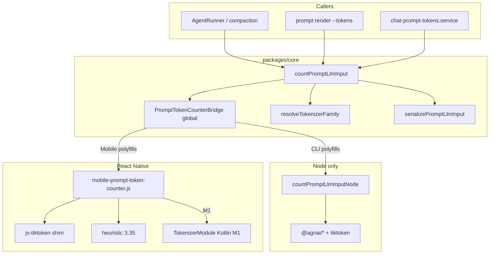

# Android 原生 Tokenizer 桥接 技术规格（SPEC）

> **PRD**：[prd.md](./prd.md)  
> **父 SPEC**：[../../spec.md](../../spec.md) — 本文 **supersede** 其中「RN 加载 `@agnai/*`」「Mobile 与 Node 共用 `packages/core/assets`」「Metro shim `@agnai/*`」等章节；**保留** 族解析、`countPromptLlmInput` 类型、压缩/CLI 接线、context window 表。  
> **分支**：`feature/model-aware-token-counting`（不新开长期分支名）。

---

## 设计目标

1. **Metro 可打包**：Mobile JS **零** 静态依赖 `@agnai/sentencepiece-js`、`@agnai/web-tokenizers`。
2. **一口径不变**：仍经 `NM_PROMPT_TOKEN_COUNTER_KEY` → `countPromptLlmInput`；序列化仍为 `serializePromptLlmInput`。
3. **平台分拆资产**：CLI 与 Android 各维护 tokenizer 文件副本；路径由各自 loader 解析，**不要求** monorepo 单目录 symlink。
4. **分档交付**：M0 先绿 bundle + GPT 精确；M1 Android 原生覆盖 WEB/SP 族（对齐 CLI 容差）。
5. **Node/CLI 不变路径**：继续 `@novel-master/core/tokenizer-node` + `installNodePromptTokenCounter`。

---

## 现状与约束（代码探索）

| 模块 | 现状 | 本 feature |
|------|------|------------|
| `count-prompt-llm-input.ts` | RN 必须走 bridge；Node 可 dynamic import node 模块 | **保持** |
| `count-prompt-llm-input-node.ts` | Node 全族 `@agnai/*` | **保持**；仅 CLI/tests |
| `mobile-prompt-token-counter.js` | 仍 `import {Tokenizer} from '@agnai/web-tokenizers'` → Metro `url` 失败 | M0：**删除** `@agnai`；WEB/SP → heuristic + `estimated: true` |
| `mobile-tokenizer-loader.js` | `readJson` / `readModel` 读 `apps/mobile/assets/tokenizers` | M0：仅 GPT tiktoken 需要时保留 JSON 读法；M1：原生从 `android/app/src/main/assets/tokenizers/` 读 |
| `install-node-tokenizer-loader.ts` | 指向 `apps/mobile/assets/tokenizers` | 改为 **`apps/cli/assets/tokenizers`**（平台分拆） |
| `metro.config.js` | blockList `*-node.ts`、`@agnai/sentencepiece-js` | 增加 **`@agnai/web-tokenizers`**；保留 tiktoken → `js-tiktoken` shim |
| `create-default-registry.ts` | WEB/SP registry 项为 heuristic 占位 | **保持**（计数在 bridge，不在 registry impl） |
| Android Kotlin | 仅 `MainActivity` / `MainApplication` | M1：新增 `TokenizerPackage` + `TokenizerModule` |

**RN 约束**：

- Hermes 无 Node `fs` / `url` / `path`。
- `js-tiktoken` 已通过 Metro alias；**唯一**允许在 RN 内精确计数的 JS 库（GPT 系）。
- Claude/Gemma 等 **M1 前** 产品接受 `estimated: true`（见 PRD）。

**对齐基准（CLI）**：

- `countPromptLlmInputNode` 与 ST `/openai/count` 同级分支为 **真值**；Mobile M1 与之比较。

---

## 总体方案

### 架构（变更后）



### 计数路径（Mobile）

| `TokenizerFamily` | M0 | M1 |
|-------------------|----|----|
| `tiktoken`, `gpt2` | `js-tiktoken` + OpenAI 风格 system 包装（与 node `countOpenAiStyleMessages` 同构） | 同左或可选委托原生（非必须） |
| WEB 族：`claude`, `llama3`, `qwen2`, `command-r`, `command-a`, `nemo`, `deepseek` | heuristic + `estimated: true` | Kotlin：`Tokenizer.fromJSON` 等价（HF tokenizers Java 或移植 ST JSON 管线） |
| SP 族：`llama`, `mistral`, `yi`, `gemma`, `jamba` | heuristic + `estimated: true` | Kotlin：SentencePiece `.model` |
| `heuristic` / 失败 | `Math.ceil(len / 3.35)` | 同左 |

**容差（M1 集成测试）**：

- 与 CLI 同 fixture、同 `vendorModelId`：`abs(mobile - cli) <= max(3, ceil(cli * 0.01))`（1% 或 3 token 取大）。
- GPT 系：**0** 容差（与 PRD M0 一致）。

---

## M0 实现步骤（必须先合入）

### 1. 精简 `mobile-prompt-token-counter.js`

- 删除 `import {Tokenizer} from '@agnai/web-tokenizers'` 及 `getWebTokenizer` / `WEB_FAMILIES` 精确分支。
- `countSerialized`：
  - `tiktoken` / `gpt2` → 现有 `countTiktoken`。
  - 其余族 → `heuristicCount` + `counterKind: family`（或 `heuristic`）+ **`estimated: true`**。
- 保留 `installMobilePromptTokenCounter` 与 `NM_PROMPT_TOKEN_COUNTER_KEY` 形状不变。

### 2. Metro

```js
// metro.config.js — 确保 blockList 含：
'@agnai/web-tokenizers',
'@agnai/sentencepiece-js',
// 已有: count-prompt-llm-input-node, tokenizer-node 等
```

### 3. CLI 资产路径

- 将 tokenizer 文件复制到 `apps/cli/assets/tokenizers/`（与现 `apps/mobile/assets/tokenizers` 内容同构，允许重复）。
- `install-node-tokenizer-loader.ts`：`TOKENIZER_ASSETS_ROOT` → `apps/cli/assets/tokenizers`。
- **不删除** `apps/mobile/assets/tokenizers` 直至 M1 原生 loader 就绪（M0 可仍供 Metro `readJson` 备用，但 M0 不再读 WEB JSON）。

### 4. 验证

```bash
npm run build -w @novel-master/core
npm test -w @novel-master/core
npm test -w @novel-master/cli   # 含 prompt-tokens e2e
cd apps/mobile && npx react-native bundle --platform android --dev false --entry-file index.js --bundle-output /tmp/mobile.bundle
```

---

## M1 实现步骤（Android 原生）

### 1. 模块边界

| 层 | 职责 |
|----|------|
| JS `mobile-prompt-token-counter.js` | 族解析 + 序列化；调 `NativeModules.NovelMasterTokenizer.count(...)` |
| Kotlin `TokenizerModule` | 按 `family` 选实现；读 `assets/tokenizers/`；返回 `{ tokenCount, counterKind, estimated }` |
| 资产 | `android/app/src/main/assets/tokenizers/<family>/...`（从 ST / 现 mobile assets **复制**，与 CLI 目录独立维护） |

### 2. Native API（定稿）

```ts
// apps/mobile/src/tokenizer/native-tokenizer.ts
export type NativeCountRequest = {
  serialized: string;
  family: string; // TokenizerFamily
  vendorModelId: string;
};

export type NativeCountResponse = {
  tokenCount: number;
  counterKind: string;
  estimated: boolean;
};

// NativeModules.NovelMasterTokenizer.countPrompt(request: NativeCountRequest): Promise<NativeCountResponse>
```

**编码约定**：

- 输入为 **已序列化的完整 prompt 字符串**（与 `serializePromptLlmInput` 输出一致），在 native 侧包装为单条 `system` 消息再 encode（与 `countWebFamilyPrompt` / OpenAI 风格一致）。
- Claude JSON：读 `tokenizerAssetPaths('claude')` 对应文件名（与 `tokenizer-asset-paths.ts` 一致）。

### 3. Kotlin 依赖（建议）

| 族 | 库 | 说明 |
|----|-----|------|
| SentencePiece | `com.google.mlkit` 不适用；用 **sentencepiece-java** 或 JNI `sentencepiece` 官方 | 与 `.model` 文件 |
| Claude / Llama3 JSON | **HuggingFace tokenizers** Android 绑定，或预编译 ST 兼容层 | 优先复用 ST 资产格式，减少 JS 逻辑重复 |
| 缓存 | `LruCache<String, TokenizerHandle>` keyed by `family` | 避免每条消息 reload |

若某族 native 加载失败：返回 `estimated: true` + heuristic 计数（**不抛**到 JS 红屏）。

### 4. JS 接线

```js
// mobile-prompt-token-counter.js (M1 片段)
import {NativeModules} from 'react-native';
const {NovelMasterTokenizer} = NativeModules;

async function countSerialized(family, serialized, vendorModelId) {
  if (family === 'tiktoken' || family === 'gpt2') {
    return countTiktoken(serialized, vendorModelId);
  }
  if (WEB_FAMILIES.has(family) || SP_FAMILIES.has(family)) {
    if (NovelMasterTokenizer?.countPrompt) {
      return NovelMasterTokenizer.countPrompt({serialized, family, vendorModelId});
    }
    return {count: heuristicCount(serialized), counterKind: family, estimated: true};
  }
  // ...
}
```

### 5. `MainApplication.kt`

- `packages.add(TokenizerPackage())` 注册。

### 6. 测试

- **单元**：Kotlin 对固定 string + `claude` fixture JSON → `tokenCount > 0`。
- **集成**：Jest mock native 模块；仪器测试可选。
- **对照**：脚本或 e2e 读 CLI stderr JSON vs adb 日志（同 session fixture）。

---

## 最终目录结构

```
.apm/kb/docs/Iterations/model-aware-token-counting/
  features/android-native-tokenizer-bridge/
    prd.md
    spec.md

packages/core/src/infra/tokenizer/
  logic/count-prompt-llm-input.ts          # 不变
  logic/count-prompt-llm-input-node.ts       # Node only
  logic/tokenizer-asset-paths.ts             # 不变（路径名契约）

apps/cli/
  assets/tokenizers/                         # 新增（自 mobile 复制）
  src/tokenizer/install-node-tokenizer-loader.ts  # 改路径

apps/mobile/
  src/tokenizer/mobile-prompt-token-counter.js    # M0 删 @agnai
  src/tokenizer/native-tokenizer.ts               # M1 类型 + 调用
  android/app/src/main/assets/tokenizers/         # M1 资产
  android/app/src/main/java/com/novelmaster/tokenizer/
    TokenizerPackage.kt
    TokenizerModule.kt
  metro.config.js                                 # block @agnai/web-tokenizers

apps/mobile/assets/tokenizers/               # M0 可保留；M1 后以 android/assets 为准
```

---

## 父 SPEC 同步（实现后）

在 [../../spec.md](../../spec.md) 顶部增加：

```markdown
> **Mobile 实现**：见 [features/android-native-tokenizer-bridge/spec.md](./features/android-native-tokenizer-bridge/spec.md)。RN 不再使用 `@agnai/*`。
```

并删除或标注过时段落：「Mobile 与 Node 共用 `@agnai/*`」「`packages/core` 增加 `@agnai` 供 RN」。

---

## 风险与决策记录

| 风险 | 缓解 |
|------|------|
| HF tokenizers Android 体积 | 仅打包 M1 验收族；ProGuard / ABI splits 后续优化 |
| 三端资产漂移 | 文档约定「改 ST 资产时同步 CLI + android/assets」；可选 CI checksum 对比 |
| iOS 无原生 | PRD 明确 defer；`estimated` 在 iOS 上长期为真直至后续 feature |
| GPT 用 JS、Claude 用 Native 口径微差 | M1 验收以 CLI 为准；GPT 保持 0 容差 |

---

## 实施顺序（当前分支）

1. **M0**（1 PR 体量）：mobile JS + metro + cli assets 路径 + bundle 验证。  
2. **M1**（独立 PR 或同分支后续 commit）：Kotlin 模块 + assets + 集成测试。  
3. 更新父 `spec.md` 引用。  
4. 不 revert 已有 core/CLI/compaction 提交；仅替换 Mobile tokenizer 实现路径。
