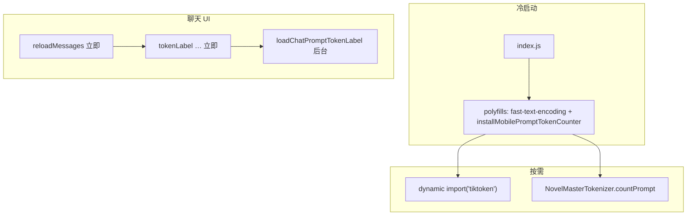

# Mobile Tokenizer 启动性能优化 技术规格（SPEC）

> **PRD**：[prd.md](./prd.md)  
> **前置**：[../android-native-tokenizer-bridge/spec.md](../android-native-tokenizer-bridge/spec.md)  
> **分支**：`feature/model-aware-token-counting`（或 `fix/mobile-tokenizer-startup-perf`）

---

## 设计目标

1. **冷启动**：RN Hermes 不再在 `index.js → polyfills` 链上解析约 **48MB** tokenizer 静态 `require`。
2. **包体**：Metro JS bundle 相对 M1 基线减少 **≥ 30MB**；APK `assets/tokenizers` 去掉未映射文件（约 **2MB** nerdstash）。
3. **首屏/发消息后**：消息列表渲染 **不等待** 完整 prompt token 计算完成。
4. **口径**：Android `NovelMasterTokenizer` + GPT `js-tiktoken` 行为与 M1 parity 一致；CLI/Node 不变。
5. **可验证**：自动化测试全绿 + PR 记录 bundle 前后字节数。

---

## 代码探索结论（现状约束）

### 启动链（根因）

```
index.js
  → polyfills.ts
       → mobile-tokenizer-loader.js   ← 15× require('../../assets/tokenizers/...')
       → mobile-prompt-token-counter.js  ← 顶层 import 'tiktoken'
  → App
```

| 资产位置 | 大小（约） | 谁用 |
|----------|------------|------|
| `apps/mobile/assets/tokenizers/**` | **48.2 MB**（15 文件） | **仅** `mobile-tokenizer-loader.js` → Metro bundle |
| `android/app/src/main/assets/tokenizers/**` | **~46 MB**（含 nerdstash×2） | `TokenizerEngine` 原生读取 |
| `apps/cli/assets/tokenizers/**` | 同构副本 | CLI `install-node-tokenizer-loader` |

M1 后 WEB/SP 计数 **只走** `NativeModules.NovelMasterTokenizer`；`NM_TOKENIZER_LOADER_KEY` 在 Android 生产路径 **未被** `countPromptLlmInputMobile` 使用。

### 实测基线（实现前记录）

在 `feature/model-aware-token-counting` @ HEAD（含 M1）上执行：

```powershell
cd apps/mobile
npx react-native bundle --platform android --dev false --entry-file index.js --bundle-output $env:TEMP\mobile-perf-baseline.js
```

| 指标 | 值 |
|------|-----|
| **JS bundle 大小** | **65.33 MB**（`mobile-perf-baseline.js`） |
| **mobile/assets/tokenizers** | 48.21 MB |
| **android/assets/tokenizers** | 含 `nerdstash.model` + `nerdstash_v2.model`（各 ~0.99 MB），**不在** `TokenizerAssetPaths.kt` 映射中 |

**目标 bundle**：≤ **35 MB**（≈ −30MB，留 Hermes/其余代码波动余量）。

### 顶栏 token UX（现状与缺口）

`ChatTabScreen.refreshChatMeta`（L179–203）：

1. `await loadChatAgentMeta` → 再 `setAgentMeta({..., tokenLabel: '…'})`
2. `await loadChatPromptTokenLabelResilient` → 更新最终标签

`useEffect`（L288–292）对 `reloadMessages` 与 `refreshChatMeta` **并行** `catch` — 首屏消息列表 **不** 被 token 阻塞 ✅。

**缺口**：`handleMessagesChanged`（L252–255）：

```ts
await reloadMessages();
await refreshChatMeta();  // 发消息/编辑后等待完整 prompt 构建 + 原生计数
```

用户发消息后需等 token 算完才结束回调链，体感卡顿。PRD 要求后台更新 token，此处 **必须解耦**。

### 其它引用

| 文件 | 说明 |
|------|------|
| `packages/core/.../get-tokenizer-loader.ts` | 错误文案仍写 `installMobileTokenizerLoader` |
| `packages/core/test/.../install-node-test-tokenizer-loader.ts` | 仍读 `apps/mobile/assets/tokenizers` — **保留**（Node 测试） |
| `apps/mobile/__tests__/mobile-prompt-token-counter.test.ts` | mock 原生桥，无 loader 依赖 |
| `metro.config.js` | `tiktoken` → `src/shims/tiktoken.js`；无需改 blockList |

---

## 总体方案



**原则**：tokenizer 重资产 **只存在于** `android/app/src/main/assets`；JS 仅轻量桥接 + 懒加载 tiktoken。

---

## 最终项目结构

```
apps/mobile/
  index.js                              # 不变
  src/polyfills.ts                        # 删 loader 安装
  src/tokenizer/
    mobile-tokenizer-loader.js            # 删除
    mobile-prompt-token-counter.js        # lazy tiktoken
    native-tokenizer.ts                   # 不变
  src/screens/tabs/ChatTabScreen.tsx      # token 刷新解耦
  assets/tokenizers/README.md             # 新增：RN 不引用；CLI/测试同步说明
  android/app/src/main/assets/tokenizers/ # 删 nerdstash*.model
  README.md                               # 已有 minSdk 26；补一句 assets 目录说明

packages/core/src/infra/tokenizer/impl/
  get-tokenizer-loader.ts                 # 错误文案

.apm/kb/docs/.../mobile-tokenizer-startup-perf/
  prd.md
  spec.md
```

---

## 变更点清单

| # | 文件 | 操作 | 说明 |
|---|------|------|------|
| C1 | `mobile-tokenizer-loader.js` | **删除** | 移除 48MB Metro 依赖 |
| C2 | `polyfills.ts` | 修改 | 仅 `installMobilePromptTokenCounter()` |
| C3 | `mobile-prompt-token-counter.js` | 修改 | `getTiktoken()` 缓存 + `await import('tiktoken')` |
| C4 | `ChatTabScreen.tsx` | 修改 | 见 §详细步骤 |
| C5 | `android/.../tokenizers/nerdstash*.model` | 删除 | 未在 `TokenizerAssetPaths.kt` |
| C6 | `get-tokenizer-loader.ts` | 修改 | Mobile 提示改为原生桥/CLI |
| C7 | `assets/tokenizers/README.md` | 新增 | 文档化三份资产关系 |
| C8 | `mobile-prompt-token-counter.test.ts` | 修改 | mock `import('tiktoken')` 若需 |

**不改动**：`TokenizerEngine.kt`、`TokenizerModule.kt`、`chat-prompt-tokens.service.ts` 公共 API、CLI assets、parity goldens。

---

## 详细实现步骤

### Step 1 — 删除 JS loader（C1–C2）

1. 删除 `apps/mobile/src/tokenizer/mobile-tokenizer-loader.js`。
2. `polyfills.ts`：

```ts
import 'fast-text-encoding';
import {installMobilePromptTokenCounter} from './tokenizer/mobile-prompt-token-counter';

installMobilePromptTokenCounter();
```

3. 全库 grep：`mobile-tokenizer-loader`、`installMobileTokenizerLoader` → 应为 0（除 KB/历史文档）。

### Step 2 — Tiktoken 懒加载（C3）

`mobile-prompt-token-counter.js`：

```js
/** @type {typeof import('tiktoken') | null} */
let tiktokenModule = null;

async function getTiktoken() {
  if (tiktokenModule == null) {
    tiktokenModule = await import('tiktoken');
  }
  return tiktokenModule;
}

async function countTiktoken(serialized, vendorModelId) {
  const {encoding_for_model} = await getTiktoken();
  // ... 现有逻辑不变
}
```

- `countSerialized` 已对 tiktoken 分支 `await` — 签名保持 `async`。
- **不**在 `installMobilePromptTokenCounter` 时预加载 tiktoken。

### Step 3 — 裁剪 APK assets（C5）

从 `android/app/src/main/assets/tokenizers/` 删除：

- `nerdstash.model`
- `nerdstash_v2.model`

**保留** `TokenizerAssetPaths.kt` 所列 12 数据文件 + `web/*` + `LICENSE.md`。

同步：若 `apps/mobile/assets/tokenizers/` 仍保留 nerdstash，可一并删除以免误导同步脚本（可选，PRD 允许保留目录作 CLI 同步源）。

### Step 4 — 顶栏 token 非阻塞（C4）

**4a. 拆分 refresh**

```ts
const refreshChatTokenLabel = useCallback(async () => {
  if (projectId == null || sessionId == null) {
    setAgentMeta(prev => ({...prev, tokenLabel: ''}));
    return;
  }
  setAgentMeta(prev => ({...prev, tokenLabel: '…'}));
  try {
    const tokenLabel = await loadChatPromptTokenLabelResilient(runtime, {projectId, sessionId});
    setAgentMeta(prev => ({...prev, tokenLabel}));
  } catch {
    setAgentMeta(prev => ({...prev, tokenLabel: ''}));
  }
}, [runtime, projectId, sessionId]);

const refreshChatMeta = useCallback(async () => {
  const modelId = await runtime.state.getCurrentModelId();
  setHasWorkspaceModel(modelId != null && modelId !== '');
  try {
    const meta = await loadChatAgentMeta(runtime);
    setAgentMeta(prev => ({...prev, ...meta, tokenLabel: prev?.tokenLabel ?? '…'}));
    void refreshChatTokenLabel();
  } catch { /* 现有 fallback */ }
}, [runtime, refreshChatTokenLabel]);
```

要点：

- Agent/model **先**展示；token 用 `void refreshChatTokenLabel()` **不 await**。
- 进入会话时 `useEffect` 仍 `refreshChatMeta().catch(...)` 即可。

**4b. 修 handleMessagesChanged**

```ts
const handleMessagesChanged = useCallback(async () => {
  await reloadMessages();
  void refreshChatTokenLabel();  // 不再 await 完整 refreshChatMeta
}, [reloadMessages, refreshChatTokenLabel]);
```

**4c. 其它调用点**

- `onSelected` 等仍可 `refreshChatMeta()`（需 agent + token）或仅 `refreshChatTokenLabel()` — 按是否改 agent 决定；改模型应用 `refreshChatMeta`。

### Step 5 — Core 错误文案（C6）

`get-tokenizer-loader.ts`：

```ts
"Tokenizer loader not installed. CLI: installNodeTokenizerLoader() in runtime. " +
"Mobile WEB/SP counting uses Android NovelMasterTokenizer; this API is Node/test-only."
```

（`getTokenizerLoader` 在 RN 生产路径不应被调用；文案面向误用与测试。）

### Step 6 — 文档（C7）

`apps/mobile/assets/tokenizers/README.md`：

- 说明：RN **不再** `require` 此目录；Android 用 `android/app/src/main/assets/tokenizers`；CLI 用 `apps/cli/assets/tokenizers`；core 测试可读本目录。

### Step 7 — 测试调整（C8）

- `mobile-prompt-token-counter.test.ts`：对 GPT 用例增加

```ts
jest.mock('tiktoken', () => ({ encoding_for_model: ... }), { virtual: true });
```

或使用 `jest.unstable_mockModule` 配合 dynamic import（Jest 30+ 与项目配置对齐）。

- 可选新增 `ChatTabScreen` 单测：`handleMessagesChanged` mock 断言 `reloadMessages` 先完成且 token 更新为异步（若成本高可仅手工 UX-1）。

---

## 兼容性与迁移

| 场景 | 行为 |
|------|------|
| Android 生产 | 无 `NM_TOKENIZER_LOADER_KEY`；WEB/SP 仅原生 |
| iOS | 无原生模块；WEB/SP 启发式；GPT 首次用时加载 tiktoken |
| 开发 `__DEV__` | 同左 |
| Core 单测 `installNodeTestTokenizerLoader` | 仍指向 `apps/mobile/assets/tokenizers` — **不变** |
| 从旧版升级 | 无 DB 迁移；仅 APK/ bundle 变小 |

**回滚**：恢复 `mobile-tokenizer-loader.js` + `polyfills` 两行；还原 `ChatTabScreen` await 链。

---

## 测试策略

### 自动化（合并前必须）

```bash
npm run build -w @novel-master/core
npm test -w @novel-master/core
npm test -w @novel-master/mobile
cd apps/mobile/android && ./gradlew :app:testDebugUnitTest
npx tsx --test apps/cli/test/prompt-tokens-e2e.test.ts
cd apps/mobile && npx react-native bundle --platform android --dev false --entry-file index.js --bundle-output $env:TEMP/mobile-perf-after.js
```

### 测试用例

| ID | 类型 | 步骤 | 期望 |
|----|------|------|------|
| PERF-1 | 构建 | 对比 `mobile-perf-baseline.js` vs `mobile-perf-after.js` | after 小 **≥ 30MB** |
| PERF-2 | 构建 | 统计 android assets 目录 | 无 nerdstash；其余 12 族文件在 |
| REG-1 | Jest mobile | 全 suite | 绿 |
| REG-2 | JVM | `TokenizerParityTest` + `TokenizerEngineTest` | 绿 |
| REG-3 | CLI e2e | prompt-tokens | 绿 |
| REG-4 | core | 全量 | 绿 |
| UX-1 | 手工 | 进聊天 Tab | 列表先出；token `…` → 数字 |
| UX-2 | 手工 | 发一条消息 | 列表更新不长时间卡住；token 稍后更新 |
| PAR-1 | 手工/仪器 | `gpt-4o` / `claude-3-5-sonnet` / `gemini-2.0-flash` | 与 M1 相同 estimated 语义 |

### PR 检查清单

- [ ] 贴 bundle before/after 字节数
- [ ] grep 无 `assets/tokenizers` require 于 `apps/mobile/src`
- [ ] 说明 `apps/mobile/assets` 仅文档/测试用途

---

## 风险与回滚方案

| 风险 | 概率 | 缓解 |
|------|------|------|
| Jest 与 `import('tiktoken')` 不兼容 | 中 | shim 路径 mock；或 `__test__` 注入 fake encoding |
| 删除 loader 后某隐藏路径调 `getTokenizerLoader` | 低 | grep + core 测试；RN 仅用 bridge |
| 首帧 token 长期 `…`（原生/DJL 慢） | 中 | 接受 PRD；与 M1 一致；后续原生预热可选 |
| GPT 首次计数多 100–300ms | 低 | 仅 tiktoken 族 |
| ARM SP JNI 仍失败 | 已知 M1 | 本 feature 不解决；启发式 fallback |

**回滚**：`git revert` 本 PR 提交；恢复 loader 文件与 polyfills。

---

## 分步实施计划（建议提交顺序）

1. **Commit A**：删 loader + polyfills + lazy tiktoken + Jest 修复 → 跑 mobile/core + bundle 记 size  
2. **Commit B**：ChatTabScreen 解耦 + `get-tokenizer-loader` 文案  
3. **Commit C**：删 android nerdstash + `assets/tokenizers/README.md`  
4. **PR 描述**：贴 PERF-1 数字 + UX-1/2 勾选

---

## 与 PRD 对齐说明

本 SPEC 在迭代变更初稿基础上补充了：**实测 bundle 基线 65.33MB**、**`handleMessagesChanged` 阻塞点**、**`refreshChatMeta` 拆分方案**、**文件级变更表** 与 **回滚路径**，可直接进入编码。
